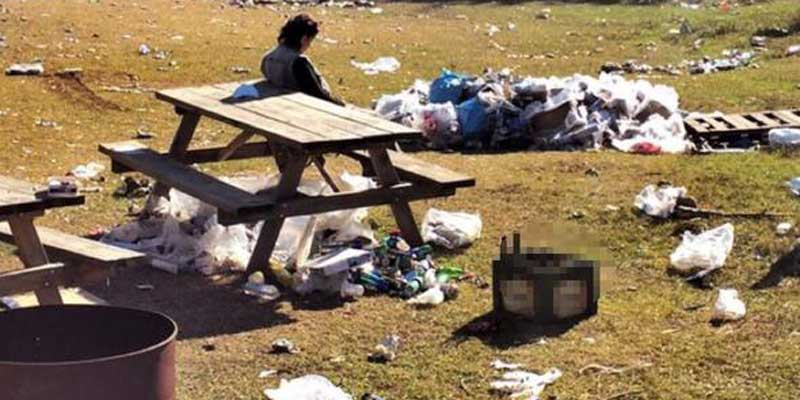
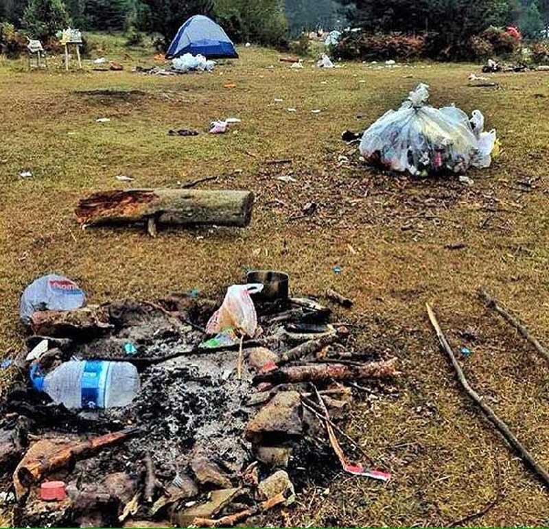

**8 Bin Kişilik Kamp, Helal**

Süpersiniz Interrail Türkiye. 7-8 Ekim 2017 tarihlerinde Bolu Mengen’de bulunan Şirinyazı Göletinde süper bir kamp organize ettiniz. 8 bin kişiyi bir araya topladığınız süper bir kamp organizasyonu olmuş. Bundan daha kalabalık bir organizasyon yapan var mıdır bilmiyorum ama adınızı tarihi yazdınız. Herkes sizi biliyor, herkes sizi konuşuyor. 8 bin kişi ile kamp. Vay be canavarca. 8 bin kişi ile millet ordu kurup savaşa katılıyor. Dile kolay 8 bin. Ha bir de medyada falan size atılmış iftiralar var. Yok kamp alanını kirletmişsiniz, yok ormana zarar vermişsiniz falan filan. Neyseki çok güzel bir basın açıklamasıyla adınızı temize çıkardınız. Sosyal medyada dönen fotoğraflar, videolar kesin montajdır. Yarın öbürgün ortaya çıkar. Alandan sorumlu işletmeci de açıklama yapmış 2bin kişi bekliyorduk 8 bin kişi geldi, çöpleri toplamaya yetişemedik, çöp bidonları yetmedi, sorun yok hallediyoruz, yağmur durdu, hava güzel, biz ortalığı temizliyoruz rahat olun demiş. Zaten sizde de bir sorun yok sevgili işletmeci 2bin kişi gelseydi herşey ok olacaktı ne olduysa o gelen 6bin kişiyle oldu. Her şeyi onlar yapmış olabilir. Gönlümüz çok rahat Allah razı olsun sizlerden. Evet hem Interrail Türkiye’den hem oraya kampa gelen 8bin kişiden ve işletme sahibinden. Eyvallah, hepiniz sağolun varolun. Sizin bir suçunuz yok, sosyal medyada bunu yayan, itiraz eden ve konuşan bizlerin suçu var. Özür dilemenize gerek yok. Zaten neden özür de dileyesiniz ki?

**Interrail Türkiye** alttakiler sizin için;

- 8 bin kişilik kamp organize ediyorsanız sorumluluk size aittir. Gelen 8bin kişiye kampçılığın sadece çadır kurmaktan ibaret olmadığını kampçılık diye bir şeyin olduğunu ve onlara düşen sorumluluğu bildiren paylaşımlar/duyurular yapabilirdiniz. Kamp alanında insanları uyaran/denetleyen/kontrol eden bir çok görevliniz olsaydı bu tablonun önüne geçerdiniz.
- Bu olay sonrası yapmış olduğunuz basın açıklaması ise tam bir fiyasko. Beceriksizliğiniz yüzünden özür dilemeniz gerekirdi.

Bu **kampa katılan 8 bin kişi** alttakiler de sizin için;

- Eminim ki aranızda çöpünü atacak yer olmadığı için arabasında götürüp, medeniyete ulaştığı ilk yerde çöpe atanlar vardır. Sizler bu yazıyı okumayı bırakın ve kapatın. Çünkü sizlere sözümüz yok. Doğaya olan saygınızdan dolayı doğa da ben de doğa severler de ve sizden sonra gelecek nesil de size minnettar.
- Gelelim diğerlerine; Decathlon’dan çadır almakla kampçı olunmuyor veya kampçı olunmuyor. Ayıp değil mi yediğiniz içtiğiniz şeylerin çöpünü ortalığa atıyorsunuz. Gelsem evinizin ortasına sıçsam ayıp olmaz mıydı?
- Çöp alanı mı dolu veya çöpünü atacak yerin mi yok? Çözüm çok basit. Çöpünü 2 veya 3 tane poşet içerisine geçirirsen eğer ne akıtır, ne de sızdırır. Koyarsın arabana mis mis, temiz temiz gidersin. İlk bulduğun yerdeki çöpe de atarsın.
- Senden sonra birileri toplayacak orayı diye atmış da olabilirsin. Ama toplamak zorunda mı veya yarın başka bir yer de kamp yaptığında toplayacak biri olacak mı?
- Şöyle bir durun da tepeden bir bakın. Ne yaptık ulan biz, niye zarar verdik deyin.

**Sevgili işletmeci** alttakiler de senin için;

- 8 bin kişiyi babanın hayrına ağırladığını sanmıyorum. Güzel para kazanmış olmalısın. Helali hoş olsun. Ama sen işletmecisin, 8 bin kişi geliyor ulan ne yapmalıyım nasıl yapmalıyım da buraları korumalıyım, kollamalıyım ve bir sorun aksilik olmamalı diye etrafta fır dönüyor olman lazım, kazandığın paranın hakkını vermen lazım.
- Veya abicim buranın kapasitesi X kişi ve daha kalabalık gelmeyin dersin, müşteri almazsın. Sonra rezil de olmazsın.

Mevzu çöp olunca çok kızıyorum. Tüm bunlar bir doğa severin sizlere olan isyanıdır. Daha sert cümleleri içimden size saydığımı da bilmenizi isterim. Eğer bir gün ben de sizin gibi böyle bir bok yersem gelin bu saydıklarımın 5 katını bana sayın. İçinizden sayacaklarınızı da yüzüme sayın. Bugün çöpü yere atıp gitmeyi normal gören adam yarın başkasının hakkına geçer, öbürgün o yaptı diye ben de yaptım diye kendini savunur, sonra kural mural dinlemez sonra da böyle böyle alır başını yozlaşmış bir toplum olarak yürür gideriz. Şayet birey olarak kendimizi düzeltmezsek geleceğe de umutla bakamayız. Hayırlısı artık ne diyeyim, mevzuyu buradan başka konulara bağlamadan kapatayım.

Yapılan haberleri, açıklamaları ve fotoğrafları alttadır.

Haberler;

[Birgün](https://www.birgun.net/haber-detay/interrail-ve-camprail-bolu-da-doga-kampi-yapti-2-kamyon-cop-184109.html) – [Onedio](https://onedio.com/haber/dersimiz-cevreyi-koruma-bolu-da-8-bin-kisilik-doga-kampindan-geriye-cop-yiginlari-kaldi-790403) – [Hürriyet](http://www.hurriyet.com.tr/bu-goruntuye-sosyal-medyada-tepki-yagiyor-40607779)

Interrail Türkiye’nin açıklaması;

[http://interrailturkiye.com.tr/kamuoyu-aciklamasi/](http://interrailturkiye.com.tr/kamuoyu-aciklamasi/)

İşletmenin açıklaması;

[http://www.hurriyet.com.tr/buyuk-tepki-cekmisti-o-kamp-yerinin-sorumlulari-aciklama-yapti-40608253](http://www.hurriyet.com.tr/buyuk-tepki-cekmisti-o-kamp-yerinin-sorumlulari-aciklama-yapti-40608253)

8 bin kişinin açıklaması yok.

