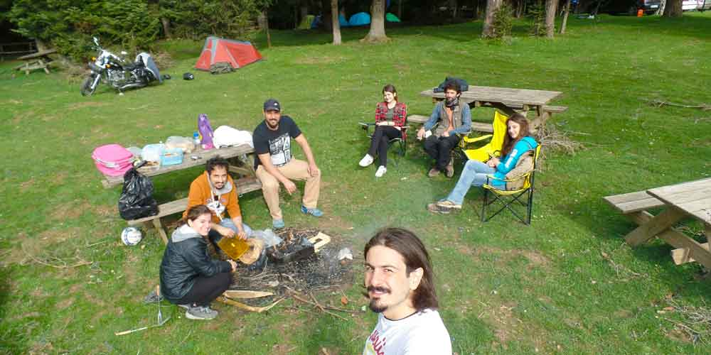
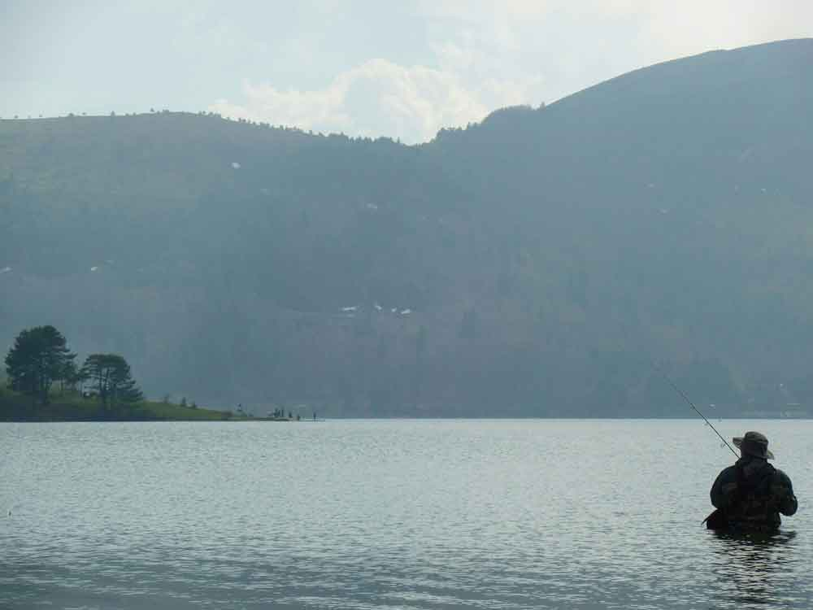

Daha yazıya başlamadan o zamanki ruh halime döndüm. Sitem, isyan, rahatsızlık dolu bir yazı olacak.

Abant’ı; arkadaşlarımızın yorumlarından duyarız, paylaştıkları fotoğraflardan görürüz ve ah ne güzel yermiş bizde en yakın zamanda biz de gitsek deriz.

**Abant’a gerçekten gitmeli mi? Abant’ta kamp yapmalı mı?**

Abant’a gittiyseniz milli parklara olan isyanınız benim gibi 10 kat daha da artmıştır. Tamam eyvallah doğayı koruyorsunuz. Abant bir milli park olmasa insanlar burayı mahveder. Bunu da biliyoruz. Ama neden olayı soygunculuğa çeviriyorsunuz ki? Bu soruların cevabını yaşadıklarımı anlatarak vermiş olayım.

Tarih 1 Mayıs, günlerden Cuma(oh mis gibi 3 gün tatil) ve güzel güneşli bir günde Abant yolunu tuttum. Abant’a yaklaştığımda ha geldim ha geleceğim derken bir araç kuyruğu başladı. Rahat 500 metre var. Neyseki motorla gidiyorumda sıraya girmedim. Kapıdaki görevli motorlu olduğum için benden ücret almadı ve geçtim gittim. İçeriye bir girdim ki aman Allah’ım o da ne? Ana baba günü olmuş burası. O kadar kalabalık ki Abant gölü çevresindeki yolda trafik sıkışıyor ve beklemek durumunda kalıyorsunuz. Girişte ücret ödenmeli mi? Bence ödenmeli, sonuçta burada size bir hizmet veriliyor ve bu doğanın korunması içinde bir ücret(Sanırım otomobil 15TL idi.) alınması normal. Doğa olarak çok güzel. O kadar güzel ki hayran kalıyorsunuz. Ancak bir kalabalık var ki her yerden insan/araba fışkırıyor. Otobüslerin biri kalkmadan diğeri yanaşıyor ve 50 kişi birden hurra diye ortama giriyor. Bir an Walking Dead’deymişim gibi hissettim(izleyenler bilir). Ne yapsın insanlar, onlarda ben gibi görmeye/gezmeye gelmiş. Buraya gelmek için hafta sonu yanlış bir tercih. Hafta içi gelin ve sakin sakin tadını çıkarın. Doğal güzelliklerini anlatmakla anlatamam zaten. O kadar güzel cümle kuramam. O kadar kelime dağarcığım yok. Neyse genel olarak ortam böyle. Gidin görün. Görülmeye değecek bir doğal güzelliği var. Hatta akşama da kalın ve göl etrafında yürüyüş yapın.

**Abant Gölü Kamp Alanı**

Gelelim kamp alanına. Bu kadar kalabalık bana çok fazla. Bunalıyorum ne yapayım. Sessizlik ve dinginlik ararken ne buldum. Eyi güzel de bu çile çekilmez dedim kendi kendime. Tam kamp alanının önündeki yoldan geçip gidiyordum ki hadi bir bakayım(sanırım şeytan dürttü) dedim. Kamp alanı göl seviyesinden biraz daha yukarıda kalıyor ve etrafı tel örgülerle çevrili genişçe bir alan. Üstelik hem 1 2 çadır dışında kimsecikler yok hem de gölün oradaki oynaşma seslerinden ve mangal dumanından eser yok. Tamam oğlum İbrahim  bu gece buradasın dedim ve hemen yerleştim. Kamp alanı güzel, oturaklar falan var. Tuvalet, banyo, mutfak ve elektrik var. Var ama tuvalet, banyo ve mutfağın olduğu binaya köpek bağlasan durmaz. O derece pis. Neymiş efenim sezon yeni açılmışmış da bakımları yapılacakmış da falan da filan. Bir de üstüne görevli benden 27TL çadır ücreti istemesin mi! Len zaten tabut(başka bir tabir de var da ayıp olur yazmadım) gibi çadır ve tek kişiyim ne 27 lirası. Tuvaletin olduğu binanın durumu belli ve temiz su bile yok. Su için taa aşağıya çeşmeye iniyorum. Bekçi inat yok mok pok ok ığ pığ, bir dahaki gelişinde senden para almam falan. Ya arkadaş çadır ücreti al alma demiyorum ama 1 kişiyim ve küçücük çadırım var neden 27 lira diyorum. Cevap: ya işte geçen yıl 15 di bu yıl 27 yaptılar, bende almak zorundayım falan. Çüş yüzde yüze yakın zam. Ben bu yıl o kadar zam almadım. Enflasyonu bile geçemedik valla. Sizin dükkan iyiymiş. Tek kişi de 1 çadır kursam kalsam 27, 6 kişi de bir çadır kursam kalsam 27 mi dedim evet dedi. Soygunculuk ya başka bir şey değil. İçeri girerken para ver. Çadır kurdun para ver. Bakalım başka nelerden para isteyecekler. Milli parklara olan isyanım iyice tavan yaptı. Yamyamlık resmen. Bir daha gelmem ve her yerde anlatırım. Adamlar milli park diye geçiriyorlar geçirebildikleri kadar. Ha bir de ateş yakmak da yasak. Nasıl kamp olum bu. Ateş yok, su yok, bişi yok.

**Abant Gölünde Nerede Kamp Kurmalı**

Tem üzerinden gidilip Abant’a giriş yapıldığında yoldan sapmadan düz devam edin. Sağda Abant Palace oteli geçtikten sonra yol sola göl çevresinde kıvrımlaşmadan önce sağa yol ayrılıyor ve orman içerisinden düz bir şekilde devam ediyor. O yolu takip ettiğinizde ileride 3 tane yayla var. Örencik, Sarıyer ve Pelitözü yaylası. Koca geniş bir çayır sizi karşılayacak zaten. Gidin buralarda çadır kurun. Doğayı koruduktan, kirletmedikten sonra gidipde o kadar para bayılmayın. Ya da 6 kişi gidin 1 çadır kurun :)