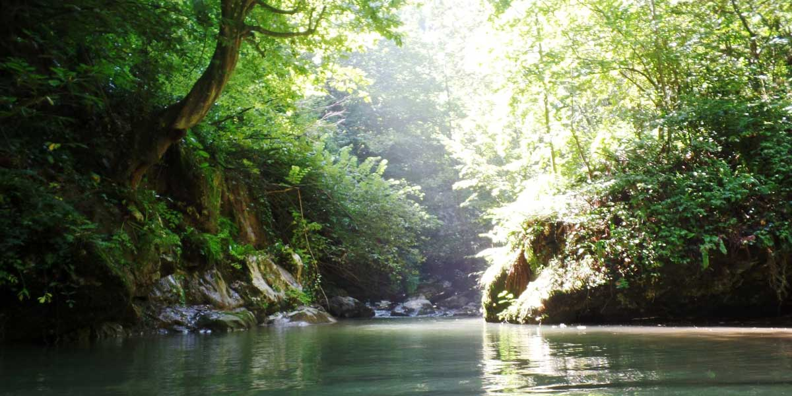
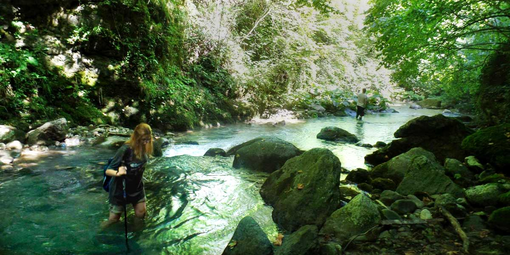
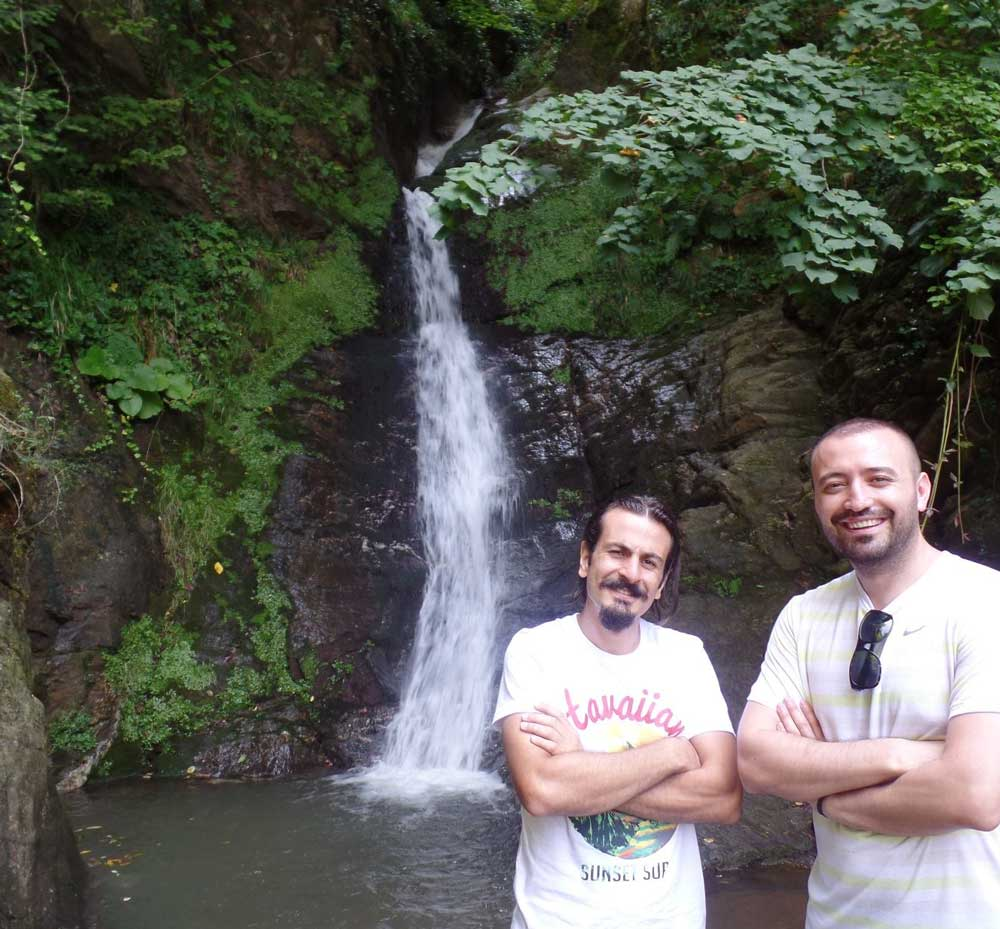
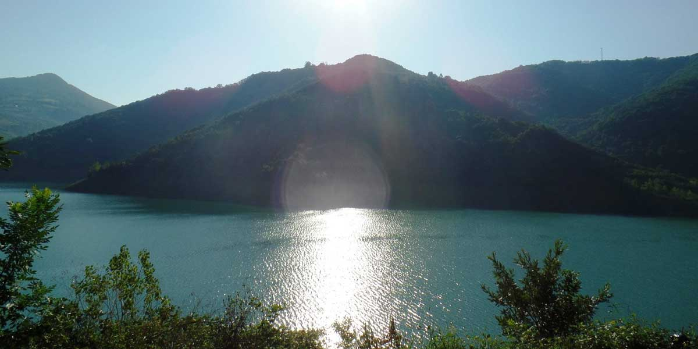

2014 Ağustos sonuna doğru planlar planlar planlar. Şu aralar sanırım zihnimi en çok meşgul eden şey planlar. Sürekli bir yerlere plan yapıyorum. Uzun zamandan beri gitmek istediğim Sıcak Dere kanyonu ve Kaya Üstü yaylası için güzel bir fırsat yakaladım. Yaklaşık 6 aydır hadi gidelim diyerek başımın etini yiyen ve bir türlü uygun zamanı denk getiremediğimiz Çağatay ile gitmeye karar verdik ki aramıza doğa dostu, heyecanlı, doğaya aç ve kamp yapmak için sabırsızlanan bir isim daha katıldı. Evet Simge de gelirim dedi. Ben ona çadırın var mı, tulumun var mı gibi soruları soracaktım ki, beni çok pis bozguna uğrattı. Tüm malzemeleri hatta sırt çantası bile var ve bunca yıllık(hahah yaklaşık 3 yıl) kampçıyım hala bir termosum yok ama onun var. Resmen kendimden utandığım an oldu. Tabi ona karşı pek çaktırmadım, artizliğime devam ettim :).

Kampa gittiğiniz kişilerle iyi uyum sağlamanız o kampın keyifli geçmesi açısından çok önemli. Çağatay ve Simge ile ilk defa kampa gidiyorduk. Şaşırtıcı bir şekilde güzel ve uyumlu bir ekip olduk. Ne yalan söyleyeyim başlarına o kadar iş açmaya çalıştım ama hiç sesleri çıkmadı. Galiba bunun nedeninin benim ne yaptığımı bildiğimi sanıyor olduklarıydı :).

### **Sıcak Dere Kanyonu**

Sabah ilk olarak Yuvacık barajının yanında kahvaltımızı yaptık ve ardından Sıcak Dere kanyonuna doğru yola koyulduk. Sıcak Dere kanyonu güneşe hasret kalacağınız yerlerin olduğu, bazen orman içerisinden bazen dere içerisinden ve kaya geçişlerinin olduğu Kocaeli’nin en zorlu parkurudur. Trekkinge yeni başlayan insanları niye buraya getiriyorsun birader diyebilirsiniz, işte dedim ya başlarına o kadar iş açmama rağmen sesleri çıkmadı. Amacımız kanyonu baştan sona tamamen bitirmek olmadığından kanyona girdik. Zorlandığımız yerde uzatmayıp, başımıza bir iş açmadan geri dönecektik. Orman içerisinden başlayıp ara ara dere içerisine girerek devam ettiğimiz parkurda yaklaşık 2km ilerledikten sonra kaya geçişleri fazlasıyla zorlu olunca ekibi daha yormadan geri dönmeye karar verdik.

Dönüşümüz Simge için sevindirici Çağatay için üzücü olmuştu. Aslında Simge de üzülmüştü ama geçişler zorlamaya başladığından ve daha da zorlu olacağından dönme kararı almak zorundaydık. Çağatay’ın üzülmesinin nedeni ise şelaleye girememiş olmasıydı. Zaten giremeyecekti ki o hızla devam etseydik ertesi güne şelaleye varırdık :D. İtiraf edeyim kanyonda kendilerinden emin bir şekilde yürüyorlardı. Adımlarını sağlam atıp güven vererek ilerliyordu. Bu çok önemli çünkü diğer türlü olsaydı kendimi sürekli diken üstünde hissederdim. Ha düştü ha düşecek diye(bunu dediğim insanlar oldu, şimdi isim vermek olmaz :)). Yalnız bir problemimiz vardı. Çağatay’daki bu şelale gazını almamız lazımdı. Bunun için üst tarafımızda kalan Servetiye Camii köyünün ilerisindeki küçük şelaleye gitmeye karar verdik. Evet burası Çağatay’ı rahatlattı, tabi bizi de. Yoksa adamı 2 gün nasıl tutacaktık.

### **Kaya Üstü Yaylası mı? Aman Diyeyim Arabanızla Sakın Gitmeyin**

Aman aman aman, biz yandık siz yanmayın dostlar. Tamam güzel bir yayla ama arabayla o yola girmeye değmez. 4×4’ünüz varsa veya yürüyerek gidecekseniz ayrı tabi. Kaya Üstü yaylasına giden toprak yol önce çok güzel. Ama sonra birden bozulmaya başladı. Yaylaya yaklaşık 2 km’miz kaldığından hadi şurayı da geçeriz, hadi burayı da geçeriz derken o 2 km de canımız çıktı. Yağmur sularından dolayı toprak yolda oluklar açılmış. Teker bir düşse direk iptal olacağız. Orada kalacağız. Len niye girdin o zaman o yola diyebilirsiniz. Dedim ya ne yaptığımı bilmediğim anlardan biriydi :D. Aslında o kadar gelmişken görelim dedik ama işte son 1-2 km çok uğraştık. Yaylaya vardığımızda kimsecikler yoktu ve haritada göründüğü gibi çok fazla düzlük alan da yoktu. Daha çok yamaç bir yer. Bir kaç yayla evi haricinde bir şey yok. Derken 3 kişilik bir ekiple karşılaştık. Onlarda 3.kez yaylaya yürüyüşe geliyorlarmış ve bu kez kayalıkların oraya gidip manzarayı görmeyi kafaya koymuşlar. 44 yaşında harleyi olan çalışmayan ve çalışanları da sevmeyen Mustafa abimiz bize aşağıda bolca ayı izleri olduğunu söyledi. Benim için sorun yok, çünkü ayı gelirse Simge’yi kurban olarak vereceğiz. Kalan ekibin selameti, güvenliği açısından önemli :). Simge ise bunu kabullenmiş bir vaziyette ama biraz tedirgin. Çağatay ise ilk kampında ayıyla karşılaşmak istemeyen bakışlarıyla ne yapacağımızı bekliyordu. Ben ise beynimi süper hızlı çalıştırarak düşünmeye başladım; Ayı, yayla, insan yok, sadece biz varız, düz alan pek yok, burada daha önce ekin yetiştirilmişse ayı kesin gelir, gelirse saldırır mı, lastiğimiz patlasa ne yaparız, benzin azalıyor, oluklardan birine düşsek arabayı bırakır gider miyiz, saat 4 oldu bir karar vermeliyiz…. gibi uzayıp giden kendimle tartışmam sonucunda İnönü yaylasına gitmeye karar verdik. O yayladan öyle bir çıkmışız ki İnönü yaylasına varınca orada hiç fotoğraf çekilmediğimizi fark ettik.

### **İnönü Yaylası mı? Bir Daha Asla veya Yazın Asla Gelmem**

Vay arkadaş ya sende ne problemli çıktın. Oranın yolu kötü, buranın şusu kötü. Bir şeyi de beğen be birader. Ama bana hak vereceksiniz. Tam çadırları kurduk, yerleştik, ateşimizi yaktık, yemek olaylarına giriyoruz derken karşıdan bir ses ‘Hastasıyızz deedeeeee’. Sonra karşıdan uzaklardan aynı ses karşılık verdi. Noluyor lan dedik içimizden. Derken hastasıyız dedeler böyle devam etti ve ara ara hatta bazen çoşkulu bir şekilde silah atışlarıyla devam etti. Adam bağırıyor, yanındaki çocuk da o çocuğun annesi de bağırıyor. Arkadaş nasıl bir ailesiniz siz ya :). Hayır bunu 1 kişi yapsa uyarırsın ama koca yaylada bunu yapmayan efendice kampını yapan 3 gruptan biri bizdik. Gerçi o insan profiline konuşarak da bir şey anlatamayacağımızı bildiğimizden o sürece hiç girmedik. İnsanları kınadığımdan ya da hor gördüğümden değil tabiki, sadece çevreyi rahatsız ediyor olduklarının farkında değillerdi ve bunu onlara anlatamazdık. Artık bir süre sonra benimsedik ve duymamaya başladık. Bu arada biz şarkılarımızı söyledik ve ateşte marshmallow’larımızı yapıp yedik. Bu kadar kamp yapmaya niyetlenip de yapamadığımız marshmallow olayı Simge sayesinde gerçekleşti. Bana kalsa yine bisküvi, çikolata yerdik :). Saatlerimiz gece 1 e doğru ilerlerken Çağatay’ın kafasnın güzel olup hastasıyız dede moduna girerek etrafdaki diğer hastasıyız dedelerle münakaşaya girmesini sezdiğimiz anda hadi yatalım cümlesi bizi çok pis dayaktan kurtardı. Yayladaki herkesi dövmek ayıp olurdu o bakımdan yani(ya da herkesten dayak yemek).

### **Ne Güzel Bir Pazar Sabahı**

Sabah 5 te zort dedi uykum kaçtı. Bu saatte yapılacak en güzel şey bir ateş yakıp çay demleyip sandalye başında uyuklamak. Yayla olduğundan dolayı sıcaklık farklı çok oluyor. 5’te hava oldukça soğuktu. Ben ateşin başında sandalyeme oturmuş çayımı yudumlarken güneşin yayla üzerine doğuşunu izliyordum. Sonra ara ara uyuklamaya başladım. 7’den itibaren güneş ışıkları çadırlarımızın üzerine gelmeye başladı. Yayada hareketlilik başlamıştı ve karşıdaki adamda artık bağırmıyor oh güzel bir gün olacak derken ‘Yanıyooorrrr içimmmmmm yanıyoooorrr’ diye bağırmaya başladı. Hay dedene de içine de diyesim geliyor ama terbiyemi bozmak istemiyorum. Bu yüzden söyleyeceklerimin hepsini içimden yardırıyorum.  Bu sesten sonra bizimkiler de artık uyanırlar diyorum ama yok. Fosur fosur uyuyorlar. En son 9.30 gibi hamama dönen çadırlarından kendileri dışarıya attılar. Sonrasında orman içi yürüyüşümüzü yaparak Ercuva yaylasına gidiyoruz. Gece keşke oraya gitseydik daha sakin olurdu orası diye düşünürken orada da bizi Ankaranın bağları şarkısıyla karşıladılar. Biraz daha orman içerisinde gezindikten sonra kamp yerine dönüp benim ateşte fazla tutarak yaktığım patateslerden kumpir yaptık. Bunca şeye rağmen bana bizi öldürmeye mi çalışıyorsun demedikleri için Simge ve Çağatay’a teşekkür ediyorum. Bir de üstüne yine gidelim demesinler mi? Deli galiba bunlar :D

### **Araba Son Demlerini Yaşıyor**

Çok güzel toplandık, arabaya bindik çalıştıracağız derken hooop bir de ne olsun akü süzülmüş. Süzük ya, ulen ne çabuk süzüldün sen öyle. Neyse ki yaylada bir sürü insan varda takviye yaparak arabayı çalıştırdık. Kaya Üstü yaylasında süzülseydi ne yapardık bilemedim. Araba artık beni tedirgin ediyor. Babam duymasın, duyarsa faturayı bana çıkarır.

Her şeye rağmen başımıza bir iş açmadan sağ salim evimize ulaşabildik. Yeni insanlarla kampa gitmeyi, yola çıkmayı çok seviyorum. Onların heyecanları beni heyecanlandırıyor, mutlulukları ise mutluluğumu artırıyor. Simge ve Çağatay ile de güzel anlaştığımız, hem onlar hem de benim için süper keyifli bir kamp oldu. Süper keyifli de nasıl oluyorsa, güzeldi yani :)