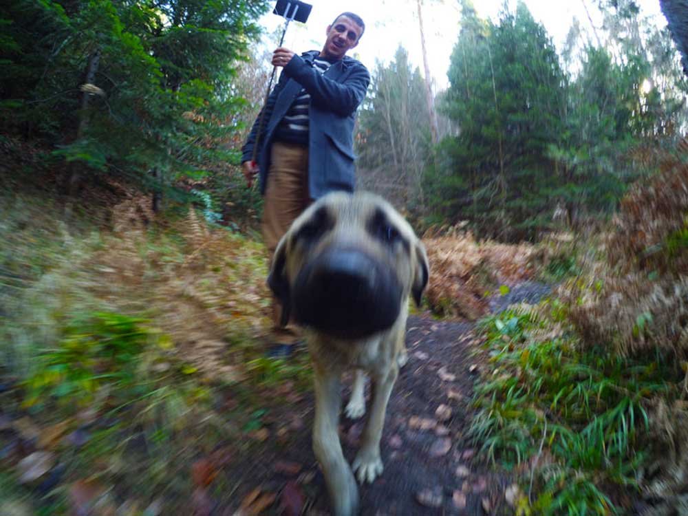

Ya kamp alanına ayı gelirse. Hiç kampta ayı sesi duydunuz mu? Bi ses geldi ama o ayı mıydı yoksa inek miydi?

### BOZCAARMUT GÖLETİ 26-27 KASIM 2016

Pazar sabah saat 9 gibi kahvaltı yaparken kahvaltıdan sonra yürüyüşe çıkalım diye planlar yapıyorduk. Yanımızda da oynak bir köpek, bizden bir şeyler koparıp karnını doyurmaya çalışıyor. Zilli kendini sevdiriyor da. Birden uzaktan silah sesleri gelmeye başladı. Silah sesleriyle birlikte köpekler havlamaya başladı. Sonra silah sesleri durdu ve yanımızdaki köpek oturduğu yerden kalktı bir kaç defa havladı, sonra karşılıklı havlaştılar. Köpek hüzünlendi, mızıldamaya başladı. 5 dk önceli şen halinden eser kalmamıştı. Ne oldu len neden hüzünlendin desekte cevap alamadık tabi. Acaba ne oldu diye düşünsekte bir yere varamadık. Avcılar işte dedik geçtik.

### BİR AYI NEDEN VURULUR?

Yürüyüşe çıktık ve yaklaşık 20km’yi 6 saatte yürüyerek kendimizi aştık. Günün sonunda epeyde yorulmuştuk. Gölün girişinde bekçiyle karşılaştığımızda biz ne kadar da yürüdüğümüzden ayı izi ve ayı pisliği gördüğümüzden bahsederken, bekçi bize sabah avcıların bir domuz bir de ayı vurduklarını söyledi. Kızdık, sinirlendik, üzüldük, moralimiz bozuk kamp alanına giderken sabah yanımızdaki köpeğin neden hüzünlendiğini anlamış olduk. Ya bir ayı neden vurulur, bir hayvan neden vurulur gerçekten anlamak güç. Cevabını bulamadığımız bir soru.

### AYI SESİ Mİ O?

Yürüyüşten geç geldiğimiz için toparlanmak geç vakte kalmıştı. 18:30 civarı herkesler gitmiş ve hava kararmaya başlamıştı. Karnımızı doyurduk, çayımızı içtik, eşyaları toparladık son 3-5 bişi kaldı yavaştan arabaya yerleştiriyoruz derken karşı ağaçlıkların arasında ayı sesi geldi. Laan ayı sesi mi o? Fatih abi ayı sesiydi o desemde yok inektir dedi. Ya abi Allah’ını seversen hiç inek gördün mü buralarda, ayı intikam almaya geldi. Abi hadi hemen eşyaları arabaya atıp gidelim, bak sabah bir ayıyı vurmuşlar gelir hıncını bizden çıkarır abi hadi gidelim diyorum. Fatih abi mangal soğumadı diyor :). Ben olacakları düşünerek yusuf yusuf haldeyim ise oldukça rahat. Ayı saldırsa zaten şansımız yok. Aslında ayıyla aynı taraftayız ama onun haberi yok. Araba dibimizde de değil. Biz arabaya gidene kadar ayı bizi düdükler. Son eşyaları arabaya atarken bir kez daha kükredi. Bu sefer ikimizde yusuf yusuf. Hemen eşyaları yükledik ve arabaya atladık. Tam yola çıkacağız biraz geri gitmek gerekiyor, Fatih abi İbrahim bir inip arkaya baksana geriyi göremiyorum demez mi? Arkadaş zorla beni ayıya kurban edecek. Bir kaç defa kornaya bastık, arabanın ışıklarını açtık(amaç ayıyı kaçırmak) sonra indim gel gel yaptım ve yola koyulduk.

Yolda bugün yaşadığımız olayı düşündük, konuştuk. Ayı bi saldırsa bizi patates ederdi. Saldırma eğiliminde olsa kükremeden saldırırdı zaten. Ama ayı bu ne yapacağı belli olmaz. Dönüş yolunda aklımızda o sorunun cevabını aramaya çalışırken İstanbul’a vardık. **Bir ayı neden vurulur, bir hayvan neden vurulur?**

Yorumlarım:

İlk defa bir ayının sesini canlı olarak duydum. Heyecan vericiydi aynı zamanda bir ayının öldürüldüğünü bildiğim için korku vericiydi. Tahminimce ayı bizi uyarmak için kükredi, çok zeki hayvanlar bunlar. Saldırmak isteseydi kükremeden yapardı o işi ve çok şansımız olmazdı. Olay ayının insiyatifinde.