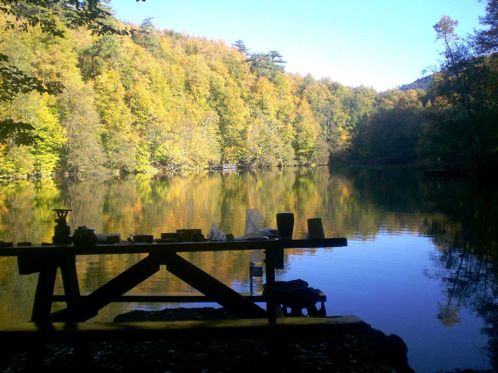
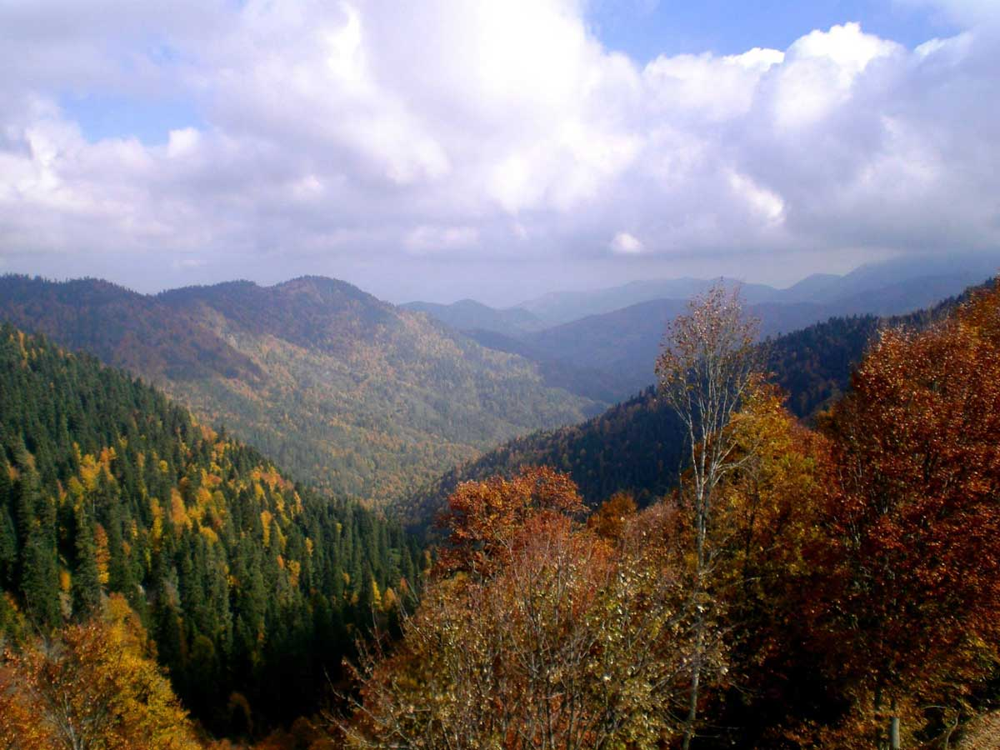
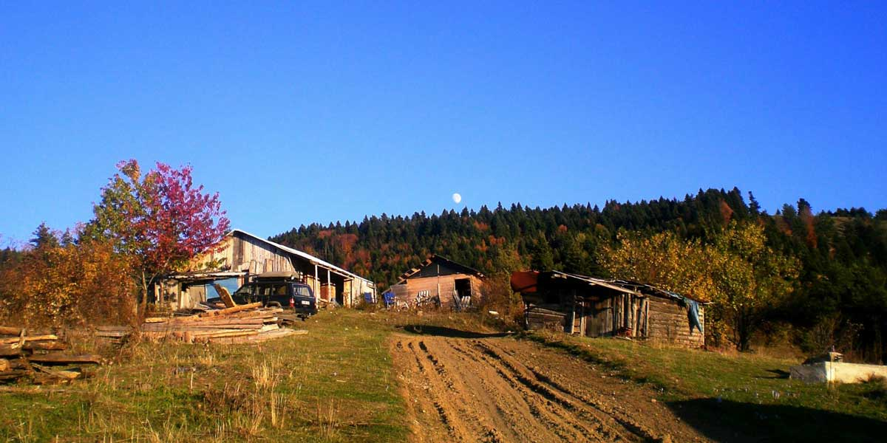
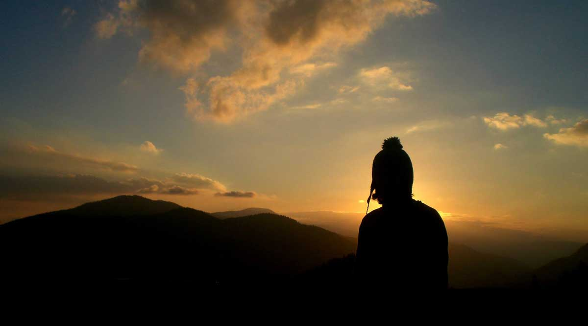
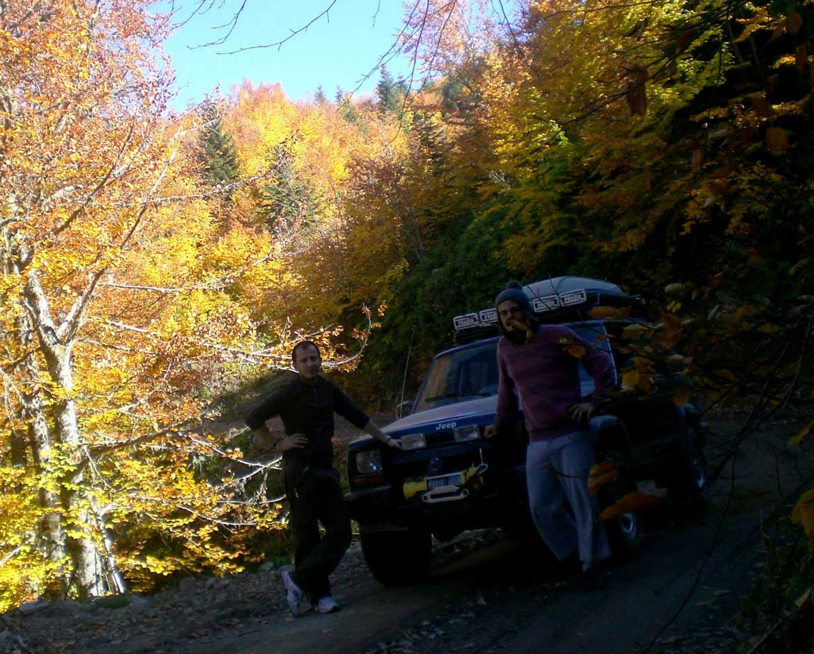
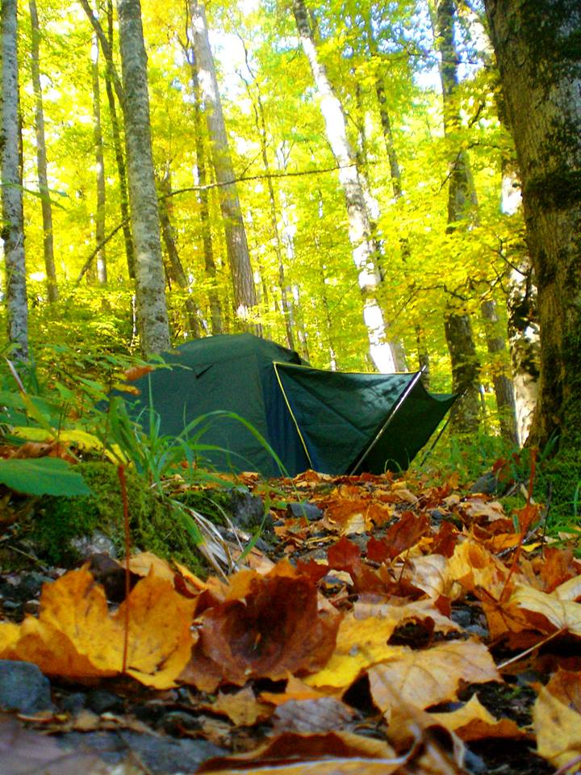
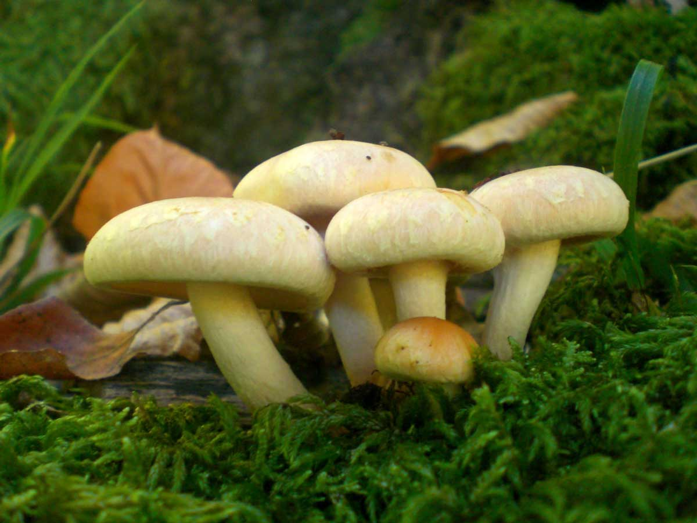
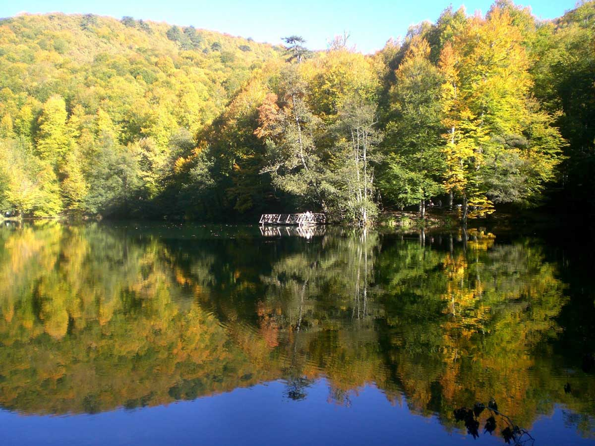
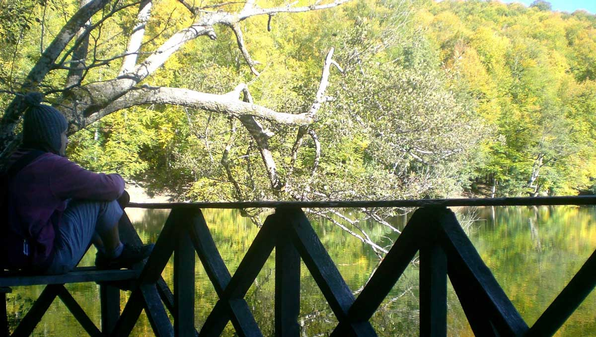

Bu kez tatil uzun. 9 günlük kurban bayramı tatilinde tek başıma yürüyerek Bolu Yedigöller’e gitmeye karar veriyorum. Aslında amacım tek gitmek değil ama 80km yürüyüp 7 8 gün kalacağımı söyleyince kimse bana katılmıyor. Bende ilk defa tek başıma yollara düşmeye karar verdim. Yedigöller’i iyice araştırdım, planlarımı yaptım ve rotamı belirledim. Bu gezi notları yolculuk esnasında yazılmıştır. Bundan sonra hep böyle yazmaya çalışacağım çünkü duygularımı ve o an ki hissettiklerimi daha güzel aktarıyorum.

**1.Gün 12/10/2013 Cumartesi**

Bayram tatili için Yedigöller’e tek başıma ve üstüne yaklaşık 80km yol yürüyerek trekking yapma planımda çok kararsızdım. Hem riskler çok yüksekti hem de hiç bir zaman tek başına yola çıkmamak gerekir. :) tabi cahilin cesareti çok olur. Karar verdim, tüm hazırlıklarımı yaptım. İlk defa dağlarda dolaşıp tek başıma kamp yapma planım beni hem heyecanlandırıyordu hem de tarifini yapamadığım bir duygu hissettiriyordu. Siz buna yusuf yusuf da diyebilirsiniz :). Bolu’ya ulaşım konusunda Cumartesi Mersin’e doğru yola çıkacak olan iş yerinden arkadaşım Neşe ve eşi ile birlikte hareket edecektik.

Günlerin geçmesini beklerken Cumartesi sabah tüm hazırlıklarımı tamamlamış ve eşyalarım sırtımda İstanbul sokaklarında olduğumu fark ettim. Neşe be Gürkan ile buluşup yola koyulduk. Benim için çok belirsiz olan bir maceranın başlangıcıydı. Onlar için ise benim saçma muhabbetlerime katlanmaktı :). Derken Bolu’da Yeniköy yakınlarında TEM’in kenarında beni indirdiler. Aslında ilk niyetleri beni soyup yol kenarına atmaktı ama çatapat Ömer’in yeğeni fırtına Rafık olduğumu söyleyince ve bıçağımı gösterince vazgeçtiler :). Bu maceraya başlamamda ulaşım ve sohbet desteklerinden ötürü kendilerine çok ama çok teşekkür ediyorum. Oymak başınız size minnettar.

26 kilo ağırlığı olan ve içerisinde beni hayatta tutmaya yarayacak eşyalarımı sırtladım ve yola koyuldum. Yol çok uzundu. İlk gün 14km dağa çıkış olan yürüyüşümü yapıp haritada evlerin olduğu bir yerde kampımı yapacaktım. Tabi bu noktaları daha önce belirledim, gideceğim rota üzerinde bayağı çalıştım. Biraz daha çalışsaydım saçma olurdu tabi :). Rota demişken balta girmemiş ormanlara dalmadım tabi, google maps’den görebileceğin Yedigöller yolunu takip edecektim.

Bakırlı->Yeniköy arasından geçerken evlerdeki serseri köpekler ödümü kopardı. Zincirleri olmasa beni yiyecek manyaklar :). Köpekleri atlattım ama bu seferde tepemde 3 tane kartal göründü. Kanatları desenli kocaman yırtıcı kuşlardı. Kartal olduğunu düşünüyorum. Ayağım kaysa yere düşsem bana saldıracak gibiler. Vay arkadaş dedim, daha yukarıda çakalı var, domuzu var, ayısı var. Kartallar böyle yaparsa yukarıda başıma neler gelecek onları düşünmeye başladım. Ayıboğan Nuri’nin yeğeniyim ama gerek yok hayvanları incitmeye, kalplerini kırmaya diyerek yola devam ettim.

Yolda kamp yapacağım yere kadar köylerde, yaylada ve yol üzerinde arabayla geçen bir çok insanla muhabbet ettik. Muhtarla bile :). Yaklaşık 11kmlik yokuştan sonra artık kamp yerini hayal ediyordum. Her yerim ağrıyor, kalan 3 km bitmek bilmiyordu. Yapacak bir şey yok ne çadır kuracak yer var ne de insan. Mecbur yürüdüm. 5 saatlik yürüyüş sonunda yaylaya vardım. Birkaç insan konfeti patlatmasa bile beni karşılar dedim ama kimsecikler yok. 2 riv riv de yapamadık iyimi. Tam çadırı kurarken bir jip geldi. Yaylada evleri varmış, bugün buraları gezmeye geldik dediler. Ardından çadırda kalma gir evlerden birinde kal diye ısrar etti. Ben dağcıyım ve çatapat Ö.. derken adam sözümü kesti ve bana sobalı bir ev ayarladı. Buradaki geleneklere göre yayla evleri kilitlenmezmiş ve bazılarında kullanman için yiyecek olurmuş. Bunu insanlar bilerek böyle yapıyor. O yüzden çekinme dedi ve girdim eve, yaktım sobayı, karnımı doyurdum. Ortam 10 numara oldu. Şimdi çayımı yudumlarken gezi notlarımı yazayım dedim. Her yerimde ağrıyor ve müthiş yorgunum. Ama uyumak istemiyorum. Manzarası harika olan ve böyle sıcak bir ortamı olan bir yerde 10 gün bile kalabilirim. Şu an Yedigöller’e gitmesem hiç üzülmem. Ama gideceğim tabiki. Ne çok yazdım ya yanımda kağıt da yok fazladan. Umuyorum ki bir yerlerden bulurum. Biraz daha çayımı yudumlayıp daha sonra uyuyacağım. Yarına dinç olmalıyım. Yeni maceralar beni bekliyor.

Not: İmla kurallarına takılıp adamı hasta etme, sen kim olduğunu biliyorsun :)

**2.Gün 13/10/2013 Pazar**

Gece zehirlenmemek için sobadaki odunların iyice yanmasını bekliyorum. Bu arada evde kalıyor olmanın vermiş olduğu güven ile camdan dışarıyı izleyerek yabani bir hayvan görmeyi çok arzuluyorum. Yarım saat sonra bir karartının hareket ettiğini görüyorum. Işığı ona doğru tuttuğumda parlayan bir çift göz hemen diğer evin arkasına geçiyor. Çakal veya tilki olduğunu düşündüğüm bu hayvanın salak bir köpek olduğunu görünce hayallerim yıkılıyor. Sobanın vermiş olduğu sıcaklıkla uykuya dalıyorum.

Sabah 7:30’da uyanıyorum. Ev soğumuş hava sanki yağacak gibi. Tabi bunlar beni yıldıramaz. O Yedigöller’e ulaşılacak arkadaş. Sobayı yakıyorum ardından güzelce kahvaltımı yapıyorum. Çok rahat bir gece geçirdiğimden orayı terk etmek istemiyorum. Yol uzun, çanta ağır. Pöff arkadaş ya diyorum çünkü yine yokuş var :). Tam yola koyulacakken sol arka adalemde çekme olduğunu ve belimden oluşan ağrının sağ bacağıma vurduğunu hissediyorum. Ama beni yıldıramaz. Hem enerjim çok hem heyecanım. Git git git hala git arkadaş lanet yokuş bitmek bilmedi. Yol boyunca Yedigöller yolunun çalışmadan dolayı kapalı olduğu yazılarını gördüm. Eee arabalara kapalıdır ben geçerim dedim. Tabi öyle olmadı. Bildiğin yolun sağı kayalık solu uçurum. Heyelan gelmiş gibi. Kepçe çalışıyor. Hani ormana girerek geçerim diye düşünüyorum ama orman yok ki. Kaldık orada iyimi. Sonra karşıdaki adamlardan geçmek için izin istiyorum. Kepçe duruyor ve ben tüm cesaretimi toplayarak ve aşağıya yuvarlanma riskini göze alarak kazasız belasız geçiyorum. Bir ayağın kaysa İbrahim pert :). 2.gün kamp yapmak için hedeflediğim yaylaya gidiyorum. Bu yaylaya vardığımda tüm evlerin kapısının kilitli olduğunu görüyorum. Çakal İbrahim seni hani dağcıydın sen, yatsana çadırda. Tabi bir önceki gün sobalı ev beklentilerini yükseltti öyle değil mi? Neyse bir bakıyorum Yedigöller için 15km yazıyor. Ben ise zaten 10km yürümüşüm. Yorgunluk artmış. Kamptan vazgeçiyorum ve dümeni Yedigöller’e doğru kırıyorum. Hedefim akşam olmadan varmak. Yokuş aşağı olduğu için tempoyu da artırıyorum. Yaklaşık 3km daha ilerledikten sonra sakatlıklar tekrar başlıyor. Ve artık ne olur bir araba geçsede beni de alsa diyorum. Çünkü yürümekte zorlanıyorum. Tam araba sesi duyar gibi oluyorum, durup arkama bakıyorum hop seslerde kesiliyor, araba da yok. Pöff 5 defa böyle oldu :). Sanırım iyice kafayı sıyırıyorum derken bir bakıyorum bir araba geliyor. Hemen yolun ortasına atlıyorum ve “Ne vereyim abime!” demiyorum tabi. Ardından 3 araba daha geliyor ve benim gözler parıl parıl parlıyor. Elbet biri beni alır öyle değil mi :D

Tabiki biri alacak. Almazsa artık bu şekilde biraz da gece yolculuğu yaparak göllere varmayı hedefliyorum. En arkadaki jipte bulunan arkadaş(Yasin) beni alabileceğini söylüyor. Ve öğreniyorum ki o da ben gibi kafasına esmiş tek başına yollara düşmüş. Ben ayaklarıma güvenmişim o ise jipine, tek fark bu :)

Dün sobalı evde kalmış olmak bugün ise Yasin’in beni göllere kadar getirmesi en anlamlı an oldu. Yine mutluluğum zirve yaptı. Yine 4 ayak üstüne düştüm. Yasin ile akşam yemeğinden sonra ben çadırıma geçtim. Sağ ayağımda sıkıntı yok ama sol adalem pert oldu. Artık yüksüz yürürken bile ağrıyor. Demek delikanlı adama da böyle şeyler oluyormuş :). 2 gün buradayım hem dinleneceğim hem göllerin etrafını gezeceğim. Bugün çok kısa büyük göl etrafında çadır kurmak için bakındım. Sadece buranın doğa harikası bir yer olduğunu söylemem yeterli olur. Ha günübirlikçileri merak ediyorsunuz tabi. Dağılın leyn dedim onlarda gittiler. Bis sürü günübirlikçi erinmemiş o kadar yol gelmişler. Buraya kalmadan gelmemek lazım. Arabayla bile Yasin 2 saate varmış. Ve herkes gitti ortam sessiz ve ben yine seni düşünüyorum. Bu gece de soğuk olacak mı çok merak ediyorum.

**3.Gün 14/10/2013 Pazartesi**

Vay arkadaş yine bir gün daha gitti. Bugün erken yatmadım. Çünkü bir sebebi var. Yine seni düşündüm. Evet sen, henüz bende kim olduğunu bilmiyorum ama düşünüyorum. Düşünmek bedava :).

Ne geceydi ama. Neden mi, çakallarla köpeklerin savaşı vardı. Bizim cesur köpekler sabaha kadar çakalları kovaladı. Onlarda ısrarla geldi durdu. Bir çakal çadırıma o kadar yakın geçti ki nefes alışını bile duydum. Pişt dedim hemen kaçtı gitti. O kadar yorgundum ve tulum sıcaktı ki dışarı çıkmak istemedim. Tüm sesleri duydum. Çakallar resmen bıktırdı. Bir rahat vermediler arkadaş. Ardından baykuş sesleri. Bu güzeldi ama ;). Sabaha doğru ise haşur huşur yaprak sesleri. Bu sesleri sincapların ve farelerin çıkardığını düşünüyoruz. Çünkü sabah erken saatlerde kalktığımızda onları gördük. İşte böyle ne gece ama değil mi? Tüm bunlara rağmen 12 saat uyudum :) (oha dediğini duyar gibiyim).

Sabah güzel bir kahvaltının ardından gülen kayalara, dilek çeşmesi ve şelalesine ardından seringöl ile deringöle doğru yürüyüş yaptık. Tahmini olarak 5 km yürüdük. Buranın bu kadar insana rağmen bu kadar doğal kalmış olması beni şaşırtıyor. Bu gördüğüm güzellikleri anlatacak kelimeler bilmiyorum. Bilseydim edebiyatla ilgileniyor olurdum zaten :). Hemen riv riv yap, yazının ciddiyetini boz. Neyse toparlıyorum akşam yemekten sonra kamp ateşini yaktık. Bu gece erken uyumayacağız ve çakalları bekleyeceğiz. derken ilk grup 8:30pm civarı geliyor. Işıklarımızı yakmak için iyicene yaklaşmalarını bekliyoruz ve ışıkları yakıyoruz. Sobeee :). Karşımızda 4, 5 tane çakal. Parıldayan gözler bir müddet bize bakıyor ve kaçıp gidiyorlar. Peşleri ardınca bir düdük patlatıyorum daha da görünmüyorlar. Evet dün burayı birbirine katan elemanlar bu kadar çıktılar. Bekle bekle ne gelen var ne giden. Saat 12 oluyor ve artık yatalım diyoruz. O da ne tekrar gelmişler. Yine kovalıyorum kaçıyorlar. Ben çadıra girip bu notları yazdığım sırada köpeğin bir çakalı kovaladığını duyuyorum. Çünkü tüm olay çadırımın önünde bitiyor. Sanırım yine hareketli bir gece bizi bekliyor. Ve ben yine seni düşünüyor olacağım. Bir de kim olduğunu öğrensek iyi olacak :). Hadi iyi uykular.

**4.Gün 15/10/2013 Salı**

Dün gece köpek son çakalı da kovaladıktan sonra daha sesleri duymadık. Sabah kalktığımda yine sincaplar etrafta kol geziyordu. Çok yaramaz ve bir o kadar da sevimli hayvanlar. Büyük gölün kenarındaki kahvaltı sonrası gezmediğimiz diğer 4 gölü de dolaştık. Yedigöller planım artık tamamlanmıştı. Geri dönüş yoluna koyulabilirdim.

Eşyaları toparlayıp arabaya yerleştirdikten sonra Yasin ile yayladaki evde 1 gece daha kamp yapmayı planladık. Ama öncesinde ayı tepesine yürüyecektik. Ayı tepesine vardığımızda dağların üstündeydik ve her tarafımız görünüyordu. Çok güzel bir manzara vardı. Ama ayı yoktu :). Kekik topladık, aloç yedik veya aluç işte her ne ise ondan, kaynatıp çayını içmek için kuşburnu bile topladık. Bir de avlanmasını bilseydik bir geyik avlasaydık on numara olmazdı tabi. Şu an sağlam bir ceza ödüyor olurduk :).

Daha sonra yayladaki eve vardık, karnımızı doyurduk ve kamp ateşimizi yaktık. Çok enteresan bir gün oldu. Sakin bir gün olmasına karşın hiç yerimizde durmadık. Sanırım artık dönüş yolunda olduğumuzdan biraz heyecanımız gitti. Pek dönmek istemiyoruz ama planlarımızı tamamladık. Ama benim için yarın heyecanlı bir gün olacak. 14kmlik geri dönüşümü yürüyerek yapacağım ardından otostop çekeceğim. Bakalım kimse beni alacak mı? :) alın len tabi.

Aslında birkaç gün daha kalınabilirdi ama hem güçten kuvvetten düşmeye başladım hem de yorulmaya. Bu yüzden dönmeyi düşünüyorum. Aslında seni düşündüğüm için dönüyorum. Ah sen. Sen kimsin be, takıldım kaldım. Tek başıma kamp yapınca sarıyorsun işte böyle :), hadi iyi geceler.

**5.Gün 16/10/2013 Çarşamba**

Sanırım bir tek bugünün tarihini doğru attım :). Ne tarihten ne de saatten haberim pek olmadı. Doğa da tarihi ne yapayım hem öyle değil mi? :)

Gece yaylada bir hareket olur, gelen giden olur dedik ama bir tıkırtı bile duymadık. Veya benim uykum yine ağırdı deliksiz uyudum :). Sabah güzel bir kahvaltının ardından ayı tepesinde topladığımız kuşburnuları kaynatıp içtik. Mis gibiydi. Ardından sıra toplanmaya gelmişti. Fazla olan ve bozulmayacak türdeki tüm yiyeceğimizi yayladaki eve bıraktım. Artık çanta hafiflemeliydi :). Ve artık Yasin ile vedalaşma vaktiydi. Sonrasında ben yine yollara düştüm.

Bugün çok hüzünlü olacak diye tahmin ediyordum. Çünkü hem doğadan ayrılıyordum, hem de senden. Bu sen yine ortaya çıktı. Neyse ki orada kaldı, gelmedi :). Beklentilerim boşa çıktı ve tam tersi çok mutlu olduğum ve keyiflendiğim bir gün oldu. Neden mi? Artık deliriyordum :-o. Normalde de öyleki zaten :). Bugün bir çok insan Yedigöller’e ulaşmaya çalışıyordu. Ve yolda karşılaştığım tüm arabalara selam verdim. Ve tabi onlardan çoğu da bana. Hatta bazıları komple ailecek gülerek el salladılar. Beni görünce çok mutlu olduklarını hissettim. Ve bu da benim mutluluğumu kat be kat artırdı. Mutluluğu paylaşmak hem de hiç tanımadığınız insanlarla ne güzel bir şey. Hatta bazı arabalar durdu sohbet ettik. Evet yol boyu böyle geçti. Belki 40 araba ile karşılaştım ve en az 10 tanesiyle muhabbet ettik. Sol omzumda ve sol ayak parmağımda yürümemi güçleştiren ağrılar oluşmuştu. Ama hiç umurumda bile değildi. Hem mutluluğumu bozmak istemiyordum hem de doğanın keyfini biraz daha çıkarmak istiyordum.

Derken kendimi TEM’in yanında buldum. Tabi yine o tel örgüler. O kadar yorgun ve halsizim ki tel örgülerden atlayıp otostop ile uğraşmaktan vazgeçip otogarın yolunu tutuyorum. Bolu’ya doğru bu şekilde yürüyünce her gören bana bakıyor. Yanımdan geçip gidenler arkasını dönüp bakıyor. Alışık olmayan bir manzara olsa gerek :). Derken 18kmlik yürüyüş sonrası otobüs terminaline varıp biletimi alıyorum. Ve 4-5 saat sonra evdeyim. Şimdi içimi bir hüzün kapladı işte. Tabi en önemlisi sağ salim eve varmaktı. Bunu bile yaptıysanız mutlu olmak için büyük bir nedeniniz var :). Sevgilerimle..

