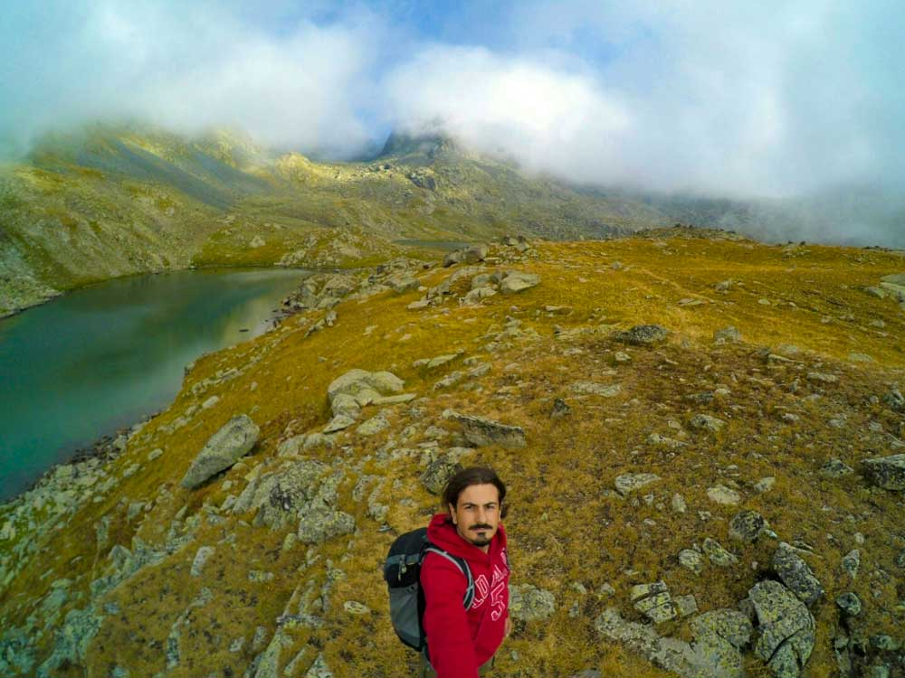
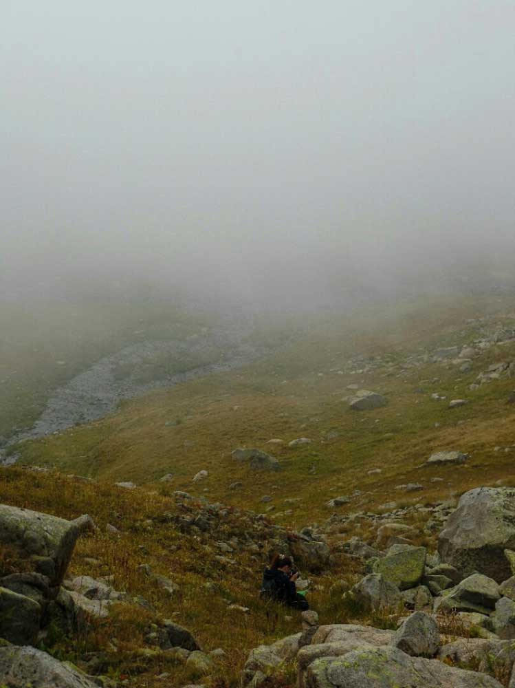

31 Ağustos 2015\
Simge’yle beraber Pokut yaylasında ayrılmadan önceki son dakikalarımızı geçirirken birileriyle karşılaşıyoruz ve bize Verçenik yaylasını övüyorlar. Pokut bir Verçenik ikinci sırada benim için diyor arkadaş. Çat vadisinin yukarısında olduğunu biliyorum ancak hiç gitmemişim. Buraya kadar gelmişken ve bu kadar övülmüşken gidelim dedik. Verçenik yaylasının üst kısmında ise krater göller var. Gitmişken buraya da yürüyüş yapıp gölleri görürüz ve belki çadır atarız diye düşündük ve yola koyulduk.

Çat vadisine doğru ilerlerken önce Zilkale’yi gördük ardından doğa harikası ve her yerden yeşilin fışkırdığı bir yolla Çat vadisindeki Toşi restorana vardık. Toşi’den sonra yol pisleşti. Bir süre toprak yol olarak devam ederken sonrasında taşlık yola döndü. Binek aracımızla(focus) yaylaya doğru ilerlerken benzin deposundaki ibrenin birden aşağıya inmesiyle biraz stres olmaya başladık. Düz yolda benzini koklayan arabayı dağa vurunca benzini içer oldu arkadaş. Tedirgin tedirgin giderken saat 15:00 civarı tam benzin ışığı da yanmıştı ki yaylaya vardık. En azından geri dönüş yokuş aşağı olduğundan bizi götürür diyerek kendimizi avuttuk.

Yaylada yoğun bir sis var. Bulutlar üzerimizden geçip duruyor. Zaman zaman görüş mesafesi artsa da siste bir yürüyüş yapacağımız bilinciyle yürüyüş için hazırlanırken Osman abilerle karşılaştık. Hem tanıştık hem karşılaştık. Onun da ayrı bir hikayesi var. “[Dünya Küçük](https://www.yolacikmali.com/2016/03/dunya-kucuk/)“‘dan ulaşabilirsiniz. Beynimde hızlıca bir hesap yaptım. Göller 3.2km uzaklıkta. Git gel 6.4km. Güzel yürürsek en fazla 2 saatte bitiririz ve saat 17:00 olur. 1’de ben vereyim 18. Hava da 19’da karardığına göre rahat rahat yürür geliriz. Plan süper. Başlattım gps kaydını ve hemen yola koyulduk. 2.8km dağlık patikadan, dere kenarından, sisler içerisinde yürüdükten sonra dik bir yokuşa geldik. Bir yokuşa baktım bir Simge’ye baktım kız isyanlarda. Bayağı yorulmuş, devam etmeyecek gibi çünkü isyanlarda. Sen burada bekle bir yere ayrılma yukarı bakayım göller oradaysa seslenirim sana değilse döneriz dedim ve 2dk içinde o tepeye çıktım. Bir de ne göreyim bir tepe daha. Biraz daha dik ve uzun tabi. Tamam kesin geri dönceğiz ama hay Allah bu kadar geldiydik göller nerede acaba diye bir fısıltı duydum. Haritaya baktım hemen, göller o tepenin ardında duruyor. Yine hızlıca düşünmeye başladım; Simge’ye seslensem duymaz, hayatta bu yokuşu çıkmaz, buraya kadar gelmişiz gölleri görmeden mi dönelim, Simge zaten aşağıda bekler bir yere ayrılmaz hem yorulmuşta biraz dinlenmiş olur, zaten ben de hızlıca 5 dkya çıkar inerim düşünceleriyle fırlayıp yukarı çıktım.

Tepede gölleri görünce bir an Simge aklıma geldi saatime bir baktım yaklaşık 15dk geçmiş. Offf, lann, naptım ben kız şimdi delirmiştir tek başına 15 dk 3 saat gibi gelmiştir ona, haber de etmedim, eyvah eyvah. Hızlıca bir kaç göl fotoğrafı çektim ve hemen koşarak aşağı inmeye başladım. Daha fazla gecikmemek için koşarak iniyordum ve bir yerimi sakatlamamak için çok dikkat ediyordum. Tabi aklımda Simge, acaba ne yapıyor, inşallah bir yere gitmemiştir diyorum. Yok ya Simge’ye burada bekle gitme dersem o bir yere ayrılmaz diye de bir güven var bende. Ama ya gitmişse? Koştur koştur inerken doğru patikayı da buldum. Daha hızlı inerim diye geldiğim yol yerine buradan inmeye devam ettim. Belki biraz aşağı inmiş olabileceğimi tahmin ederek Simge’yi bıraktığımı düşündüğüm tepeye yaklaştığımda bir ses duydum. Bir baktım ses yukarıdan geliyor ve Simge yukarıya doğru bakarak bana sesleniyor. Simge neden yukarı çıktın diye seslendim. Süper, her yeri bok ettim şimdi sıvıyorum. Öyle deyince Simge’nin kayışlar koptu başladı bana yardırmaya. Kız bir yere gitmemiş sadece ben aşağıya inmişim. Bir araya geldik, fırçamı da yedim ve şuursuzca yaptığım hareketin pişmanlığını yaşarken Simge bir insan olarak rica ediyorum beni buradan çıkar dedi. O an kaşım gözüm seyirmeye ve gözümün önündeki görüntü gidip gelmeye başladı. Bildiğin kafa gidip gelmeye başladı. Bir an bulunduğum yeri nereden döneceğimizi falan şaşırmaya başladım. Boş boş ettrafa bakınırken İbrahim bak koçum dedim önce bir sakin ol. Bir bok yedin eyvallah ama şu an sakin ol ve yediğin haltı düşünme ve buradan çıkmanın hesabını yap. Sonra kendinle olan hesaplaşmana ve Simge’ye olan özrüne geri dönersin dedim ve kendimi toparladım. Ortamın sisli oluşu ve havanın kararmaya da yakın oluşu gerginliğimizi artırıyordu. Ben sise ve bu dağlara alışkındım ama Simge hala alev saçıyordu. Patikayı buldum, hızlıca aşağı indik. Yaklaşık 1 saat 40dk civarı süren yukarı çıkışımızı 40 dklık süper bir performansla arabaya vardık. Simge sinirlenince daha iyi yürüyormuş onu anladım. Arabaya varmış olmanın mutluğu tatlı bir yaz esintisi gibi gelse de benim kendimle olan hesaplaşmam zebani gibi üzerime çöktü. Yine mallaşmaya başladım ve yol boyunca ses çıkarmadım, çıkaramadım.

Yokuş aşağı arabaya benzini koklatarak Çat vadisindeki Toşi pansiyona indik ve geceyi orada geçirmeye karar verdik. O akşam yemeğinde olayı konuştuk. Yanımızda telsiz olması gerektiğini en azından Simge’de de rota bilgisinin olması gerektiğini konuştuk. Sonuçta benim tansiyonum düşse, aniden bayılsam bişi olsa kız tek başına kalacaktı. Hatalarımdan ders çıkardık sonra tatlıya bağladık. Gerçi Simge ne zaman bu olayı anlatsa aynı siniri yaşıyor. O yüzden hatırlamamasında fayda var :)