Tarih 2014 Nısan ayında bir gün işte. Yaklaşık 4.5 ay sonra Likya yoluna gitmeyi hedefliyorum. 3 aydır ise kondisyonumu güçlendirmek için body ve kardiyo çalışıyorum. Artık kendimi test etme zamanı geldi. Ne kadar yürürüm, ne kadar yokuş çıkabilirim, yokuşlar beni yoracak mı, ayaklarım ağıracak mı gibi soruların cevabını öğrenmek için rotası uzun olan bir plan yapmaya karar verdim. Aklıma daha önce Yalova taraflarına gitmiş olduğumdan Esenköy’den yürüyüşe başlamak geldi. Esenköy’den yürüyüşe başlayıp Delmece yaylasından geçerek Armut’lu taraflarına inmeyi planlamaya başladım. Ben planlarken iş yerinden arkadaşım Emre de gelmek istedi. Emre motor tutkunu, kamp yapmayı seven, doğa sever birisi. Ama daha önce hiç trekking yapmamış birisi için bu uzun parkur zor olacaktı. Sürekli yapmış olduğu yürüyüşlere güvenerek ve şu fani hayattan trekking yapmadan gitmiş olmayayım diyerek gelmek istedi.

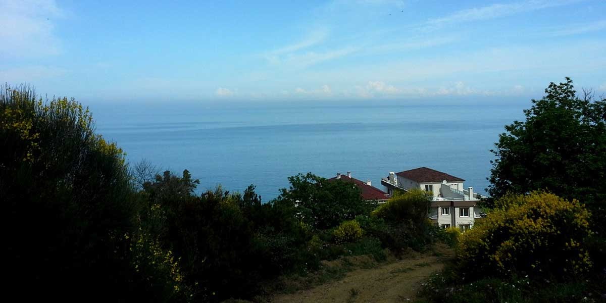

### **Esenköy Ulaşım**

Cumartesi sabah her zaman ki gibi Pendik’ten Yalova’ya vapurla geçtik. Saat sabah 8 ve Esenköy’e gidecek ilk araç 10 da hareket edecekmiş. Ben Cuma geceden gelmeyi planlıyordum. Sonra vasıta bulamam diye vazgeçmiştim. İyi vazgeçmişim. Yoksa gece gece otostop da çeksem Esenköy’e gidemezdim. Bizde 8 de kalkacak olan Çınarcık arabalarına binip Çınarcık’a kadar geçip sonrasında otostopla Esenköy’e geçmeye karar verdik. Zaman kaybı bizim için çok lüks olacaktı. Çınarcık’ta otostop çekmek için elimi kaldırır kaldırmaz bir araba durdu. Hahah şaka gibi, hayatımda 2.kez otostop çekiyorum ve ikinci kez otostop çektiğim ilk araç beni alıyor. Allah’ın sevdiği kulu olabilir miyim acaba.

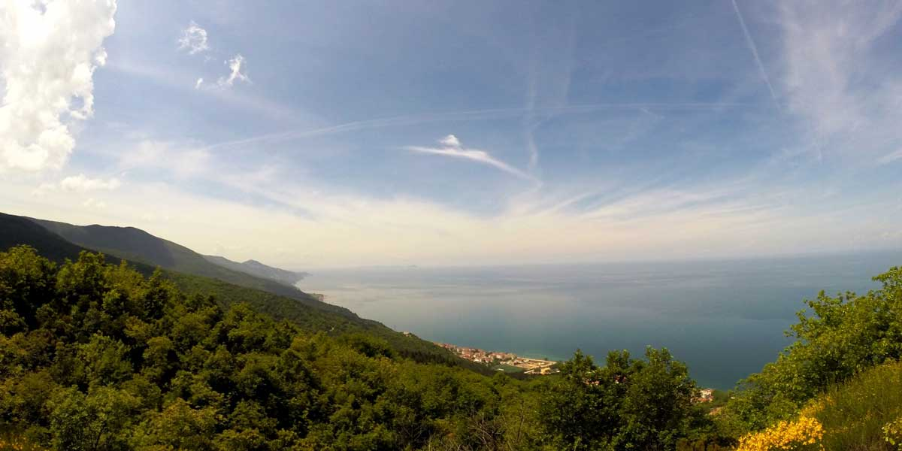

### **Muhteşem Manzarasıyla Esenköy**

Esenköye inmeden bir viraj döndük ve gördüğümüz manzara karşısında ağzımız açık kaldı. Bir an kendimi Ege ya da Akdeniz taraflarında sandım. Bu kadar güzel manzarası olan ve İstanbul’a da bu kadar yakın olan bu güzel yeri daha önce nasıl oldu da keşfedemedik, öğrenemedik diye kendimce hayıflandım. Esenköy merkezde indikten sonra yürüyüşümüze başladık. Sıfır rakımdan yaklaşık 900 metrelere yükselecektik ve sonra yine tekrar deniz seviyesine inecektik. Orman içi toprak yoldan hatta eski bir traktörü olan bir yoldan yürüyüşümüze başladık ve yükseldikçe manzaranın güzelliğine hayran kaldık. Sonra orman içerisine iyice girdik ve manzara kayboldu. Yolda giderken bir kurt izine rastlıyoruz. Bizim için oldukça heyecan verici oluyor. En erken 1 günlük olan bu izi görünce içimden umarım karşılaşmayız diyerek yola devam ediyorum.

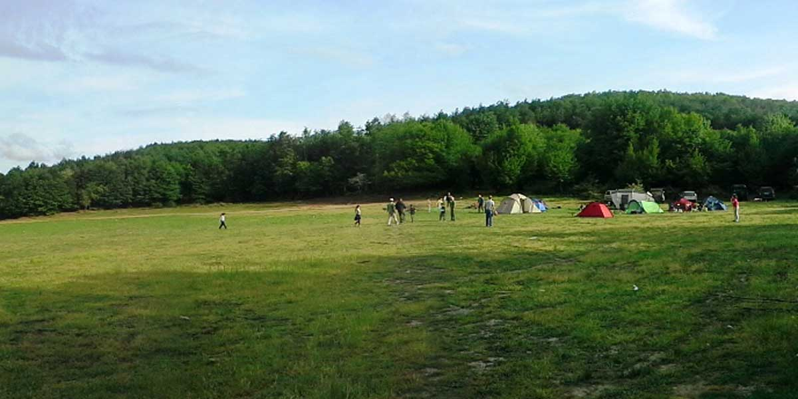

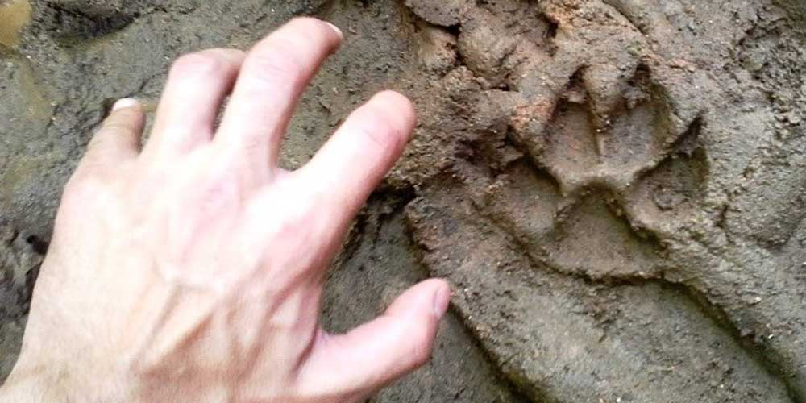

### **Karlık ve Delmece Yaylası**

900 metre yükseltiye çıkmak insanı yoruyor. Ancak spor yapmanın etkisini şu an çok rahat görebiliyorum. Ayaklarım oldukça rahat ve adalelerimde çekme yok. Benim için oldukça rahat bir yürüyüş oluyor ancak bu dik çıkış Emre’yi biraz zorladı. Ama yine de normal birisine göre oldukça iyi efor sarf ediyor. O da yapmış olduğu yürüyüşlerin faydasını görüyor. Sonra birden kendimizi Karlık yaylasında buluyoruz. Ormanın içerisinde kalan bu yaylada 18 tane çocukla birlikte kamp yapmaya gelmiş kalabalık bir gruba rastlıyoruz. Biraz muhabbet ettikten sonra Delmece yaylasına doğru devam ediyoruz. Baharla birlikte yeşillendiğinden burası bize çok güzel geliyor. Hatta Delmece yaylasından bile daha güzel olduğunu söyleyebilirim. Bir gün burada kamp yapmaya gelmeliyiz diye düşünürken çok yakında olan Delmece yaylasına geliyoruz. Uygun bir yer bulup çadırımızı kuruyoruz. Kamp ateşi için odun toplamakla uğraşmıyoruz çünkü epeyce yorgunuz. Yemek ve çayın ardından biraz oturuyoruz sonra uykuya geçiyoruz.

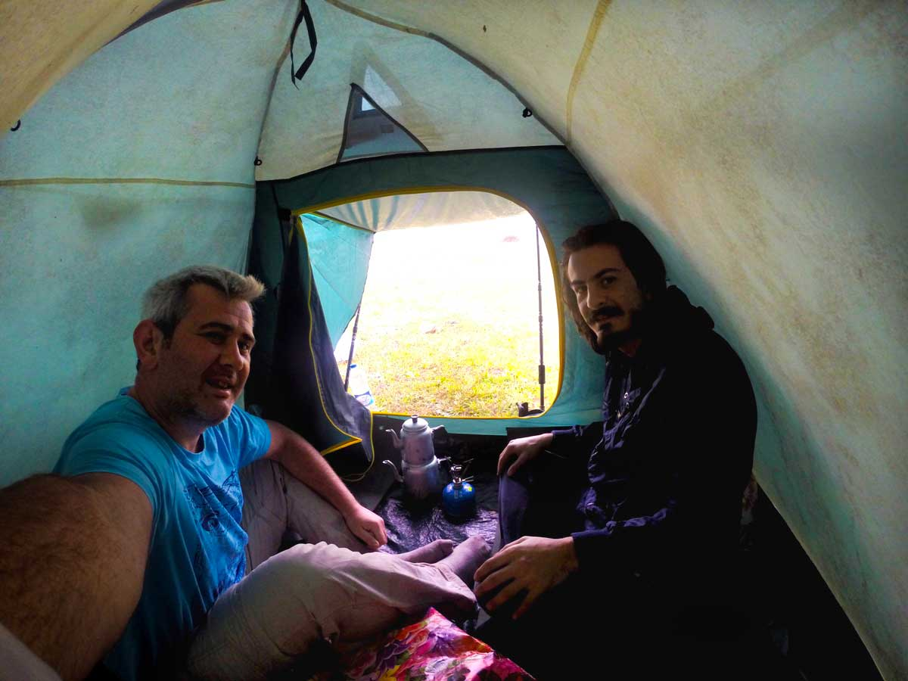

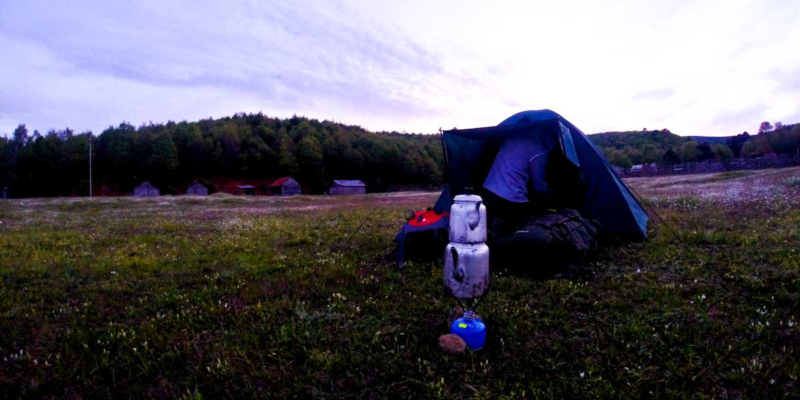

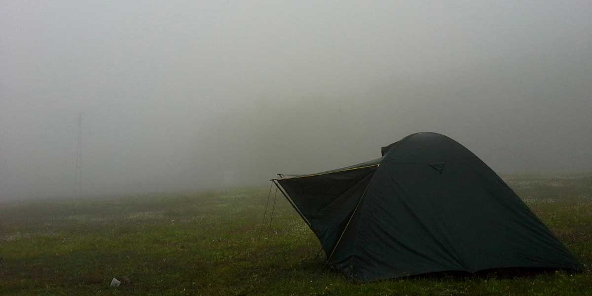

### **Yağmur da Yağmur**

Sabah uyandığımızda güzel bir yağmurla karşılaştık. Yağmur yağma ihtimaline karşı hazırlıklıydık ancak yine de sabah güneşi görmek daha keyifli olurdu. Kahvaltıyı çadırda yaptıktan sonra hızlı bir şekilde toparlandık, yağmurluklarımızı giyindik ve yola koyulduk. Yağmur iyice sağanak şekline döndü. Ama biz durumdan oldukça memnunduk. Texapore bot kullanmanın faydasını burada çok gördüm. Ayaklarıma 1 gr bile su gelmedi. Bu tür yürüyüşlerde ayağınızın kuru, rahat ve sıcak olması size daha iyi bir yürüyüş yapmanızı sağlar. Emre’nin botları su geçirdiğinden çoraplarının üstüne poşet giymesini sonra poşetin üstüne de tekrar çorap giymesini söylüyorum. Çünkü ıslak ayaklarla yürüyor olmak bir süre sonra onu kendinden bezdirebilirdi. Sizde bu gibi bir durumda poşet kullanarak ayaklarınızı hem kuru hem de sıcak tutabilirsiniz. Yürürken muhabbet o kadar güzeldi ki bir de baktık yağmur durmuş. Nerede, ne zaman durdu hiç bilmiyoruz :)

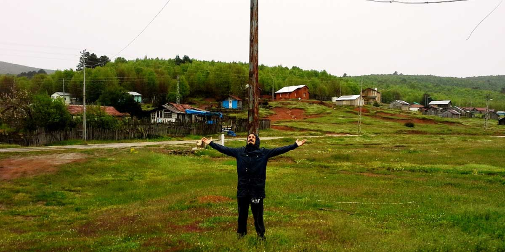

### **Narlı**

Delmece yaylasından aşağıya inerek Armut’luya yakın bir yere varacağımızı düşünürken Narlı’ya daha yakın olduğumuzu fark ettik ve Narlı’ya doğru devam etme kararı aldık. Orman içerisinden çıkınca yine çok güzel bir manzara bizi karşıladı. Karşımızda Gemlik önünde Marmara denizi arkasında Uludağ ve muhteşem bir manzaraya hayran kalarak Narlı’ya ulaştık. Yaklaşık 37 km yol yürümüş olmak benim için umut ışığıydı. Üstelik fiziksel olarak 10-15 km daha kaldırabileceğimi düşünüyorum. Emre ise tabi ilk yürüyüşünün vermiş olduğu yorgunluk yüzünden okunuyordu. 37 kmyi çıkarmış olması onun içinde çok güzel bir başarıydı. İlk yürüyüşlerim de ben bile 30km’yi göremiyordum, itiraf etmeliyim bu kadarını çıkaracağını tahmin etmemiştim. Bunu duymasın :)

Narlı’dan Gemlik otobüslerine binerek önce Gemlik’e ardından Yalova arabalarıyla tekrar Yalova’ya ulaşıyoruz. Sonrası yine vapur ve yine İstanbul. Doğayla bu kadar baş başa kaldıktan sonra topluma karışmak zor oluyor. 

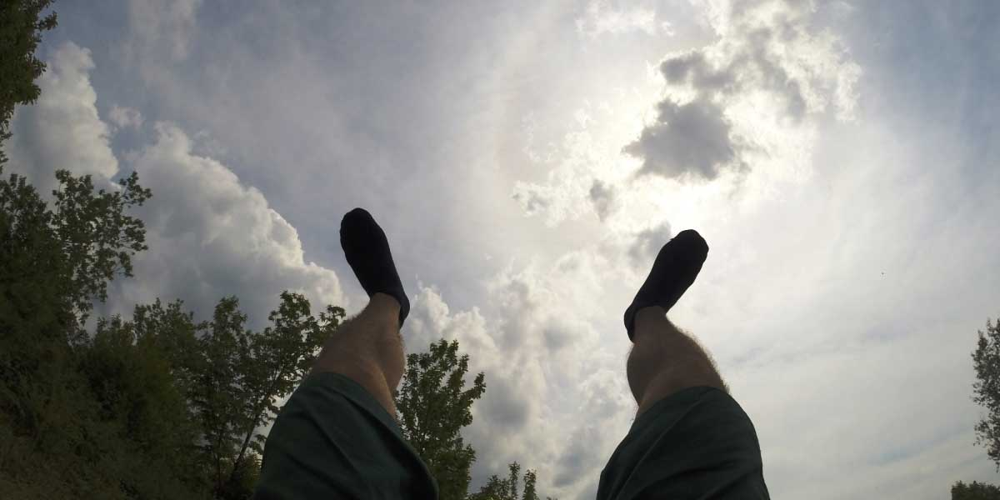

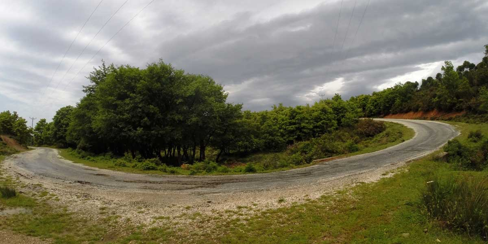

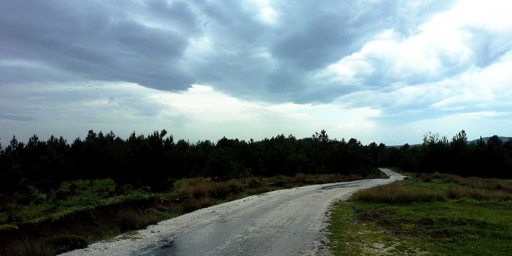

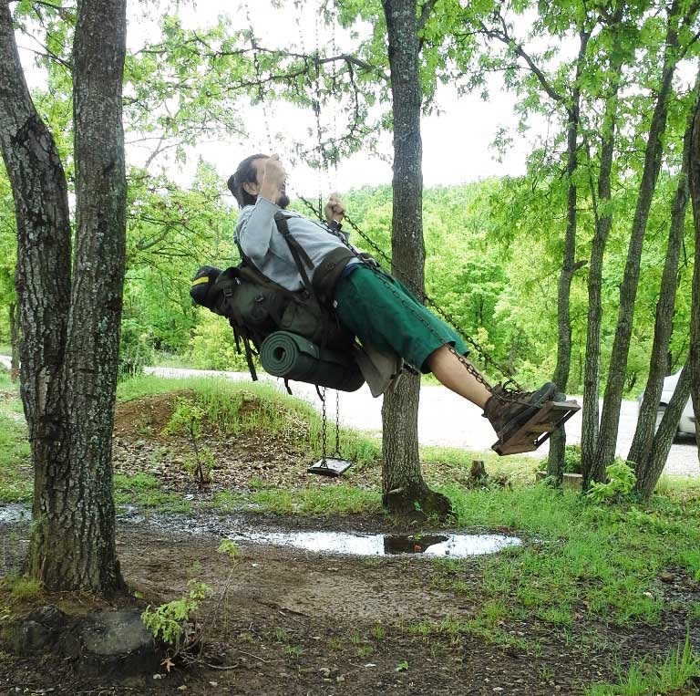

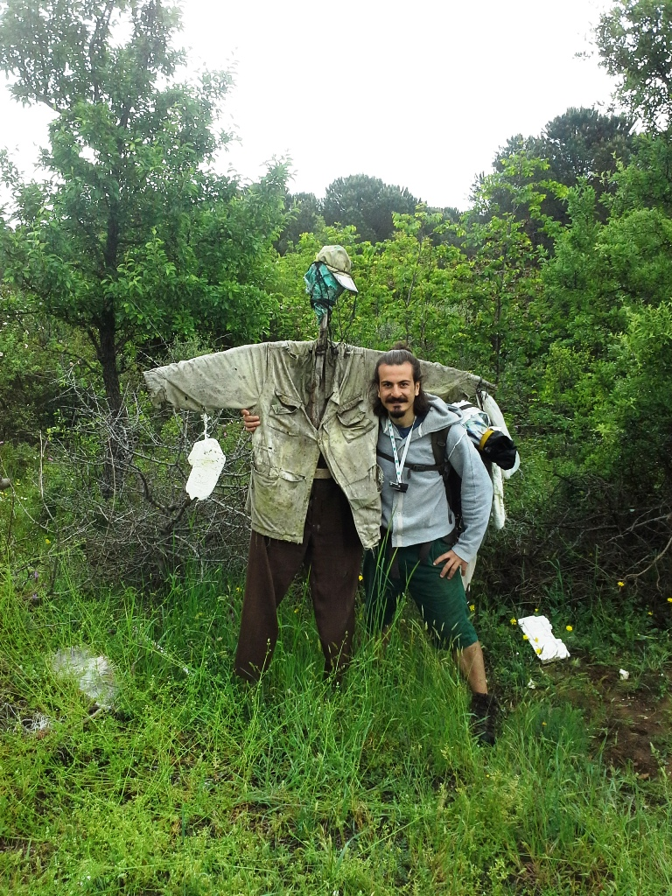