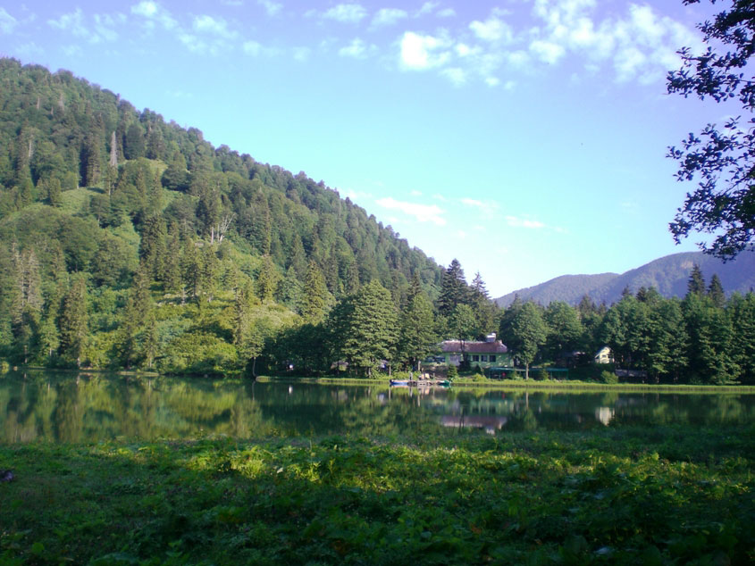
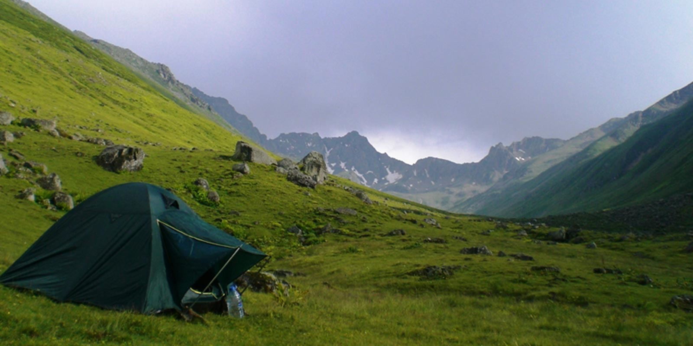
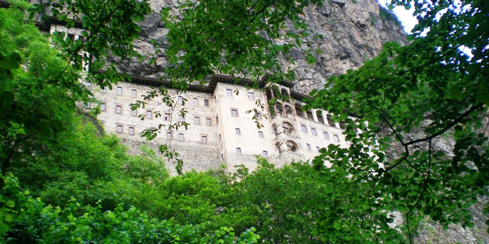

Çadır kurmak, kamp yapmak, dağlarda dolaşmak, trekking ve hiking yapmak içimde bastırılmış gizli tutkularımdı. Bunların hepsine çok yabancıydım. Ama bir yerlerden de başlamam gerektiğini biliyordum. Yakın dostum doğa sever ve aynı zamanda sivil savunmada görev almış Hüsnü Şen kardeşim bana ön ayak oldu. Birlikte gidip gerekli tüm ekipmanları aldık. İlk malzemenizi bilen birisiyle almanızı tavsiye ederim. Aksi halde size uygun olanlar yerine pek işinizi görmeyecek veya sizi yarı yolda bırakacak şeyler alabilirsiniz.

## **Plan**

2011 Temmuz ayında Erzurum’dan Istanbul’a geçeceğim için kamp planını buna göre yapmalıydım. Fotoğraflardan gördüğüm ve hep merak ettiğim Doğu Karadenizi gezmeye karar vermiştim. Gezimi tek başıma yapmayı planlarken kardeşlerim Furkan ve Zeynep de dahil oldular. Yanımda bir bayan olacağından artık planları buna göre yapmalıydım. Bana kalsa dağda herhangi bir yerde tek başıma kalabilirdim. Hem ilk kampım hem de o derece cesaretliyim. Cahil cesareti iste. Ama yanınızda bir kadın olunca öyle olmuyor :). Uzun araştırmalarım sonucu Artin de bulunan Karagöl’ü, Kaçkar sırtlarındaki Yukarı Kavrun yaylasını ve Sümela Manastırını hedef almıştım. Oralarda çadır kurabiliyor olmak benim için yeterliydi.

## **Yola Koyulma Vakti, Hedefimiz Borçka Karagöl**

Cuma sabah eksik kalan işlerimizi tamamlayıp öğle vaktinde Erzurum’dan yola çıktık. Ilk gün once Tortum gölünden geçtik. Ardından Tortum şelalesini dolaştık. Bu mevsimde suyu az akıyordu. İlkbahar da suyunun çok gür aktığını ve dibine kadar yaklaşılamadığını biliyorum. Tortum şelalesinde herhangi nir sosyal tesis bulunmuyor. Piknik yapacak masalar mevcut. İçme suyu ve tuvalet bulunmaktadır. Şelalenin etrafını dolaştıktan sonra tekrar yola koyuluyoruz. amacımız hava kararmadan Karagöl’e varmak. Yusufeli’ne kadar rahat geliyoruz. Ancak sonrasında baraj çalışmalarından dolayı yol çok bozuluyor, hatta bazen çalışmaları bekliyoruz. Artvin’e yaklaşana kadar böyle devam ettik.

Tekrar asfalt yol ile buluşunca rahatladık. Hiç vakit kaybetmeden Borçka’ya doğru devam ettik. Borçka’ya vardığımızda Karagöl için 27km mesafemiz kalmıştı. 20kmsi asfalt, 7kmsi ise toprak ve dar bir yol olan bu kısım inanilmaz güzel ve keyifliydi. Her nekadar karanlığa kalmamak icin hızlı gitsekde yolun bu kısmı cok keyifliydi. Artık doğu karadenizde olduğumuzu hissedebiliyorduk. Tam hava kararmaya başlamıştı ki biz Karagöl’e vardık. 7tl otopark ücreti,  8tl ise çadır ücreti ödedik. Karagöl de pansiyon var. Ancak detaylarını bilmiyorum. Yiyeceginizi kendiniz temin etmelisiniz, yoksa aç kalabilirsiniz :). Çok temiz olmasada tuvaletin olması güzeldi. Çadırımızı pansiyonun hemen karşısındaki düz alana fenerler eşliğinde kurduk. Allah’ım her taraf sivrisinek. Bizi ısırmak, tadımıza bakmak için birbirleriyle yarışıyorlardı. Çok hızlı bir şekilde çadırı kurup hemen içine girdik. Dışarı çıkmak istemiyorduk. Bir cesaretle dışarı çıktığımda hiç sivrisinek kalmadığını gördüm. Ardından dışarı çıktık. Arkamız orman önümüz göl ve gökyüzü alabildiğince yıldızla dolur :). Bizden baska çadır kuranlar vardı.  Hatta kalabalık bir ekip. Ancak onlar pansiyonun yaninda oldukları için bizim yanımızda kimseler yoktu. Aniden orman içerisinde sigaranın ucundaki ateş gibi ışıkları farkettik. Yüzlerce hatta binlerce ateş böceğinin olduğunu gördük. Hatta bir tanesi hemen önümüzden uçarak geçti. Bizse o kadar ateş böceğini bir arada görmüş olmanın şaşkınlığıyla ağzımız açık doğayı izliyorduk :)

Ertesi sabah sivrisinekler yine her taraftaydı. Hemen toparlandık, gölün etrafını biraz dolaştık ve Ayder’e doğru yola koyulduk. Göl etrafındaki otlar çok yüksek olduğundan arasına pek girmedik. Çünkü karşımıza ne çıkar bilemedik. Yani yusuf yusuf :).

Borçka-Karagöl’e gidilmeli mi? Gitmeye değer mi?

\-Evet kesinlikle değer. Görülmesi gereken çok güzel bir göl. Tekrar gitmeyi çok isterim.

## **İkinci Hedefimiz Yukarı Kavrun Yaylası**

Uzun bir yolculuktan sonra önce Ayder’e geldik. Buraya kadar gelmişken mıhlama(muhlama) yememek olmazdı. Sonra Yukarı Kavrun yaylasına doğru yola koyulduk. Aslında Ayder-Y.Kavrun arası minibüsler var. Yarım saatte bir veya yoğunluk varsa dolunca hareket eden bu minibüslerin ücreti ise 10TL. Ayder turistlik bir yer olduğu için oldukça kalabalıktı. Hala doğal güzelliğini koruyor. Ayder’de bir çok pansiyon ve çadır kurabilecek yer var. Normal zamanlarda fiyatları pahalı olmayan bu pansiyonların fiyatları bayram, tatil gibi yoğunluk olan günlerde ateş pahası oluyor. Ayder’i bir kaç km geçtikten sonra yol iyice bozulmaya başlamıştı. Y.Kavrun yaylasına kadar arabamızla çıkabileceğimizi düşünüyorduk. Yolun çok bozuk olduğunu öğrenmiştik ama arabamızın(megane scenic) altının yüksek olduğuna güveniyorduk, en azından sedan araçlara göre. Ama öyle olmadı yolda karşılaştığımız ve bize bu arabayla çıkmayın diyen insanlar haklıydı. Biraz zorlasak arabanın altını vurup orada kalabilirdik. Bu yüzden arabamızı uygun bir yere park edip çantalarımızı sırtlanarak yürüyerek çıkmaya karar verdik. Yolda linea ile yolu zorlayan birisiyle karşılaştık. Arabasının altında vurulmadık yer kalmamıştır. Ki adam da zaten pişman olmuştu. Bu yüzden bu yola 4×4 aracınız yoksa girmeyin. (2013 de tekrar gittiğimde bu yolun asfalt yapılacağı, hatta Ayder’den Kavruna teleferik yapılacağı söylentileri dolaşıyordu. Gerçekten olur mu? Yaşayıp göreceğiz).

4-5 km yürüdükten sonra yanımızdan geçmekte olan Kavrun minibüsünde yer olduğunu öğreniyoruz ve hemen biniyoruz. Eee ilk kamp 4-5 km bile iyi yürüdük. Tabi araç yolunu takip ederek. Yoksa yol bilmez, iz bilmeyiz kaybolur gideriz :). Ve artık Y.Kavrun yaylasındaydık. Amacımız zirveye doğru kısa bir yürüyüş yapıp ardından yayla civarında kamp kurmaktı. Ancak erken bastıran yağmur buna izin vermedi, ve hemen çadırımızı kurup içine girdiğimizde, sırılsıklam olmaktan bir kaç dk ile kurtardığımızı anladık. Yağmura karşı dayanabileceğimiz hiç bir şeyimiz yoktu. Eee yazın ortasında yağmur olmaz diyorduk. Ama buraya ne zaman gelirseniz gelin, gelin tabi ama yağmura hazırlıklı gelin :). Y.Kavrun yaylasında 2 3 tane pansiyon ve yine bu işletmelere ait cafeler mevcut. Ücretlerinin çok yüksek olmaması bizi memnun etti. Sonuçta dağın tepesinde yiyecek bulabileceğiniz başka bir yer yok. Yayladakiler güler yüzlü, sıcak kanlı insanlar. Konservemizi ısıtmamız için 1 2 odun istediğimizde bizi kırmayıp verdiler. Odun burada çok değerli çünkü etrafta odunun o’su bile yok.

Ertesi sabah zirveye doğru bir yürüyüşün ardından geceyi tekrar yaylada geçirip bir sonraki gün dönmeyi hedefliyorduk. Gece çok rahat bir uykunun ardından sabah havanın yine kapalı olması ve bizim yağmura karşı hiç bir önlemimizin olmayışından ötürü geri dönmek zorunda kaldık. Evet bu moral bozucuydu, çadırın içerisinde saatlerce tıkılı kalmak istemiyorduk. Bu yüzden dönme kararı aldık. Resmen içimde kalmıştı :), ama bir gün tekrar gelip zirveye çıkacaktım. Hızlıca toparlanıp yaydaki kahveye kendimizi atar atmaz yağmur başladı. Yağmuru görünce ne kadar doğru bir karar verdiğimizi anlamıştık. Yeterli ekipmanın yoksa zorlamanın bir anlamı yok. Aksi halde günü zararla bitirebilirsin.

## **Ve Son Hedefimiz Sümela Manastırı** 

Sümela’ya gitmek icin Trabzon’a uğramak gerekiyordu. Hazır medeniyetle buluşmuşken bir hamam keyfi yaptık,  ardından karnımızı doyurduk. O kadar yoldan sonra bu iyi gelmişti. Öğleden sonra Sümela’ya vardık. Sümela’ya yaklaşmadan kamp yerleri vardı,  ama biz manastırın yakınlarında bir yere çadırı kurmak istiyorduk. Önce restoranların oradan başlayan patika ile manastıra çıktık. Yaklaşık 45 dk süren bu tırmanış oldukça keyifliydi tabi yorucuydu da. Burayı yürüyerek çıkmak istemeyenler araç yolunu takip ederek yukarı kadar çıkabilirler. Ama buraya kadar gelmisseniz yürüyerek çıkmanızı tavsiye ederim. İnsanların dinlerini devam ettirmek için kayalıkların arasına yapmış oldukları bu yere hayran kaldık. Muhteşem bir yapı. Restoranların karşısında bulunan pansiyonların arkasındaki ağaçlık alanda çadırımızı kurduk. Genelde insanlarin piknik yaptığı çok büyük olmayan bu yerde Furkan’ın çalmış olduğu keman sesi ile son gecemizi geçirdik.

Doğu karadenizi pek bilmiyorduk, bu yüzden gezimiz erken sonlandı. Ama hem doğu karadenizle tanışmak için hemde kamp hayatına atılmak için güzel bir başlangıç olmuştu.