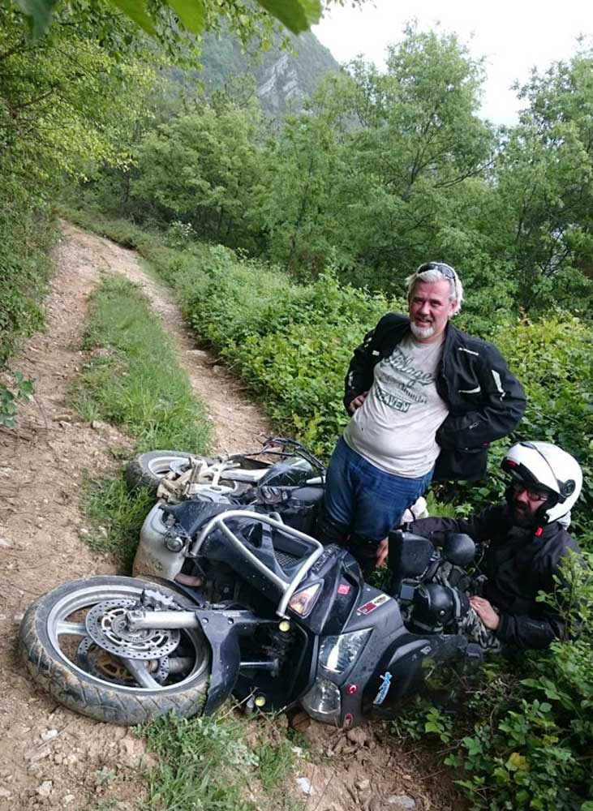
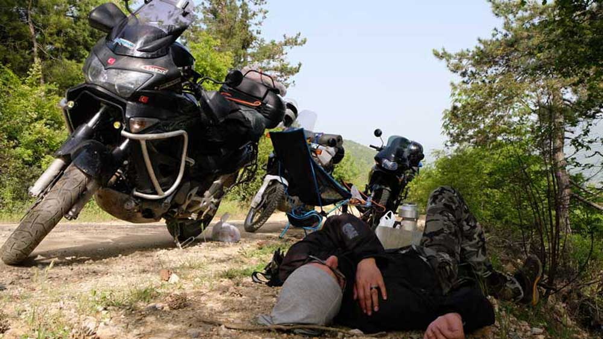

13 Mayıs 2017. Artık havalar ısınmış yaza girerken motorlarla kamp planları zihnimizde dönüp duruyordu. Hedefimiz **Turnalık Yaylası** ve 3 motor sabah 7 gibi yola çıktık. Soldan sağa -> 1 Transalp(Ben), 1 Africa Twin(Emin abi) ve 1 de Varedero(Emre abisi). 1 de Tenere (Murat abi) var ama o öğleden sonra bize katılacak.

### MOTORDAN DUMAN GELİYOR

Sabah kahvaltı falan yapalım derken biraz geciktik ama sorun yok, Tem’e çıktık ve güzelcene devam ediyoruz. Motorları denemek için Tem’de Adapazarı düzlüğüne girince 150-160 basmaya başladık. Aslında hızlanıp önümüzdekini solluyor ve sonra yavaşlıyoruz. Öyle sürekli basıp gitmek yok. Keyifli keyifli güzelcene giderken birden Emre’nin beni durdurmasıyla emniyet şeridine geçtik ve noldu diye sorduğumda egzozundan duman geliyordu dedi. Durunca fark ettimki ne egzozu motor bildiğin yanıyor. Hemen kontağı kapadım, motordan inip ne olup bittiğine bakayım dedim. Her yer yağ. Motor yağ kusmuş resmen. Hem üstüm başım hem de motorun her tarafı. Ulan yine mi motor yatak sardı diye düşünmeye başladım. Bilenlere, ustalara arayıp sorduk. Motorun yağını kontrol ettik ve üstüne bir de usta getirtip gösterdik. Mevzu yokmuş, sıkıntı motora fazla yağ konmasındaymış. Motora fazla yağ konunca yağ ikmal hortumundan fazla yağı püskürterek atmış. Bunu öğrenince gönül rahatlığıyla yola devam ettik. Bi an ödüm koptu motor yine mi yatak sardı diye. Neyse ki değilmiş. Yoksa motoru kaldırıp atardım oracıkta.

### BİLMEDİĞİN YOLA GİRME

Motordaki yağları temizledik, kontrol ettik tekrar kaçak var mı diye. Olmadığını görünce Akyazı’ya gittik, yemeklik bişiler aldık, motorları yıkadık. Motorları diyorum çünkü o kadar yağ püskürtmüş ki Emre’nin motor bile yağ olmuş. Saat 2 oldu. Tekrar yola koyulduk ve Dokurcun’daki yol ayrımına geldik. Haritaya bakıyorum google kestirme bir yol çiziyor. Asıl yol farklı gibi. Kestirme yol en fazla biraz toprak ve bozuktur, biz ne de olsa endurocuyuz diyerek yola daldık. Bu düşünceleri içimden geçirdim. Gittikçe yol daha da bozuluyor. Ulan bu yoldan gidilmez, uğraşmayalım diye ekipten kimse de uyarmıyor. Yol artık o kadar çirkinleşti ki traktör yolu olmaktan bile çıktı. Derken motorları düşürmeye başladık. Yol o kadar kötü ki, bazı yerler çamur, bazı yerler ise yarıklarla dolu. Benim motor çok ısındığından olsa gerek, bir de muhtemelen hava filtresi de yağ olduğundan gazı almamaya başladı. Biraz dinlendikten ve motor soğuduktan sonra tekrar motora atladım. Gazı bir açtım gitmeye başladı. Durursam kalkamam korkusuyla yardır yardır yukarı ana yola kadar arkama bakmadan çıktım. Nasıl çıktım ben de bilmiyorum. Ama çıktım. Motoru kenara çektim. Aşağı yardıma gideyim diye yürümeye başladım. Aşağı doğru iniyorum ama bana doğru gelen yok. Motor sesi de yok. Hayır yol da tanıdık gelmiyor. Yerlere bakıyorum hiç tanıdık gelmiyor ve kurt izleri var. Ulan ne oluyor nereye gidiyorum derken az daha yerdeki yılanın üstüne basıyordum. 1 adım kala durdum. İnce kendince takılan bir yılandı. Beni sallamadı da. Üzerine bassaydım işte o zaman olay olurdu. Telefonu çıkardım haritadan bir baktım ki saçma sapan bir yere gidiyorum. Hay Allah ya bi dünya da aşağıya inmiştim. Geri dönüp doğru yolu bulum ve bizimkilerin yanına ulaştım.

### SICAK VE BİTMEYEN İŞKENCE

Tabi motorları tekrar tekrar devirmişlerdi. Yanlarına vardığımda yüzlerinde kızgın ve içlerinden bana küfreden bir ifade vardı. Sıcağın altında tükenmişlik ve yorgunluk epey kötüydü. İnsan bu gibi anlarda bu işkencenin hiç bitmeyeceğini sanıyor. Ben ise onlara umut veriyorum, şurayı dönünce buraya kıvrılınca çıkmış oluyoruz falan. Hadi az kaldı yukarıdaki yol düzgün, güzel. Son bir gayret motorları yukarı düzlüğe çıkardık. Sonrasında herkes yerlerde, kendimize gelmeye çalışıyoruz. 

Bense kendimi affettirmek ve moralleri toparlamak için çay yapıyorum yemelik bir şeyler hazırlıyorum. Ulan arkadaş bilmediğin yola niye giriyorsun ki. Arabayla ve yürüyüşte girilmemesi gerektiğini öğrendim ama motorla tam olarak öğrenememişim demek ki.

### AKŞAM 7’DE KAMP ALANINDAYIZ

Saat 5 civarı Murat abi geldi bize yetişti. Biz sabah 7’de çıktık adam 1 de çıktı. Ama aynı noktadayız. Nasıl iş ama. Beraber hareket ettik ve akşam 6-7 gibi yaylaya anca varabildik. Toplamda 4 saatlik yolu yaklaşık 12 saatte gelerek büyük bir başarıya imza attık. Sonuç olarak canımız sağdı, motorlarda koruma demirlerindeki çizikler haricinde bir şey yoktu. Ama bana bi dünya küfür ettikleri kesindi. Kamp alanına kurulduk, ateşi, yemeği, çayı hazırladık. Böylece keyifler yerine geldi. Ha bir de kamp alanındaki ödülümüzden bahsedeyim. Bir Karaca gördük. Evet bunca yıl bu işi yap bu kadar gez bu kadar orman içine gir bu kadar dikkat karaca çıkabilir tabelası gör ama Karaca görme. Sonunda şeytanın bacağını kırmış olduk. Kırsa süreliğine de olsa bir Karaca’nın sekerek gidişini gördük.

### SONUÇ

Muhtemelen bu adamlar bir daha benimle kampa gelmeyecekler. Zamanla unuturlarsa belki gelirler :). Kendi adıma çıkardığım derslerden bir diğeri ise riskli bir yol varsa girmemem gerektiği. Hele ki ekipte başkaları varsa risk almaya gerek yok. Ama işte böyle bir tecrübeyi de başka türlü edinemezdik. Bu da işin bir diğer gerçeği. Önemli olsan kazasız, sağ salim eve dönmekti.