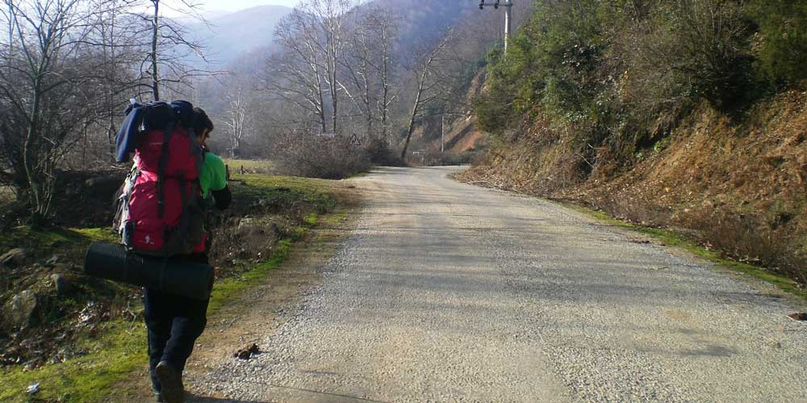
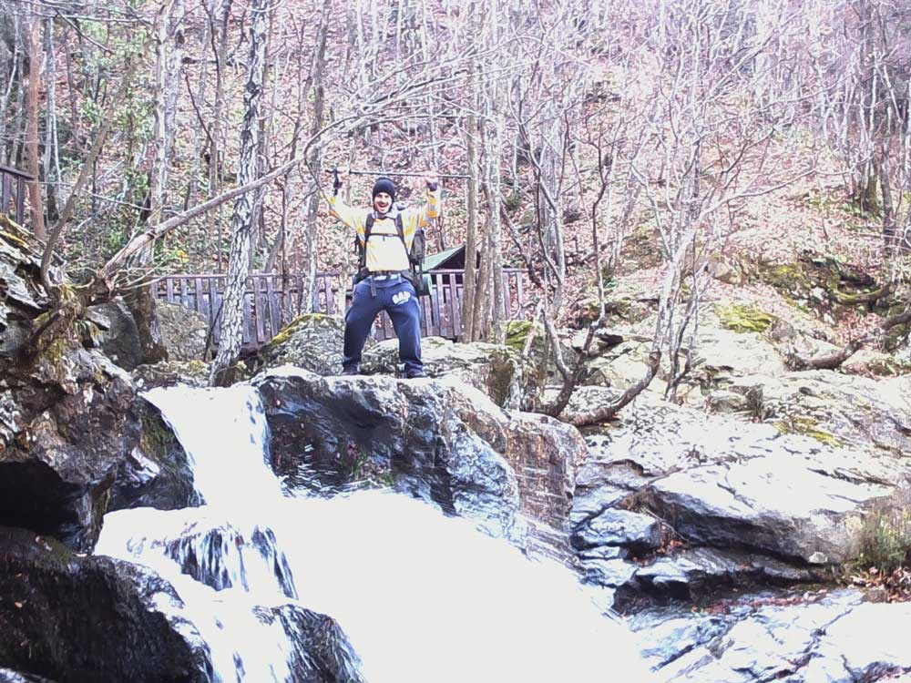
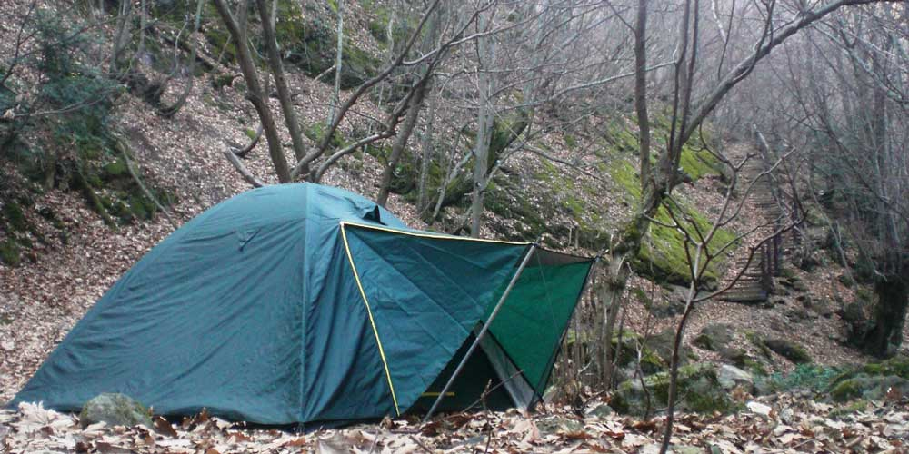
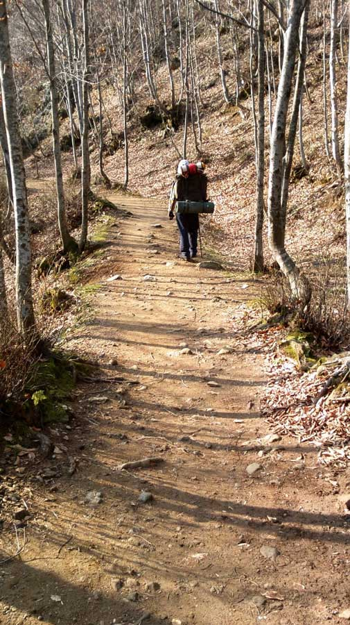
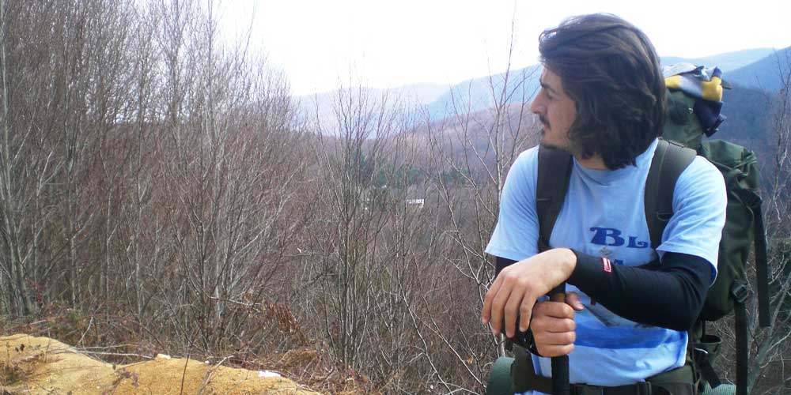
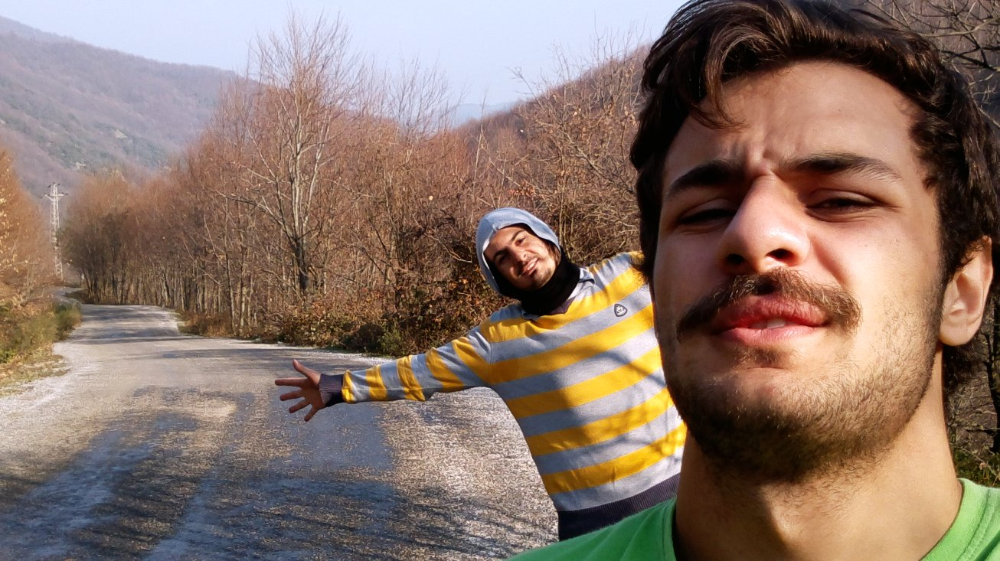

2014 Ocak ayı ve 2 ay oldu bir yere gitmeyeli. Artık o kadar sıkıldım ki kaçıp gidesim var. Çünkü doğayı özledim. Mevsim kış ama henüz ciddi bir kar yok ve hava bir kış gününe göre oldukça yumuşak. Hemen bir plan yapıyorum. Adını çokça duyduğum yerlerden olan Erikli yaylasını araştırıyorum.

### Yine Yollardayız

Cumartesi sabah Yalova’dan minibüslere binerek Çınarcık’a ulaşıyoruz. Çınarcık merkezde eksiklerimizi tamamladıktan sonra sabah 9 gibi yürüyüşe başlıyoruz. Araç yolunu takip ederek Erikli yaylasına ulaşmayı, çifte şelalelere ve dipsiz göle gitmeyi planlıyorduk. Kamp yapacağımız yeri ise gidince belirleyecektik. Çınarcık’tan Teşvikiye köyüne ulaştık ardından Erikli yaylasına doğru devam ettik. Teşvikiye köyünü geçtikten 4, 5 km sonra dik bir çıkış başlıyor. Burası bizi biraz yorsa da Erikli yaylasına ulaşıyoruz. Hava güneşli ama serin. Yürüdüğümüz için üşümüyoruz. Aksine terlediğimiz bile oluyor. Aslında termal içliklerin çok faydasını görüyoruz. Teri tutmadığı için esen rüzgarla birlikte üşümemizi önlüyor.

### Çifte Şelaleler

Erikli yaylasına bir bakındıktan sonra biraz daha ileride olan Çifte şelalelere doğru devam ediyoruz. Şelalelerin olduğu yerde kafeteryalar, piknik alanı, mescit, çocuk parkı, tuvaletler ve çeşme var. Ancak kış olduğundan bizden başka kimse yok. Şelalelere giden merdivenleri çıkmadan önce ki alanda çadırımızı kuruyoruz. Hava kararmak üzere olduğundan dipsiz göle başka zaman gitmeyi planlıyoruz. Önce şelaleleri geziyoruz ardından ilk işimiz ateş yakmak oluyor. Şelaleler o kadar güzel ki hava biraz sıcak olsaydı da girseydik diye iç çekiyoruz. Buraya tekrar gelirsem ilk işim şelalelere girmek olacak. Vadinin içinde kalan bu yer fazla güneş almadığı için daha çabuk soğuyor. Kamp ateşi candır, olmazsa olmazlardandır. Etraftaki yabani hayvanları çekmemek için yanımıza sadece konserve türü yiyecekler aldık. Ateşte bunları ısıtıp yedikten sonra çayımızı içiyoruz ve kendimize geliyoruz.

### Ateş Başında Uyuklamak

Saat henüz 19 civarı ama biz yaklaşık 2 saattir karanlıktayız. Kış olduğundan dolayı hava erken kararıyor. Ateş bizi öyle güzel ısıtıyor ki, ateş başından uzaklaştığımız anda havanın ne kadar soğuk olduğunu hissediyoruz. 20:30 a kadar ateş başında Furkan’la birlikte oturuyoruz ve arada uyukluyoruz. Öyle ki orada uyuyup kalacak düzeydeyiz. Saatin erken olmasına rağmen çadıra geçip uyumaya karar veriyoruz. Su sesi eşliğinde sakin bir gece de yapışkan ısıtıcılarımızı ayaklarımıza ve belimize yapıştırarak uyku tulumlarına girip uykuya dalıyoruz.

### Nemden Eser Yok

Yapışkan ısıtıcılar gerçekten çok iş gördü. Yaklaşık 13 saat uyuduk. Oha bence de o kadar uyunur mu hiç. Üstelik çok dinç bir şekilde uyandık. Ama hava serin. Bu yüzden yine ilk iş ateş yakmak oluyor. Buraya gelmeden yaptığım araştırmalarda çok nem olduğunu okumuştum. Kış olduğundan dolayı sabah zerre kadar nem yoktu. Yazın gidecekler neme dikkat diyorum, açıkta eşya bırakmayın ki sabah uyandığınızda ıslak olmasın :)

### Geri Dönüş

Oldukça sakin geçen ve huzurlu olan bir kamp oluyor. Kahvaltı sonrası tekrar toparlanıp yola koyuluyoruz. Dönüş yolunda 2 bisikletliyle karşılaşıyoruz. Biraz sohbet ediyoruz. Orman içi bir yoldan da Teşvikiye’ye inebileceğimizi söylüyorlar. Bizde bilmediğimiz ve oraya giden yol ayrımını geçtiğimiz için başka zaman o yolu kullanırız diyerek geldiğimiz yoldan geri dönüyoruz. Doğa resmen uykuya dalmış. Bahar gelse de doğa hareketlense. Yaklaşık 16 kg yük ile 32km yürüyerek geldiğimiz yolu aynı şekilde geri dönüyoruz.

