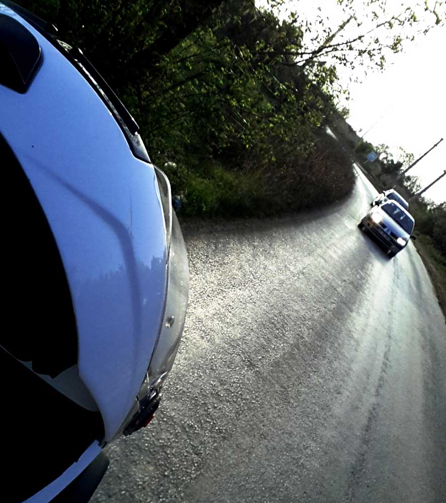
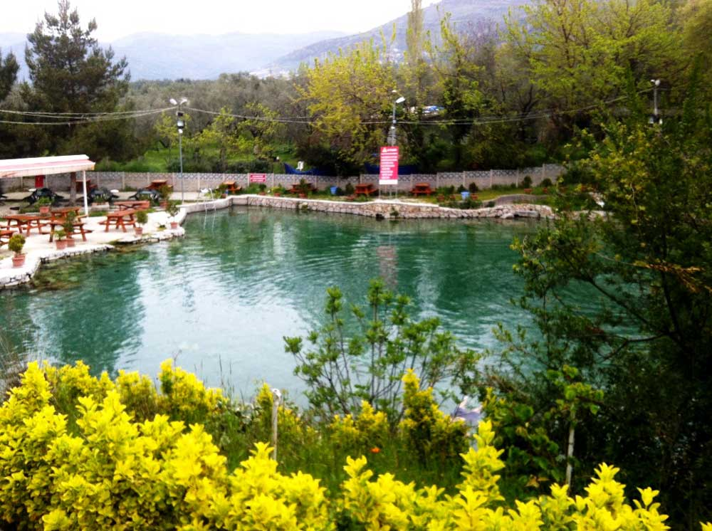
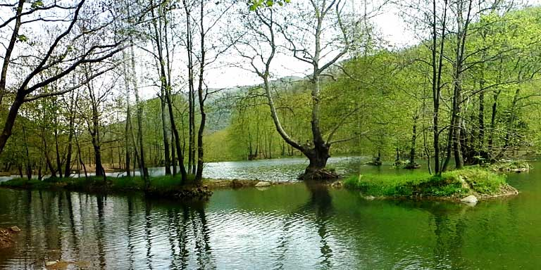
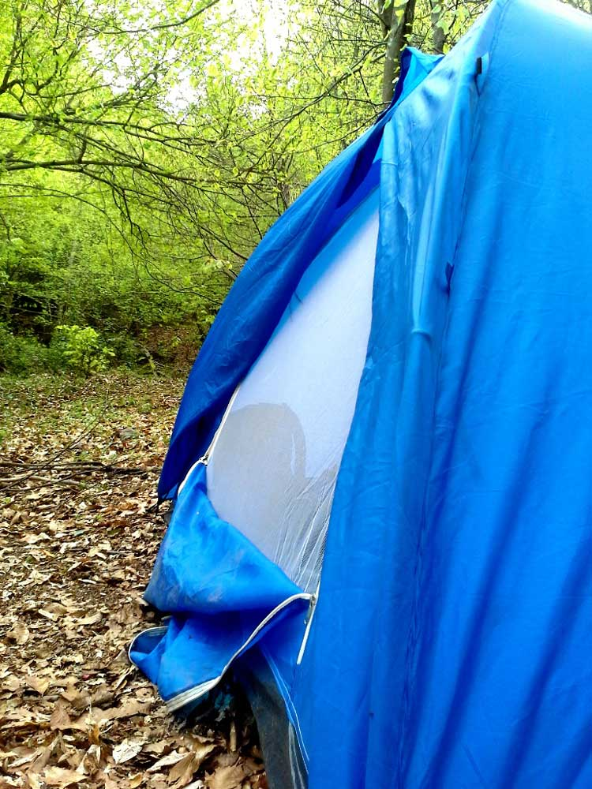
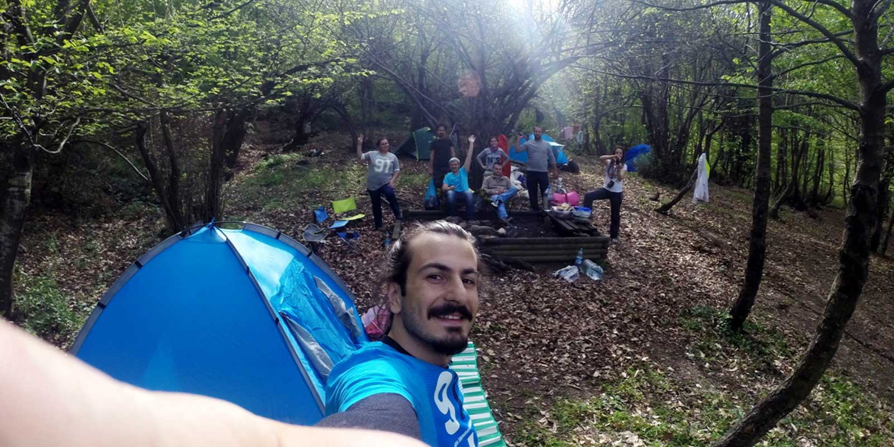
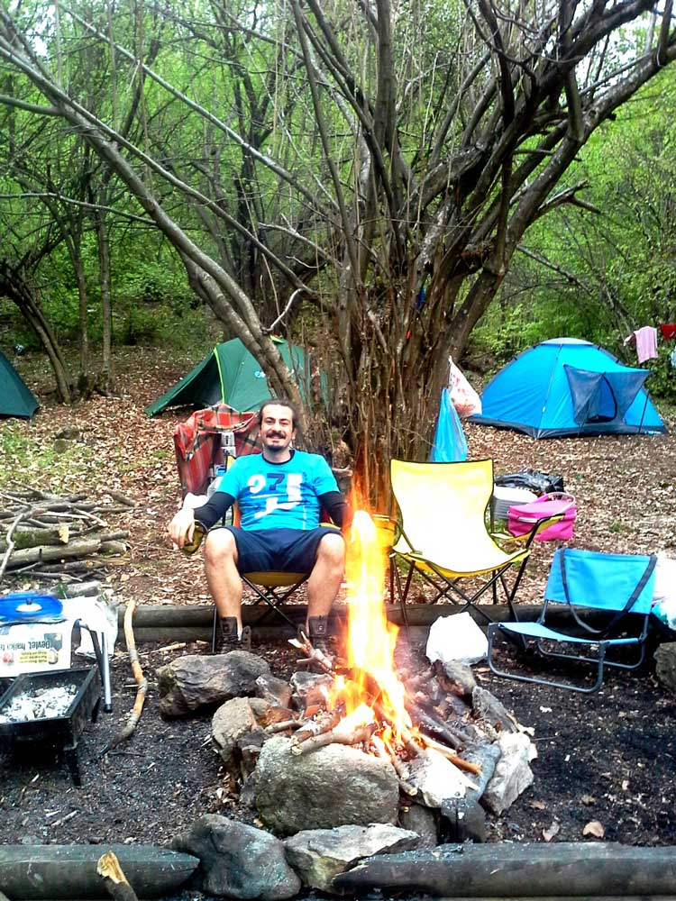
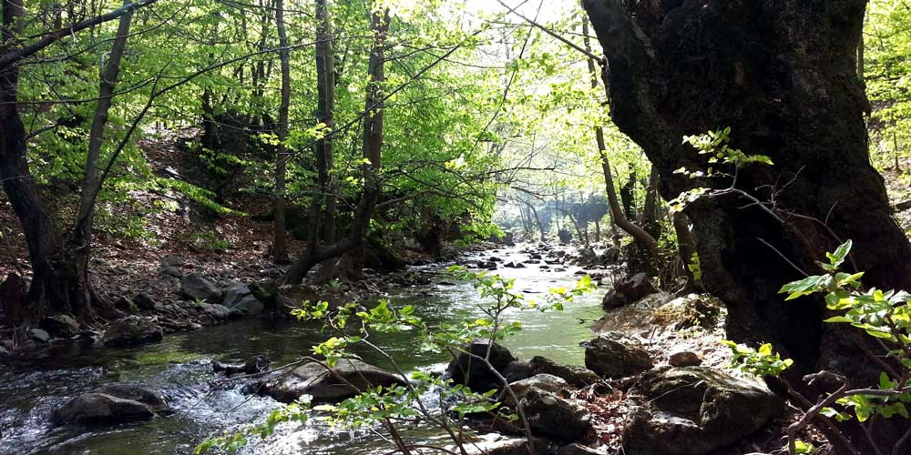

TEB’deki arkadaşlarla yılın ilk kampını yapalım istedik. Bu kampa eşleriyle geldikleri için kamp resmen ziyafete dönüşüyor. Hoop hemen plan yapmaya başladık. Eşler geldiğinden hem daha korunaklı hem de tuvaleti/suyu olan bir yer olmalıydı. Önce Orhangazi – İznik yolu üzerinde bulunan Keramet köyü kaplıcasına gidecektik. Açık havadaki sıcak suya girip ardından Çınarcık üzerinden gidilen Erikli şelalesinin ilerisinde bulunan Delmece yaylasında kamp yapmaya karar verdik. Delmece yaylası bizim için güzel bir yerdi. Yürüyüş için ise şelaleyi ve dipsiz gölü gezmeyi planladık.

### **Sabah Erkenden Yola Çıkmalı**

Cumartesi sabah erkenden toplaştık ve yola koyulduk. Sabah erken saatlerde kalkıp yola çıkmak iyi oluyor çünkü fazla vakit kaybetmeden gitmek istediğin yere ulaşıyorsun böylelikle günü öldürmemiş oluyorsun. Ama ben hiç sevmiyorum. Neden mi? Çünkü sabah kalkması zor oluyor :)

### **Keramet Köyü Kaplıcası**

Eskihisar’dan vapurla Topçular’a geçtik ve sonrasında Yalova -> Orhangazi -> İznik yolunu takip ederek Keramet köyü kaplıcalarına ulaştık. Açık havada, yeşillikler içerisinde koca bir havuz olan kaplıca da suya girmek için sabırsızlanıyorduk. Girişte kişi başı 3 tl ücret ödedikten sonra, ateş ve tüp yakmanın yasak olduğu bu yerdeki piknik masalarında demlik çay alarak çayımızı temin ettik ve kahvaltımızı yaptık. Ardından çıkınca üşüdüğümüz(Nisan ayında hava biraz serin oluyor) sıcacık bir su içerisinde vakit geçirdikten sonra Orhangazi -> Yalova -> Çınarcık istikametini takip ederek Delmece yaylasına gitmeye karar verdik.

### **Buraya Bahar Gelmemiş**

Erikli yaylasına kadar her yerde baharın geldiğini görebiliyorsunuz ancak burayı geçtikten sonra Delmece yaylasına vardığımızda hala kışın etkisi gözüküyordu. Pek bir yeşillik söz konusu değildi ve ekip doğal olarak Erikli şelalesini görünce burada kalmak istemedi :)

### **Erikli Şelalesinde Kamp Yasak**

Erikli şelalesine varınca çocuk parkının hemen üst tarafına çadırlarımızı kurup yerleşiyoruz. 

Derken ailesiyle gezmeye gelen orman işletmeden birisiyle konuşuyoruz. Şelale bölgesi koruma altına alındığından kamp kurmak yasaklanmış. Orman işletmeden birileri gelirse ceza keser diye bizi uyardı. Bizde Nisan ayında sakin olan bu yerde sorun olmayacağını düşünerek toparlanmadık. Öyle ki henüz buradaki kafeteryalar bile sezonu açmamıştı ve az sayıda insan gidip geliyordu. Bu uygulamaya önce bir kızıyor olsak da sezonda buraya günlük 1500-2000 kişinin geldiğini düşününce doğayı korumak amaçlı alınmış bu uygulamanın mantıklı olduğunu görüyoruz. Hem kamp için gelenlere de şelaleye girişten sola dönen yoldan inince kocaman bir alanda kamp yapma olanağı sağlanıyor. Tabi ücreti karşılığında.

### **Şelaleye Girmek İsteyen?**

İlk gün kamp ateşi ve sohbet eşliğinde bitti. Bugün ise önce şelaleye gidiyoruz. Daha önce buraya bir daha gelirsem şelaleye girmeden gitmem demiştim. Şelalenin bulunduğu yer pek güneş almadığından serin ve su epeyce bir soğuk. 10snyeden fazla şelaleden akan suyun altında kalamadık. Keramet kaplıcasındaki sıcak sudan sonra epeyce üşümüştük. Sonra hemen kamp yerindeki ateş başına koştuk. Pazar gününü de etrafta dolaşıp şelaleye girerek bitiriyoruz. Ardından toplanarak İstanbul yoluna koyuluyoruz.

Daha Yalova’ya gelmeden trafik başlıyor ve Topçular iskelesinde zirve yapıyor. 2 saat vapur sırası bekliyoruz. Evet doğayla bu kadar baş başa kaldıktan sonra topluma karışmaya çalışmak zor oluyor.

