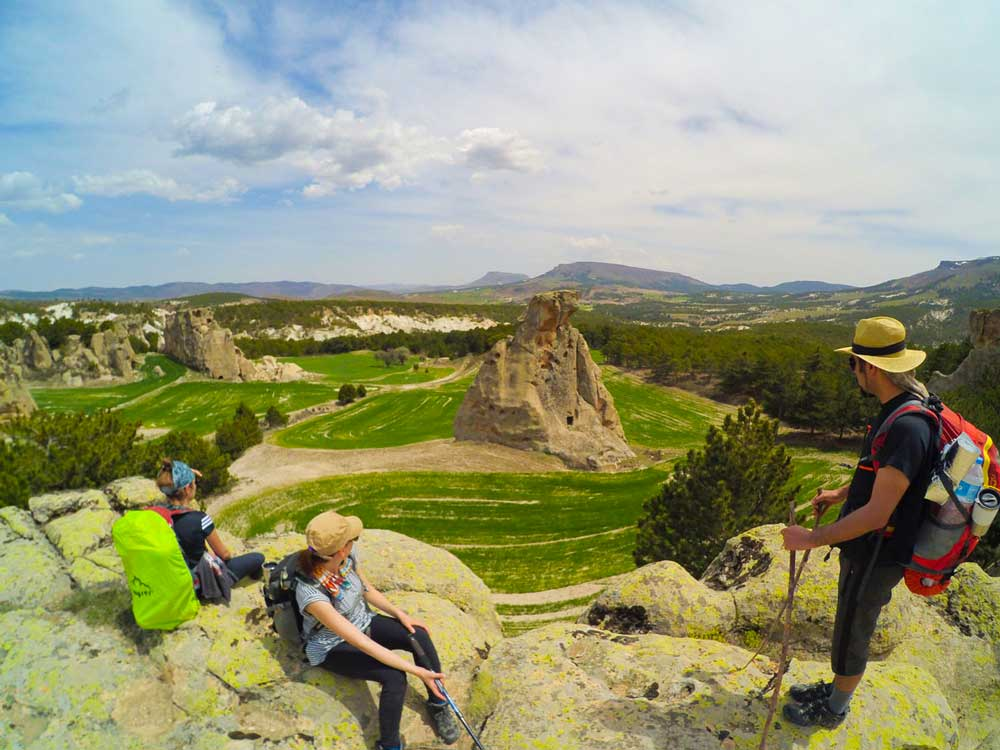
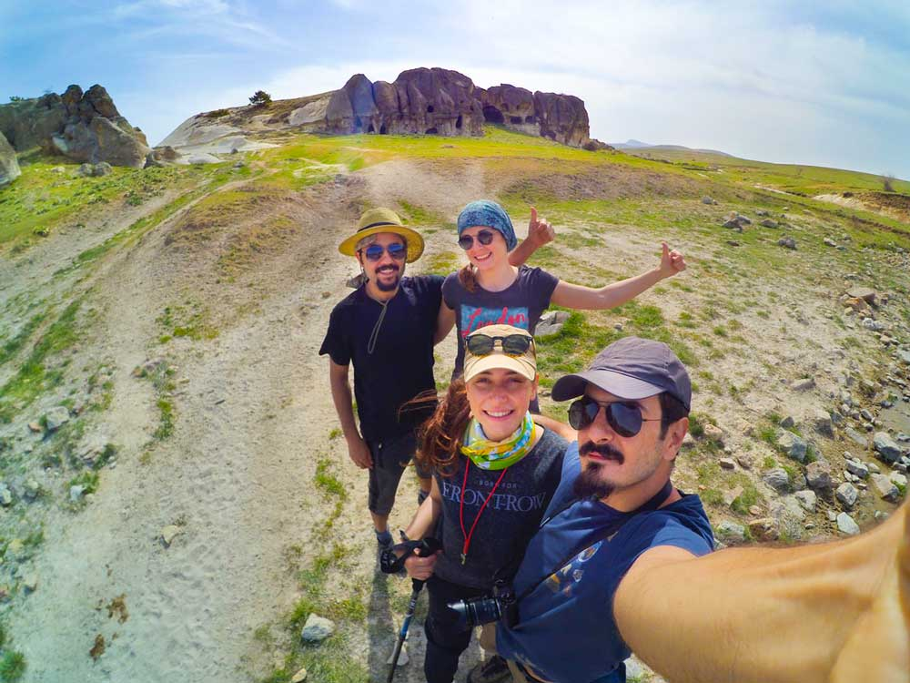
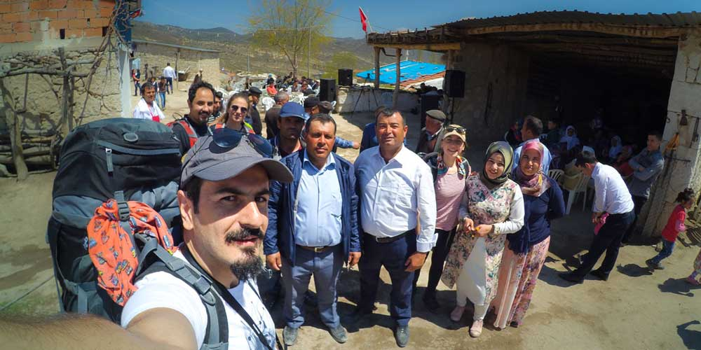
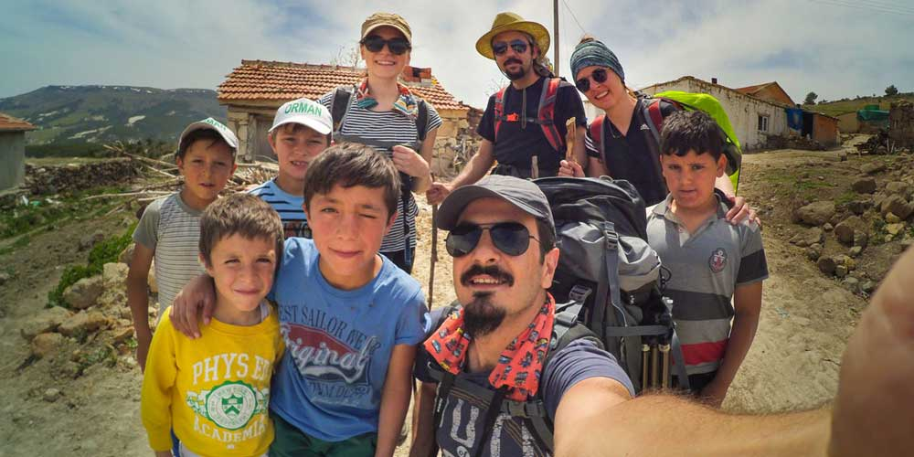
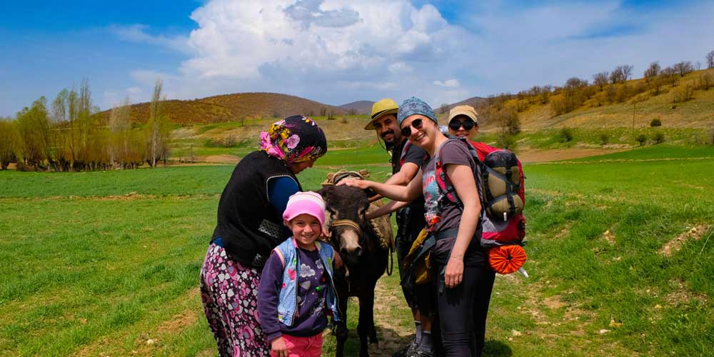
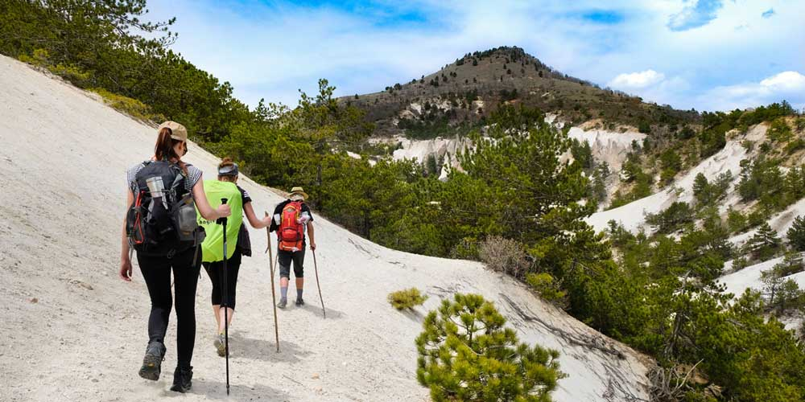
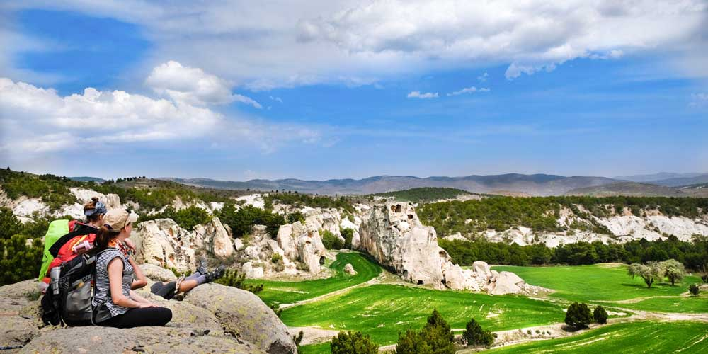

Facebook’ta Hüseyin Sarı ile arkadaşlığımızın başlamasından sonra güzel güzel fotoğraflarla “Frig Yolu Sizi Bekliyor” paylaşımlarını görmeye başladım. Neydi bu Frig Yolu, nereden çıktı bu Frigya, Frig’yalılar kimler ki, yoluda mı varmış derken Hüseyin Sarı’nın hazırlamış olduğu Frig Yolu kitabını satın aldım ve bekle beni Frig yolu dedim.

## FRİG YOLU PLANI

1 Mayıs 2017'nin Pazartesi’ye gelmesini fırsat bilerek 3 günlük bir Frig yolu macerasıyla bu parkuru adım atmaya karar verdik. Frig yolu 506km uzunluğunda olup Eskişehir Afyon Kütahya üçgeninde yer alan güzel bir yürüyüş rotası. Frig yolu henüz bir Likya yolu kadar popüler hale gelmedi ve benim için de yeni bir rota. Bu kadar güzel ve eski bir uygarlığın barındığı bu coğrafyanın ilerleyen yıllarda çok popüler olacağına eminim. Frig Yolu kitabını incelemeye başladım ve o kadar güzel parkurlar var ki bir ara sapıtıp 3 günlük planı 1 haftaya çıkaracaktım ama ne yazık ki o kadar iznimiz yoktu. Yürüyüş rotası olarak yapabileceğimiz en güzel rota 1.1 Seydiler – Karakaya’dan başlayıp 1.8 Eski Eymir – Ayazini’nde bitirmekti. Plan belli olmuştu. 3 günde 6 saat yol gittikten sonra yaklaşık 40 kmlik yürüyüşü tamamlayacaktık ardından bir şekilde arabaya geri dönüp 6 saat daha araba sürerek İstanbul’a eve ulaşacaktık. Biliyorum biraz zorlama bir plandı ama neden olmasın. Her şey yolunda giderse ve benim pilim bitmezse başarabiliriz diye umuyordum.

## PLAN HAZIR O ZAMAN YOLA ÇIKMALI

Cuma iş çıkışı yola koyulduk. Her zamanki gibi İstanbul’dan çıkmak eziyet oldu ve gece 12 civarında Afyon öğretmen evine ulaştık. Aslında gidip bir yerde çadır atarız diyorduk ama gecenin bir yarısı kim uğraşacak diyerek vazgeçip öğretmen evinin yolunu tuttuk. İşin ilginç yanı öğretmen evindeki son 2 odayı kiralamıştık. Bizden 5dk sonra gelenlere oda kalmadı cevabı verildi. Kalan son 2 odayı kapmış olmak bize zafer kazanmış hissi uyandırdı. 6 saatlik yol sonrası yumuşak bir yatakta güzelce uyumak ve sabahında duş alıp sonrasında kahvaltı yapmak harika gelmişti. Daha ne olsun. Sabah çok vakit kaybetmeden yürüyüşe başlayacağımız Afyon Ankara yolu üzerinde Karakaya köyü yol ayrımındaki noktaya ulaştık. Niyetimiz arabayı köye bırakmaktı ama yol kenarındaki şantiye gözümüze çok uygun göründü. Şantiye görevlilerine bilgi vererek ve müsade isteyerek  aracımızı  onların park alanına bıraktık. Araba emniyette olduğundan kafamız rahattı.

## FRİGYA’YA İLK ADIM

Ekipten hiç bahsetmedim. Simge, Yunus ve [Keçe üstadı Deniz kızı(nam-ı diğer NeedleSea)](https://www.instagram.com/needlesea/) ile Frig Yolu yürüyüşüne başladık. Açtım GPS’i kaydet dedim her adımımızı. Ama 5dk geçmedi güneş kremi sürmeyi unuttuğumuzu fark ettik. Güneş altında ıstakoz olmamak için kremlendik ve Frig vadilerine doğru yola koyulduk. Bir planımız ve bir hedefimiz vardı ama her zaman ki gibi yolda spontane takılmaya karar verdik. Yorulduğumuz yerde kamp atacaktık. Yolda bir çok çeşme olduğu için yanımızda sadece içeceğimiz kadar su taşıyorduk. Kişi başı 2 litre kadar. Bunun haricinde 3 günlük yiyecek(makarna, bulgur ve kahvaltılık şeyler), çadır, mat, uyku tulumu ve sadece yedek kıyafetimiz vardı. Bir de benim 2-3 kg kadar elektronik ekipmanlarım. Napalım güzel fotoğraf istiyorsak bunları taşımam lazım. Yıllar geçtikçe tüm kamp ekipmanlarım küçüldü ve hafifleşti ancak fotoğraf için taşıdığım ekipmanlar hep çoğaldı.

## FRİGYA’DA DÜĞÜN VAR

Daha yola başlar başlamaz Frig uygarlığının izlerini görebiliyorsunuz. Keserler mahallesine yaklaşınca bir grup çocuk bizi karşıladı. Düğünleri olduğunu ve büyüklerinin de bizi düğüne davet ettiğini söylediler. Daha yeni mola vermiştik, kaptan olarak bir molaya daha sıcak bakmasamda davete icabet etmek gerektiğinden ve ben hariç herkesin gitmek için istekli oluşundan dolayı düğün alanına gittik. Bizi yabancı turist sanmışlar, Türk olduğumuz ortaya çıkınca biraz muhabbet sohbet ettik. Sofralar kurulmuş, davul zurna hazırlanmış, köy alanı düğün alanı haline getirilmişti. Sağolsunlar bizi çok güzel ağırladılar, düğün yemeği ikram ettiler. Yolumuz daha uzun diyerek müsade istedik ve tekrar yola koyulduk.

Ağın dağına doğru çıkan yokuş bizi biraz terletse de ilk günün heyecanıyla yardırıp gittik. Ağın dağındaki mağaraların önünden ilerideki düzlük alana doğru giderken çok sakat bir geçiş var. Dik bir yamaç ve küçük taşlı oluşundan dolayı ayaklarınız kayabiliyor. Çok fazla deneyiminiz yoksa burayı geçerken baton kullanmanızı ve çok dikkatli olmanızı öneririm. Dengenizi kaybedip 30-40 metre aşağıya sürüklenip ciddi bir şekilde sakatlanabilirsiniz. Ağın Dağındaki mağaralar ise kesinlikle görülmeye değer güzellikteler. Duraklar Mahallesine varmadan düzlük bir alanda çeşme de olduğundan dolayı kamp atmaya karar verdik. Etrafta çobanlar harici kimseler yok. Etraftan üç beş çalı çırpı toplayıp kamp ateşimizi yakıp yemeğinimizi hazırladık. Biraz ateş başı muhabbetten sonra erkenden uyuduk. İlk günümüzde Rota 1.1-1.2-1.3 ü tamamlamış olduk. Yolun bu kısmında çok sık işaretler olmasa da, işaretler oldukça netti ve GPS’den takip ederek devam ettik.

## GİTTİ PARMAKLAR 

2. gün sabah erkenden kalkıp yola koyulmak için çadırları toplarken bir çoban ve eşi geldi. Zavallı eşeğe fazla yük yüklediklerinden dolayı hayvan ikide bir düşüyordu ve kadın elinde sopayla acımasızca eşeğe vuruyordu. Bizimde bir sopa alıp kadına vurasımız geldi. Yaptığının yanlış olduğunu anlatalım istedik ama vereceğimiz mesaj yerine ulaşacak gibi değildi. Onlar yoluna biz yolumuza devam ettik. Ara sıra yolda serseri köpeklerle karşılaştık. Onların saldırgan tavrına aynı saldırganlıkla karşılık verince bizden korktular pek tabi. İlk günlerde köpeklere kızma saldırırlar diyen Deniz son günümüzde köpekleri kovalıyordu. İyi eğitilmiş köpekler haricindeki diğer başıboş köpekleri taş atarak veya onlara bağırarak korkutabilirsiniz. Parkur bize Frigya’nın tüm güzelliklerini sunmaya devam ediyordu ve çok güzel manzaralar eşliğinde yola devam ettik ve Alanyurt’a vardık. Burada market bulunca soğuk içecek derdine düştük. Market önünde dinlenirken aldıklarımızı tıkınırken bir amca arabayı vurdurmama yardım eder misiniz dedi. Pek tabi neden olmasın dedik ve aracı ittirelim diye el attığımızda ben arka açık kapıyı kapayayım dedim. O esnada ahhhh İbraam naptın diye Yunus’un sesi yükseldi. Naptım acaba len diye bi baktığımda Yunus’un parmaklarının arada kaldığını fark ettim, hemen kapıyı açtım. O esnada hızını alan amca da arabayı çalıştırdı gitti. Biz Yunus’un elini kurtarmanın derdine düştük. Neyseki araç eskiydi ve arada boşluk vardı. Parmaklarında ezilme harici büyük bir sorun yoktu ve parmakları kurtarmış olduk. Hemen buz tedavisi uyguladık ve biraz acısını dindirdik. Sonrasında parkurun en sevmediğim kısmı Rota 1.6 Alanyurt-Selimiye arasındaki 4kmlik asfalt yoldan ilerleyen kısmı tamamlayarak Selimiye’ye ulaştık. Yol kenarından yürümek pek hoş değildi, keşke başka bir yerden devam ettirilseymiş. Selimiye’ye varınca çadır atacak yer aradık. Köyün içerisinde olmamak için Selimiye’yi çıkınca eski oyma kilise olan İbrahim inlerinin yakınındaki çeşmenin orada çadırımızı kurduk. Çeşme yanı, düzlük yer, kimse de yok, mis gibi kamp alanı.

## FRİGYA’DA EŞEK SALDIRI

Ve artık son günümüze girdik. Sabah erkenden toparlanıp kahvaltı sonrası İbrahim inlerini gezdik ve ardından rotamıza devam etmek için yola koyulduk. Biraz yürüdükten sonra geniş bir alana vardık, koca tarlada çalışan yaşlı bir adam bir kadın ve bir çocuk var. Ha bir de ağaç altında takılan bir eşek. Onlara doğru muhabbet ederek ilerlerken kafa bir kaldırdık ki ne görelim eşek dört nala üzerimize geliyor. Kadın, yaşlı amca ve çocuk koşturuyorlar. Len hadi köpekler saldırıyordu ama eşek nedir ya. Saldırıyor mu, kaçıyor mu anlamadık. Ben öne doğru atıldım, kollarımı açtım bağırdım. Hoop müdür dedim yine. Yok dört nala üzerimize geliyor. Son bir çare yerde taş aldım. Ne yapacaksam artık. Bir an kendimi arenaya çıkmış gladyatörler gibi hissettim. Arenada eşekle çarpışacakmışız gibi. Hayır bir yandan da tırsıyorum. Son anda eşek 90 derecelik bir açı yaparak yönünü değiştirdi ve tarlanın diğer tarafına doğru koşturmaya devam etti. Kadın ve yaşlı amca eşeğin ipini koparıp kaçtığını söyledi. Tüm kış yatan hayvan bi anda dışarı çıkınca bırakın beni de koşturayım şuralarda diye yardırmaya başlamış. Yorulan eşek biraz sakinleşince yakalamalarına yardım ettik ve sonunda zafer pozumuzu verdik.

Ayazini’ye yaklaşınca bir baraj gölü var. Buradaki patika dar ve yamaç olduğundan dolayı biraz bizi yordu. Baraj sonrasında dik bir tepe çıkışı vardı. Bizimkiler isyan edince burayı çıkmadık ve toprak yoldan Ayazini’ye ulaştık. Ayazini’nde konaklayabileceğiniz ve gözleme yiyebileceğiniz bir yer olan Şefika Teyzenin Yeri’nde yürüyüşümüzü bitirdik. Gözlemeleri gömdük. Sonrasında Şefika teyzenin bize ayarladığı taksi ile aracımızı bıraktığımız yere gittik. Eşyaları arabaya yerleştirdik, biraz toparlandık ve biriktirdiğimiz Frig anılarıyla beraber İstanbul yoluna koyulduk. Yine bir 6 saatlik yol sonrası eve vardık.

## BİR SONRAKİ FRİG YOLU YÜRÜYÜŞ PLANI

3 günlük Frig yolu yürüyüşü bizi bizden almıştı. Gördüğümüz manzaralar, tarihi ve kültürel bir yol oluşu, yolda karşılaştığımız insanlar, özetle her şey çok güzeldi. İstanbul’a geri dönerken bir sonraki Frig yolu planlarını yapmaya başlamıştık bile. Benim Londra’ya taşınmam bu planları alt üst etse de bir gün tüm Frigya’yı yürümek için geri geleceğim. 

