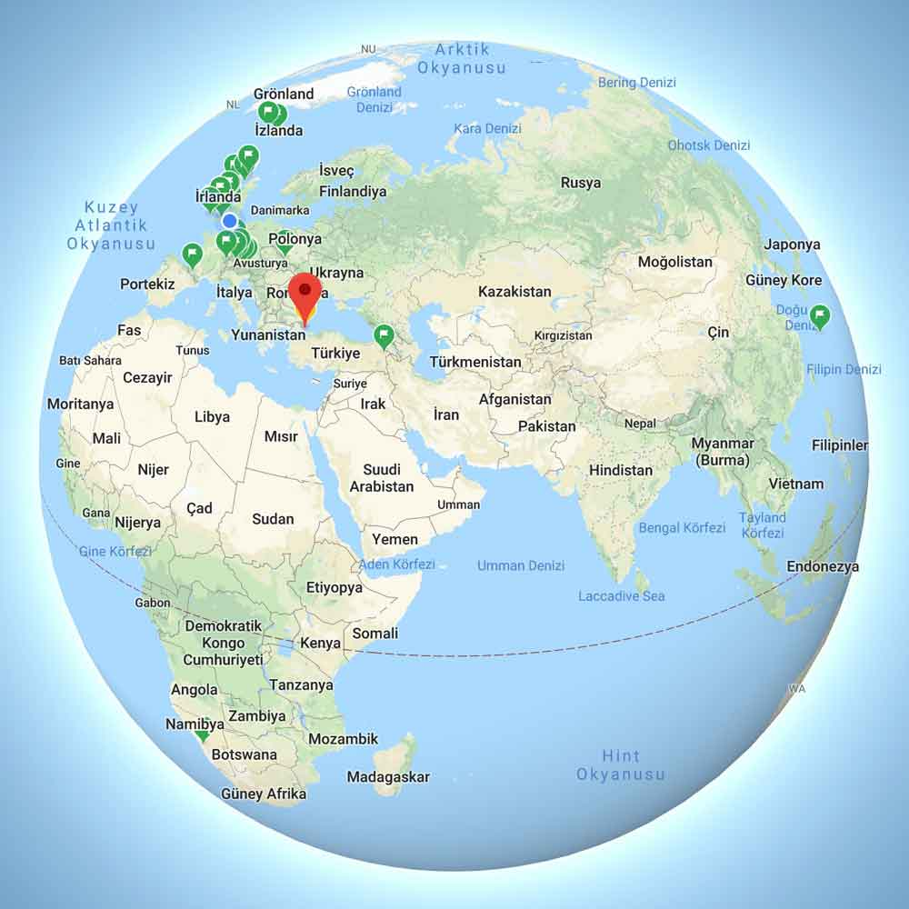

2018 Ekim ayında soğuk bir Londra akşamındayım, çayımı demledim – ne yapacaksın bazısı çay bazısı şarap sever- sonra google’dan rasgele bir Jazz müzik kanalı açtım -muhtemelen ilerleyen saatlerde Müslüm babaya bağlarım- ve bir şeyler yazmaya oturdum. Bu arada 2 baba tanırım biri Bob baba(Bob Dylan) diğeri Müslüm baba ve her nedense ikisinin de sadece yaşlandığında söylediği şarkıları seviyorum. 

### Neredeydim?

Valla miskin miskin yatıyorum. Biliyorum uzun zaman oldu bir şeyler yazmayalı. Hep niyetlendim ama nereden nasıl başlasam bilemedim. Rota mı yazsam, kampçılıkla ilgili bir şeyler mi yazsam, kullandığım ürünleri mi anlatsam diye diye yazmayı planladığım tüm yazılar birikti durdu ve günler geçtikçe nereden başlayacağımı bilemeyerek üzerimde saçma bir baskı oluşturmaya başladım. Sanki patrondan her gün mobbing yiyor gibiydim. Tabi ki kendimce sürekli bir bahanem oldu ve yazmayı sürekli erteledim. Sonra fark ettim ki bu işi önceliklendirmiyorum ve böylelikle sürekli sallıyorum. Kendime iki tokat attım, önceliklerimi değiştirdim, kendime geldim ve bu gece itibariyle tekrar yazmaya başlamaya karar verdim. Artık ilk aklıma gelen mevzulardan yazmaya başlayacağım, köye hareket gelsin biraz.

### Yıllandım ya

Aslında itiraf etmeliyim ki yıllandım biraz ve 2-3 günlük yürüyüşler, hafta sonu kampları artık beni kesmiyor. Kendimi kamçılayacak yeni hayaller planlar kurmam lazım. Ben hayal adamıyım dostum. Hayallerim için yaşıyorum, hayallerimi gerçekleştirmek için çalışıyorum. Hayallerimi elimden alırsan benden geriye bir şey kalmaz. Hayalleri olanlara selam olsun.

### Yeniden Büyük Hayaller Kurmak

Kendi çapıma göre büyük hayaller kurmaya tekrardan başladım. Eğer Londra’da her şey yolunda giderse seneye istifamı vereceğim(neyseki şirkettekiler beni takip etmiyor ve türkçe bilmiyor) ve Haziran gibi yollara düşerek 2-3 ay sürecek bir gezi yapacağım. Belki motorla belki yürüyerek ben de bilmiyorum. Şu an sadece 2-3 farklı planım var. Her gün zihnimde bu planın detayları dönüp duruyor ve hayalini kuruyorum. İnşallah her şey istediğim gibi devam eder de ben de yollara düşerim. Hayatında ilk defa birine platonik olarak aşık olmuş biri gibiyim, aynı duyguları yaşıyorum. Uzaktan uzaktan seviyorum, sürekli onu düşünüyorum ve ara sıra açıp haritadan bakıyorum. Nereye Gitsem?

