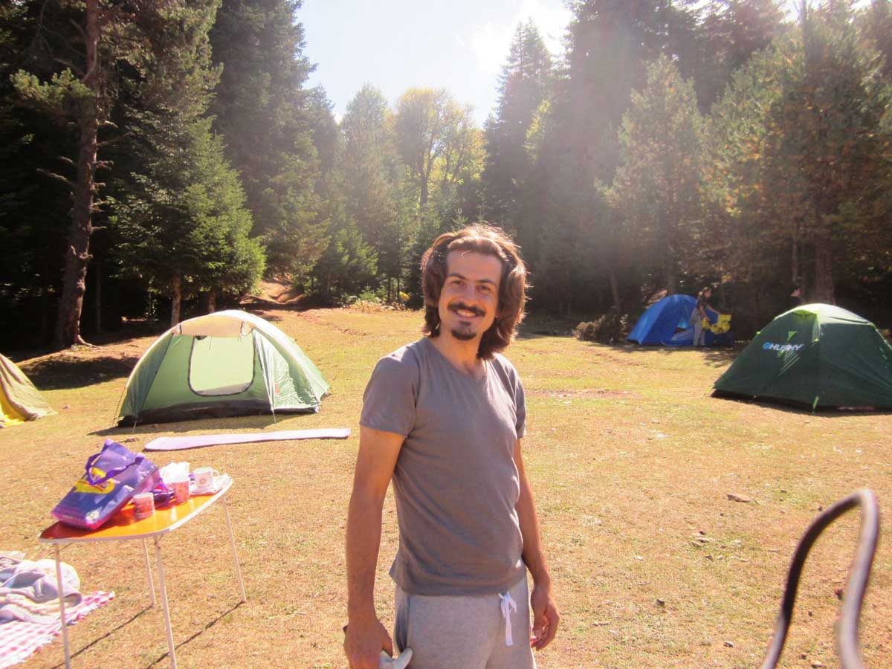
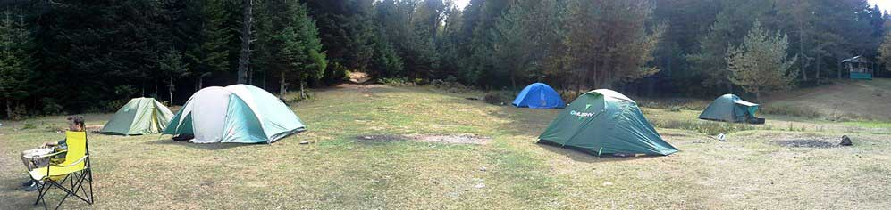
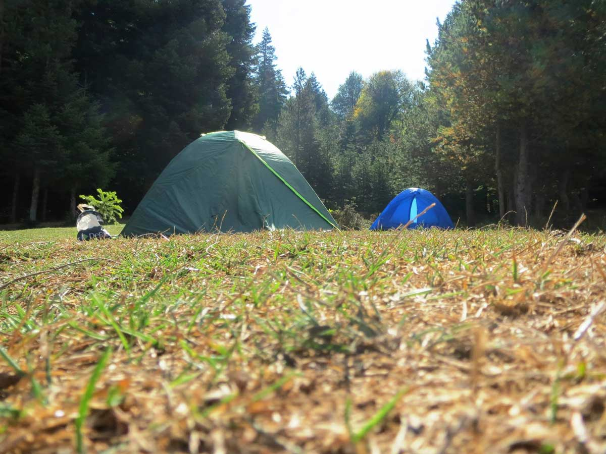
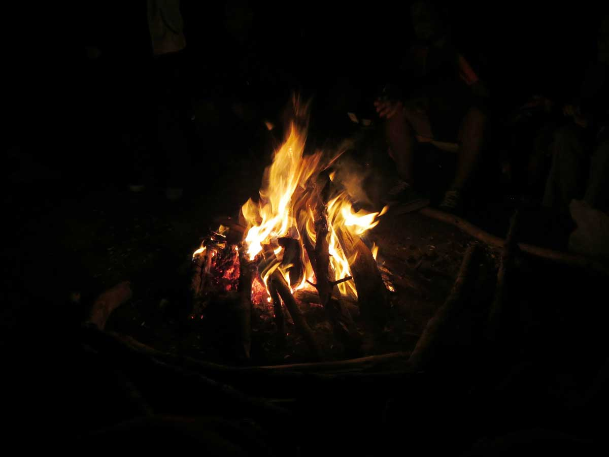
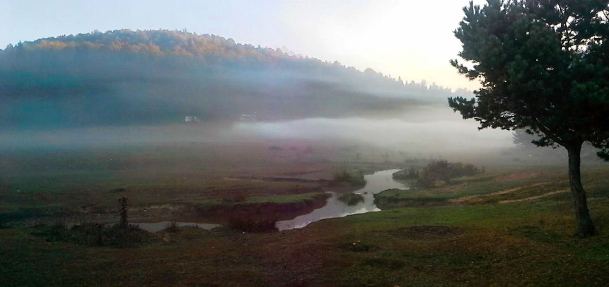
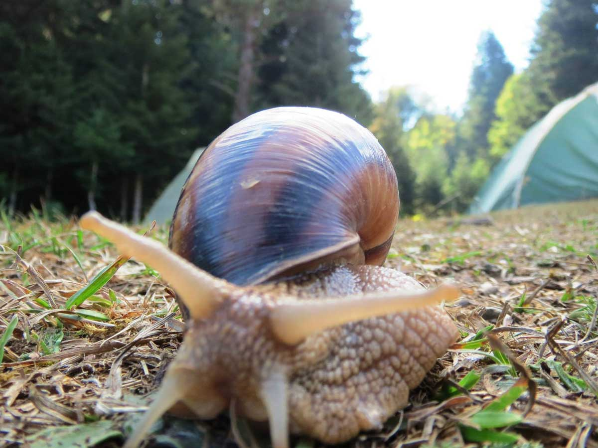
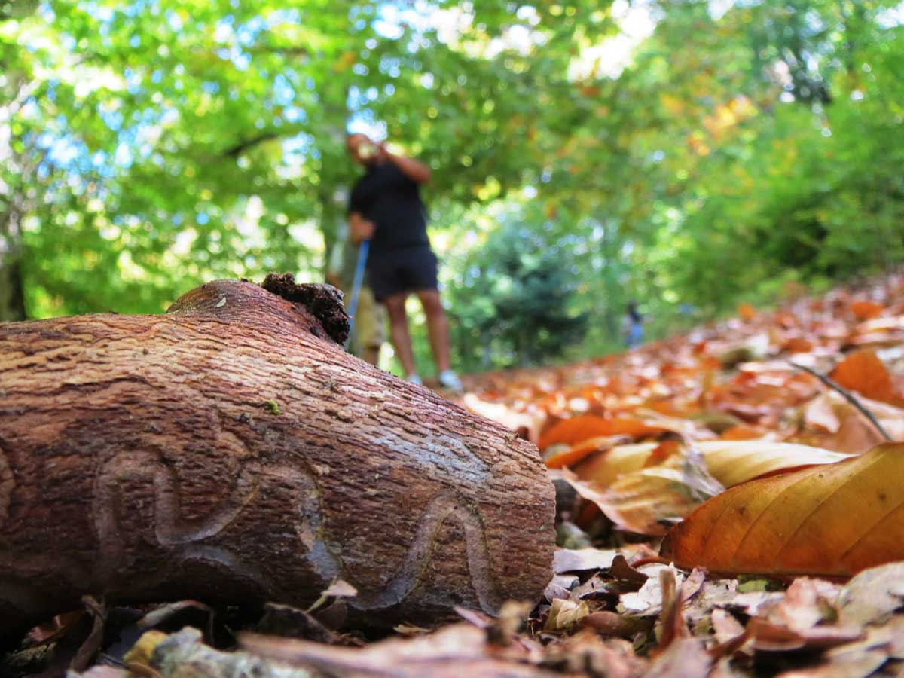
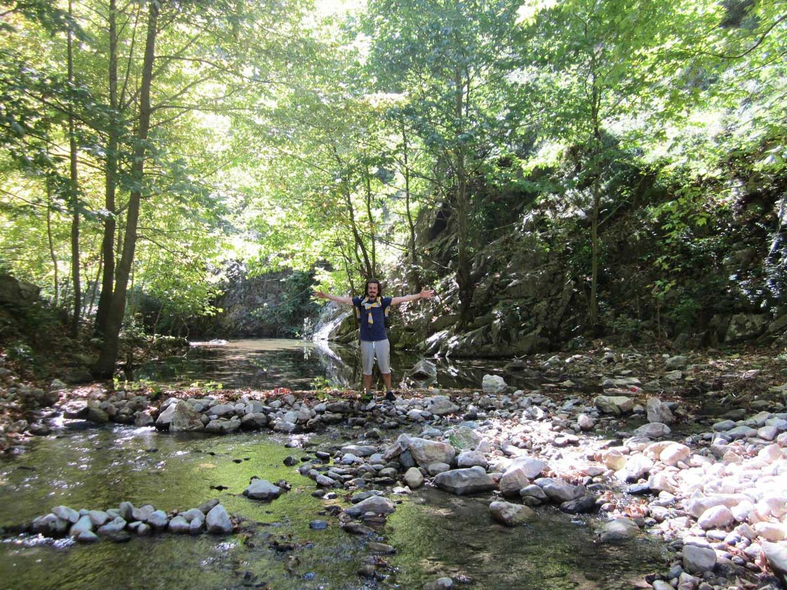
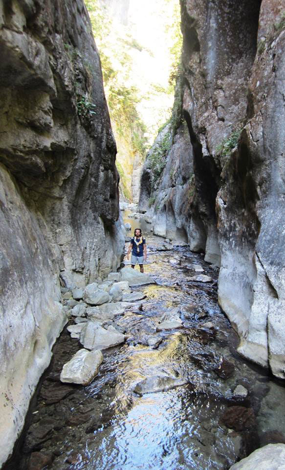
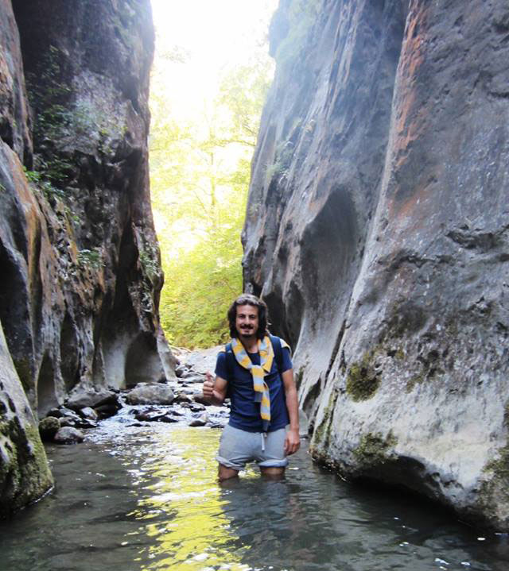

Artık Ekim ayına girmek üzereyiz. Tarih 28-29 Eylül 2013 ve Sonbahar’dayız. İş yerinden arkadaşlar ve eşleriyle birlikte kampa gitme kararı veriyoruz. İşin içinde eşler olunca biraz daha korunaklı, su, wc olan bir yer tercih etmek gerekiyor. En iyi tercih İnönü yaylası diyerekten yola çıkıyoruz. Yaklaşık 12 kişilik arkadaş grubu ile Cumartesi İnönü yaylasına varıyoruz. Sonbaharda burası ayrı bir güzel oluyormuş. İnsan her gelişinde bir yerden ayrı zevk alır mı, alıyor işte.

Kamp alanına yerleştikten sonra orman içi yürüyüş yapıyoruz ve geri dönüşte akşam kamp ateşi için odun topluyoruz. Akşam hava oldukça serin oluyor. Öyle ki gece 2 dereceleri görüyoruz. Kamp ateşinin başında müzik eşliğinde şarkılar söyleyip muhabbet ediyoruz. Ardından herkes uyumak için çadırına çekiliyor. Ben gece çok hafif üşüsem de gece soğuktan uyuyamayıp arabaya geçenler oluyor. Bir ara arabanın kontak sesine uyandığımı hatırlıyorum. Sabah 6 gibi artık benim de soğuktan uykum kaçıyor ve kalkıp ateşi yakıyorum. Ateşin sıcaklığı bizi ısıtıyor ve kendimize getiriyor. Bir çoğumuz için soğuk ve uykusuz geçen gecenin ardından ateş ve çay iyi geliyor.

Erken kalktığımız Pazar günü kahvaltının ardından oyunlar oynuyoruz. Sonra bir grupla birlikte serindere kanyonuna gidiyoruz. Sular iyice azalmış, buraya ilkbahar da gelmek daha zevkli olur diye düşünüyorum. Tabi kanyon her zamanki gibi güzel. Sorunsuz bir yürüyüşün ardından kamp alanına varıyoruz. Öğle yemeği sonrası geri dönüş yoluna koyuluyoruz.

Kafa dinlemek ve güzel zaman geçirmek için iyi bir kamp oldu. Bu ekipteki herkes uyumlu olduğu için kamp çok neşeli geçiyor. Üstelik arkadaşların eşleri olduğu için de aç kalma durumu olmuyor :)

## İnönü Yaylası Fotoğraflar

