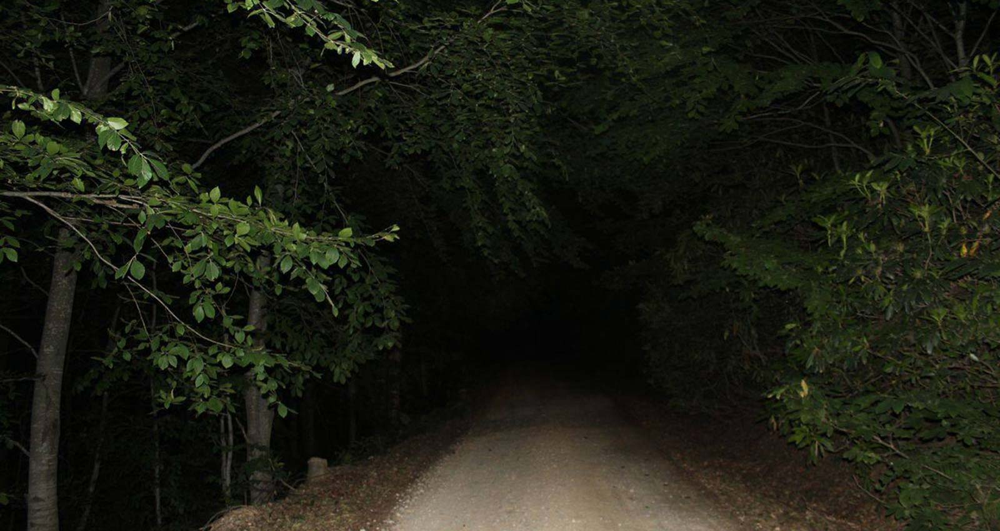
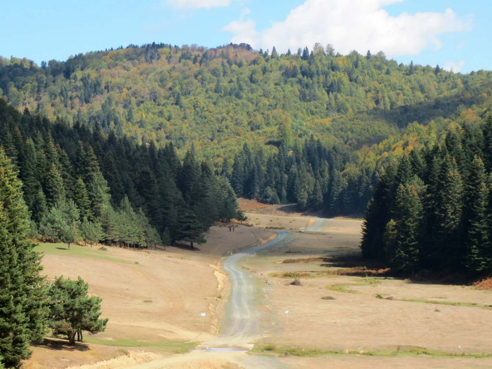
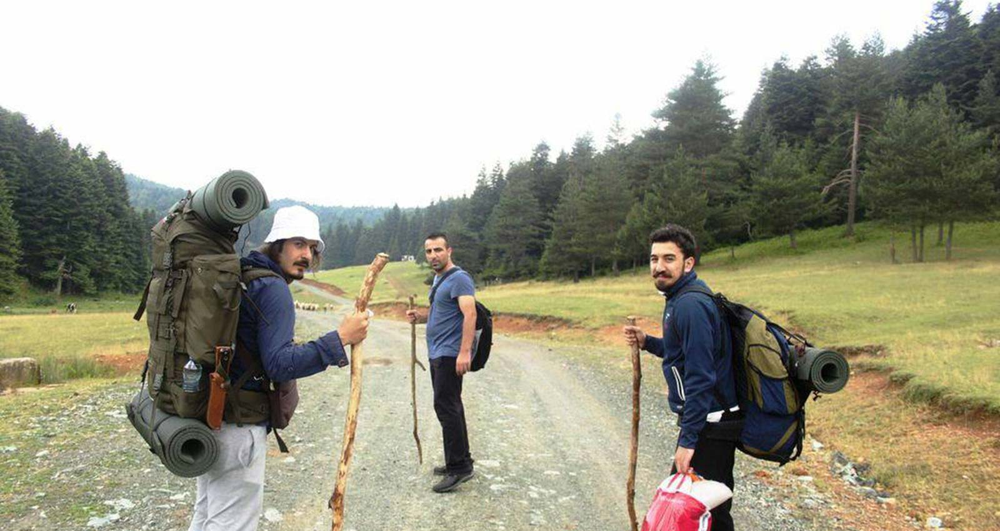
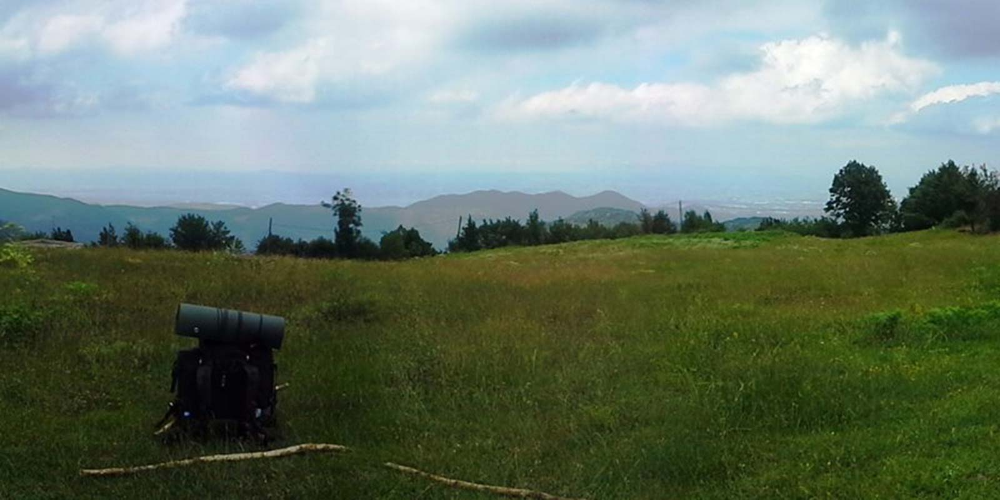
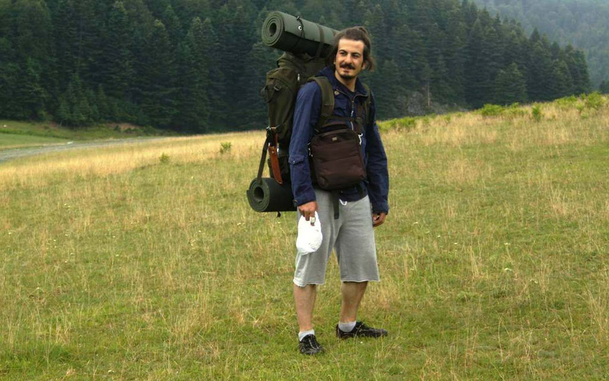
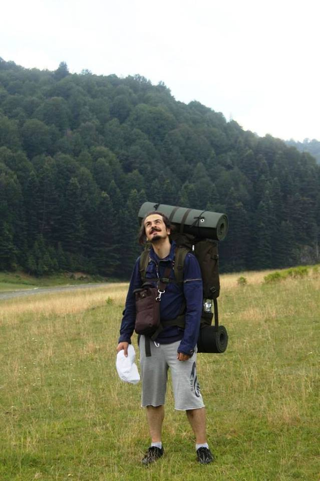
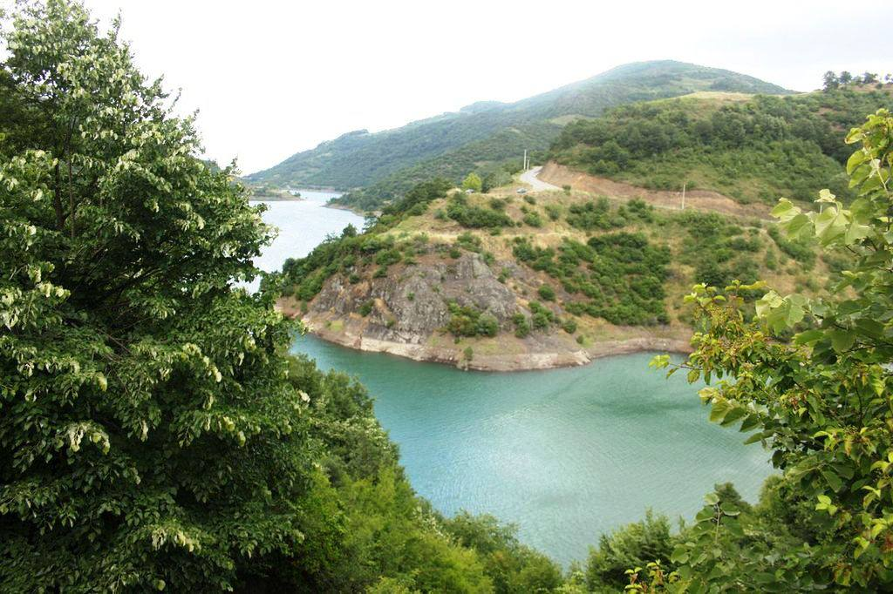

Artık bir trekking yapmanın zamanı gelmişti. Şimdiye kadar gittiğimiz kamplarda her ne kadar doğa yürüyüşleri yapsak da hep sadece bir yerde konakladık. Bu seferki plan farklı olmalıydı. Cuma’dan yola çıkmalıydık ve böylece 2 gece doğada geçirmiş olacaktık. Üstelik trekking yaparak ilk geceyi bir yerde diğer geceyi başka bir yerde geçirmeyi istiyorduk. Bize en uygun yer İnönü yaylasına gitmekti. Ertesi gün Aytepe’ye yürüyerek geçip gece orada kalacaktık. Son gün ise aynı yol üzerinden geri dönmeyi planladık ve yola koyulduk.

Cuma Geceden **Yola Çıkmalı**

İnönü yaylasına ilk defa gidiyorduk, araştırmalarımı çok iyi yaptığım için sanki daha önce gitmiş gibiydim. 4 arkadaş Cuma mesai bitimiyle birlikte yollara düştük. 2 saatlik bir gece yolculuğunun ardından İnönü yaylasına vardık. Dağ yolu zaten zifiri karanlıktı. Gece orman içerisinde yolculuğun ayrı bir heyecanı oluyor. İnönü yaylasına vardığımızda karanlıktan pek bir yer göremedik ve ilk gördüğümüz düzlüğe arabamızı park edip çadırları kurma işine başladık. Gece çok fazla nem çökmüştü, çıra yerine tutuşturucu jellerden almıştık. Mangalda sadece 1 kömürü bu jelle tutuşturana kadar canımız çıktı. Sonrasında zaten bir daha tutuşturucu jel almadık. Çünkü kendine bile hayrı yok. O 1 kömürle hem mangalımızı hemde kamp ateşimizi yaktık ama doğrusu nem bizi çok zorladı. Bu yorgunluğun üzerine fazla vakit kaybetmeden çadırlara uykuya geçtik.

Aytepe’ye Yolculuk

Sabah kalktığımızda yaylanın asıl güzel yerinin biraz daha ilerisi olduğunu fark ettik ve bizden başka bir çok kişi kamp yapmaya gelmişti. 2-3 km yürüdükten sonra Ercuva yaylasında ilk molamızı verdik. Ardından orman içi toprak yolu takip ederek Saman dağları üzerinden Aytepe yoluna devam ettik. Aytepe’ye varmamıza son 4km kala artık çok yorulmuştuk. Akşam üzeri Ayetepe’ye vardığımızda Orman işletmenin binasının hemen yanındaki boş araziye çadırlarımızı kurup burada kamp yapmaya karar verdik. Körfez manzarası olan bu güzel tepeye hayran kaldık. Gece yine o yorgunlukla deliksiz bir uykuya daldık.

Çikolatası Olan Var mı?

Sabah kalktığımızda bir çikolata krizi vardı. Evet yanımızda tatlı bir şey pek yoktu. Aytepe köyü içerisinde bakkal olacağını düşünerek gezinmeye başladık. Ancak bulamayınca tam hayallerimiz yıkılmıştı ki bir küçük bir çay bahçesi işletilen bir yerde çikolatalı gofret bulduk. Bu bizim için altın kadar değerliydi. Malum yolun geri kalanında enerjiye çok ihtiyacımız olacaktı. Kahvaltı ve ardından etrafta biraz gezindikten sonra geri dönüş yoluna koyulduk.

Opps Araba mı Çalışmadı?

Kaybolmamak için geri dönüşümüzü aynı yol üzerinden yaptık ve yaklaşık 32kmlik yürüyüşümüzün ardından arabayı bıraktığımız yere vardık. Hafif yağmur çiselemeye başlayınca artık fazla vakit kaybetmeden arabaya binip marşa bastığımda birden arabanın çalışmadığını fark ettim. Beyler benzin bitmiş araba çalışmıyor dediğimde herkes şaka yaptığımı düşünse de içimden kaynak sular aktı. Tam kazasız belasız bir kampı tamamladık diye sevinirken dağın başında kaldık. Araba LPG li olduğundan benzin göstergesi doğru çalışmıyor. Yani gazla gittiğinizde benzinle gidiyormuşsunuz gibi bir süre sonra depoyu boş gösteriyor ve bu gösterge sadece benzin aldığınızda yenileniyor. Ne kadar saçma değil mi? Yoldan geçen orman işletmenin çalışanlarından yardım istediğimizde, arkadan gelecek kamyonda biraz benzin olabileceğini söylediler. Sonra arabayı yan park etmişsiniz şöyle düzleyelim belki bu yüzden benzin alamamıştır dediklerinde içimizden haklı olmaları için dua etmeye başlamıştık. Gerçekten de öyle oldu. Arabayı düze çıkarınca çalıştı. Sonra ilk benzinlikte tabiki depoyu doldurduk. Ardından olaysız bir şekilde İstanbul’a ulaştık.

İlk trekking’imiz sakin ve keyifli bir şekilde son bulmuştu. İtiraf etmeliyim 2 günde 32km ham vücutlarımızı yormuştu.

