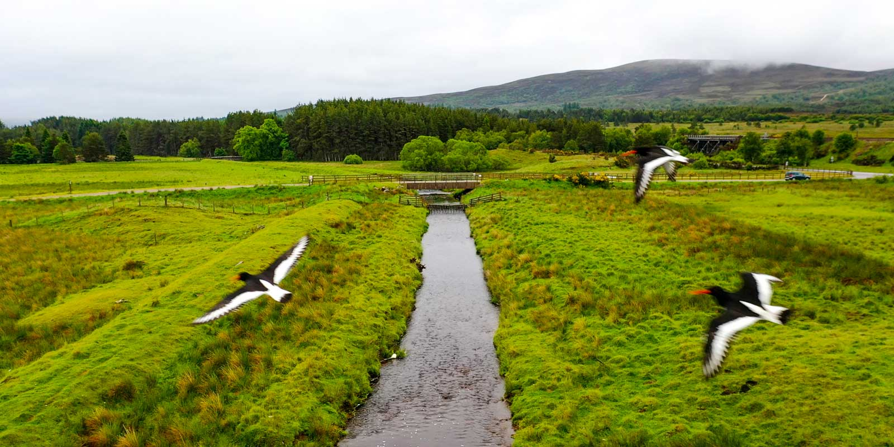
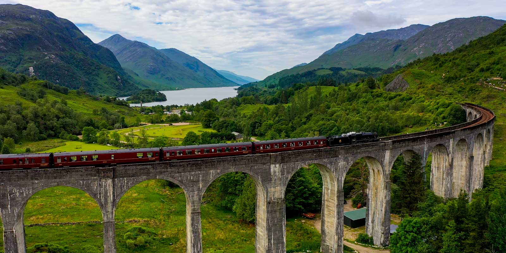
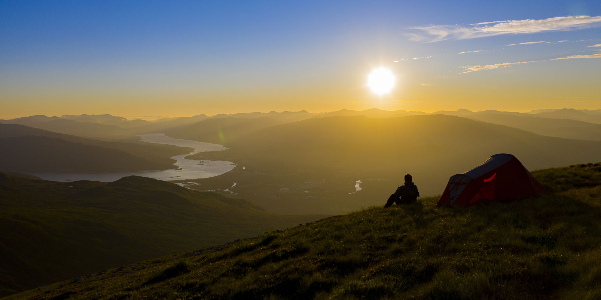
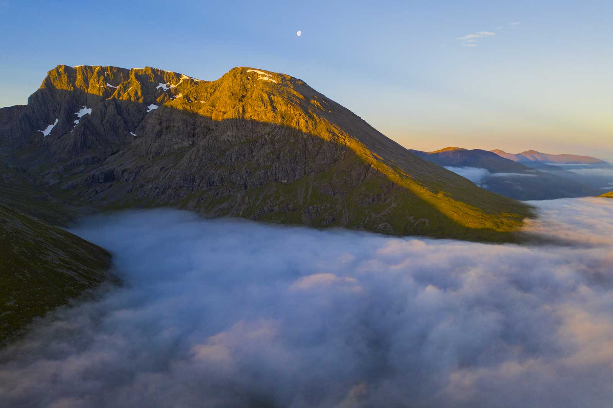
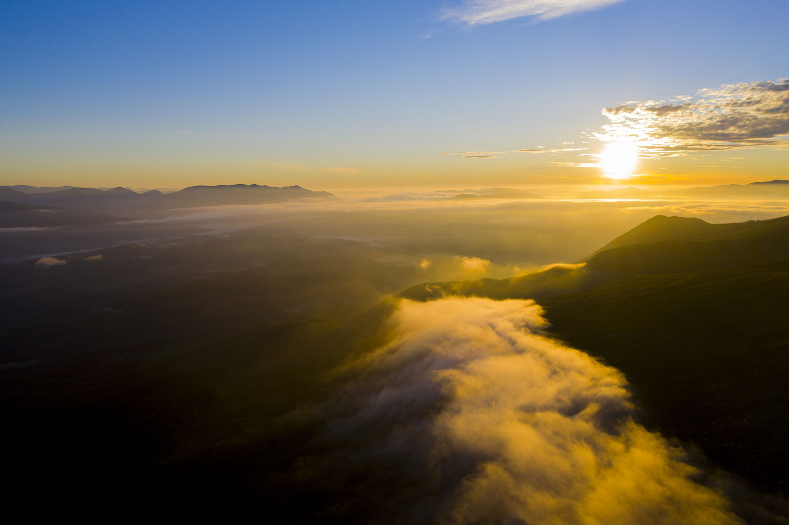

[Inverness'te geçirdiğim 1 hafta](https://www.ibrahimuylas.com/iskoc-yaylalari-inverness-1.-bolum/)nın ardından yola koyulma vakti gelmişti. Planın Inverness kısmı 1-2 gün yoğun yağmur harici tam planladığım gibi geçmişti. Benim için doğayla buluşma seansı şimdi başlıyordu.

25 Haziran Cumartesi sabahın körü olmasada 7sinde yola koyuldum. Yağmurun olmayacağı bulutlu bir gün vaadediliyordu ve 3 gündür drone görüntüsünü çekmek istediğim ama bir türlü yağmurdan dolayı çekemediğim tren köprüsüne gitmeye karar vererek güne başladım. Köprüye 5km kadar kala yağmur yine başladı ve geri dönmek zorunda kaldım. Çok da harika bir köprü değil ama nedense bir türlü şansım yaver gitmedi. Bende gidonumu geçerken gördüğüm göle doğru çevirdim. Drone'u çıkardım ve çayırlık bir yerden başlayan dereyi takip ederek uçmaya başladım. Önce etrafımda kuşların sortisine maruz kaldım ardından dereyi takip ederek 30-40 metre yükseklğindeki çam ağaçlarının olduğu ormana ulaştım. Orman içinde drone ile sağ sol yaparak ilerlerken yol tıkandı ve yükseldim yükseldim yükseldim ve güzel bir göl manzarası beni karşıladı. Köprü yoksa göl var dedim ve sabah misyonunu tamamlamış oldum.

O ana kadar yaklaşık 1500km yol yapmıştım. Zincirin yağlanması için Inverness'deki bir motorcu abiye uğradım.  Durumu anlattım o da bana bir şeyler sordu, anlamadım. Adam muhtemelen bana orta ayak var mı diye sordu ama yok anlamadım. Çünkü orta ayak varsa yağlamak çok kolay. İngilizcesini de bilmiyordum, adam da middle leg falan da demedi. Böyle deseydi de saçma olurdu zaten. Sonra baktı bu adam mal biraz anlamıyor geldi motora kendi baktı. Sonra biri daha geldi yan ayak üzerinde motorun tekerlerini yerden kesip 10snye de yağladılar ve 5 kuruş para da almadılar. Tenk you, many many tenk you diyerek ayrıldım. Hedefim Fort William'daki kamp alanı sonrasında ise bu hayalin yıldızı Ben Nevis'de gün batımını izleyerek kamp yapmak ve  sabahında gün doğumu izleyerek geri dönmek.

Inverness ile Fort William arası muazzam güzellikte göllerin olduğu, yelkenli teknelerin olduğu ve vadi içerisinden giden harika bir yol. Gördüğüm manzaralar karşısında bayıldım resmen. Fırsat bulursam ilerleyen günlerde gün batımında oralarda drone uçurmayı istiyorum. Akşam üzeri kamp alanına ulaştım ve acayip yorgun olduğumdan Harry Potter treninin([The Jacobite Steam Train](https://westcoastrailways.co.uk/jacobite/steam-train-trip)) peşine düşme işini Pazar sabahında yapmaya karar verdim. Kamp alanına yerleştikten sonra şöyle bir mevzu oldu. Elektirikli kısımda yer ayarlamıştım. Ama benim düdüklüğüm dönüştürücü almamıştım. Hiç aklıma da gelmedi. Prize takatım fişi elektiriği alırım diye düşündüm herhalde. Google'dan hemen neye ihtiyacım olduğunu baktım buldum ve resepsiyona koştum. Orada satılan kısa dönüştürücüyü aldım ve ablaya ya ben kablomu evde unutmuşum bu yeterli olurmu dedim. Mal mısın diye baktı bana sonra uzun kablon var mı diye sordu. Ulan o ne ki acaba, tam olarak başka bişi daha lazım diye anladım ama bilmiyordum. Bilmiyorsun mal mısın niye elektirikli yer arıyorsun denmesin diye de biliyormuş gibi davranıyordum ama mallığım daha da büyüyordu. Belki de yol yorgunluğu. Neyse yok dedim abla baktı baktı herhalde halime acıdı, fakir bu dedi ya da gariban gördü beni gitti içeriden o dönüştürücünün olduğu uzun kabloyu aldı getirdi. Al oğlum, uzun yoldan gelmişsin bunu kullan, işini gör, ayrılmadan önce de geri getirirsin dedi ve hayatımı kurtardı. Anadolu insanı işte bir başka oluyor. Londra'da günahını vermez kimse :). Ama elektirik olmasa işi dert edecektim çünkü Pazartesi pc'yi açıp işe bağlanmam lazımdı. İyi oldu bu, hatta harika oldu. Motoruyla gezen solo rider karizmasını ne kadar çizdirdim bilmiyorum ama elektiriğim vardı artık :).

Pazar sabah kalktım koştum Glenfinnan'daki viyadüğe gittim. Harry Potter filminde trenin geçtiği yer. 2 yıl önce bu trene binip buradan geçmiş ve fotoğraf makinemle görüntüsüyle ses kaydını almıştım. Şimdi sıra drone ile çekmeye gelmişti. O zamanlar etrafta bolca drone uçurmak yasak levhası görmüştüm. Park alanına ulaşıp motoru park ettiğimde ortalıkta drone yasak tabelası görmedim. Ohh dedim yasak kalkmış misss. Saklanmadan çekim yapabilirim. Viyadüğün dibine gittim oturdum saati bekledim. Tren yaklaşınca uzaktan korna çalıyor. Hemen saldım bizim elemanı, göğe yükseldi ve treni beklemeye başladı. Tren geldi çekime başladım, tam giderken hızlanmaya başladı bende açtım spor modunu, takıldım peşine yardırıyorum. O sağda ben solda yarış halindeyiz ve bir de duman basıyor falan. Lokomotife yetişmeye çalışıyorum, bastım iyice gaza tam kafa kafaya geliyoruz önüne geçeceğim bir anda yanımda bir araba durdu ve adamın biri öyle bir fırladı ki, noluyor lan dedim kavga çıkacak herhalde, beni dövmeye geldiler galiba dedim drone'u bıraktım. Adam bana bir temiz fırça kaydı, azarladı, drone yasak it tabelayı görmedin mi dedi. Ben şok. Yok abi özür dilerim falan dedim görmedim valla, yeni açılan park alanına park ettim ve hiç uyarı yoktu dedim. Vardı dedi. Yasak drone'u indir hemen, bir sonraki sefere silahımla ben indiririm dedi ve diğer 2 drone uçuran elamanın peşine düştü. Erzurum'lu adama öyle denir mi? Durduk yere damarıma basıyor. Erzurum'dan toplaşır gelir döveriz seni dayı diyemedim. Çünkü ben pis bir göçmenim. Ulan acayip ayar oldum adama, sinirlerim bozuldu. Itoğlu it 10 snye sonra gelse trenin önüne geçip yarışı kazanmış olacaktım. [Birincilik telini](https://www.google.com/search?q=birincilik+teli+f%C4%B1rat&oq=birincilik+teli&aqs=chrome.1.69i57j0i19j0i19i22i30l2.4083j0j7&sourceid=chrome&ie=UTF-8) bana vereceklerdi. Kaçırdık iyimi, güzel görüntü de yakalayamadım diye üzülürken fazlasıyla güzel bir şeyler yakalamış olmam beni rahatlattı. Sonra geri döndüm kamp alanına, drone'u şarj ettim ve Ben Nevis dağına çıkıp kamp yapmak üzere eşyaları toplayıp dağa doğru yola koyuldum.

Zirvesi 1350 metreler olan bu yüksek dağ Birleşik Krallığın en yüksek noktası. Yukarı çıkana Sir ünvanı veriyorlarmış. Gideyim de alayım dedim. Yaklaşık 5km'de 800 metre yükselerek zorlu bir yukarı çıkış olacağını biliyordum. Bu yüzden çantamı hazırlarken sadece gerekli olan şeyleri alcağım diye işe başlamıştım. Çadır, uyku tulumu, mat, bir gecelik yiyecek ve elektronik ekipmanlar yani kameralarım. Sonra şeytan soldan fısıldadı: "oraya kadar çıkmıştken tepede kahve içemeyecek misin?". Bardağımı, kamp ocağımı, kartuşunu, su kaynatacağım demliği, kahveyi, kahveyi öğütecek öğütücüyü ve kahve yapmamı sağlayan Delter Coffee Press'de aldım. Tabi ekstra su almak da gerekti. Yukarıda su var mı ne kadar temiz vs uğraşmamak adına 1 litre de ekstradan su aldım. Abi çanta oldu mu 12kg civarı. 32litrelik çantaya 60litrelik eşya sığdırdım ve 800 metreye kadar ter ata ata çıktım. Yolda çıkarken kendime küfürler ettim ve çok söylendim. Neymiş beyimiz orada manzara izlerken drone uçurup kahvesini içecekmiş. Hayır birinden de ödün ver be abicim. Zirveye doğru yol alırken tek kaygım çadır kurmak için yukarısı kayalık acaba yumuşak bir zemin bulabilecek miyim idi. Aşağı inen 20'ye yakın yürüyüşçüyle karşılaştım. Yolda konuştuğumuz bir abi rahat ol ara ara öyle yerler var ve biraz bakınırsan bulursun dedi. 800 metreye geldiğimde harika bir manzaram vardı ve dedim ibrahim burada çadır kuruyorsun, 1200 lere kadar çıkmaya gerek yok ve çıkarsan da bu manzarayı kaybedebilirsin. Çadırı kurdum, yerleştim ve her şey hazır. Gün batımına 1.5 saat var. Kahve yapayım dedim. Abi lanet olasıca kibriti yanıma almamışım ya. Sinirden deliye döndüm. Her b.k var kibrit yok. Ocağı yakamıyorum. Bir kıvılcım yetecek ama neremle üreteceğim bilmiyorum. Olmadı kahve olayı, yalan oldu bir de üstüne bi dünya şeyi taşımış oldum. 

Dağın başında sinirden kendime sayıp söverken bu harika gün batımı başladı ve bende de mutluluk hormanları salgınmaya başladı. Kibrit yokmuş, kahve yokmuş, fazladan bir sürü ağırlık taşımışım falan kimin umrunda. Hepsi uçtu gitti. Dağın eteklerine bulutlar çökmemişti ama olsun, süper bir gün batımı izlemiştim. Artık güzel bir gün doğumu görmesem de fazlasıyla mutluydum. Doğa bana bir güzellik yapmıştı. Saatim 23:30 civarlarını gösterirken yavaş yavaş uykuya dalıyordum. Hava hala aydınlıktı. Sabah 4:15 de gün doğumuna kalkmak için alarm bile kurmamıştım. Gün doğumu kısmını şansa bıraktım ve uyudum.

Gece 03:30 civarı hafif üşüyerek uyandım. Uyanınca çadırın tenteyi aralayıp hemen dışarıya baktım. Karanlıktı ama bizdeki gibi zifiri bir karanlık yoktu. Bulut falan da yoktu. Ortam tertemizdi. Bulutlu bir gün doğumu olmayacak diye tekrar uyudum. Bu kez tenteyi hafif aralık bıraktım ki uyanırsam olduğum yerden dışarıyı görebileyim. 1 saat sonra ne oldu niye uyandım bilmiyorum ama gözlerimi açtığım an tentenin kenarından dışarıyı gördüm. Tüm bulutlar önüme serilmiş, bulut denizi oluşmuş ve güneş hafif hafif doğmaya başlamıştı. Muhteşem bir manzara beni bekliyordu. Hemen çadırdan fırladım ve o muhteşem anları önce 5dk kadar izledim, sonra hemen drone alıp uçurmaya, daha fazlasını görmeye başladım. O anı, yaşadığım o anı ve hissettiklerimi sadece 'mutluluktan nefes alamadım' diye anlatabilirim. Başka kelime bulamıyorum tarifini yapmak için.

Yarım saat içersinde tüm bulutlar kayboldu. Bende dönüş için toparlanıp yola koyuldum. 

Aşağıya inerken bu hayallerime ulaşmak için yıllardır verdiğim emekleri ve bu anı düşlediğim sayısız zamanları düşündüm. Ne kadar da şanşslıydım ya da doğa/kader/tanrı adına ne derseniz diyin bana bir güzellik yapmıştı. Harika bir gün batımı sonrası onu 100'le çarpan muhteşem bir gün doğumunu izlettirmişti. Benden 5-6 gün önce bu dağa çıkıp kaybolan ve 2 gün sonrasında cansız bedenine ulaşılan 24 yaşındaki gencecik bir kızdan farkım neydi? Eminim ki o da ben gibi tüm planını yapıp yola çıkmıştı ve belki o da aynı gün doğumunu izlemişti, aynı yollardan geçmişti. Bana daha cömert davranan doğa ona neden bu kadar cömert davranmamıştı. En son sabah 6:30 zirve fotoğrafı paylaşmıştı ve gerisini bilen yok. Onun için güzel dileklerimi ve dualarımı yollarken bir yandan da abi 24 nedir ya çok erken değil mi diye düşünüyordum. Kızcağız kendini bilmiş bileli 3-5 yıl olmuştur şu hayatta. Yaşadığı kaza çok üzücü ama onun adına mutluydum çünkü sevdiği işlerin peşinden koşarken hayatı sonlanmıştı. Bir gün hepimiz öleceğiz ki bir şekilde fikrimiz alınsaydı ben de trafik kazasında falan ölmektense bu şekilde sevdiğim işlerin peşindeyken ölmeyi seçerdim. Ahh be hayat/yaşam ne kadar basitsin ve ne kadar karmaşıksın. [And The Waltz Goes On](https://open.spotify.com/track/6gvQHafvp7j7eanVD269Jj?si=e5f677b8ac814365)'u dinleyerek kafamdaki deli sorularla ve derin düşüncelerle aşağı inmeye de devam ediyordum ki Ben Nevis eteklerinde bir anda hıçkıra hıçkıra ağlamaya başladım ve olduğum yere çöktüm hıçkırıklar eşliğinde ağlamaya devam ettim. Şu an bu satırları bile gözlerim dolu bir şekilde yazıyorum. Neydi bu, neden öyle olmuştu, neden böyle hissediyordum ve hissetmeye devam ediyordum? Hala bilmiyorum. Dünyanın hatta evrenin bu kadar büyüklüğü ve muhteşemliğinin yanında ibrahim neydi ki ona bu kadar cömert davranılmıştı...

...

...

Bugün 29 Haziran Salı. Eğer akşam hava biraz bulutlanır ve sert güneş etkisini kaybederse Harry Potter treninin peşine tekrar düşeceğim. Çok güzel bir iki göl var, onun yanından geçiyor. Gidip bir de orada yarış içine girmeyi planlıyorum. Sonrasında ise Glencoe vadisine gidip orada motor sürüp doğasını izleyeceğim ve yarın sabah erkenden de bu hayalin kalbi olan Isle of Skye'a geçeceğim.
