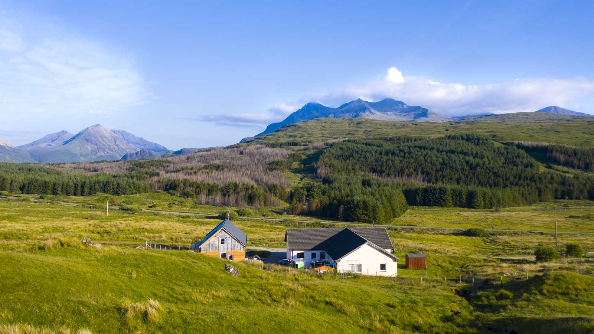
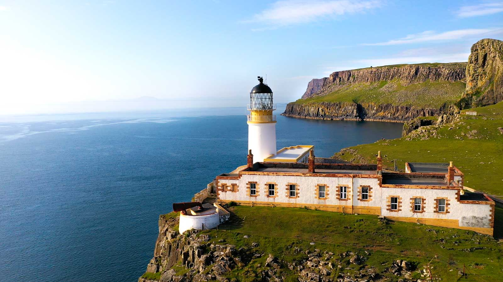
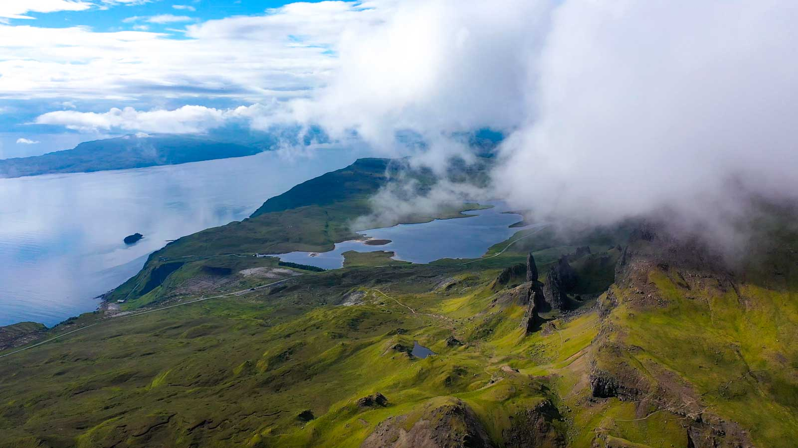
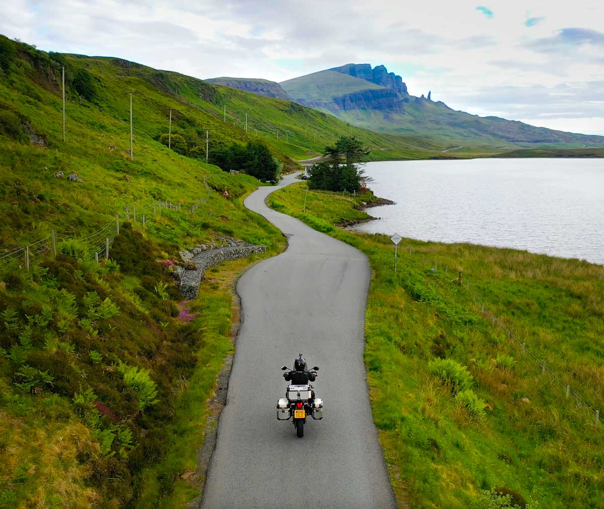
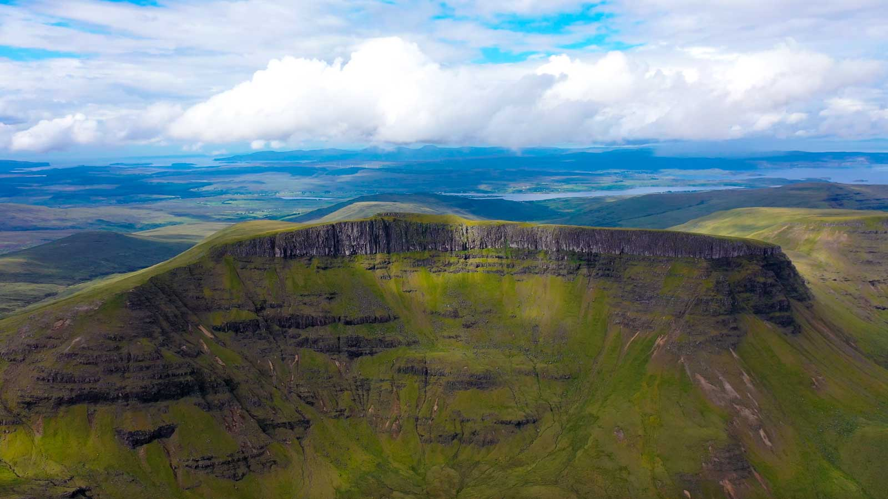
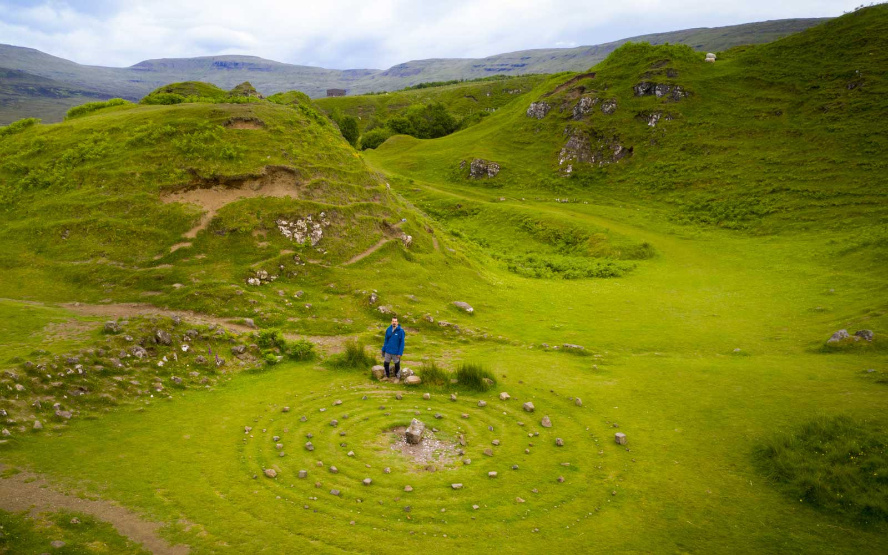
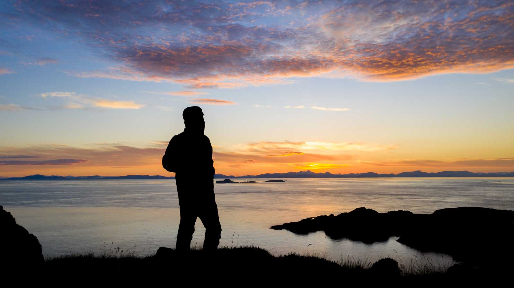
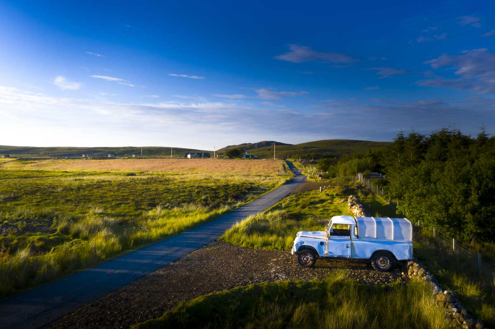

Vee işte geldik hayalin kalbi olan Isle of Skye, türkçesi Gökyüzü Adası olan bölüme. Ben burayı hayalim kalbi olarak tanımlıyordum. Batı İskoçya'ya 500 metrelik uzun bir köprü ile bağlı olan Skye adasının ününü duymuştum ve fotoğraflardan çok güzel bir yer olduğunu görmüştüm. Doğanın bağrında, şehir hayatından 20dk uzaklıkta, dağın başında güzel de bir ev bulunca 10 günlüğüne ayarlayıp burayı hayalimin kalbi olarak ilan etmiştim.

10 gün olarak ayarladım çünkü koşuşturmak istemedim. Zaten evden çalışacaktım ve işten sonra akşamları adanın etrafını rahatlıkla gezmek istiyordum. Bu eve vardığımda hem yağmurdan ıslanmıs hem de çok fazla motor sürmekten aşırı yorulmuştum. Zaten 1-2 gün öncesinde de Ben Nevis dağına gün batımı ve gün doğumu için kamp yapmaya gitmiştim. Hal böyle olunca eve ulaştıktan sonraki ilk 2 günüm dinlenmekle geçti. Biraz kendime gelince atladım motora ve adada turlamaya başladım.

Hemen ilk hedefime koştum. Üstteki deniz feneri. Adanın en batı ucunda ve harika bir manzaraya sahip bu deniz fenerinde süper bir havayla beraber Midges denilen ısıran küçük sinekler vardı. Tabi bu sefer hazırlıklıydım. Sıktım her yerime sinek ilacı ve bana uğrayan olmadı. Neymiş efenim güneş kremi alacakmışım da 50 faktör olacakmış da fpv midir pvf midir öyle bişisi de olacakmış da. Ulan bir Allah'ın kulu demez mi güneş 1-2 gün var yok, onu boş ver sen sinek ilacı al yanına. Ya arkadaş bütün batı İskoçya'da her yerde bu lanet sinekler. O kadar çoklar ki, niye bu kadar çoklar aklım almıyor. Onlardan kurtulmanın tek yolu tüm batı İskoçya'yı ateşe vermek olurdu.

Deniz fenerinin etrafında takılıp, manzarayı izleyip, drone uçururken birden fotoğrafta görünen en arkadaki kayalıklardan sesler gelmeye başladı. Sürüyle kuş orada uçuyor, garip garip sesler geliyor ve bir de ne göreyim 2-3 tane girdap var. Kesin balina var dedim veya fok kaynıyor orası. Saldım drone'u. Koş olum dedim 2 balina fotosu kap gel, gelirkende bir iki fok fidyosu çek. Ulen 1 tane pili orada tükettim ve kuşlardan başka bir şey göremedim. Girdap ise denizin(hatta okyanus diyelim çünkü fotoğraftaki yer Kuzey Atlantik Okyanusu) ortasında kalan kayalıklardan dolayı girdap oluşuyormuş. Garip seslerde büyük ihtimalle salak kuşların sesi ve kayalardan yankılandığı için değişik geliyor. Ne heyecan yapmıştım ama ve boşa gitti. Ama umudumu kesmedim. Hala fok veya balina görme ihtimalim var.

Burada hava o kadar hızlı değişiyor ki, hava durumuna bakıyorum yağmur yok diyor ama yağmur yağıyor. Veya hava yağmurluyken bir anda güneşli oluyor. Yağmura hazırdım tabi ve yağmursuz motor sürdüğüm gün sayısı 1-2 dir en fazla. Sonraki günlerde adanın en popüler yeri olan The Old Man of Storr'a gittim. Türkçesi Storr'un yaşlı adamı. Orada bir kayalık var ve yaşlı bir adama benzediğinden dolayı öyle demişler. Ama efsaneye göre orada yaşayan dev bir gün yeter be kardeşim, dünyayı ben mi kurtaracağım artık ebed uykuya geçiyorum ben demiş ve yatmış oraya. Ama parmakları havada kalmış o yüzden de devin parmakları diyorlar. Eğer öyleyse ebedi uykusuna geçmeden önce bize hareketini yapmış eleman.

Buraya gelirken kafamda hep soru işaretleri vardı. Tamam eyw abi güzel yer gibi ama 2 tane dikili daş. Ya çok mu abartıyor millet diye kendi kendime soruyordum. Hatta uzaktan görünen üstteki fotoğraf bana böyle düşündürtmüştü. Ama gel gör ki etrafında yürümeye başlayınca manzarasına ve doğasına hayran kaldım. Hatta 2-3km yürürüm diye başlamıştım ve yürüyüşü bitirdiğimde neredeyse 10km yürümüştüm. 

Bu güzel fotoğrafların yanında harika bir kaç video da çektim. Ve şunu net bir şekilde söylebilirim ki çektiklerim gördüklerimin en fazla yüzde 5'idir. 

Skye adasında ne kadar yol varsa girdim çıktım ve hayatımda motor sürerken hiç bu kadar keyif almamıştım. Bayıldım resmen ve motorla hiç durmak istemiyordum. Adaya geldiğimde 1500 mil yani 2000 küsür km yol yapmıştım bile. Adada ne kadar yaptım bilmiyorum. Keşke gün gün ne kadar yol yaptım tutsaydım. Aslında google haritaların zaman çizelgesi özelliği var. Oradan bakınca hangi gün kaç km gitmişim, nerede durmuşum, ne kadar mola vermişim vs. hepsi gözüküyor. Gezi bittiğinde plan yazarken bunlardan faydalanayım.

Bu arada Storr'un yaşlı adamından sonra koşa koşa yani başka bir akşam The Fairy Glen'e gittim.

Ya buranın bir olayı yok. Var aslında minik minik tepeler var ve küçük su birikintileri var. O yüzden değişik tatliş bir yer. Küçük tepeler bana sanki karınca tepesiymiş gibi geldi. Ortada dizili bu yuvarlak taşların ise bir olayı yok. Delinin biri gelmiş yapmış herhalde. Sadece internette gördüğüm fotoğraflarda çok büyük bir alanmış gibi gelmişti. Bu kadar küçük olduğunu görünce şaşırdım. Ortadaki taşa ise bozukluk atmış dilek tutmuş ve çikolata koymuşlar. Ulan toplasaydım onları hem benzin parası çıkardı hem de çikolata yemiş olurdum. Ahh akılsız kafam hep sonradan mı çalışırsın.

Böyle böyle bir oraya bir buraya koştururken günler hızla geçiyordu. Ne yedin ne içtin çocuk sen diyenleriniz olabilir. Bütün yiyecek, benzin gibi ihtiyaçlarımı Portree denilen küçük şirin kasabadan sağlıyordum. Ne yalan söyleyeyim dağ başında bu evde kaldığım süre resmen rehabilitasyon olarak geçti. Sessizlik, huzur ve akıl ile baş başa kalmanın muhteşemliğini yaşadım.

Son hedefime doğru bir gün iş çıkışı motor sürdüm. Evet adanın en kuzeyindeki yere Rubha Hunish denilen kayalıklara gün batımına gittim. Tabi bir yandan hala umudum vardı ya balina görürsem diye. Ama görmedim.

Skye adasında 10 gün nasıl geçti ve bitti hiç bir fikrim yok. Burada müthiş manzaralar gördüm ve yollarında motor sürerken keyiften motoru düşüreceğim anlar yaşadım. Tek pişmanlığım çok fazla doğa yürüyüşü yapamamak oldu. Ama hem çalış hem motor sür hem her yere git falan anca bu kadar oluyor. Şimdi ayrılık zamanı. Sıradaki hedefim Inverness'in biraz batısındaki Strathpeffer'de bulunan 120 yıllık Viktorian tarzı eve ulaşmak ve Highlands bölgesinin kuzeyinin altını üstüne getirmek. Şimdi yol zamanı, yola çıkma zamanı.