Iskoç yaylalarındaki 9 günlük bu son bölümde Highland bölgesinin yani İskoç yaylalarının Batı ve Kuzey bölümlerini kıyıdan kıyıdan motorla gezmeyi ve bir kaç gece Torridon dağlarında kamp yapmayı planladım. İş değişikliği yaptığım için kamp ve yürüyüş hayalleri suya düştü ama ölümüne motor sürmeye kararlıyım. Isle of Skye'dan içim burkularak ayrıldım. Harika yollar yapıp, süper yerler görmüştüm ve hayatımda motor sürerken hiç bu kadar keyif almamıştım. Yürümeyi planladığım ve kamp yapmayı planladığım yerlere izin kullanamadığımdan dolayı gidememiştim. İşte bu yüzden ayrılışım biraz buruk olmuştu.

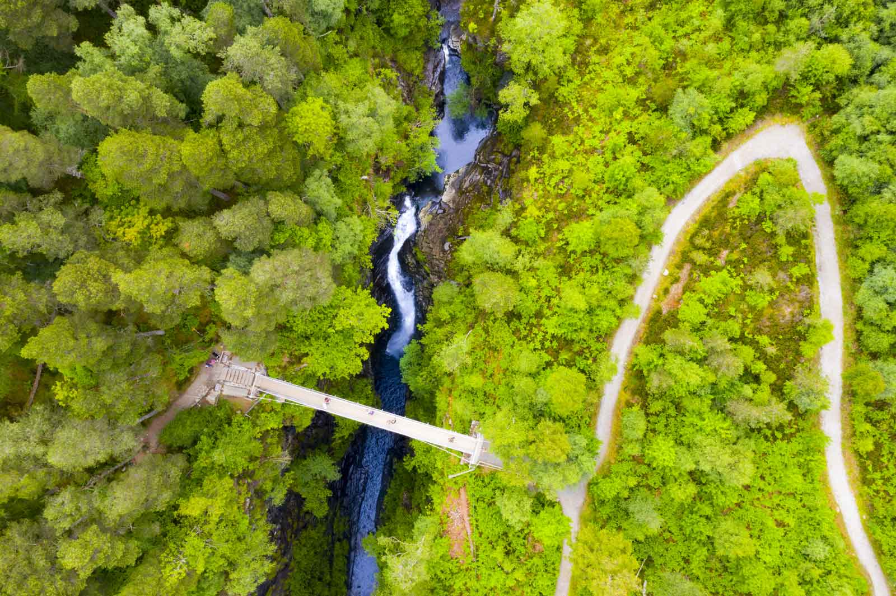

"The beginning is the end is the beginnig", türkçesi "Başlangıç sondur ve son da başlangıçtır". Çok severim bu sözü. Başlangıç ve son birbirine bağlı sonsuz döngüdeki acayip iki manyak dosttur. Isle of Skye bir hikayenin sonu olmasa North Coast 500 yeni bir hikayenin başlangıcıydı. 

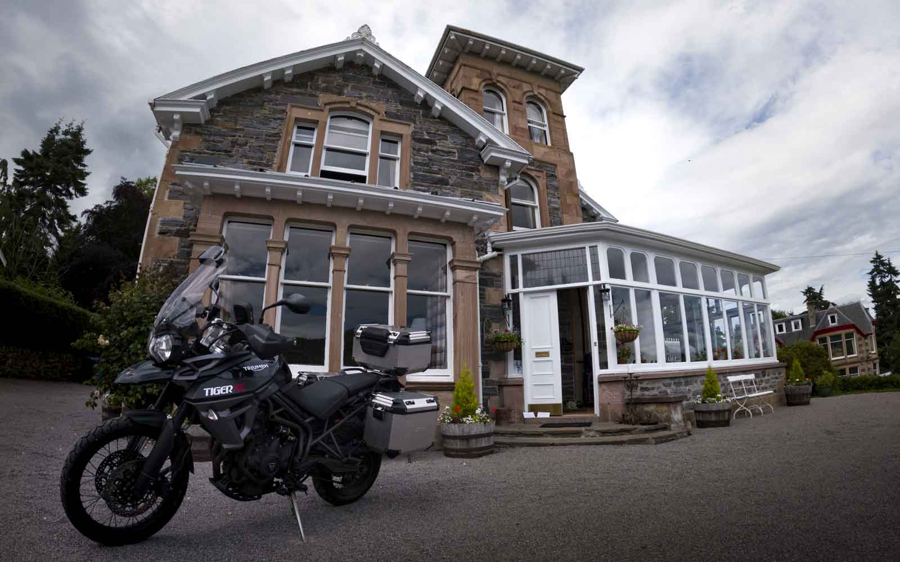

Isle of Skye'dan ayrıldıktan sonra hedefim Eilean Donan kalesinde biraz drone uçurmak sonrasında Inverness'in biraz batısında kalan ve Kuzey bölümünü rahat gezmemi sağlayacak 120 yıllık Viktorya miimarisinde yapılmış eve gitmekti. 3 saatlik dağlık yollardan, göllerin ve ormanların içinden geçerek eve ulaştım. Yolda ilk dikkatimi çeken şey ise NC500 tabelalarıydı. Turistlik bir yer mi bir rota mı emin değildim. Kendi yoluma gittiğim için de çok sallamadım. Evin reisi Fiona teyzem karşıladı beni. Fiona uzun boylu güzel fiziğiyle, bakımlı, çok güzel konuşan, kibar ve 75 yaşlarındaki bir İskoç ninemiz. Evi dolaşırken bir eve bir de Fiona'ya baktım. Kesin dedim ata yadigarı bu ev. Bir insan eviyle bu kadar mı özleşleşir. Kadın da ev de 120 yılı yansıtıyor. Bi an zamanda yolculuk yapıp geçmişe gitmişim gibi hissettim.

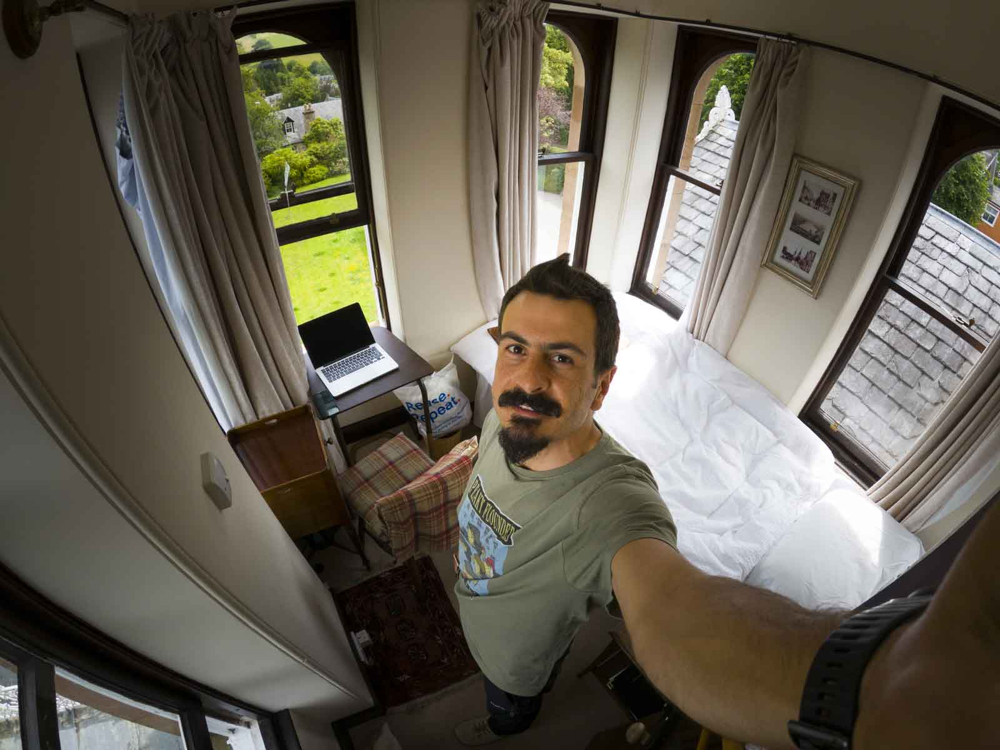

Fiona yıllardır turizm işiyle uğraşıyormuş. 2013 yılında da bu evi alıp hem yaşamaya hem de pansiyon gibi işletmeye başlamış. 4-5 odasını kiraya veriyor, gelen gidenle muhabbet edip arkadaş oluyor, onlara tavsiyelerde bulunuyor ve süper kahvaltılar hazırlıyor. Fiona o kadar sıcakkanlı bir insan ki sizi evinizdeymişssini gibi hisettiriyor. 

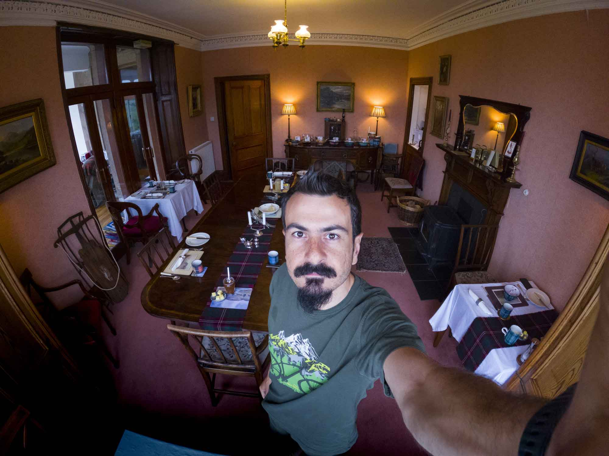

Yemek odasında verilen kahvaltıda diğer odalarda konaklayanlarla görüşme ve muhabbet etme şerefine eriştim. Bir aile ortamı gibi, herkes ne yaptığını nereye gittiğini, nereleri gezdiğini falan anlatıyor. Ben ve Rob haricinde evde kalanlar sürekli değişiyordu. Böylece her gün başka bir muhabbet açılıyordu. Ben de hem gezdiğimi hem de evden çalıştığımı söyleyince her seferinde odayı bir hüzün kaplıyordu. Tatildesin sen niye çalışıyorsun vs vs. Üstüne bir de bilgisayar muhendisiyim, yazılım geliştirme yapıyorum deyince kimse ne yaptığımı anlamıyor. NASA'da çalışıyormuşum havası oluşuyor bi an. Hatta evde kalanlardan bir amca çok tehlikeli işin var sakın kimseye söyleme dediğinde şaşırdım ve niye diye sordum. Ulan yanlış veya ayıp bi iş mi yapıyorum diye 2 saniyeliğine zihin karmaşası yaşadıktan sonra herkes senden bilgisayarıyla ilgili bir şey sorabilir veya isteyebilir diye şaka yaptı. Ki öyle de oldu bir sabah Fiona geldi ibrahim 'Your drive is full. There is no space' ne demek dedi. Ya bir gün önce de bana bir İskoç kelimesi olan "**Dreich**"i öğretmeye çalıştı. Sisli, ıslak, kasvetli ve kapalı havalar için Dreich derlermiş. Yine öyle bir şey mi diyor acaba dedim ya da bu bir deyim/atasözü gibi bir şey mi falan diye düşünürken ne demek bu nerede karşılatın dedim. Bilgisayarımda bu hatayı alıyorum, hiç anlamıyorum ne yapmalıyım dedi ve bizim amcanın uyarıları gerçeğe dönüştü.  

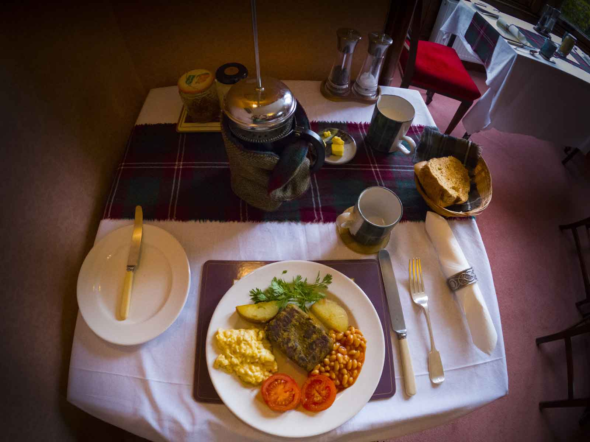

Evdeki diğer konuklar genelde 1-2 günlük kalıp rotalarına devam ediyorlar veya bir işleri olduğu için bir gecelik kalmayı tercih ediyorlardı. Biri bisikletle tura çıkmış, diğerleri düğüne gelmiş ve benden 2 gün sonra gelip 1 hafta kalan Rob ise o bölgeyi gezerek öğrenmeyi ve sonra beğendiği bir yerden ev alıp oraya yerleşmeyi planlıyormuş. Rob reis ya, bir arabasıyla bir bisikletiyle gezen, 50'li yaşlarda British Airway'de çalışan ve başından 2 evlilik geçmiş heyecanlı reisimiz. Karar vermiş Birmingham civarından bu tarafa taşınıp artık buralarda yaşayacakmış. Tabi çocuk ve hatun olmadığı için tüm planlarını daha kolay bir şekilde yapıyordu. Evdeki en çok muhabbet ettiğim, kendi hikayemi anlattığım ve evdeki benden sonra en genç kişi Rob'du. Ha bir de Fiona'nın 20 yaşındaki kedisi var. Onu unutmayalım lütfen. Bu ülkede insanların uzun yaşadığı gibi hayvanlarda uzun yaşıyormuş vay arkadaş dedim. Türkiye'de 60'ı gören dede oluyor, hayattan bağını kesiyor. Burada ise yaşlı diyebilmek için birinin 80 yaş üzeri olması gerekiyor. Son bir kaç yılda yaşlı kavramı bende çok değişti. Kesin ben burada 100 e kadar yaşarım. Oha lan 2087 yapar. Uff çok iyi, belki Mars'a giden minibüsleri kullanarak orada kamp yaparım.

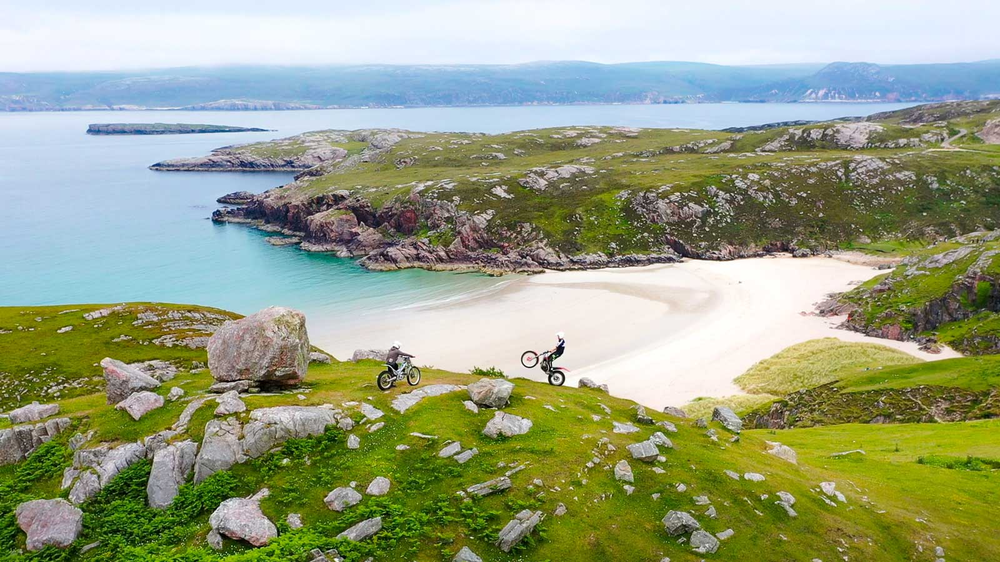

Burada kaldığım süre boyunca evden çalışmaya devam ettim. İş sonrası ve hafta sonları ise acımasızca motor sürdüm. Önce batıya gittim oradan kıyıdan kıyıdan kuzeye çıktım. Cumartesi sabah Puffin'leri görmek için yola çıkacağımdan bahsedince Fiona'nın sabah 10 Puffin görmek için geç olabilir demesi moralimi bozmuştu ama yine de yol yapmak ve şansımı denemek istiyordum. Bu yüzden önce batıya sürdüm Kuzey Atlantik Okyanusuna ulaştım sonra kıyıdan kıyıdan kuzeye giderek [Puffin Cove](https://goo.gl/maps/CfPDcpnTRzPkuPD17)'a yani Puffin'lerin evlerine gittim. Kayalık koya varınca adeta şoklanmıştım. Yüzlerce Puffin reis gördüm. 2 metre kadar yanlarına yaklaşıp oturdum onları izledim. Küçük kuşlardan biraz büyük ama güvercinden küçükler ve salak salak, şaşkın şaşkın etraflarına bakıyorlar. Normalde avlanmaya gittikleri için o saatte görme ihtimali düşükmüş. Ama burası onların evi olduğu için çok şanslıydım. Tüm Puffin aşireti oradaydı. Puffin'ler bir kuş türü, kesinlikle bir penguen değil. Bu tatlı hayvanlar suya dalarak beslenen, açık deniz adalarında, kayalarda ve topraklardaki oyuklarda yaşayan ve Kuzey Atlantik Okyanusunda yaşayan bir deniz kuşudur.

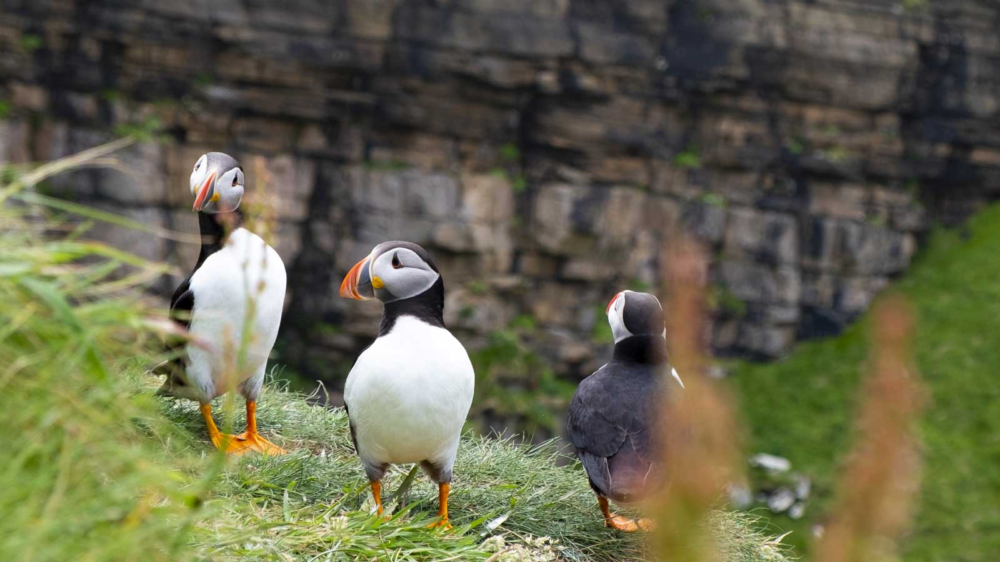

Cumartesi ve Pazar günü çalışmadığımdan dolayı kıyıdan kıyıdan gezdiğim ve ara sıra ana yollardan çıkıp özellikle dağ yollarına dalarak uzun yol yaptığım iki gün oldu. Hatta öyle ki 2 günde 500 mil yapmıştım yani 800km civarı. Bu yollarda giderken de sürekli NC500 tabelaları görmeye devam ediyordum. Bir bakayım ya neymiş bu NC500 falan derken [Mustafa Karaaslan](https://www.youtube.com/user/nistelX) ile yollarımız kesişti. 

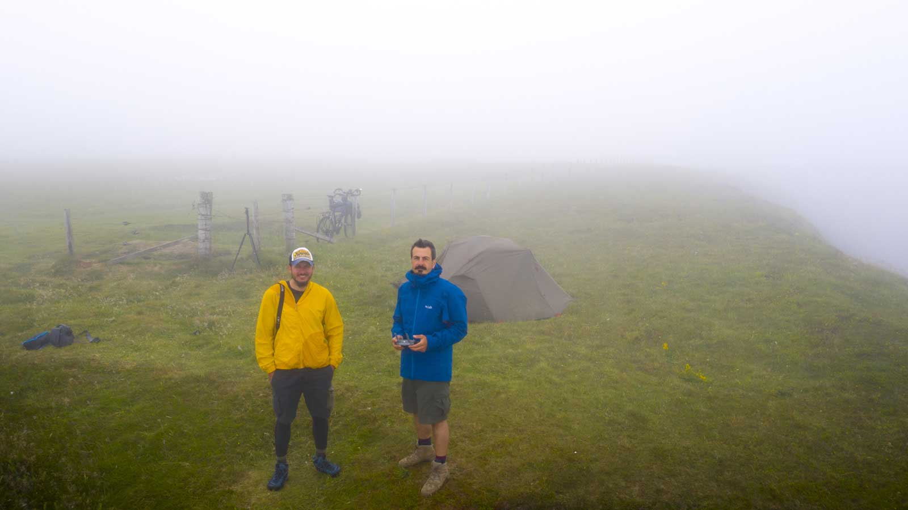

Mustafa ile bir arkadaşımın söylemesi üzerine tanıştım. İskoçya'yı hatta tüm Birleşik Krallık topraklarını bisikletiyle geziyor, Youtube'da süper içerikler hazırlıyor. İskoç yaylalarında bir Türkle aynı hayaller peşinden koşmak benim için harika bir olaydı ve yolumuzun kesişmesi bu anlamda benim için değerliydi. Onunla [Dunscansby Stacks](https://goo.gl/maps/wob8akHoJqYeo633A) denen kayalıkların olduğu Highland'ın en kuzeyinde ve okyanus kenarı olan bu yerde yolumuz kesişti ve tanıştık. Dünya çok da büyük değil belki bir gün yine yolumuz kesişir. 

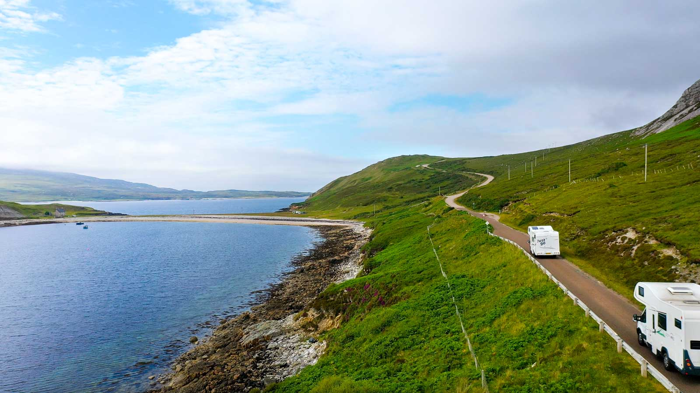

Mustafa'yla muhabbet ederken NC500 rotasından bahsetti. O da İskoçya'ya geldiğinde öğrenmiş. Bende diyorum bu tabela ne ayak her yerde karşıma çıkıyor falan. Meğer 2015 yılında **North Coast 500** adı altında ortaya çıkmış 516 mil(830km) uzunluğunda yuvarlak bir rota. Highland'ın en güzel yollarından geçen bu rotayı bitirmek için bi dünya insan tur yapıyor. Sonra haritaya bir baktım. Oha lan dedim zaten çoğunu yapmışım. Hatta dağ yollarına girdiğim için daha fazlasını yapmışım. Sadece gitmediğim çok az bir kısmı kalmış. Onu da yaparak gezinin son bölümünü tamamlamaya karar verdim. Bu son bölümde NC500 rotasını yaptığım için bu bölümün adı NC500 oldu sayın seyirciler. Bazı mevzuların böyle yolda oluşmasını çok seviyorum. Spontane takılmak diyorlar buna dostum ve evet bazen çok güzel oluyor. Sürprizlerle dolu. 

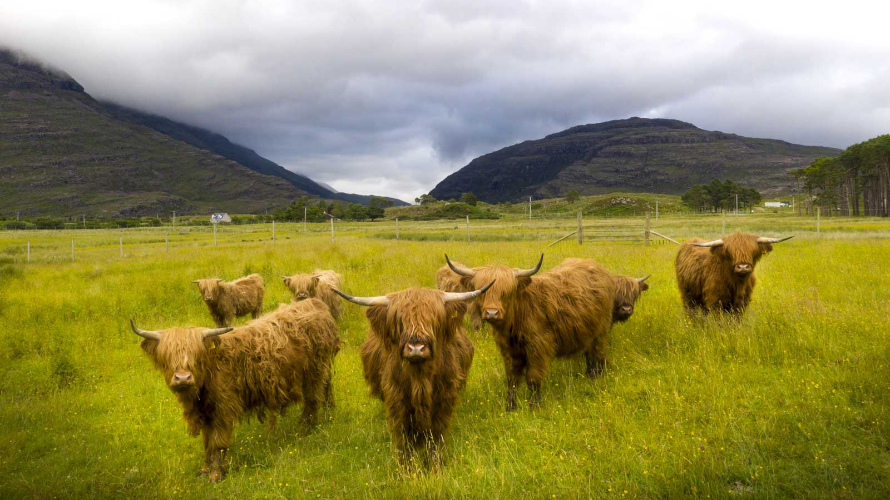

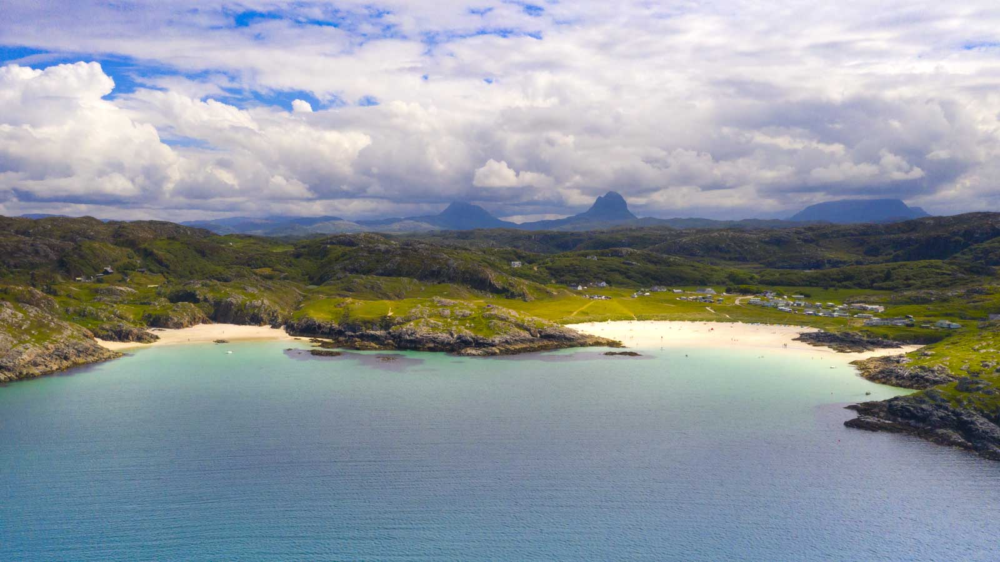

Bu rotada dağlardan, çok güzel koylardan ve geçitlerden geçtim. Fiona'nın evinden ayrıldıktan sonra 3 günlüğüne biraz daha batıda ve Isle of Skye köprüsünden önce olan [Dornie](https://goo.gl/maps/2MyyK7FLWSRag1WWA) üzerinden ulaşılan [Sallachy](https://goo.gl/maps/Zx7YjyUJVfS4FjMM8) denen göl kenarındaki bir eve 3 gün kalmak için geçtim. 

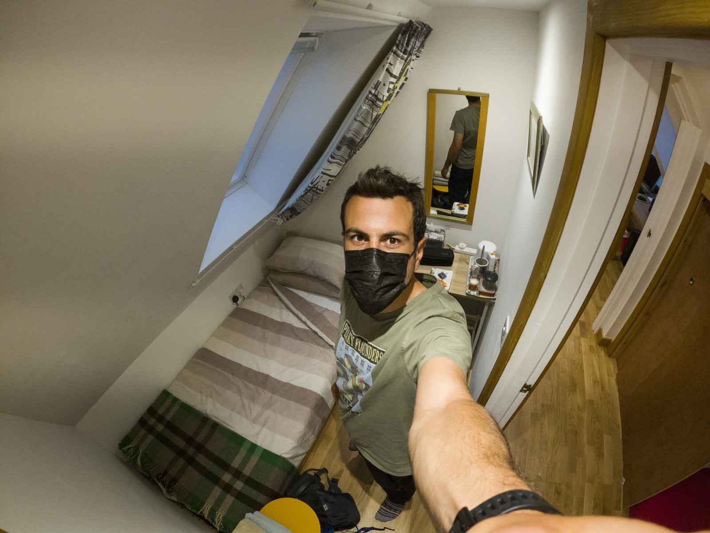

Buraya akşam 4-5 saatlik bir motor yolculuğu sonrası(işi 5'te bırakıp) ulaşacaktım ki yolda küçük bir sahil kasabasında([Gairloch](https://goo.gl/maps/TRtzurhZVv3VZTYMA)) kahve içecek bir yer arıyordum. Birden karşıma balinaları ve fokları görmek için yapılan tekne gezileri yapan bir yer çıktı. Kapalıydı ama bir dünya afiş vardı ve o yıl kaç tane fok, kaç tane balina ve puffin gördüklerini yazmışlar. Hemen internetten baktım ve şans eseri Cumartesi'ye kalan son koltuğu aldım. Normalde Cumartesi günü geri dönüş yolculuğu başlayacaktı ama kim takar geri dönmeyi. Balina görmek varken 2 gün sonra döneriz Londra'ya abicim dedim. Arkadaşım ne kadar şanslı bir gezi yapıyorsun diye kendi göğsümü kabartıp havalara uçmuştum ki ertesi gece turun iptal olduğunu söyleyen email'in geldi. Demek ki neymiş tüm şanslarımı tüketmişim. 

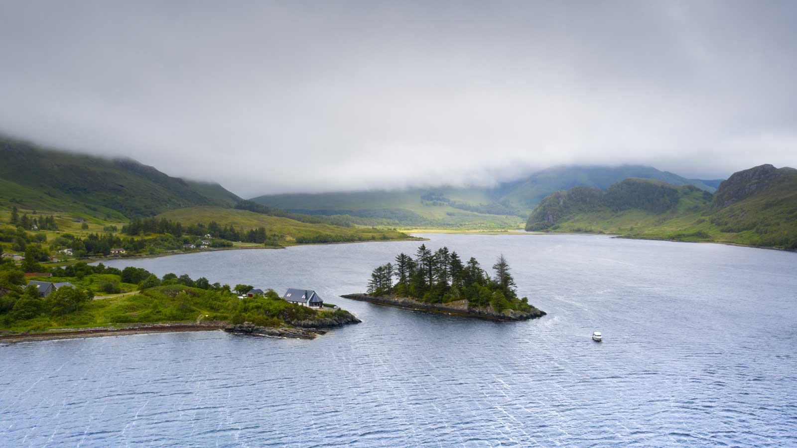

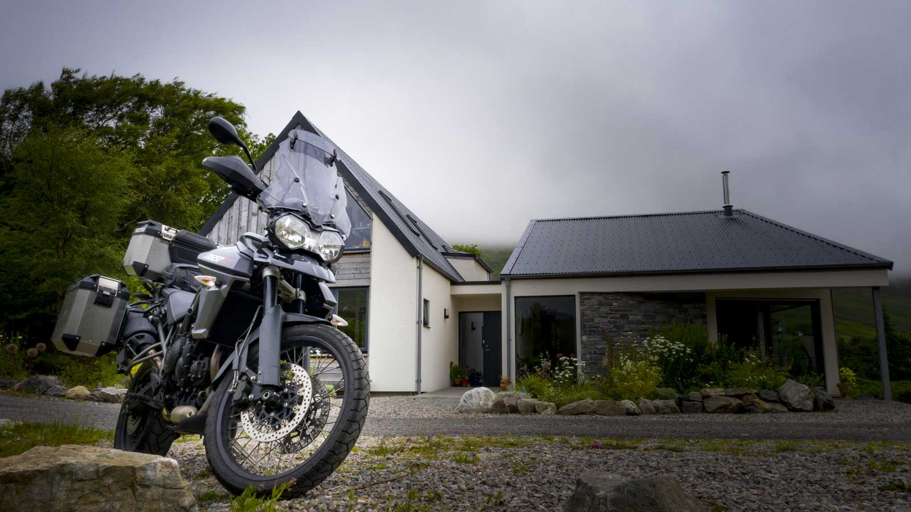

Cumartesi sabah erkenden yoldaşım Karaoğlan'la 14 saat yolculuk yaparak 1000km devirdik ve eve ulaştık. Dostum Karaoğlan süper bir yoldaş. Beni her yere götürdü ve hiç gık mık demedi. Gezi bitmişti. 29 günde 5500km yol, 85 km de doğa yürüyüşü yapmışım. Vay arkadaş ya, hiç mi durmadım acaba. Londra'dan buraya git gel 2000km, bunu çıkarsak sadece 3500km Highland'da yol yapmışım. Çok iyi ya. Hayatımdaki en uzun turumdu. Daha fazla kamp ve doğa yürüyüşü yapmak isterdim. Hatta 1-2 hafta daha uzatmayı da düşündüm ama artık bu şekilde yaşamaya başlamaya alışmıştım. Londra'ya dönüşümde ciddi adaptasyon sorunları yaşamak istemiyordum ve bu yüzden dönmeye karar verdim. Zaten Highand topraklarından çıktığım ilk an ya biz İngiltere'de ne yapıyoruz niye burada yaşamıyoruz diye sorgulamaya başlamıştım ama dönerken hep aklımda 1 ay sonra arabayla tekrar gelirim ve bol bol kamp ve yürüyüş yaparım vardı. Çünkü tadı damağımda kalmıştı.

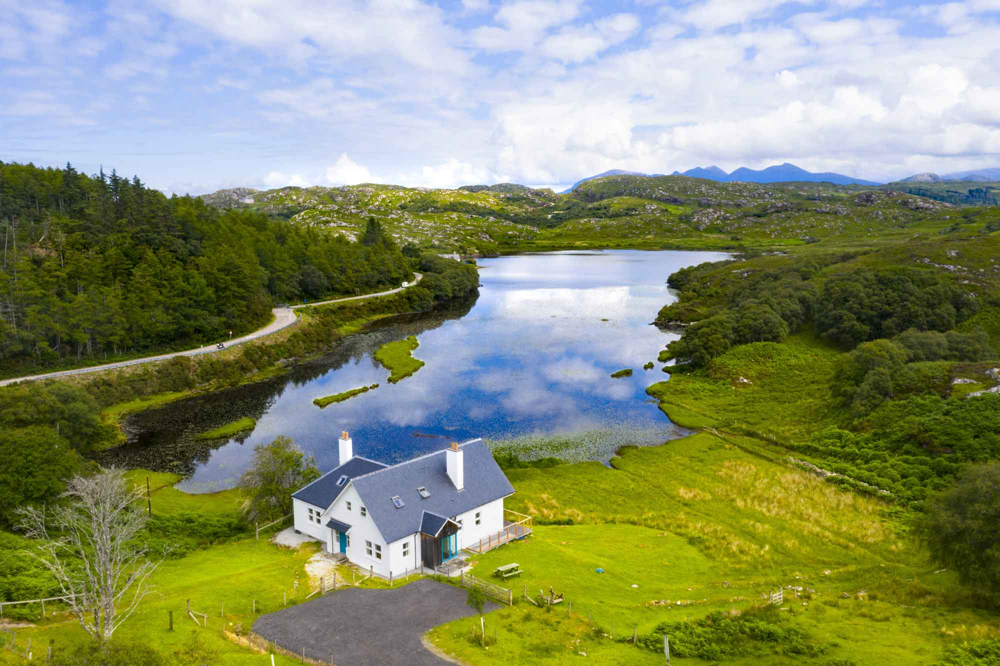

Londra'da geçirdiğim ilk haftada gezi sonrası oluşan depresyona girmedim, girmemek için kendimi tuttum ve yeni planlar yaparak kendimi kandırdım. Ama oralardan ayrılışımın hüznü ve özlemi her geçen gün artıyordu. Hayırlısı olsuna bağlayalım en iyisi ;)