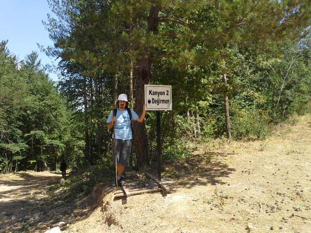
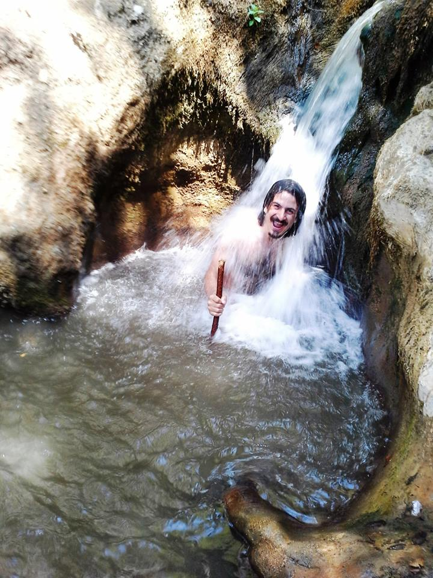
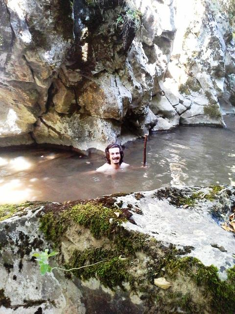
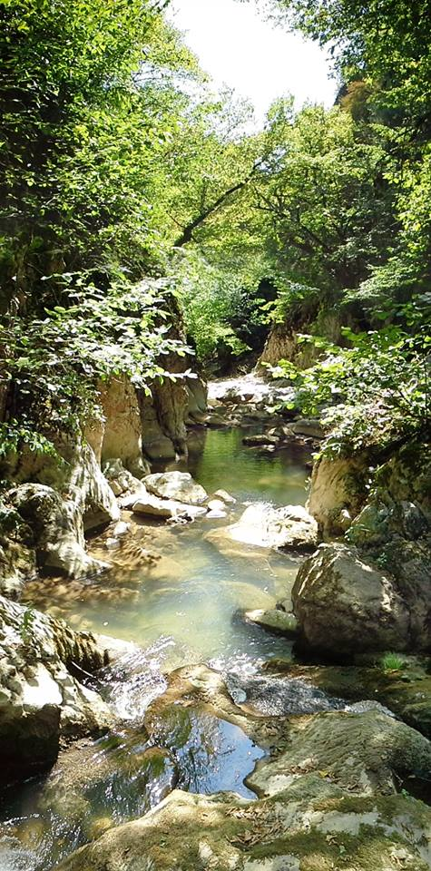
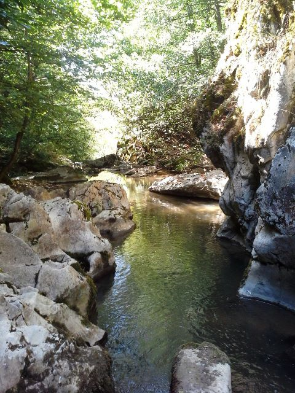
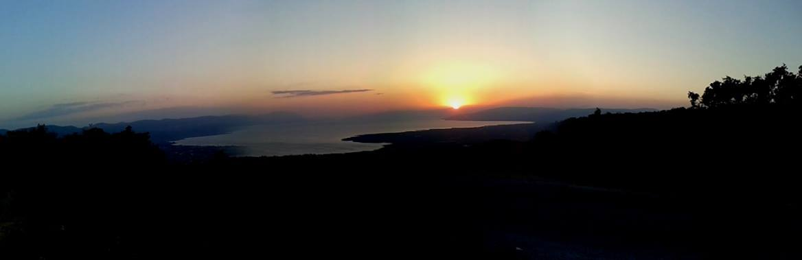

İznik’te bir akrabanız varsa şanlısınız. Çünkü hafta sonu hem akraba ziyareti yapabilir hem de Sansarak kanyonunda güzel bir doğa yürüyüşü gerçekleştirebilirsiniz. Akrabanız yok diye üzülmeyin çadır kurulabilecek çeşitli yerler var. Teyzemler İznik’te olduğu için ben hem akraba ziyareti hem de kanyon yürüyüşünü birlikte gerçekleştirdim. Tabi her zamanki gibi gitmeden önce iyi bir araştırma yaptım.

İznik üzerinden yaklaşık 20km sonra Sansarak köyüne ulaşacaktık. Köyü geçtikten 1km kadar sonra kanyon girişine(tabelalar var) varıp yürüyüşümüze başlayacaktık. Bu seferki yürüyüş ailecek oldu diyebiliriz. Babam, kardeşim, teyzem ve eniştemle birlikte güzel bir deneyim yaşamış olduk.

Kanyonlar Serin Olur

Kanyon 2 Değirmen tabelasının olduğu yerden dereye doğru inişe başladık. Kısa süre sonra dereye vardık ve kanyon yürüyüşümüzü kolay olması için yukarıdan aşağıya doğru yapcaktık. Kanyon sürekli bizi şaşırttı. Tam bitti bu kadar galiba derken veya suyun çok azaldığı yerlere gelip moralimiz bozulduğu anda birde ya bir şelale ile ya da küçük bir havuz ile karşılaştık. Su Ağustos ayında olmamıza rağmen oldukça serindi. Su da fazla durduğunuz zaman üşüyebiliyorsunuz.

Zaman zaman derenin kenarından yürüyebildiğiniz, bazı yerlerde geçişlerin oldukça zor olduğu, kaygan taşların bulunduğu güzel bir kanyon. Suya girmeden yürümenizin mümkün olmadığı  bu doğa harikası yerin sadece ilk etabını yürüdük. Yaklaşık 4 saat sürdü, tabi hızımız da biraz yavaştı. Tek karşılaştığımız sorun kanyondan nereden çıkacağımızı bulamadık. Aslında ben orman içerisinden bir yerden tırmanarak biraz ilerledim ancak ekip içerisindekilerin buradan geçmesi tehlikeli olacağından buraya girmedik. Yoksa güzel bir yol keşfedebilirdik. Sağa sola bakınırken bir grupla karşılaştık ve ormanlık alandan giden patikayı takip ederek çıkabileceğimizi söylediler. Patikayı takip edince yol üzerinde ki Kanyon 1 tabelasının olduğu yere çıktığımızı farkettik.

Tadı damağımda kalan heyecan verici kanyona bir gün tekrar geleceğim.

