Haziran 2014. Artık kendimi test etmenin zamanı geldi. Malum Eylül ayında Likya yoluna gitmeyi hedefliyorum ve tamamını 21 günde bitirmek istediğimden artık günde ortalama 30 km yürüyebilmem gerekiyor. Bu yüzden uzun bir parkur düşünürken aklıma birden Kocaeli’inden Iznik’e gitmek geldi. Bu parkuru kullanacaksam arabayla gitmem olmazdı. Çünkü arabayı bıraktığım yere geri dönmem gerekiyor. Araba her zaman böyle bir problem oluşturuyor. Karar verdim otostopla gideceğim. TEM otoyolunun kenarından otostopla başlayacağım yolculuguma Yuvacık kavşağına ulaştıktan sonra 60 km civarı yürüyerek Iznik’e ulaşmayı hedefliyorum.

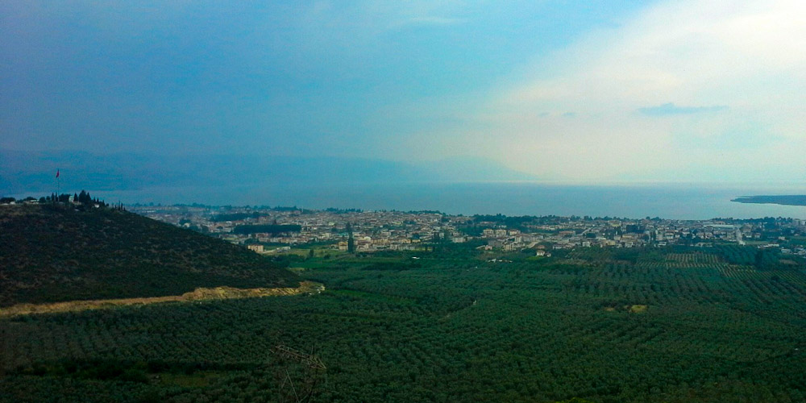

### **Otostop Zamanı**

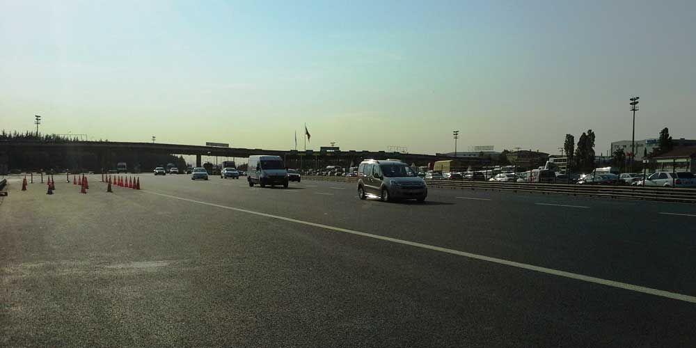

Cuma mesai bitimiyle birlikte TEM kenarına kadar yürüyüp Çamlıca gişelerinden otostop çekmeye başlıyorum. Elimi kaldırır kaldırmaz bir araba duruyor. Ama bana yaramıyor çünkü Kartal’a gidiyormuş. Bu kadar kolay olacak diye çok sevinmiştim. Yaklaşık 15 dk otostop çekiyorum. Solumda bulunan tır tartı alanına gelen şoförlerden beni almalarını istiyorum. Ama çoğu beni geri çeviriyor. 2 tanesi niyetleniyor ama onların biri Gebze’ye gidiyormuş diğeri ise ileride mola verecekmiş. Derken bir panelvan minibüs geliyor ve Sakarya’ya gittiğini söylüyor. Ohh süper deyip hemen atlıyorum. Bu da olmasaydı 5 dk daha bekleyip metro turizme gidip otobüsle Kocaeli’ne gidecektim.

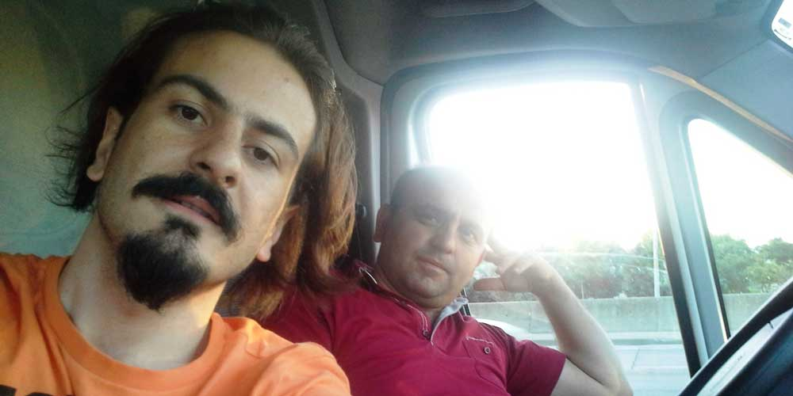

### **Dolunay Işığında Yürüyüş**

Sakarya’ya giden Cem Tem’den çıkarak beni Kocaeli şehir merkezinde bırakıyor. Beni alıp buralara kadar getirip bir de üstüne merkeze bırakan Cem’e teşekkür ediyorum ve Yuvacık kavşağına gitmek için otobüse biniyorum. Saat 20.30 gibi Yuvacık kavşağından yürüyüşe başlıyorum ve 1 saat içerisinde hava tamamen kararıyor. Çok şanslıyım çünkü dolunay var. Fenerimi yakmadan dolunay ışığında yaklaşık 13 km yürüdükten sonra Karaaslan kamp yerine ulaşıyorum. Gece 12 de varmış olduğum bu güzel tesiste hemen çadırımı kuruyorum ve birşeyler atıştırdıktan sonra uykuya dalıyorum.

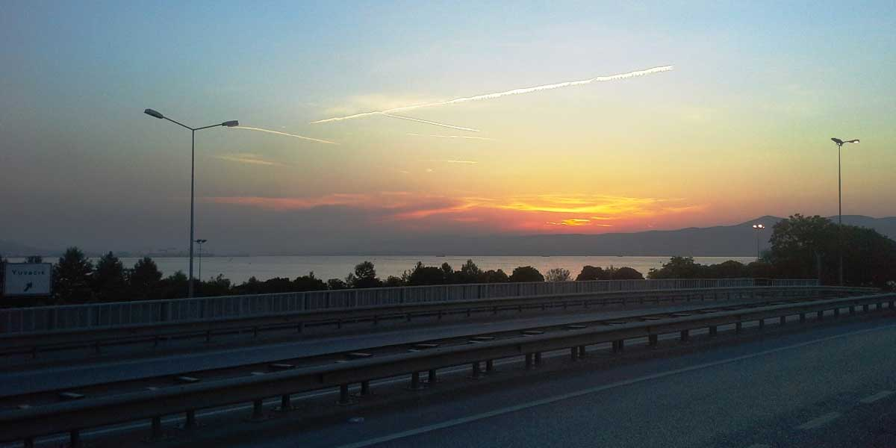

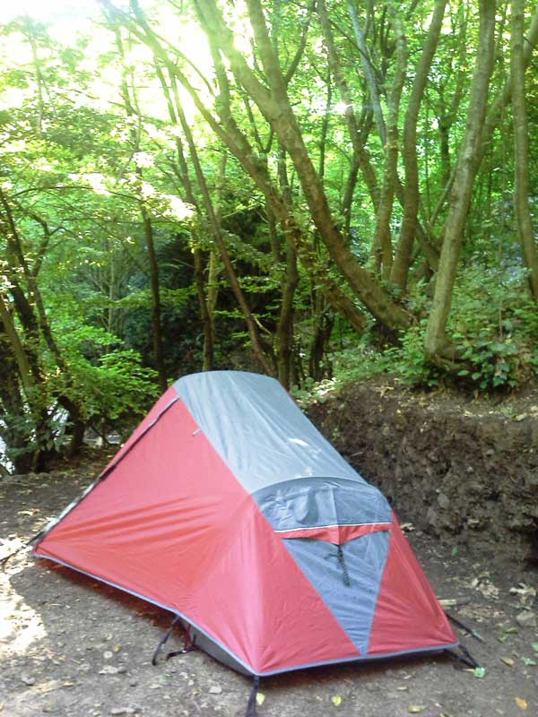

Sert zeminde uyku zor oluyor. Zaten yorulmuştum bir de sert zeminde uyuyunca sabah her tarafım ağırarak uyandım. Bir sonraki kampa çıkmadan ilk işim şişme mat almak olacak. Bu tür uzun yürüyüş olan rotalarda gece uykusu çok önemli. Iyi bir uyku uyuyup sabah dinç uyanmak o günkü performansınıza çok etki ediyor. Kahvaltı yaptığım sırada telefonumu da sarj ediyorum. Bu gercekten iyi oluyor. Aksi halde sarjim yetmeyecekti. Yola çıkmak içinde geç kaldım. 10 gibi tam yürüyüşe başlayacakken dün gece kendisiyle biraz oynadığım sevimli köpek yolun ortasına oturmuş gitme der gibi bakıyor. Ama vedalaşma zamanı diyerek yanından geçip gidiyorum. Bir süre ilerledikten sonra birden önüme çıkıyor ve 11 km boyunca bana eşlik ediyor. Çok iyi bir yol arkadaşı oluyor. 

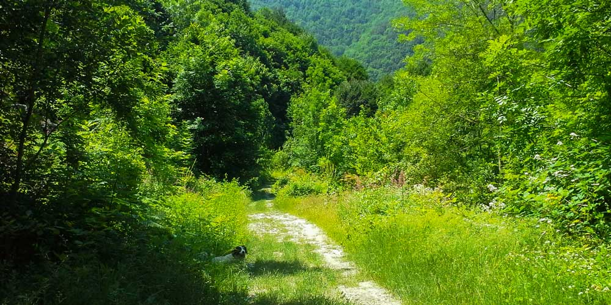

Yürürken sohbet edip, oyun oynuyoruz. Etrafımda hoplayıp zıplayıp dört dönüyor. Beraber mola veriyoruz, çikolata yiyoruz. Bu sevimli havhava çok alıştım. 11km sonra Aytepe Soğukpinardaki çay ocağına vardığımızda burada kendini seven kızları görüp beni hemen satıyor. Bir anlamda iyi oldu daha fazla uzaklaşmadi ama bir yandan da kötü oldu çünkü yol arkadaşıma çok alışmıştım.

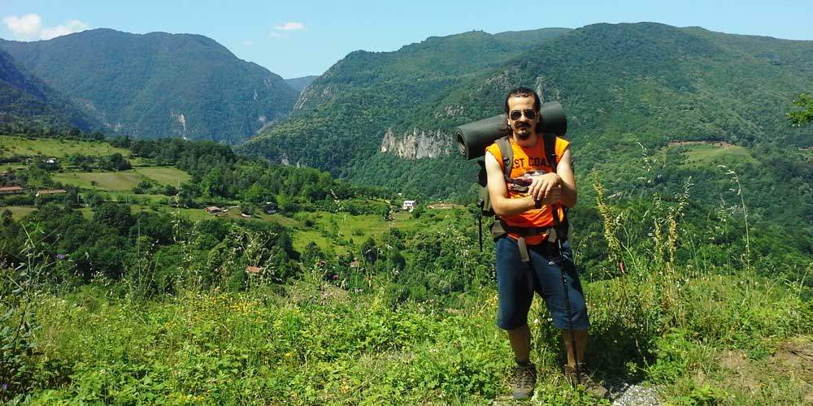

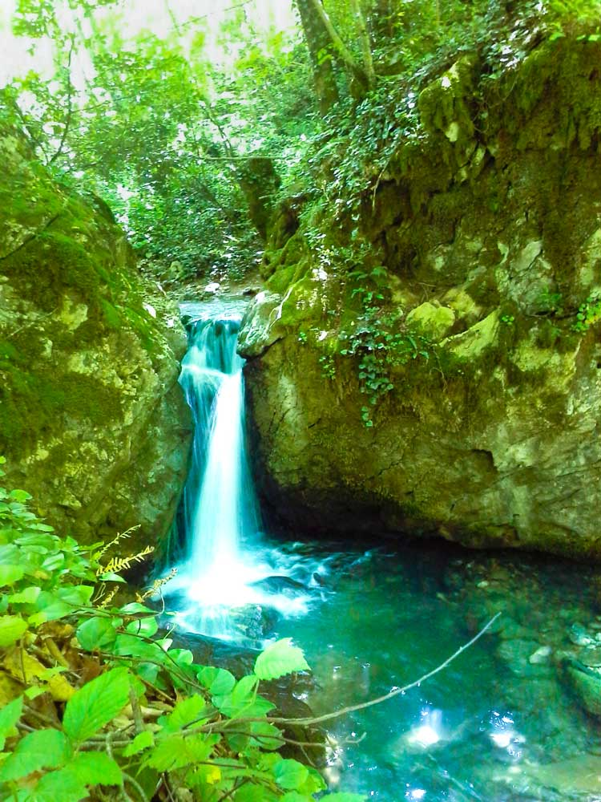

### **Papaz Çayırı**

Soğukpınardan orman içi patikayı kullanarak dik bir çıkışla Papazcayırına ulaşıyorum. Yaklaşık 16km yürüdüm bu yüzden burada 2 saatlik bir mola vermeyi planlıyorum. Papazçayiri bu bölgedeki en cok sevdiğim yerlerdendir. 

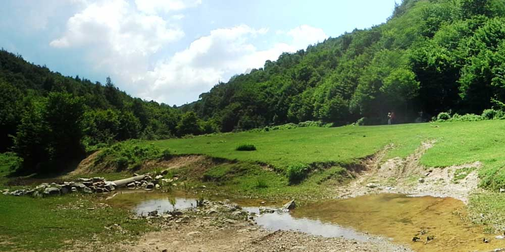

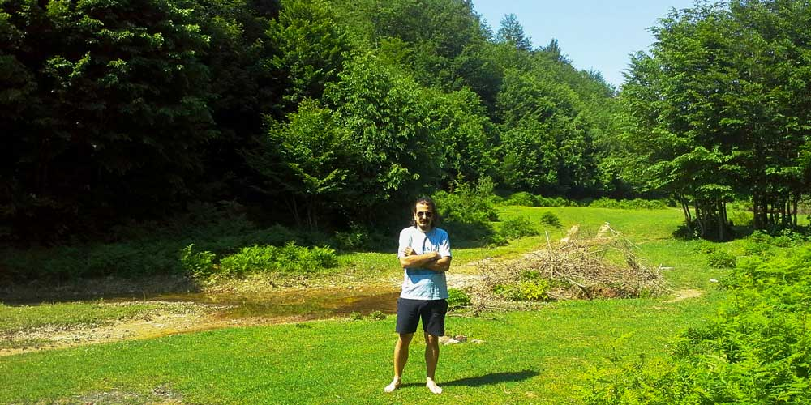

Burada ineklerini otlatan yöre halkından birisiyle muhabbet ediyoruz. Inekler kaybolup gitmiyoru mu, suruden ayrıldıkları hiç oluyor mu diye soruyorum. Bakıp takip etmezsen olur diye bana hava atıyor. Yakınlarda kurt var bizi izliyor. Biz burada olmasak sürüye saldırır diyerek de beni korkutmaya çalışıyor. Ardından şunlara bir bakayım diye yanimdan ayrılıyor. Uzun bir sure gözükmüyor sonra inekleri sayarak geldiğini görüyorum. Birisi kaçmış gitmiş sonra ormana girmiş bulmuş. Ben ise toparlanıyorum ve yoluma devam ediyorum.

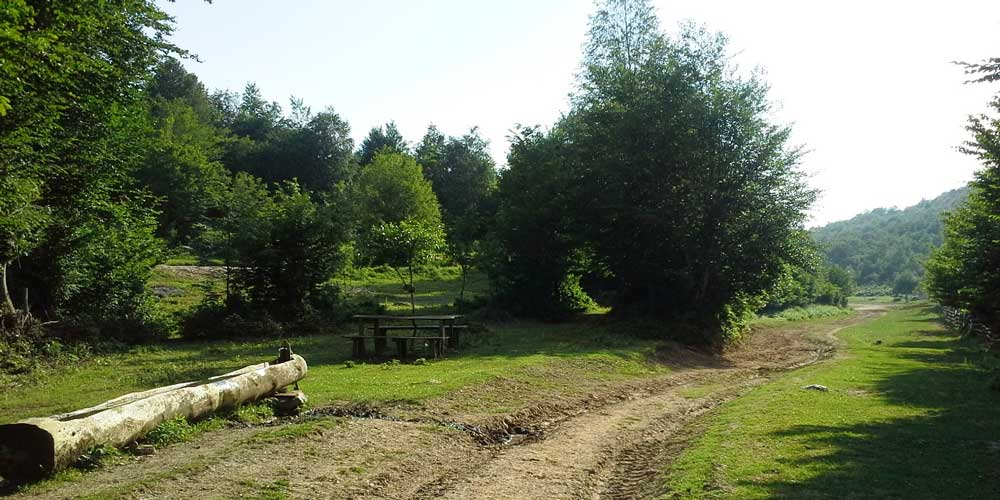

### **Sansarak Köyü**

Çerkesli gölüne gidip geceyi orada geçirdikten sonra yarın İznik e geçmeyi planlıyordum. Sonradan vazgeçtim ve Sansarak kanyonunun olduğu Sansarak köyüne doğru devam etme kararı alıyorum. 1 yıl aradan sonra belki tekrar kanyona girerim düşüncesi zihnimde dolaşmaya başlıyor. Tabi vaktim olursa. Yol üzerinde bolca çeşme olduğundan su sıkıntısı hiç yaşamıyorum. Köyün birinden geçerken yaşlica bir amcaya selam veriyorum ve halini hatrını soruyorum. Beni iyice suzdukten sonra tanıyamadım kimlerdensin diye cevap veriyor. Sanırım tanıdık biri olduğumu düşündü:). Sansarak köyüne 9 km kala artık hava kararmaya başladığından düz bir yer bulup çadirimi kuruyorum ve kamp ateşini yakıyorum. Gece gökyüzü kapalı. Bu gece gökyüzünü izleyemeden uyku için çadırıma geçiyorum.

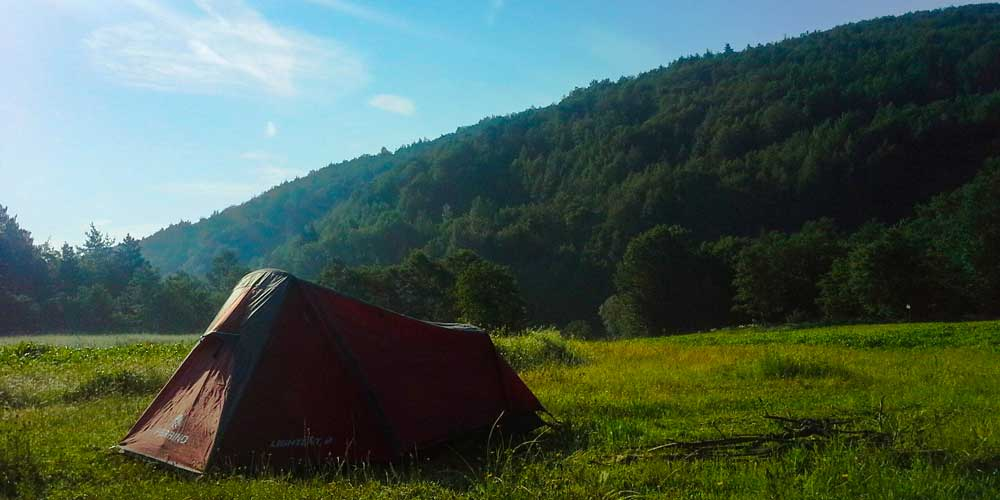

### **Kanyona Girecek Vakit Yok**

Dün yaklaşık 25 km yürüdüm ve gece yumuşak bir zeminde uyuduğum icin sabah dinç bir şekilde uyandım. Sansarak kanyonuna geldiğimde fazla vaktim olmadığından kanyona girmekten vazgeçiyorum. 

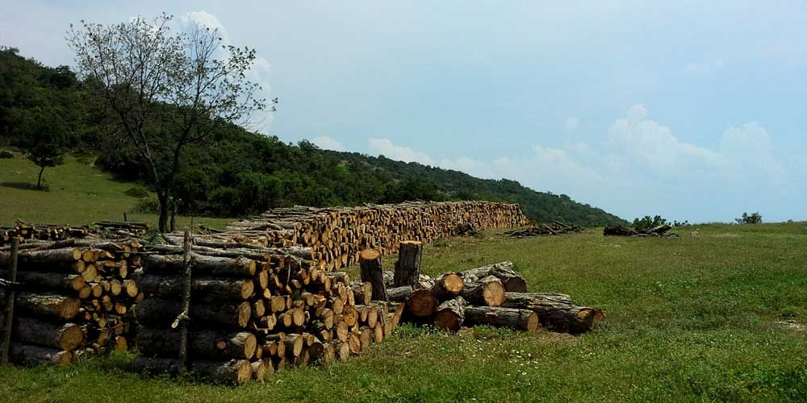

18kmlik yolum olduğundan ve sonrasında Istanbul’a gitmek için vasıta bulmam gerektiğinden pek vaktimin olmadığını düşünüyorum. Yoksa buralara kadar gelmişken kanyona girmeden gitmek olmazdı. Bazen yoldan bazen traktör yolundan bazen de yamaçlardn geçerek Iznik’e doğru devam ediyorum. Yoldan geçen bir kaç araba yanımda durup beni götürebileceklerini söylüyor. Nazikçe teşekkürlerimi iletiyorum. Ne kadar güzel değil mi? Otostop çekmediğim halde insanlar beni gideceğim yere kadar götürebileceklerini söylemeleri beni çok mutlu ediyor. Halbuki Istanbul da 20 dk uğraştıktan sonra birisi beni almıştı.

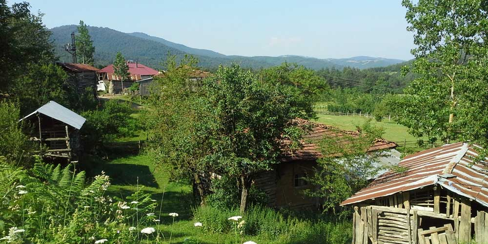

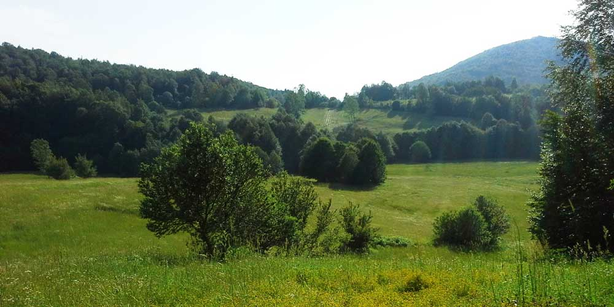

### **Hedefe Varış**

Yaklaşık 24 km sonra İznik e ulaşmış oluyorum. Ve hedefimi tamamlamış olmanin gururunu, mutlulugunu yaşıyorum. 2 günde yaklaşık olarak 62 km yürüdüm ve fizik olarak gayet iyi durumdayım. Psikolojik olarak zaten keyiften dört köşeyim :)

Likya yoluna gitmeden once böyle uzun parkur denemelerim olacak. Artık fizik olarak hazir olduğumu hissetmeye başladım. Tabi önemli olan üst üste 21 günde bu kadar yol yürüyebilmek. Bakalım kısmetse olacak gibi.