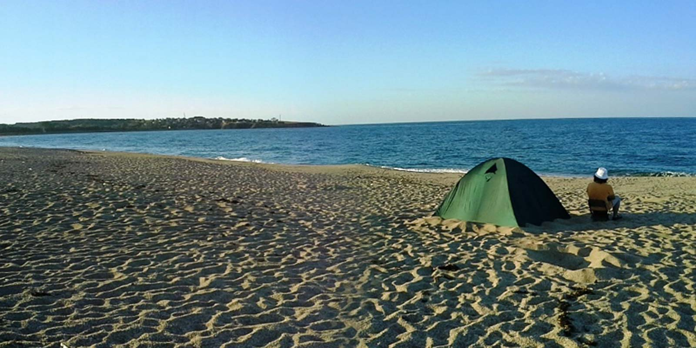
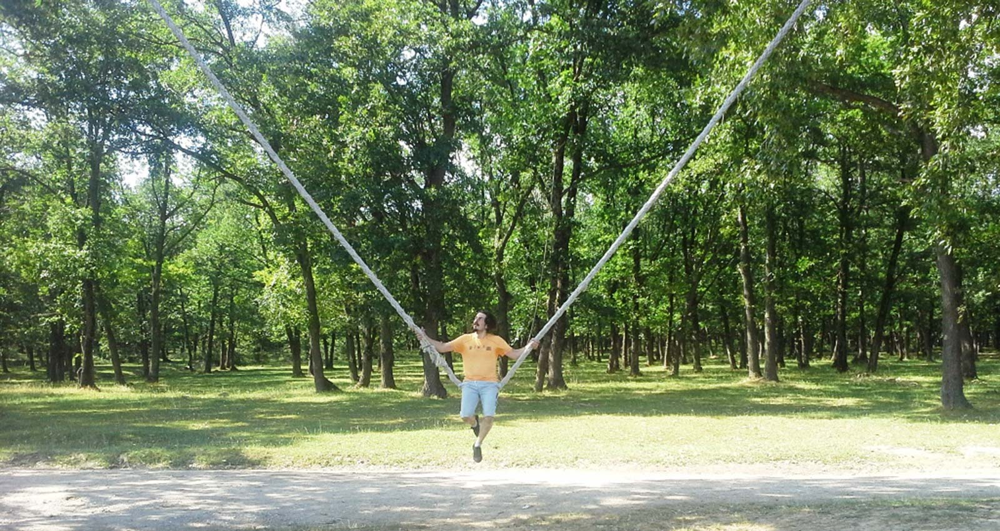
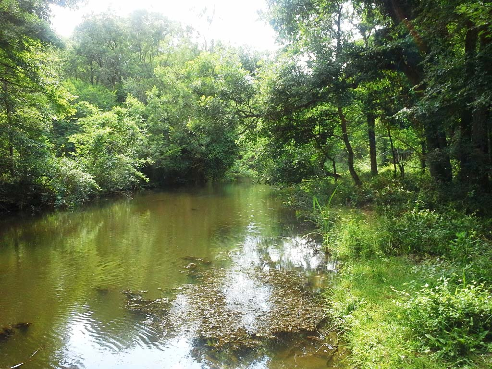

[Kerpe Kampı](/kerpe-kampi "Kerpe Kampı") sonrası 1-2 Haziran tarihlerinde kamp planı yapmaya başlamıştık. Denize girebileceğimiz ve aynı zamanda genişçe ormanı olan bir yer arıyorduk. Derken bir arkadaşımın tavsiyesi üzerine İğneada’yı araştırmaya başladım. İğneada da çok güzel **longoz ormanları** olduğunu ve **Beğendik Koyu**‘nda denize girebileceğimizi öğrenince hemen plan yapmaya başladım. Hedefimiz İğneada’ya gidip oradan Bulgaristan sınırının hemen yanındaki Beğendik koyunda kamp yapıp, longoz ormanları ile **Dupnisa Mağarası**nı gezmekti.

**1 Haziran Cumartesi – Yol Uzunmuş**

Cumartesi sabah erkenden iş yerinden arkadaşlar ve eşleriyle birlikte toplaşıp yola çıkmalı diyerekten yollara düştük. [Yol bilgisi olarak](https://www.google.com/maps/dir/41.0246793,29.0574145/41.9679199,28.0331687/@41.5333895,27.8580852,10z/data=!4m9!4m8!1m5!3m4!1m2!1d27.6089803!2d41.6590462!3s0x40a0a2fa32e50c11:0x353070889f5a3015!1m0!3e0) İstanbul üzerinden yaklaşık 250km olan bu mesafeyi 2.5 saatte almanın hayaliyle yollardaydık.  E80 yolundan ayrıldıktan sonra işler hiçte öyle gitmedi ve yol çalışmaları yüzünden yaklaşık 4.5 saatin ardından Beğendik koyuna ulaştık. Kahvaltı ve kamp yeri için önce sahilin biraz ilerisindeki yeşillik tepeyi tercih etmek istedik. Ancak burada fazlaca böcek yüzünden sahilde bulunan işletmenin hemen önündeki kumsala çadırlarımızı kurmaya karar verdik. Böyle tuvalet ve su ihtiyacı da çekmeyecektik, aynı zaman da denizin hemen dibinde olacaktık.

Fotoğrafta gözüken sağ taraftaki kumsala çadırlarımızı kurup, kamp ateşi için odun toplama işine koyulduk. Buradaki işletmede tenekede tavuk gibi yemekler ve sıcak içecekler bulabilirsiniz. Çadır kurmak veya sahili kullanmak için bir ücret ödemiyorsunuz. Kamp yerimiz hazır hale geldikten sonra İğneada’ya gidip longoz ormanlarında yaklaşık 4-5kmlik bir orman içi yürüyüş yaptık sonrası kamp alanına geri dönüp denize girdikten sonra akşam yemeğimizi yedik ve kamp ateşimizi yakıp kampın en güzel anının tadını çıkarmaya başladık. 1 Haziran itibariyle denizin sıcak olacağını düşündük ve çok yanıldık, buna rağmen soğuk su bizi yıldıramadı ve denize girdik. Bu noktada artık Bulgaristan’a çok yakınsınız. Hatta bir bulgar köyü karşıda görünüyor. Zaten sahilden biraz ilerleyince gözetleme kulesinde bulunan asker geri gitmeniz için sizi uyarıyor.

**Ya Jandarma Gelirse**

Gece saat 10-11 sularında her zamanki gibi jandarma geldi. Önce bir tedirgin olduk. Çünkü bu gibi jandarma bölgelerinde kamp yapmadan önce ilgili bölgenin jandarma müdürlüğünden izin almak gerekiyor. Eşlerimizle birlikte kampa geldiğimizi söyleyince aile ortamını gören komutan bize bakınmak için geldiğini gece bu bölgede yaşayan gençlerin alkol almak için deniz kenarına gelip taşkınlık yapabileceğini, öyle bir şey olursa jandarmaya haber vermemizi isteyerek yanımızdan ayrıldılar. Böyle olunca hem tedirginliğimiz gitti hem de kendimizi biraz daha güvende hissettik.

**Siz Hiç Dolunayın Doğuşunu İzlediniz mi?**

Gece 1.5 sularında herkes yorgunluktan yatmaya çadırlarına çekildi. Sadece Gürkan ve ben denizin, ateşin, suyun sesinin ve gökyüzündeki sayısız yıldızların tadını çıkararak muhabbet etmeye devam ettik. Saat 2 civarı denize taraf ufuktan dolunayın doğuşunu izledik. Evet kocaman bir ay resmen doğuyordu. Yaklaşık yarım saat sessizce bu anı izledik ve erkenden yatmaya gidenlerin neler kaçırdığını düşündük. 3 gibi çadırlarımıza yatmaya gittikte sonra yan tarafımıza komutanın bahsettiği gençler geldi. Neyse ki çok gürültü yapmadılar ancak onlar gelince ben biraz daha onları izleyip, sorun çıkarmayacaklarını anlayınca 4 gibi yatmaya karar verdim.

**2.Gün – Longoz Ormanları ve Dupnisa Mağarası**

Sabah güneşin çadırlara gelmesiyle birlikte erken uyandık. Kahvaltı sonrası çadırlarımızı toparladık, kumsalda ateş yaktığımız yerdeki közleri toparladık(bir kumsal temiz bırakılmalı). Bu esnada hava iyice kapattı ve hafif hafif  yağmur çiselemeye başladı derken kendimizi arabalara zor attık. Hedefimiz ilk olarak **Dupnisa mağarası**na gitmekti. Demirköy’deki yol ayrımından sonra Dupnisa yoluna girmiş olduk. Biraz bozuk olan bu yol oldukça keyifli ve orman içerisinden ilerliyor. Yer yer yeşillik gökyüzünü görmenizi  engelliyor. Yol üzerinde orman içerisinde kamp yapan insanlara rastlıyoruz. Bir gün bu tarafa kamp yapmaya gelmek için zihnime güzel bir not düşüyorum.

**Bir Mağara İçin Yolu Uzatmaya Değer mi?**

Bizim de aklımıza bu soru takılmıştı. Ya ne olacak ki sonuçta bir mağara. Ama girişinde kişi başı 3TL gibi bir ücret ödedikten sonra 5dklık bir orman içi patikadan geçiyorsunuz. Sonrasında içerisinden dere akan çok büyük ve uzun bir mağaraya giriyorsun. Hep filmlerden görmeye alışık olduğumuz bu tür bir mağarada olmak insana heyecan veriyor ve iyi ki gelmişiz diyoruz. Mağara içerisi güzelce aydınlatılmış, yer yer karanlık olduğundan fotoğraf çekimlerimizin çoğunda netlik problemi yaşıyoruz. Ama hafızalarımız da bu güzel yer net bir şekilde kalıyor. Sonrasında tekrar çileli İstanbul yolculuğu başlıyor. Biraz da trafiğe takılarak 5 saatlik bir yolculuk sonrası eve dönmüş oluyoruz.

2 günlük bir süre için hızlandırılmış bir plan oluyor. Mesafe uzak ve yol çalışmaları sizi yoruyor. Yol çalışmaları bittiğinde 3 saatte gidilebilecek bu mesafeye Cuma akşamdan gitmek daha mantıklı gözüküyor veya 3 günlük bir tatil olduğu zaman gidilmeli. Çünkü Longoz ormanlarının tadına tam olarak varamadım. Yürüyüşümüz kısa oldu. Bu içimde kalan ukde ile bir gün tekrar gideceğime inanıyorum.