### 3 Gün Tatil Varsa Hedef **Kaz Dağları**

2014 19 Mayıs in haftasonu ile birleşmesiyle 3 günlük tatilim olmuştu. Sürekli aklımda olan ve gitmek istediğim Kaz dağları için güzel bir fırsattı. İlk defa gideceğim Kaz dağları hakkında bir sürü araştırma yaptım. Ve ilk sorun olarak milli parka kılavuz rehbersiz giriş yapmanın yasak olduğunu öğreniyorum. Bunun sebebi ormanı ve içindeki canlıları korumak gibi gösterilse de ben bu yönde yapılan bir çalışma göremedim. Aslında kılavuz rehber çok güzel bir uygulama ancak belirli yeterlilikte ve bilinçte olan kişilere zorunlu tutulmaması gerektiğini düşünüyorum. Mesela benimle gelen rehber benim kadar yürüyebilecek mi, ne yiyip ne içecek,  nerede kalacak gibi sorunlar ortaya çıkıyor. Zorunlu tutmalarinin tek nedeninin turistik bölge olduğu için para olduğunu düşünüyorum. Diğer milli parklarda böyle bir uygulama görmedim.

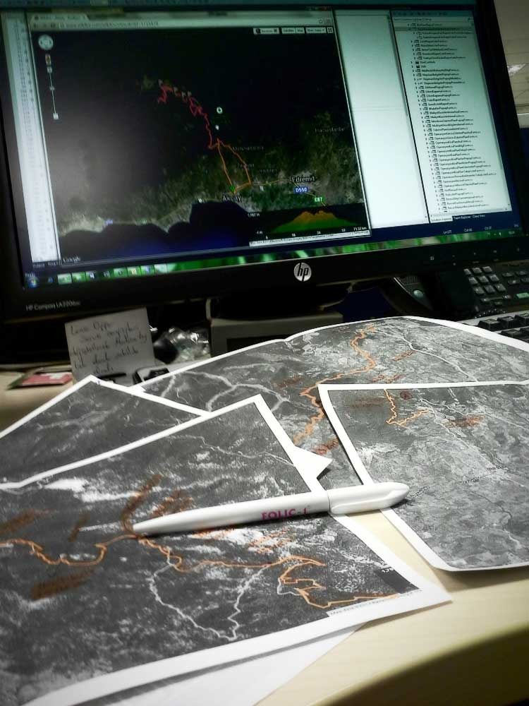

### Planlar Yapıldı

Araştırmalarım sonucunda aynı problemi daha önce yaşamış ve orman içi bir yoldan kaz dağlarına giris yapmış birisinin verdiği bilgileri kullanmaya karar verdim. Kaçak giriş yapmış olacaktım ve en fazla yaka paça beni dışarı atarlar diye düşündüm :-). Rotamı çıkardım, tüm hazirliklarimi tamamladım ve artık yola çıkmak için mesainin bitmesini bekliyordum.

### Yola Çıkma Zamanı

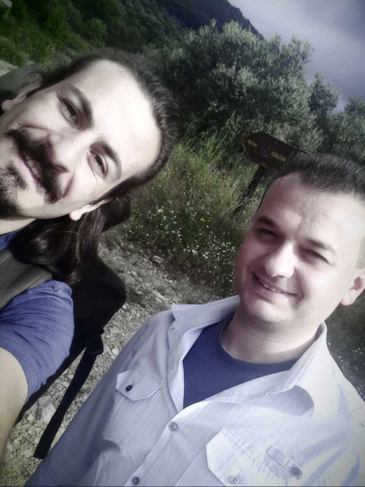

İş yerinden arkadaşım Cem ile birlikte Edremit e gidip gece onlarda kaldıktan sonra Cem beni sabah doğaya salacakti. 17:30 da yola çıkmamıza rağmen İstanbul trafiği kilit olmuştu. Gebze dolaylarinda Tem otoyolunu kapatmışlar ve yolu E5’e yönlendiriyorlar. 9 saat suren çileli bir yolculuğun ardından gece 2 de eve vardık.

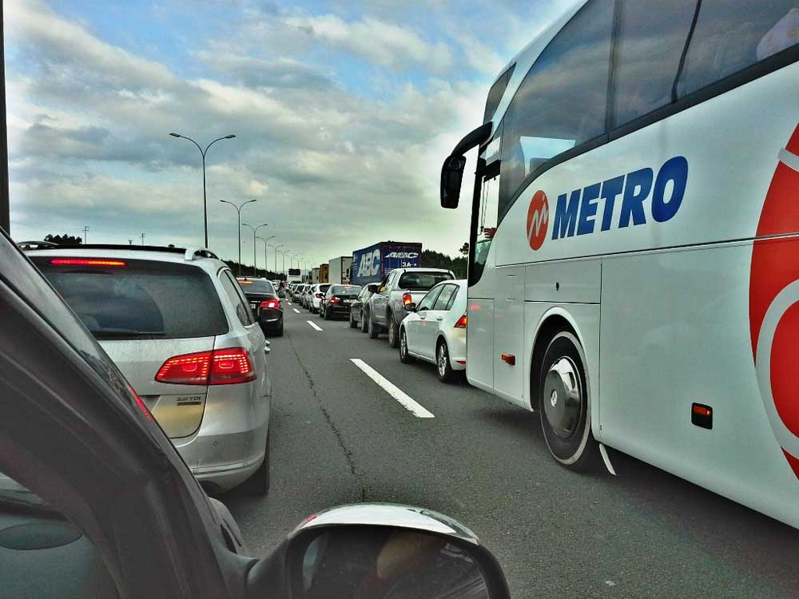

## **1.Gün – Kaz Dağlarını Görünce Beni Heyecan Bastı** 

Sabah 6 da yolda olmayı hedefliyordum. Ancak gece 3’te uyuyunca bunu 8’e erteledik. Derken bu saat 9 oldu ve başlangıç noktasında Cem beni doğaya uğurladı. Kaz Dağlarına klavuz rehber olmadan girmenin yasak olduğunu biliyorum. Ama klavuz rehberi neremde taşıyacağım :), üstelik ben kafasına göre takılan bir adamım. Bu yüzden kimsenin bilmediği bir yerden orman içi toprak yoldan yürüyüşe başladım. Zirveye doğru hava biraz kapalı görünüyordu. Yağmur ihtimaline karşı çadırımın yağmurluğunu hazırladım. Çünkü yanıma yağmurluk almamıştım. Bu gibi durumlarda çadırınızın yağmurluğu veya yanınızda götüreceğiniz büyük boy çöp poşetleri çok iş görebilir.

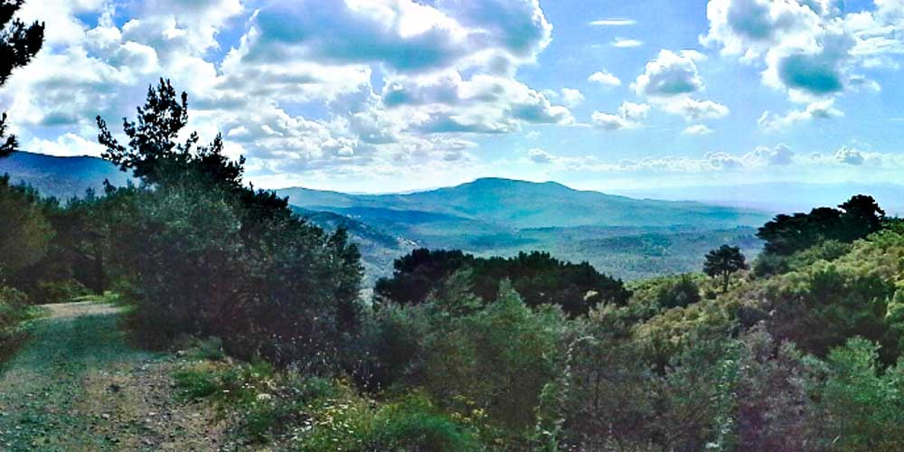

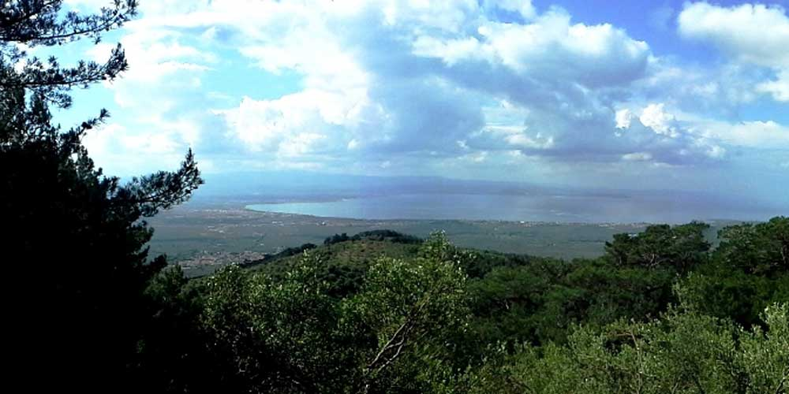

### Ege Semaları

Yükseldikçe manzaranın güzelleştiğini ve ege denizinin güzelliğini görmeye başladım. Gökyüzü bağrına bastığı bulutlarla birlikte ege denizi ile birleşiyordu. Ufuk çizgisi kalmamıştı. Bu güzel manzara ve orman içerisinde toprak yoldan devam ediyordum. Derken toprak yol bitti ve eski bir traktör yoluna döndü. Öyle ki yolun her tarafını otlar basmış ve bozuk bir yol. Tabi yürüyüşçüler için çok güzel. Yol üzerinde bolca su kuyusu mevcut. Hatta bunlardan çıkan sesi öncesinde domuz sesine benzeterek biraz tedirgin olmuştum. Ancak bir süre dinledikten sonra bir ritminin olduğunu fark ettim. Belirli debide akan suyun bir ritmi vardır. Biraz dinleyince bu ritmi yakalayabilirsiniz.

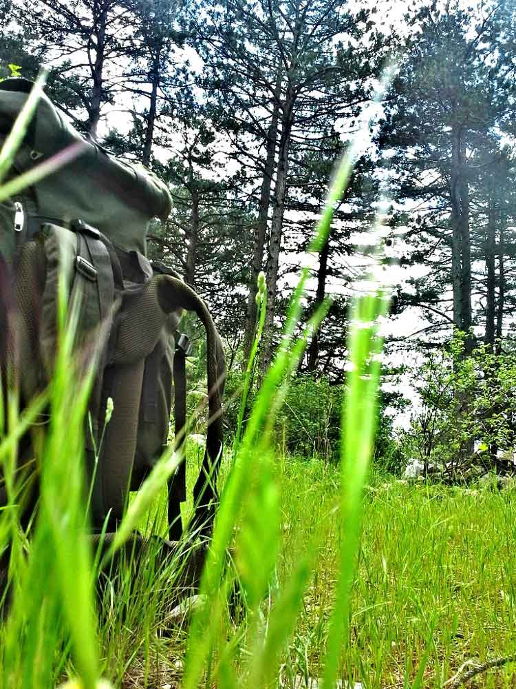

### Yol Bitti Ne Yapmalı? Cevap: Ormana Dalmalı

10km sonra gölcük denilen suyun bolca aktığı bir yere geldim ve yol bitti. Evet yol bitti. Suya çok girmeden geçmeyi hedeflediğimden burayı geçmek biraz uğraştırdı. Ardından orman içi patikalardan, yamaçlardan tırmanışa devam ettim. Ormanın en derin yerlerine gelmiştim. Gitgide yükseliyordum. Ama bu yamaç beni çok yordu doğrusu. Saat 14:00 gibi artık 1300 metre yüksekliğinde mola vereyim dedim. Son 5km yamaç çıkıyor olmak beni çok yormuştu. 1300 metrede hava serindi. Akşam daha soğuk olacağını düşündüğümden yukarıda kalmaktan vazgeçtim. Yaklaşık 7-8 km sonra zirveye varabilirdim. Ama aşağıda deniz manzarası olan bir tepe çok hoşuma gitmişti ve gece orada kalmayı daha çok istediğimden bu noktada yemek ve mola işlerini halledip geri dönmeye karar verdim. Geri dönüş yolunu yamaç hariç aynı rota üzerinden yaptım. O kadar fazla orman içerisine girmiştim ki kesin bir hayvanla karşılaşırım düşüncesi vardı. Ama ne yazık ki kuşlardan başka bir şeyle karşılaşmadım.

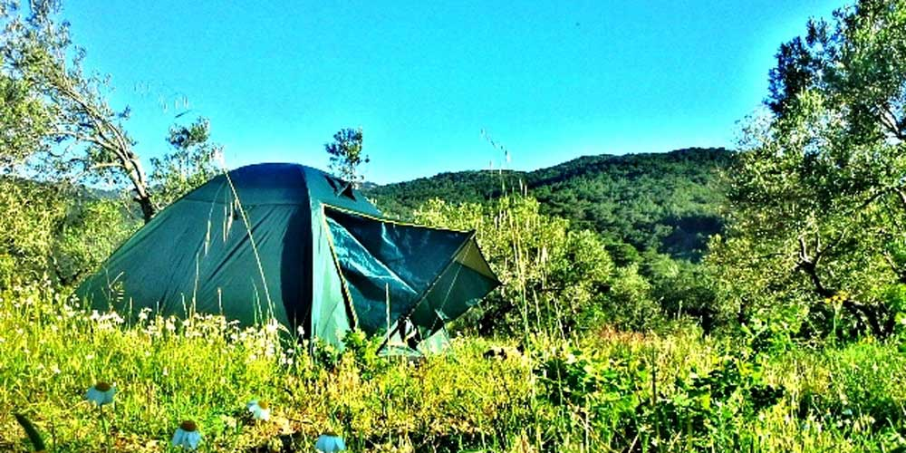

### Deniz Manzaralı Kamp Yerim

Akşam 8 e doğru kamp yapmak istediğim yerdeydim. Zeytinliklerin içerisinde muhteşem ege manzarası olan bu sert zeminde gece uyumak zor oldu doğrusu. Gece 10 gibi uzaktan çakal sesleri geldi, bende karşılık olarak bir ıslık çaldım. Sonra sesler kesildi. Fazla kalan yemeğimi çadırın içerisine almak istemedim. Çünkü dışarıya yayacağı kokuyla hayvanları direk çadırıma yönlendirecekti. Bu yüzden biraz uzak bir yere gidip döktüm. İlk gün 32km yürümüş olmanın yorgunluğuyla uykuya daldım. En çok omuzlarım ağrıyordu. Düzenli spor yapıyor olmanın faydasını görmüştüm, ayaklarım ilk defa bu kadar iyiydiler.

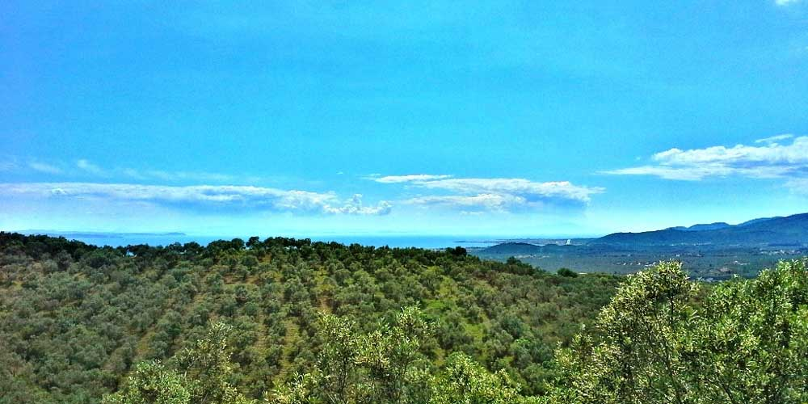

## **2.Gün – Gece Misafirleri**

Sabah güneşin çadıra gelmesiyle birlikte 7 gibi uyandım ve sıcaktan kendimi hemen dışarı attım. Yine o güzel manzara beni karşıladı. Sert bir zeminde rahat bir uyku uyuyamamıştım ama havanın ve manzaranın güzel oluşu bende moral/keyif düzeyini tavan yaptırdı. Gece 2 3 defa domuz homurtusuna uyandım. Sanırım gece beni ziyarete gelmişlerdi. Çadırın içerisinden “hooop müdür” diye seslenince koşturarak kaçtığını duydum. Eşyaları toparladıktan sonra kahvaltımı yapmak için yol üzerindeki çeşmenin orada yapmaya karar verdim. Çünkü orası hem gölgeydi hem de suyum bitmişti.

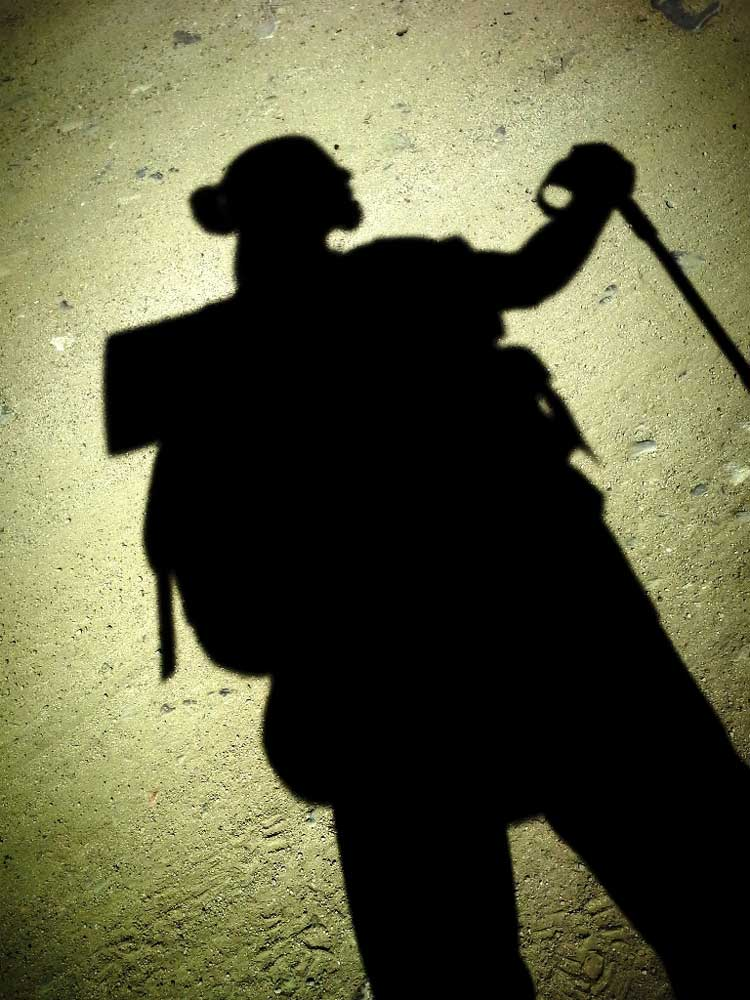

Kahvaltı sonrası 2 km yürüyünce Hasanboğuldu(sütüven) şelalesine vardım. Buralara kadar gelmişken bu güzel yeri görmeden geçmek olmazdı. Tur şirketleri safari jiplerle doğa sever insanları buraya getiriyorlar. Yolda iki jiple karşılaştık ve içindeki insanlarla selamlaştık. Yolda senin gibi veya sana sempatiyle bakan insanlarla selamlaşmak çok sevdiğim ve keyif aldığım şeylerden birisidir. Giriş ücreti ödeyeceğiniz bu yerde piknik yapabilir, dereye içerisindeki masalarda oturabilir, kafeteryadan faydalanabilir veya yöre halkın satmış olduğu çeşitli şarküteri ürünlerini satın alabilirsiniz. Şelaleye giriş fiyatlarını çok hatırlayamıyorum ama araba 8tl, otobüs, 16tl kişi başı 2 tl gibi bir şeydi. Telefonumu şarj etmek bahanesiyle 2 saat kadar oradaki kafede takıldıktan sonra Zeytinliye doğru yola koyuluyorum.

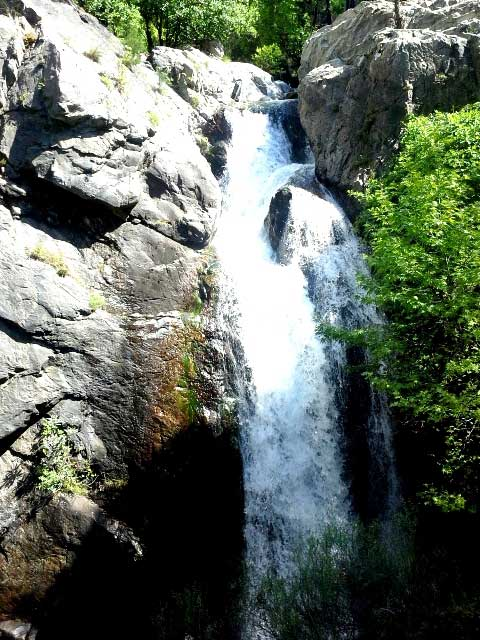

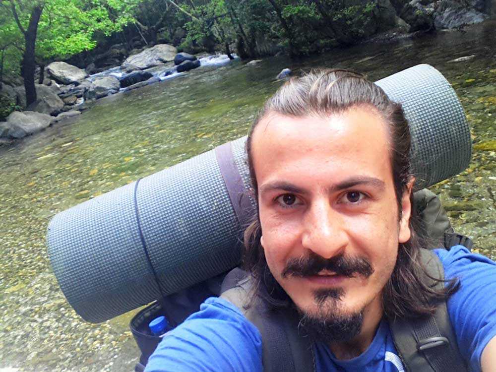

### Güzel Bir Tesadüf

Yolda giderken yanımdan geçen arabalardaki insanların meraklı bakışlarını seviyorum. Derken böyle bir araba yanımdan geçerken bana baştan aşağıya süzerek baktığını gördüm. Hafif gülümseyerek yoluma devam ediyordum ki bir baktım o araç sağda durdu ve üniversiteden arkadaşım Zafer benimle aynı şaşkınlıkta bana doğru geliyor. 

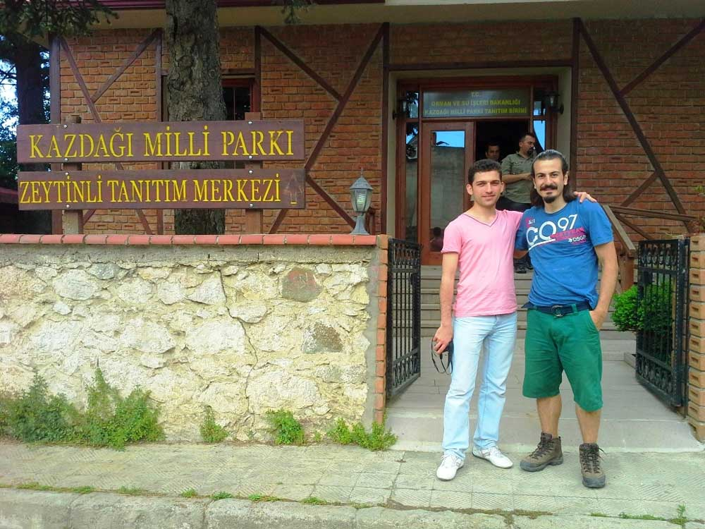

Biraz muhabbetin ardından herkes yoluna devam ediyor. Hedefim o akşam Yaşyer köyüne gidip geceyi bu yüksek tepede güzel manzara eşiliğinde geçirdikten sonra ertesi gün oraları biraz gezip geri dönmek. Ortaoba köyünde bir kahvehanede mola veriyorum. Köylülerle selamlaştıktan sonra bir masaya geçip telefonumu şarj ediyorum. Kahvedekilerle güzel muhabbetin ardından bazen toprak yoldan bazen traktör yolundan ilerleyerek Dereli köyüne yaklaşıyorum. Havanın kararmasına 1 saat gibi bir süre var ve bende artık yoruldum. Derken bir araba yaklaşıyor ve yanımda duruyor. Biraz muhabbetin ardından gece evinin yanında çadır kurabileceğimi söyleyen kişiye Dereli uğradıktan sonra evine gidebileceğimi söyleyip ayrılıyorum. Derken Dereliye girmeden su kenarı üzerine kurulmuş güzel bir restoran görüyorum. Biraz gezinip etrafa bakındıktan sonra çok beğendiğim bu yerin sahibi Ömer abiyle tanışıyoruz. Çadır kurabileceğim yer bakıyorum dediğimde Ömer abi bana restoranının arka tarafında güzel bir yer gösterdi. Telefonumu şarj edip wireless üzerinden interneti de kullanabileceğimi söyleyince benim gözler 4 açıldı :). Dereli köyünde bu güzel restoranı işleten Ömer abi misafirperver, gezgin ruhlu, araştırmacı, çalışkan ve üretken bir insan. Öyle ki restoranında bulunan bir çok şeyi kendi elleriyle yapmış ve şu anda arka bahçede bulunan büyük çam ağaçları üzerine ağaç evler yapmaya başlamış. Akşam Ömer abiyle güzel ve keyifli bir muhabbetin ardından 23:00 gibi ben müsaade isteyip yatmaya geçiyorum.

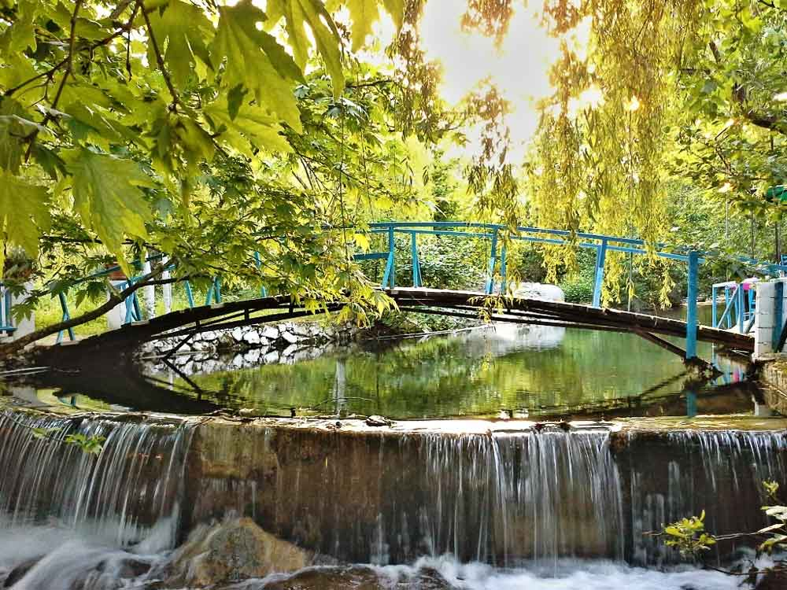

Edremit’ten 7,7km sonra Ömer abinin restoranına ulaşmak için [google yol tarifi için tıklayınız](https://www.google.com/maps/dir/39.594441,27.01635/39.6468298,27.0348537/@39.6205281,26.9942142,11895m/data=!3m2!1e3!4b1!4m4!4m3!1m0!1m0!3e0).

##  **3.Gün- Dönüş Yolu**

Gece su ve kuş sesi eşliğinde yumuşak bir zeminde rahat bir uykunun ardından sabah kalktığımda etrafta kimsecikler kalmamıştı. Ömer abi sabah olmayacaklarını söylemişti, bu yüzden geceden vedalaşmıştık. Kısmet belki bir gün yine bir şekilde bu güzel abimle görüşürüz. Kahvaltının ardından rotam belliydi; Yaşyer köyü. Evet dün oraya varamadım ama bugün oraya gidecektim ve ardından Edremit’e varıp 16:00 otobüsü ile İstanbul’a dönecektim.

### Kapak Oynayan Çocuklar

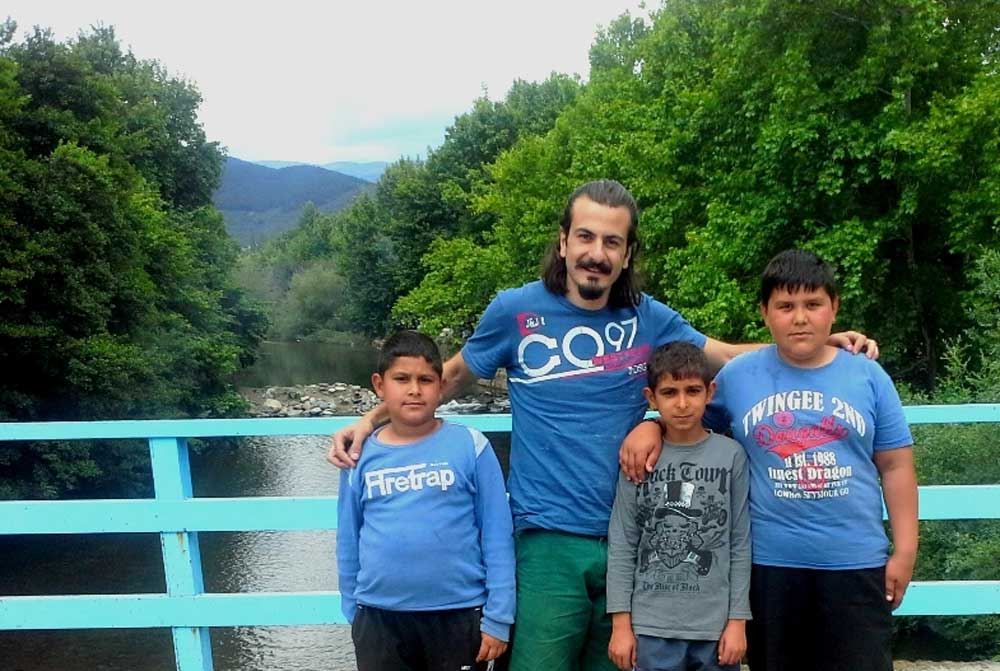

Yolda karşılaştığım çocuklarla muhabbet etmeyi çok seviyorum. Çocukların abi sen dağcı mısın, nerede kalıyorsun, nereden geliyorsun, nereye gidiyorsun, ya yılan seni ısırırsa gibi meraklı sorularına cevap vererek muhabbet ettik. Bazı çocuklar ise arkamdan hello, nice, good diye bağırdıklarını duydum :), Dereli köyünde karşılaştığımız çocuklara neden top oynamıyorsunuz dediğimde abi topumuz yok diyerek elindeki kapakları gösterdi ve bizde kapak oynuyoruz dediklerinde bir an kendi çocukluğumu hatırladım. Hala kapak oynayan çocuklar var demek ki diye düşündüm. Yaklaşık 2-3 km ilerledikten sonra içimde bir pişmanlık hissettim. Keşke oradaki bakkaldan çocuklara bir top alıp hediye etseydim diye düşündüm. Geri dönüp vakit kaybedemezdim çünkü yetişmem gereken bir otobüs vardı. Artık bir sonraki sefere diyerek Yaşyer köyüne doğru yola devam ettim. Özellikle köyde büyüyen çocuklar bana daha sempatik ve sevimli geliyorlar. Bunun nedeni belki de bu çocukların gazoz kapağından başka oyuncakları olmadan bu kapaklarla oynayarak mutlu olmayı bilmeleridir diye düşünüyorum.

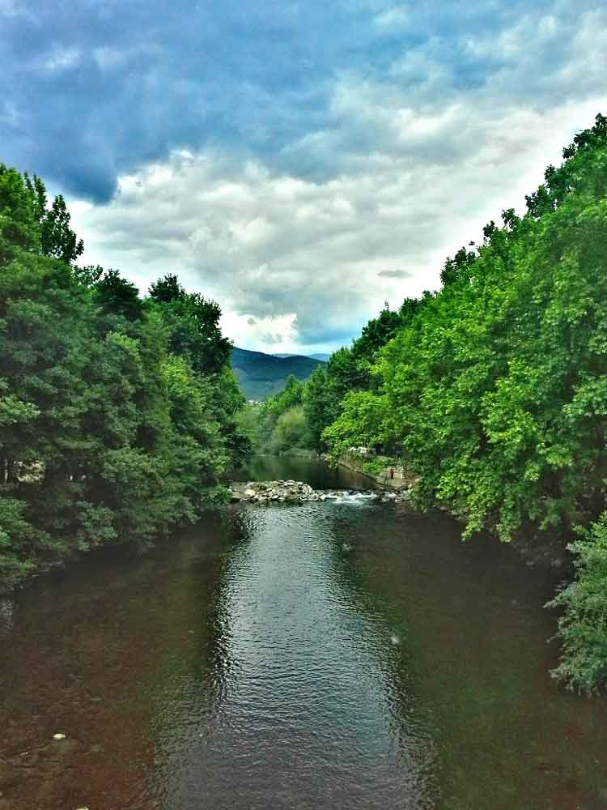

### Yolda Kendiliğinden Giden Hortum

Yaşyer köyüne yaklaşık olarak 3 km mesafem kalmıştı ki yolda kendiliğinden giden kalınca bir su hortumu gördüm. Önce karşıdan birisinin çektiğini düşünerek bayağı bir ilerledim. Ancak virajları dönmeme rağmen hortum benimle birlikte gidiyor. Ne oluyor acaba diye şaşkın şaşkın ilerlerken yol birden düzleşti ve yaklaşık 40 metre önümde hortumu sırtlanıp götürmeye çalışan birini gördüm. İlk başlarda ara sıra durarak gidiyordu. Sonra bende bir el atayım dedim ve benden habersizce hortumu beraber götürmeye başladık. Uzun bir süre devam ettikten sonra öndeki adam birden durup arkaya baktı “Ya bende diyorum neden böyle kolay geliyor” dedi. Bende durma devam et diye seslendim. Yaklaşık 2km böyle devam ettikten sonra yollarımız ayrıldı ve uzaktan selamlaşarak bana teşekkür etti. Kısa bir süre sonra Yaşyer köyündeydim. Kısa bir mola ve dinlenmenin ardından son durağım olan Edremit’e doğru devam etim ve 14:20 gibi Edremit’e ulaştım.

Yaklaşık 3 günde 67km yolu yürüyerek tamamlamış olmanın gururu ve sevincini içimde yaşıyordum. Kendimi görmek amaçlı ilk defa bu kadar uzun bir parkur tamamlamıştım. Aslında bu Eylül ayında planlamış olduğum “21 günde 509km”lik Likya yolu öncesi bir alıştırmaydı. Beni başlangıç noktama bırakan Cem beni Edremit’te tekrar karşıladı. Yol anılarını paylaşıp biraz hoşbeş yaptıktan sonra beni otobüsüme bindirerek İstanbul’a uğurladı.

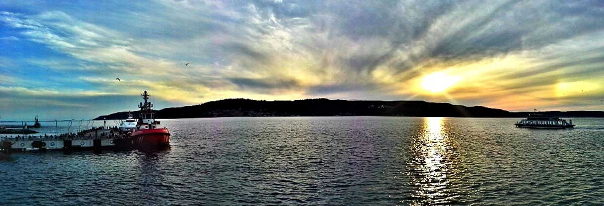

Otobüs ilerledikten 2 saat sonra fark ettim ki Çanakkale üzerinden geri dönüyormuşuz. Bir açıdan iyi oldu bu tarafları görmüş oldum, diğer taraftan yarın sabah 9 da işte olmam gerekiyordu :). Ve gece yani sabah 04:00’da eve ulaşıyorum.

Beni çocukluğuma götüren, yeni dostluklar edindiğim, tanımadığım bir çok insanla muhabbet ettiğim, ormanın derinliklerine daldığım, çok güzel manzaralar izlediğim, Yörükleri gördüğüm keyifli bir yolculuk oldu. Kaz dağları mı, tekrar gider miyim? Neden olmasın :)