**Zorlu Dağ Kaçkarlar**

Ağustos ayı Kaçkar dağlarına gitmek için en güzel zaman. Çünkü hava şartlarının en güzel olduğu ay. Hem yağmurlar azalmış oluyor hem sıcaklık daha da artmış oluyor. Diğer aylarda gitmeyi düşünüyorsanız yağmura her zaman hazırlıklı olun. Ne de olsa Doğu Karadeniz.

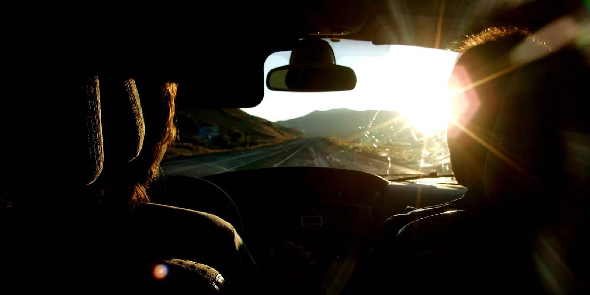

**Plan**

Bizde 16 Ağustos tarihinde Kaçkar dağlarına trekking(doğa yürüşü) turumuzu yapmak için planlamalara başlıyoruz. Rotamız; Erzurum üzerinden Yusufeline doğru geçeceğiz. Ardından Altıparmak(Barhal) köyü üzerinden Olgunlar(Hevek) yaylasına ulaşacağız. Aracımızı burada park edip Naletleme geçidini kullanarak Kaçkar dağlarını aşıp Kavrun yaylası üzerinden Ayder yaylasına kadar ineceğiz. Aynı rota üzerinden geri döneceğiz. Ekip olarak 3 kişiyiz, 2 gece 3 gün kalacağız. Çadırımız, tulumlarımız ve yol boyunca bize yetecek kadar yiyeceğimizi yanımızda götürüyor olacağız. Kaçkarların tepesinde yiyeceksiz kalmak istemeyiz :). Yolumuz üzerinde birçok doğal su kaynağı olduğu için, suyu hiç dert etmiyoruz.

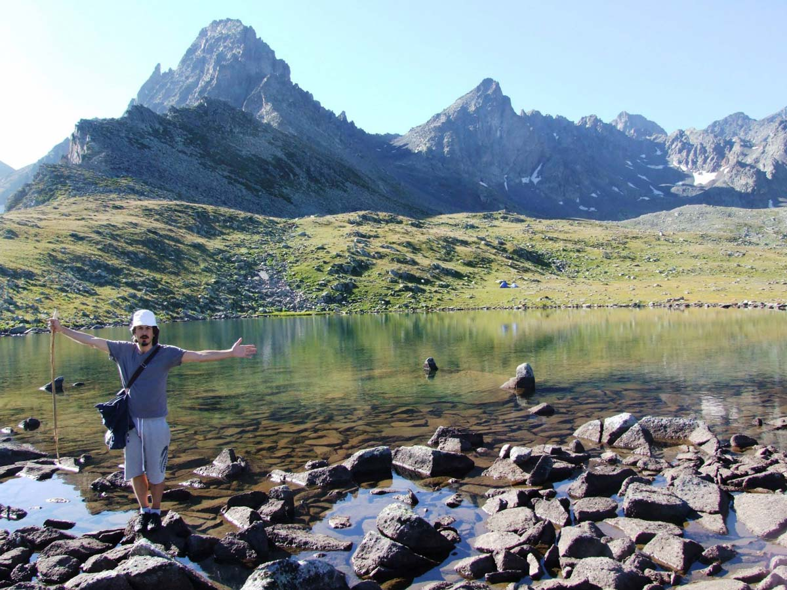

**İLK GÜN**16 Ağustos sabah 6:00’da Erzurum’dan yola çıkıyoruz. Ekip olarak çok heyecanlıyız. Yeni bir macera ve Kaçkarlar bizi bekliyor. Erzurum-Yusufeli arası yol asfalt ve çok rahat. Ancak  Yusufeli sonrasında Altıparmak köyüne yaklaştıkça yol bozuluyor ve virajlar artıyor. Altıparmak-Olgunlar arası ise yol artık çok bozuk. Yaklaşık 25 km olan yolu 1 saatte alıyoruz. Ancak yol keyifli, doğa çok güzel bu yüzden sıkılmıyoruz.

6 saat 30 dk’lık bir yolculuk sonrası artık Olgunlar yaylasındayız ve arabayı park edecek yeri zor buluyoruz. Neden mi? Ramazan bayramını burada insanlar yaylada şenliklerle geçirirlermiş. İnsanların tulum çalıp oynadığını ve kuzu çevirmeler yaptığını görüyoruz. Vaktimiz kısıtlı olduğundan dolayı şenliklere kalamıyoruz.

Olgunlar yaylasından düz yukarı doğru devam ederseniz önce Deniz gölüne ardından Kaçkarların zirvesine varırsınız. Buradan çok sert ve zorlu bir kayalık inişten sonra da Kavrun yaylasına ulaşabilirsiniz. Sırtımızda ağırlıkları yaklaşık 20 kg olan çantalarımızla bu rotayı zorlamak istemiyoruz. [İlgili rotaya ulaşmak için tıklayınız.](http://tr.wikiloc.com/wikiloc/view.do?id=2137109) Ek bilgi olarak Olgunlar yaylasında konaklamak için pansiyonlar bulunmakta.

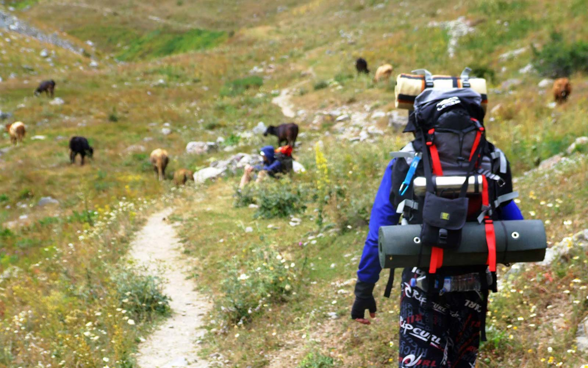

**Yola Koyulma Vakti**

Saat 12:30 ve biz Olgunlar yaylasının sağ tarafından ayrılan vadinin içine girerek Naletleme geçidine doğru yol alıyoruz. Aslında bu yolculuğa başlamak için geç kaldık. Ancak İlk gün Dibe yaylasını geçerek Naletleme geçidine ulaşacağız ardından 14 km’lik mesafeyi tamamlayıp Karadeniz gölünün yanına kamp kurmayı hedefliyoruz. Naletleme geçidinin girişinden çıkarak başlayan ve devamında diğer sularla buluşan dereyi solumuza alıyoruz ve patikayı takip ederek yukarı doğru  ilerliyoruz. Bu patika sizi doğruca Naletleme geçidine götürüyor.

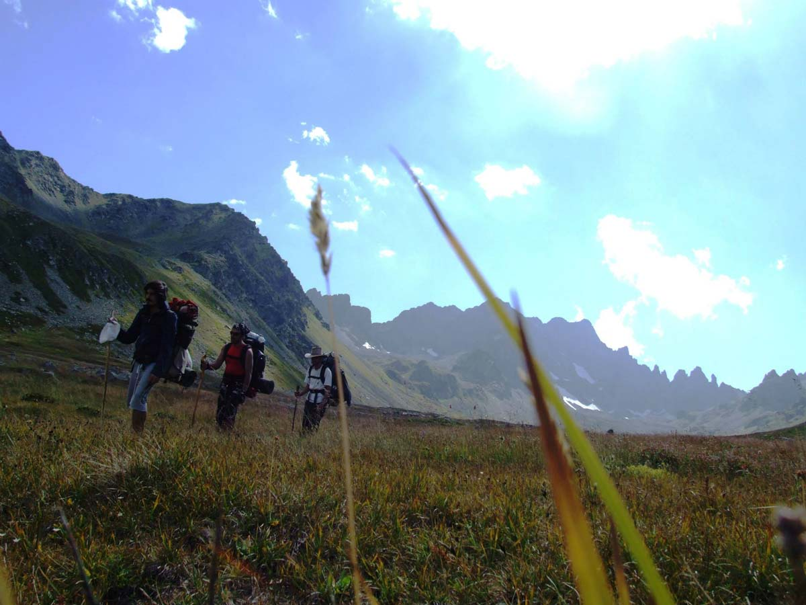

Biraz daha yürüdükten sonra vadi sola doğru dönüyor. Ve birde ne görelim, zirve karşımızda. Heyecanımız iyice artıyor. Mesafe daha çok ama manzara bir harika.  Patikayı takip ettikçe gittikce yükseldiğimizi fark ettik. Geçide çok yaklaştığımız bir yerde etrafımızda bir anda bir sürü kelebek uçuştu. Hepsi farklı renklerde ve yüzlercesi etrafımızda uçuyor. Yol boyunca kelebek görmüştük ancak hiç bu kadar kelebeğin arasına düşmemiştik. Zaten Yusufeli Dünya da kelebek çeşitliliğinin en fazla olduğu yerlerden birisidir.

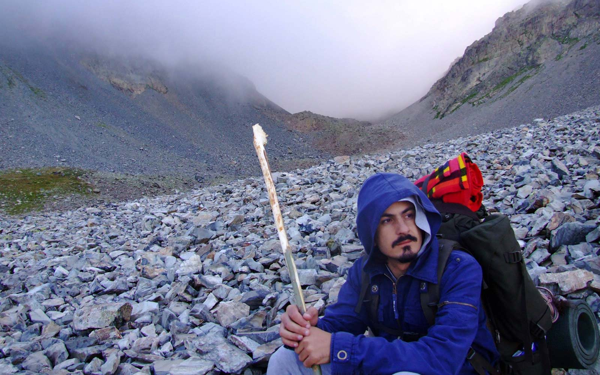

**Naletleme Geçidi ve Suyun İlk Çıktığı Yer**

Ve nihayet geçide geldik. Patikayı takip ettiğiniz sürece burada yolunuzu kaybetmezsiniz. Eşsiz bir görüntüyle karşılaşıyoruz. Geçitten bulutlar geçiyor. Çok gizemli ve merak uyandırıcı. Çünkü ilerisinde neler olduğunu bilmiyorsunuz. Geçidin içerisine girdikçe görüş mesafesi 10 metreye kadar düşüyor. 10 metre iyi bir mesafe gibi gözükse de burada taşlardan başka bir şey göremiyorsunuz. Her yer taşlık ve hava iyice soğudu. Üzerimize daha kalın bir şeyler alıyoruz. Patikayı kaybetmemek için insanlar üst üste taşlar dizmişler. Bu işimizi çok kolaylaştırıyor. Aksi halde yönümüzü kesinlikle kaybedebilirdik. Bu geçit de Ağustos ayında bile kar görebilirsiniz.

Havanın kararmasına yaklaşık 1 saat kaldı. Geçidin büyük bir kısmını aştık ancak bu seferde sis var. Sisten ötürü fenerlerimizi kullanmaya başladık. Artık çok yorgunuz bir an önce Karadeniz gölünün kenarında çadırlarımızı kurmak istiyoruz. Patika bizi bir türlü göle çıkarmıyor. Sisten dolayı nereye gittiğimizi de tam olarak seçemiyoruz. Çadır kurmak için hiç düzlük alan yok. Gps’den bakıyoruz göle yakın bir yerdeyiz ancak her yer taşlık ve kayalık olduğundan nasıl ulaşacağımızı bilmiyoruz. Ve artık hava karardı ve enerjimiz tükeniyor. Bu en son isteyeceğimiz şey. Telefonlar zaten çekmiyor. Bir şekilde ilerlemek zorundayız. Sis iyice etkisini artırdı ve yürüyüş yolunu kaybeder gibi oluyoruz. Bizim için en kötü senaryo gerçekleşmeye başlıyor. Aslında hataydık. Çünkü bir gece öncesini uykusuz geçirmiştik ve yürüyüşe geç başlamıştık. Siz siz olun böyle çok fazla insanın geçmediği bir yerde bu kadar riske girmeyin. Derken küçük bir düzlük bulduk ve hemen çadırımızı oraya kurarak geceyi orada geçirdik. Çok yorgunduk moral ve motivasyonumuz düşmüştü. Göllere yakın bir yerdeydik ama tam olarak nerede olduğumuzu kestiremiyorduk. Yemekten sonra hemen uykuya geçtik.

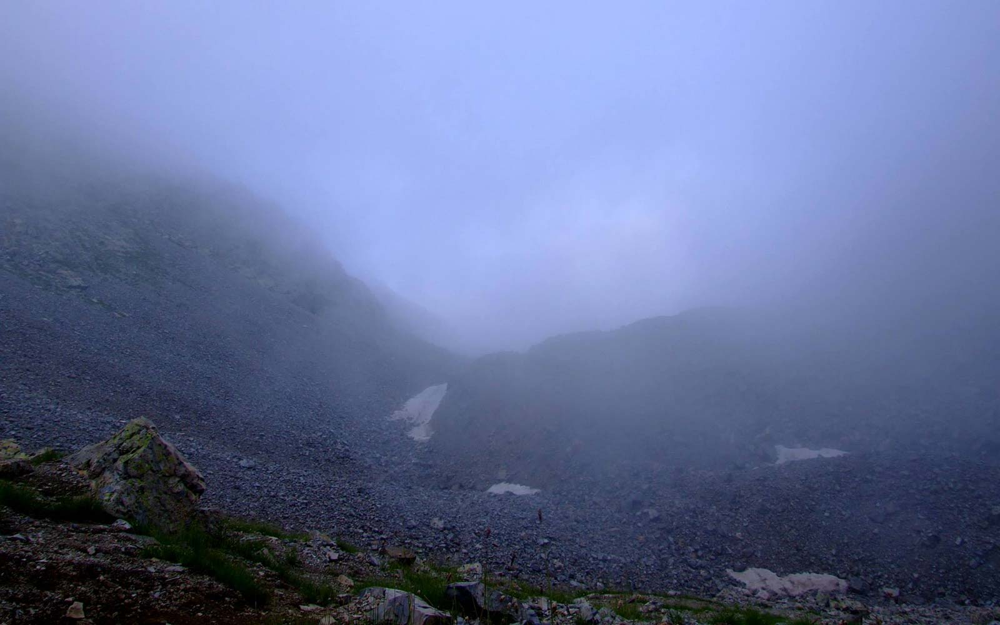

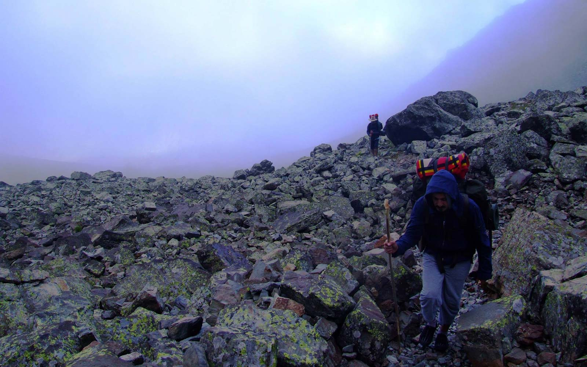

**İKİNCİ GÜN**

**Karadeniz Gölü**

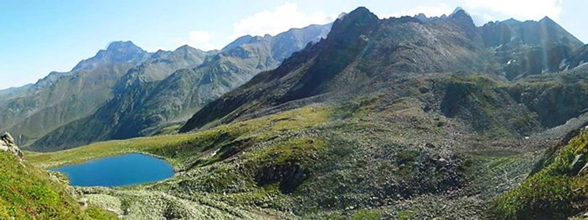

Ve işte o an. Çadırdan bir çıktığımda gölün hemen yakınlarına kadar geldiğimizi gördüm. Aslında sisten ötürü bir şey görememiştik. Havanın güneşli olması, uykumuzu almış olmamız ve nerede olduğumuzu bilmenin mutluluğuyla tüm enerji ve heyecanımız geri geldi. Artık geçidi aşmıştık. Göllerdeydik ve yaklaşık 5 km sonra Kavrun yaylasında olacaktık. Ardından oradaki minibüsleri kullanarak Ayder’e inecektik. Çadırımızı ve diğer eşyalarımızı burada bırakmaya karar verdik. Eğer hava kararmadan dönebilirsek yine geceyi burada geçirecektik.

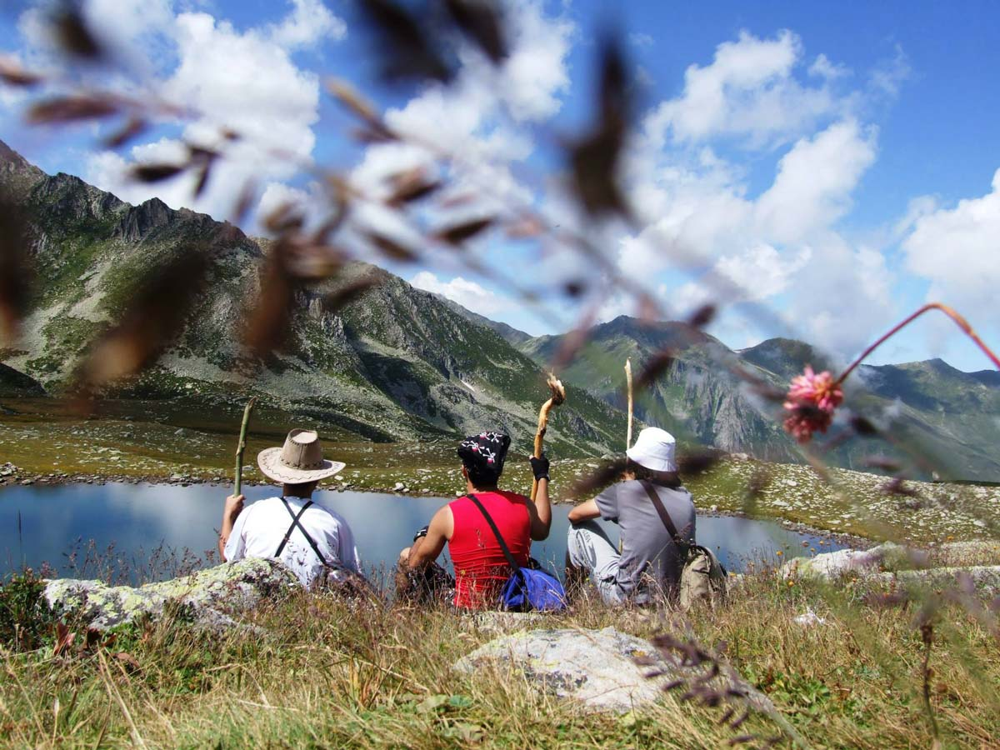

**Yukarı Kavrun Yaylasına Giderken Manzara Çok Güzel**

Göllerden Yukarı Kavrun yaylasına inerken bir çok insanla karşılaştık. Göllere doğru yürüyüş yapan ayrı ayrı gruplarla. Kavrun yaylasından kalklan ilk seferle Ayder yaylasına indik.

Ayder artık fazlaca turistlik bir yer haline gelmiş. Buna rağmen doğal güzelliğini koruyor. Bayram olması nedeniyle insan akınına uğramıştı. Gece olmadan çadıra varamayacağımızı anladık. Hava karardıktan sonra da yürümek çok riski olacağından bir pansiyonda kalmaya karar verdik. Üstelik ertesi gün geçidi tekrar geçeceğimizden dolayı geceyi iyice dinlenerek geçirmeyi istiyorduk. Ancak Ayder’deki pansiyonlar dolmuştu. Boş olan yerlere de çok uçuk fiyatlar isteniyordu. Daha sonra bize yardımcı olmaya çalışan minibüs şoförü Yukarı Kavrun yaylasında bize pansiyon ayarladı ve geceyi orada geçirdik.

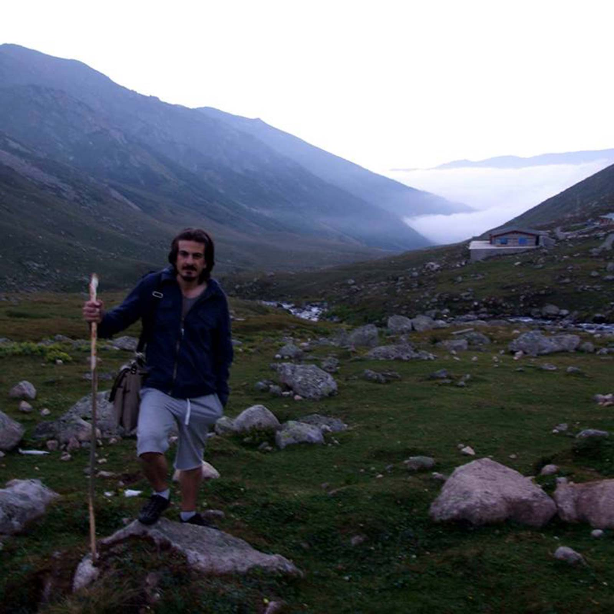

**SON GÜN**

Ertesi sabah erkenden yola koyulduk. Önce çadırı bıraktığımız yere vardık. Eşyalarınızı toplayıp geçide doğru yürümeye başladık. Güneşli bir havada daha keyifli ve enerjik olduğumuz bir yürüyüşün ardından Olgunlar yaylasındaki arabamızı bıraktığımız yere vardık. Geldiğimizde tıklım tıklım olan yaylada kimsecikler kalmamıştı. Yaklaşık 6 saatlik yolun ardından sağ salim Erzurum’a dönüyoruz.

Sakın unutmayın; bir maceranın en güzel anı kazasız, belasız tamamlayıp eve dönmektir.

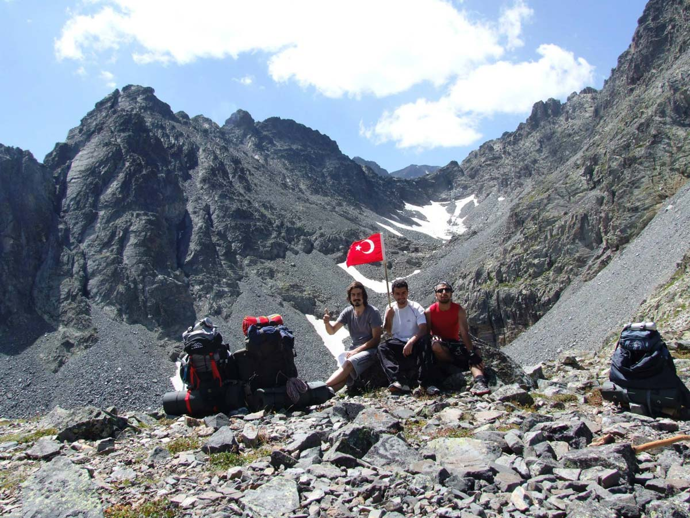

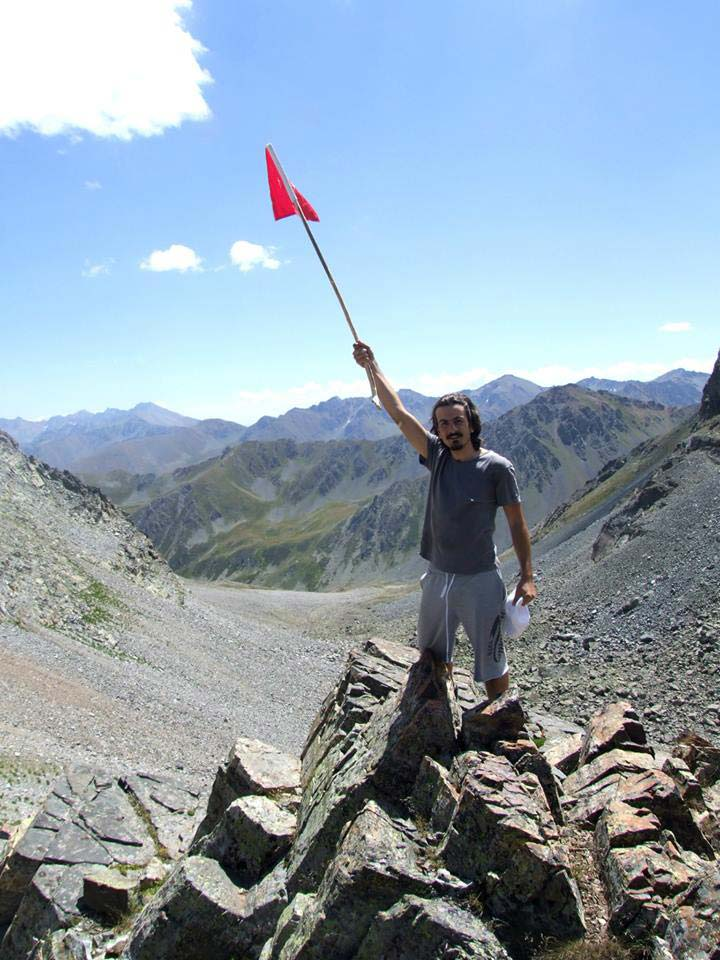

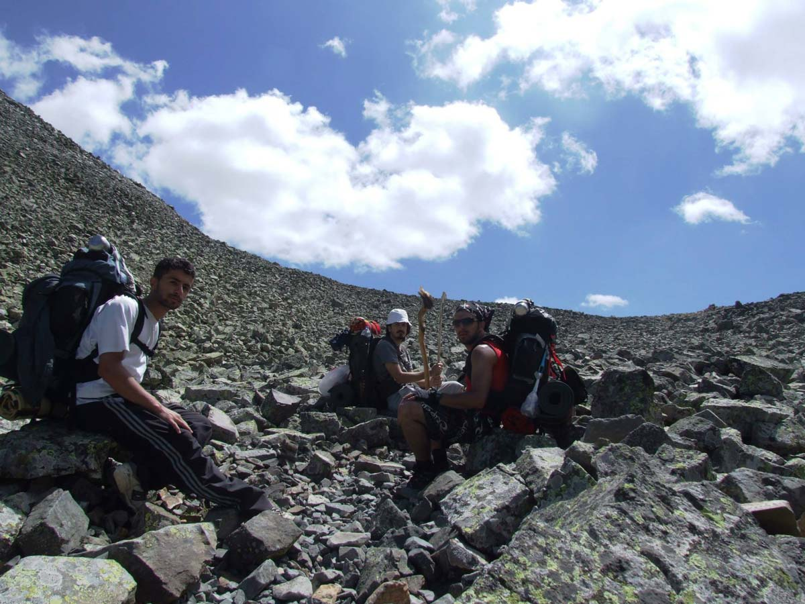

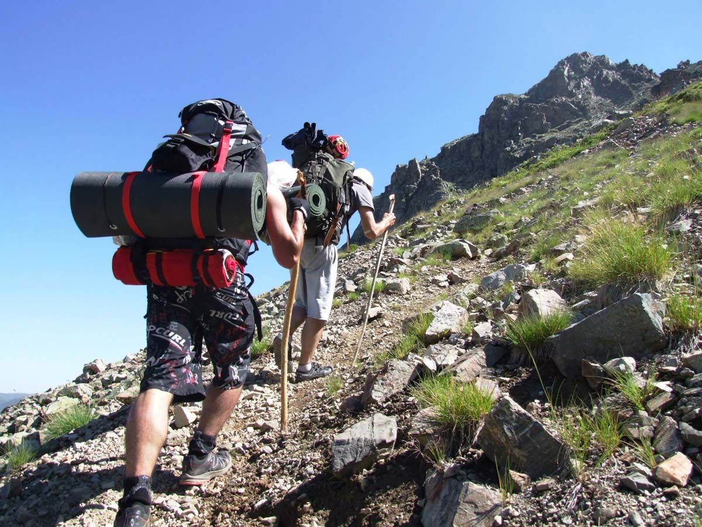

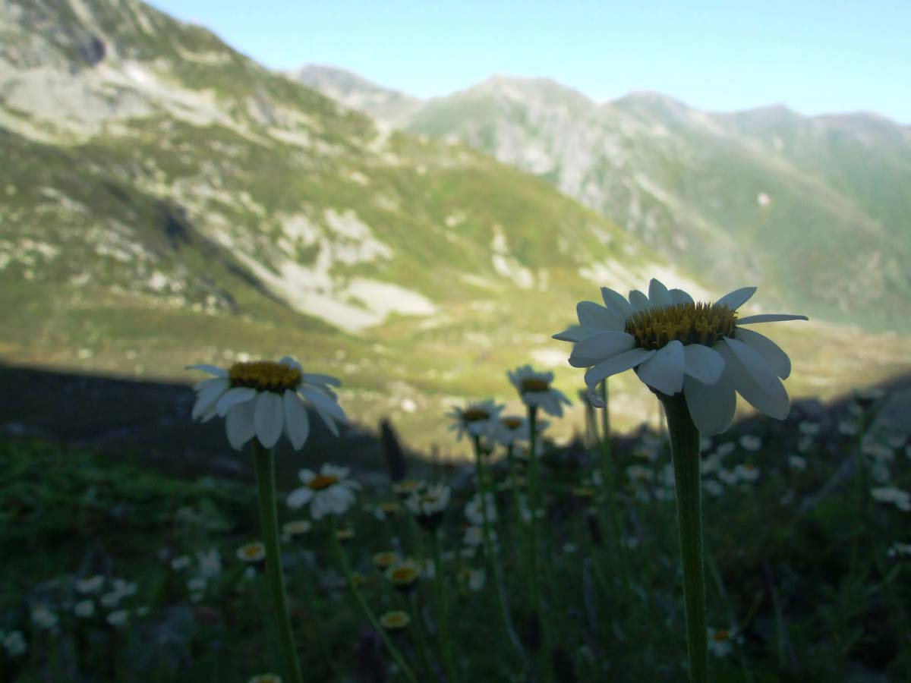

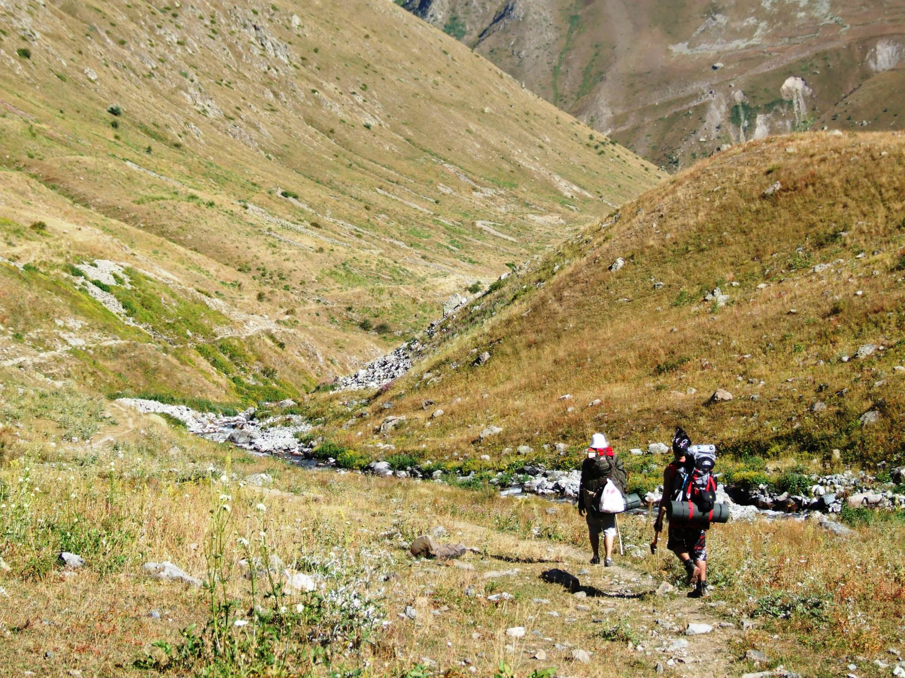