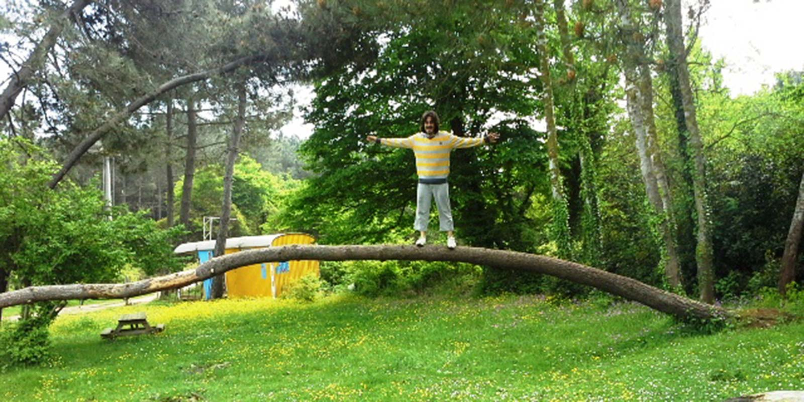
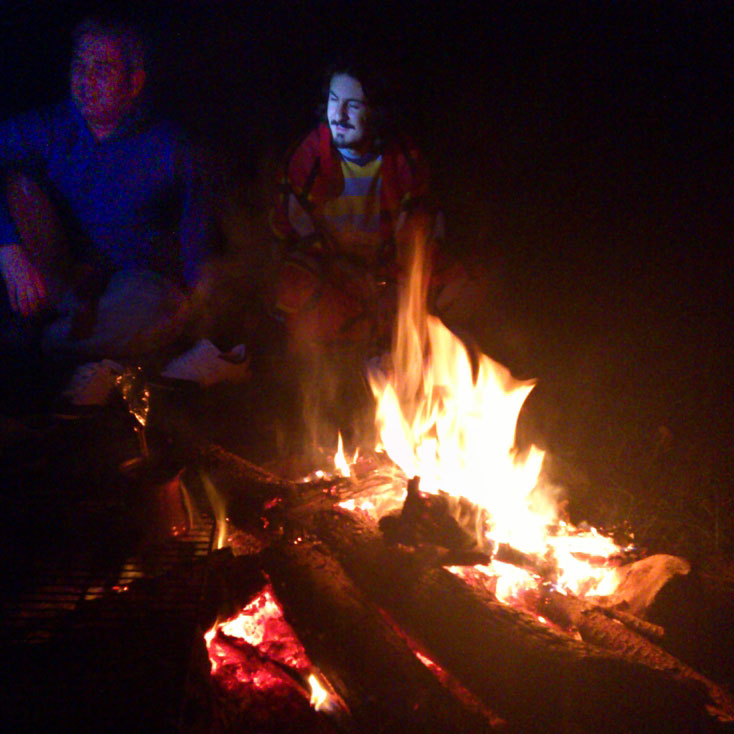
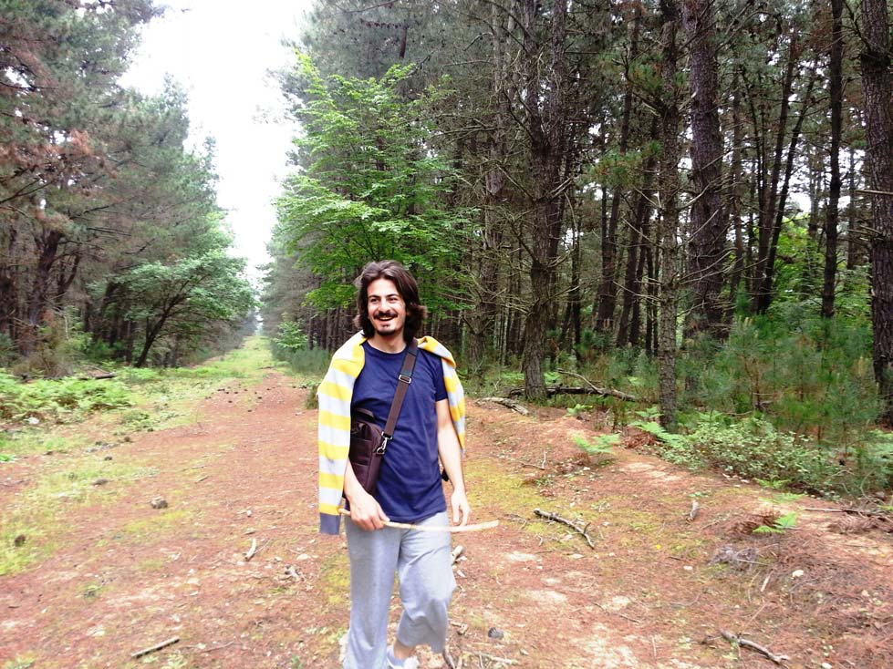

2012 yılı anlamlandıramadığım şekilde yoğun olduğum ve sürekli kampa gitmeye niyetlenip ama bir türlü gidemediğimiz bir yıl olmuştu. 2013 de bunun patlamasını yaşayacağım ta o zamandan belliydi :)

**Plan**

Aylardan Mart ve ben kamp için plan yapmaya ve araştırmalara başlıyorum. Bir an önce havaların ısınmasını ve kamplara başlamayı çok arzuluyorum. Bu yüzden araştırmalarımı daha keyifli yapıyorum. Daha önce hiç gitmediğim ama giden bir kaç kişiden duyduğum yer hakkında biraz daha araştırma yapınca 2013 başlangıcı için ideal bir yer olacağını düşündüm. Hem İstanbul’a yakın, hem denize sahili var, hem balık tutabileceğimiz kayalıklar var ve hem de yürüyüş yapabileceğimiz ormanı mevcut. Evet hedef [KERPE](http://goo.gl/maps/Sreqv)…

**4 Mayıs Cumartesi**

Yılın ilk kampı için heyecanımız çok fazla ve ekipte ilk defa kamp yapacak kişilerin vermiş olduğu enerji ile de bir an önce yola çıkmak istiyoruz ve sabah erkenden İstanbul’dan Kerpe’ye doğru yola çıktık. Yaklaşık 2 saat sonra kamp alanında olmayı hedefliyorduk. Kamp alanı için kesinleştirdiğimiz bir yer yoktu. İnternetten yaptığım araştırmalar sonucunda Kerpe’de kamp yerleri olduğunu, eğer buralar doluysa veya kapalıysa orman içerisinde bir yere kamp kurabileceğimizi öğrendim. Bu bilgi zaten bizim için yeterliydi. [İstanbul-Kocaeli-Kandıra-Babaköy-Kerpe](http://goo.gl/maps/7PR4j) güzergahını takip ederek Kerpe’ye ulaştık. Babaköy-Kerpe arası yol yapımı vardı. Bu yüzden Babaköy’den sola doğru Sarısu deresinin yanından sahile giden yolu takip ederek Kerpe’ye vardık. Bu yolu kullanmasaydık bu güzelim [kamp yerimizi ](http://goo.gl/maps/b0hgn)belki de hiç görmeyecektik. Aynı zamanda [Babadağ Yürüyüş Parkuru](http://goo.gl/maps/M2uGY)nun da başlangıç noktasını hiç görmeyecektik.

Kerpe’ye varmadan bulduğumuz kamp yeri için önce pazarlık yaptık. 3 araba için 1 gece kamp 1 günde piknik şeklinde 90 tl fiyat aldık. Piknik ve kamp alanı olan bu yerde temiz su ve tuvalet(fazla temizlik beklemeyin) bulunuyordu. Yaklaşık 10 kişi için kabul edilebilir bir ücretti. Kerpe’yi gezdikten sonra gelip yerleşmeye karar verdik. Kerpe’ye geldiğimizde , gelmeden önce telefonda konuştuğum kamp yerini gördük. Kapalıydı. Onlara geleceğiz dememiştik ama henüz sezonu açmamışlardı. Zaten etrafta bizden başka kamp yapanda yoktu. Kerpe Karadeniz’e güzel bir koyu olan küçük şirin bir yer. Her türlü ihtiyacınızı karşılayabileceğiniz yerler mevcut. Deniz, hiç Karadeniz’e benzemiyordu. Koy oluşundan ötürü denizde hiç dalga yoktu. Eksiklerimizi tamamlayıp kamp yerimize geri dönüyoruz. Önce yerleşiyoruz ardından akşam havanın serin olacağını düşünerek odun toplamaya başlıyoruz. Arkamızdaki orman sağolsun bize yakacak sıkıntısı çektirmiyor :).

Akşam ateşimizi iyice harlıyoruz. 4 Mayıs ama hava soğuk. Üstelik sis çöktü. Muhabbetimiz güzel, keyifler yerinde derken jandarma geliyor. Korkulacak birşey yok rutin kontrollerini yapıyorlarmış. Gece 1 gibi yatmaya karar veriyoruz. Aslında balık tutmayı planlıyorduk ama tutamayacak kadar yorgunuz. O sırada etraftan çakal sesleri geliyor. Kimsenin panik olmaması için bu bilgiyi kendime saklıyorum ve köpek onlar rahat olun birşey olmaz diyorum :), gerçekten de olmadı.

**5 Mayıs Pazar**

Sabah erkenciyiz. Kahvaltımızı yapıyoruz ardından Babadağ yürüyüş parkuruna doğru yola çıkıyoruz. Orman için olan bu parkurda yanımızda su ve yiyeceğimiz olmadığı için yaklaşık olarak 5-6 kmlik bir yürüyüş ile uzatmadan yolun yarısından geri dönüyoruz. Parkur üzerinde içme suyu göremedik. Belki de vardı biz bilemedik. Ama çok güzel bir orman içerisinden Babadağ’a doğru çıkıyorsunuz. Keyifli ve huzur verici. Yürüyüşü tamamladıktan sonra sahil kenarındaki kayalıklarda biraz dolaşıyoruz ve ardından kamp yerine çadırlarımızı bıraktığımız yere geri dönüyoruz. Tabi ayrılmadan görevliye çadırlarımıza göz kulak olmasını söylemiştik. Geri geldiğimizde bir sorun yoktu sadece bir kaç günübirlikçi gelmişti. Bizde İstanbul’a dönecek olduğumuzdan 15:00 civarı dönüş yoluna koyuluyoruz. Geldiğimiz yolu takip ederek geri dönüyoruz.

2013 için güzel, keyifli, enerjik bir başlangıç yapmıştık. Daha bu kampı bitirmeden geri dönüş yolunda yeni kamp yerlerinin hayalini kuruyorduk. Yazın çok kalabalık olan ve bir çok günübirlikçinin akın ettiği Kerpe’ye en uygun zamanda gitmiştik.