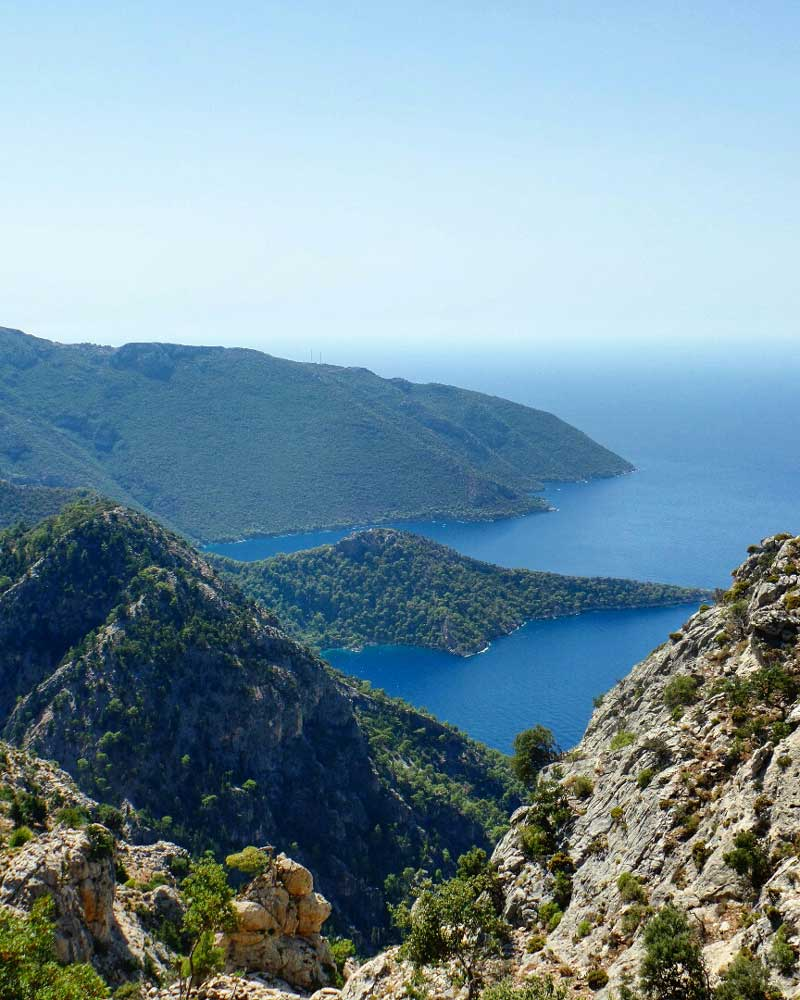
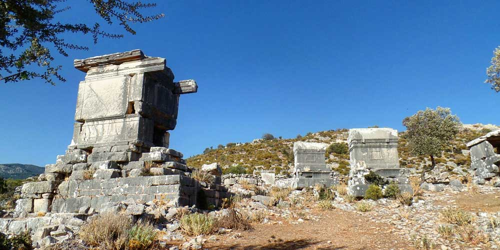

### Kabak Koyu -> Alınca -> Sidyma Antik Kenti(23km) - **21 Eylül 2014**

Dün gece Kabak koyunda samanyolunu izlerken uyuyakalmışım. Bir ara yıldız da kaymıştı. Rahat bir uykunun ardından 8 gibi tekrar yola koyuldum. Sabahları 6 gibi kalkarım diyordum ama 6 da kalkmak çok saçma olacakmış. Çünkü hava 7 de aydınlanıyor. Kabak koyundan Alınca’ya 8kmlik dik bir çıkış var burası beni biraz yordu. Yokuş çıktıkça evimi, sevdiklerimi özlüyorum, bir duygusallık ağır basıyor. Yol düzleşince eski odun halime geri dönüyorum. Bu dik yokuşta perişan oldum valla. Yokuşu çıkarken İsveçli 50’li yaşlarda bir çiftle karşılaştım. Onlar Antalya’dan yola çıkmışlar ve bir aydır yürüyorlarmış. Bitirmelerine 2 gün var ve benim ise ilk günüm. Onlar bitiriyordu ben ise daha yeni başlıyordum. Belki bana da kısmet olur o günleri görmek. Adamlar akıllı, ufak bir çanta almışlar yanlarına pansiyonlarda kalarak parkuru yürüyorlar. Tabi birazda para meselesi. Likya yolundaki bir çok pansiyonun fiyatı oldukça yüksek. Sanki 5 yıldızlı otelde kalıyorsunuz ama yapacak bir şey yok. Ya çadır ya da para. Yokuş bir an bitmeyecek sandım. 3.5 saat sürdü ve bir ara bıktırmıştı ki tepeye çıkıp manzarayı görünce mutluluk patlaması yaşadım. Biraz daha ilerledikten sonra bir karşılaştığım ilk evde kahvaltımı yaptım. Buranın köylüleri bile işi ticarete dökmüş. Neyse ya ben güzel bir köy kahvaltısı yaptım ve yola koyuldum. O kadar yemişim ki daha da bir şey yiyemedim. Tek öğün yemek ve 1-2 paket bisküvi bana yetiyor. 2 gündür kendimle baş başa yürü yürü bıkmıştım. Bir müzik açtım ve biraz ilerledikten sonra Yediburunlar’ın güzel manzarasını görünce oynamaya başladım. Yolda inişe geçince parkuru bitirmiş gibi bir sevinçliydim.

## **SİDYMA ANTİK KENT**

Sidyma’ya doğru giderken Romanya’dan gelmiş bir çiftle karşılaştık(buraya çift geliniyor galiba). Onlarda aşağıdaki sahile inmişler sonra pansiyona geçiyorlarmış. Aşağısı dediğim yer ile aramdaki yükselti benim Kabak koyundan çıktığım yere eşdeğer yükseklikte. Kendilerini taktir ettim doğrusu. Benden onlara 100 puan. Boğaziçi köyüne varıp çocuklarla muhabbet ettikten sonra Sidyma’ya doğru işaretleri takip ettim. Buradaki işaretler biraz zayıf kalmış veya ben renk körü olduğum için biraz zorlandım(kırmızı ile yeşil bende karışıyor). Bu yüzden 2 kez haritaya baktım. Ve sonunda Sidyma antik kentine ulaştım. Burada kalıntıların fotoğraflarını çeken birisiyle karşılaştık ve ben direk hi diye seslendim. Merhaba cevabı gelince şaşırdım. Adam Türk çıktı. Yolda ilk rastladığım Türk. Yani gezintiye çıkan. İlhan abi Fethiye’de yaşayan ve antik kentleri çok seven birisi. Birlikte Sidyma’yı gezdik ve bana kalıntıları anlattı. Likya; Roma ve Bizans döneminden kalmış. Lahitler oldukça enteresandı. Koca taş kütlelerini nasıl oymuşlar hayret. Gerçi onlarda bizim yazdığımız kodları(yazılımcılar anlar) görselerdi şaşırırlardı :)

Antik kentin hemen yanındaki köyde bir teyze ile konuştuk. Arka bahçesinde çadır kurabileceğimi söyledi. Rahatsızlık vermemek için önce reddettim ama sonra kabul ettim. Ne yapayım ısrar etti. Yine de evlerden biraz uzağa çadır attım.Yerleştikten sonra su ve elektrik ihtiyacı için hemen camiye koştum. Namaza da git namaza. Hep elektriğin, suyun peşindesin birader. İmam hemşehrim çıktı. Haşim abiyle biraz sohbet ettik. Evinin bahçesinde çay ve ikramlarından sonra çadırıma geçtim. Yolda güzel bir insanla daha tanışmış oldum. Kısmet belki bir gün Haşim abiyle yine karşılaşırız.

Bir sevdiğiniz varsa yolda zırt pırt aklınıza gelip duruyor. Sonra insan duygusala bağlıyor. Duygusal şeyler de insanı doğa da güçsüz bırakır. Bunu iyi anla dostum. Doğa da duygusallığa yer yok. Hayatta kalmak için odun olmalısın :). Peki…

O zaman yine iyi geceler.

Saat: 22:30

Ek bilgi; Bu notlar yolculuk sırasında yazılmıştır.