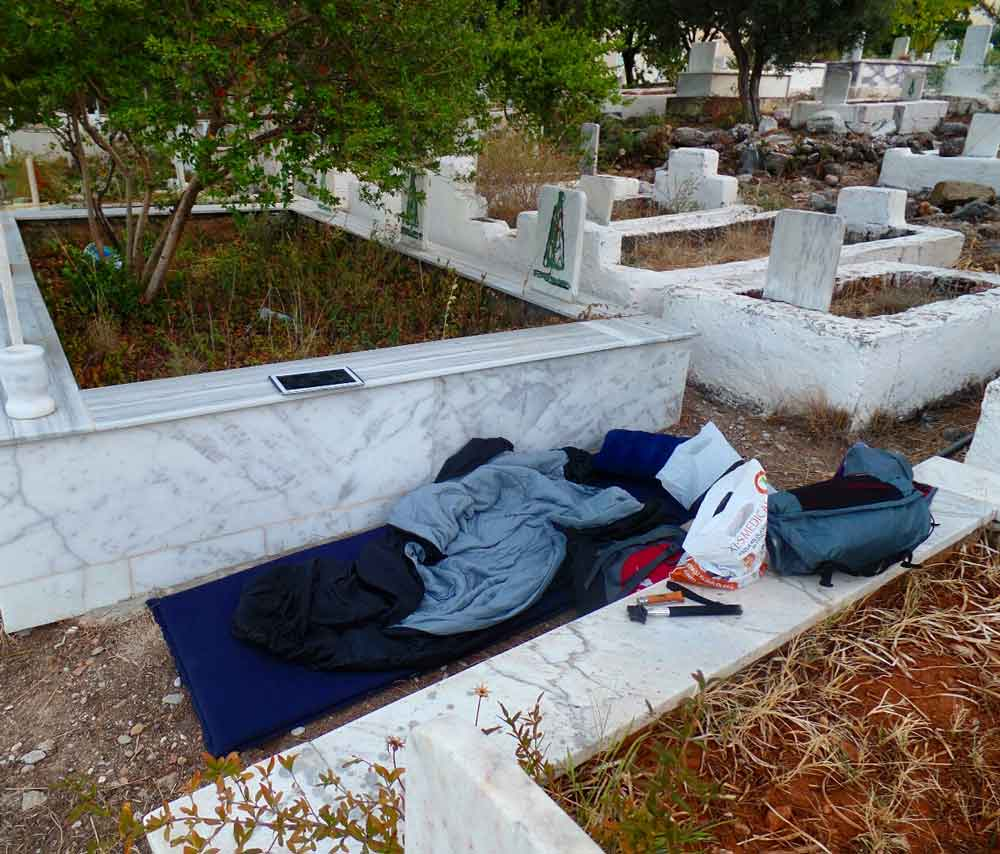
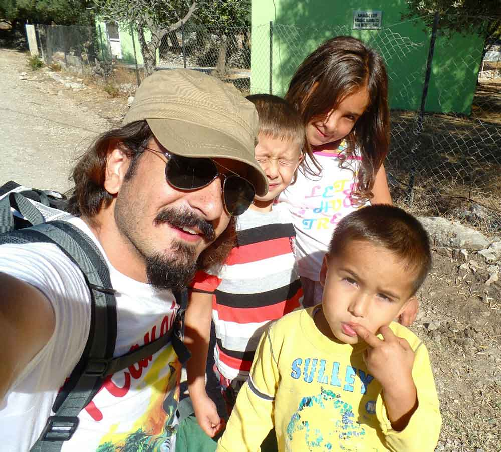

Bu 20 Eylül 2014 günlüğü, Likya Yolu yürüyüşümün Ölüdeniz’den Kabak Koyu’na uzanan 25 km’lik ilk etabında yaşadıklarımı kaydediyor.

## 2014 yürüyüş günlüğü: hızlı bilgiler

> **Editoryal bağlam:** Bu sayfadaki günlük notları 2014 yürüyüşü sırasında yazıldı; aşağıdaki bilgiler dönemin etap kaydını özetler.

- **Gün:** 1
- **Tarih:** 20 Eylül 2014
- **Etap:** Ölüdeniz – Kabak Koyu
- **Mesafe:** 25 km

### Likya Yolu günlük navigasyonu

- [11 günlük yürüyüş dizini: Ölüdeniz – Kaleüçağız parkuru](/likya-yolu-11-gunde-yurudugum-parkur/)
- [Ana rota: Likya Yolu'nun 11 etaplık rota rehberi](/likya-yolu-rotasi/)
- [Pratik etap rehberi: Ölüdeniz – Kabak Koyu yürüyüşü](/likya-yolu-rotasi-oludenizden-kabak-koyuna/)
- [Sonraki gün: 2. gün Kabak Koyu – Sidyma Antik Kenti günlüğü](/likya-yolu-2.-gun/)

### **LİKYA YOLU 1.GÜN (20 EYLÜL 2014)**

Ölüdeniz -> Faralya -> Kelebekler Vadisi -> Kabak Koyu(25km)

### **MEZARLIKTA BAŞLAYAN MACERA**

Bir önceki gece az uyumuştum ve Dalaman’a inişim ise 23:15 civarı oldu. Havaş’ın Fethiye’ye giden aracı doldu ve sadece ben dışarıda kaldım. Bir sonraki aracı beklerken 30dklık kayıp ile Fethiye’ye 12 gibi ulaştım. Ölüdeniz’e giden vasıta ararken bu saate araba olmadığını öğrendim. Çok yorgun olduğumdan otostopla uğraşmadım ve Fethiye dışına kadar yürüyüp çadır kurmaya karar verdim. 45 dk kadar güzel yürüdüm ama ayakta uyuyacak kadar yorgun olduğumdan bir an önce uyumayı hayal ediyordum. Sağımda gördüğüm yeşillik alan mezarlık çıktı. Arka taraflarına bakınca geniş boş alanlar gördüm. Gecenin bir yarısı kimse buraya girmez hem de macera olacaksa böyle olsun diyerek mezarlıkta kamp yapmaya karar verdim. Mezarlık mı? Evet doğru duydunuz . Kalabileceğim en güvenli yer. İçeri girdim arka taraflara yöneldim. Bir an evvel çadır kurmaya çalıştım ama zemin çok sertti ve kazıklar eğiliyordu. Kazıkları çakamazsam çadır ayakta durmuyordu ve ben ayakta uyuyacak düzeydeydim. Başlarım çadırına diyerek şişme matımı ve uyku tulumumu çıkarıp 2 mezar arasına kıvrılarak uyumaya karar verdim. Çok rahat bir uyku olmadı ama en azından güvenli bir yerdeydim. Hava sıcaklığı da üşütmeyecek düzeydeydi. Uykuya geçtiğimde gece 2 olmuştu. Ziyaretçi olarak kedi veya köpek beklerken bana domuz gelmişti. Ayak seslerine uyandım ve kafamı kaldırdığımda aramızda sadece 2 mezar vardı. Şşşşşişşşştttt diye seslendim korkup kaçtı hayvan. Ufak bir şeydi zaten. Sonra artık bir an önce sabah olsun diye uykuya daldım.

Geçen yıl yine bu zamanlar bende azıtan yüksek tansiyon 3 gün önce tekrar başgöstermişti. 3 gündür hafif baş dönmesi ve rahatsızlık hissediyordum. Ama bugün diğer günlere göre daha iyi geçti. Zaten öyle olmasaydı devam etmezdim. Sabah toparlandıktan sonra minibüsle Ölüdeniz’e ulaştım ardından kendimi Likya parkurunun başlangıç noktasına attım. Babadağ’ı tırmanarak yürüyüşe başladım. Yükselti çok fazla değildi bu yüzden çok yorulmamıştım ancak bir an aklıma kalan 500km gelince, 21 günde böyle nasıl olacak diye düşünmeye başladım. Bu düşüncelere çok dalmadan manzarayı izle koçum diyerek dikkatimi dağıttım. İlk karşılaştığım insanlar bir aile oldu. Aslında karşılaşmadık ben onları uzaktan gördüm. Puset gibi bir şey sırtına takmış el kadar veledi yanlarına almış ailecek yürüyüş yapıyorlardı. Büyük ihtimalle Türk değillerdi. İlk muhabbet ettiğim kişiler ise yine çocuklar oldu. Ben Antalya’ya onlar ise Züheyla’ya oyun oynamaya gidiyorlardı. Çocuklarla muhabbet etmek bana iyi gelmişti. Seviyorum veletleri. Masum, saf ve temiz oluyorlar. Gülücüklerinin ardında mutluluk var. Sonra birkaç turistle karşılaştım ve muhteşem ingilizcemle muhabbet ettik. En azından anlaştık :).

Kelebekler vadisine inmeye karar verdiğimde tansiyonum yine sapıtmıştı. Başına buyruk takılıyordu. Dik yeri indim biraz ilerledim ama sonra geri dönme kararı aldım. Çünkü in çık zaman kaybı olacaktı hem de biraz uyku problemimin vardı. Faralya’daki camiye daldım ve 1 saat uyku çektim. Telefonumu da şarj ettim. Bir de soğuk su sebili koymuşlardı ki oh daha ne isteyeyim. Bu uyku iyi geldi ve sonrasında 5 gibi Kabak koyuna vardım. İlk gün hedefimi tutturmuştum. Önce bir denize girip yıkandım sonra çadır kurmak için biraz orman içerisinde ilerledim. Yılın bu zamanı hava tahminimden sıcak çıktı. Bu yüzden denize girmek iyi geldi.

## **KABAK KOYUNDA BEKÇİ BOZUNTUSU** 

Sote bir yere çadırı kurdum notlarımı yazıyorum ki bir de göreyim 2 kişi bana doğru geliyor. Uzaktan fenerimin ışığını görmüş olsalar gerek. Kendini tanıtan bekçi ve yanındaki delikanlı çadır kurmak yasak, tabelaları görmedin mi dedi. Likya yolunu yürüyorum gördüğünüz gibi ateş yakmadım ve öyle bir hazırlığımda yok. Notlarımı yazıyorum ardından uyuyacağım ve sabah erkenden yürüyüşüme devam edeceğim ve neye göre yasak, hangi kanuna göre bana açıklar mısınız şeklinde tepki verince bekçi şaşırdı. Benden böyle bir tepki beklemiyordu sanırım. Biraz yumuşadı ve ya işte orman işletme yasak koymuş, istersen arayayım gelsinler onlarla konuş, sonra bana laf ediyorlar çadırını toplayıp gelip sahilde uyuyabilirsin, hem sahilde yatan başkaları da var dedi. Çadır kurmak yasak ama uyumak serbestmiş. O zaman çadırımı toplayacağım ve tam bu noktada uyku tulumunda uyuyacağım dedim. Adam iyicene şaşırdı. Gel sahilde uyu, sonra bana kızıyorlar falan yaptı. Daha fazla uğraşmamak ve keyfimi kaçırmamak için peki dedim. Toparlanıp Kabak kumsalına geçtim. Bana fark etmez mezarlıkta yatmış adamım ama bekçinin tavırları hoş değil. Üstelik yasal olarakta bir yaptırım yok. Oradaki işletmecilerin yapmış olduğu bir uygulama. Neyse ya fena da olmadı. Niye mi? Çünkü samanyolunu izleyerek uyuyacaktım. Evet gece Kabak koyunda gökyüzü bir harika gözüküyor.

Hadi o zaman iyi geceler..

Saat: 20:03

Ek bilgi; Bu notlar yolculuk sırasında yazılmıştır.

---

## Yürüyüşe devam et

**[Sonraki gün: 2. gün Kabak Koyu–Sidyma Antik Kenti günlüğü →](/likya-yolu-2.-gun/)**

[11 günlük yürüyüş dizinine dön](/likya-yolu-11-gunde-yurudugum-parkur/)
