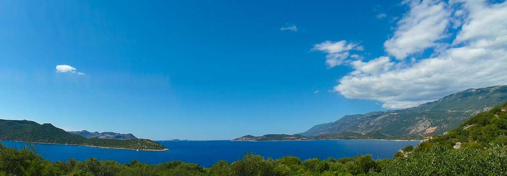
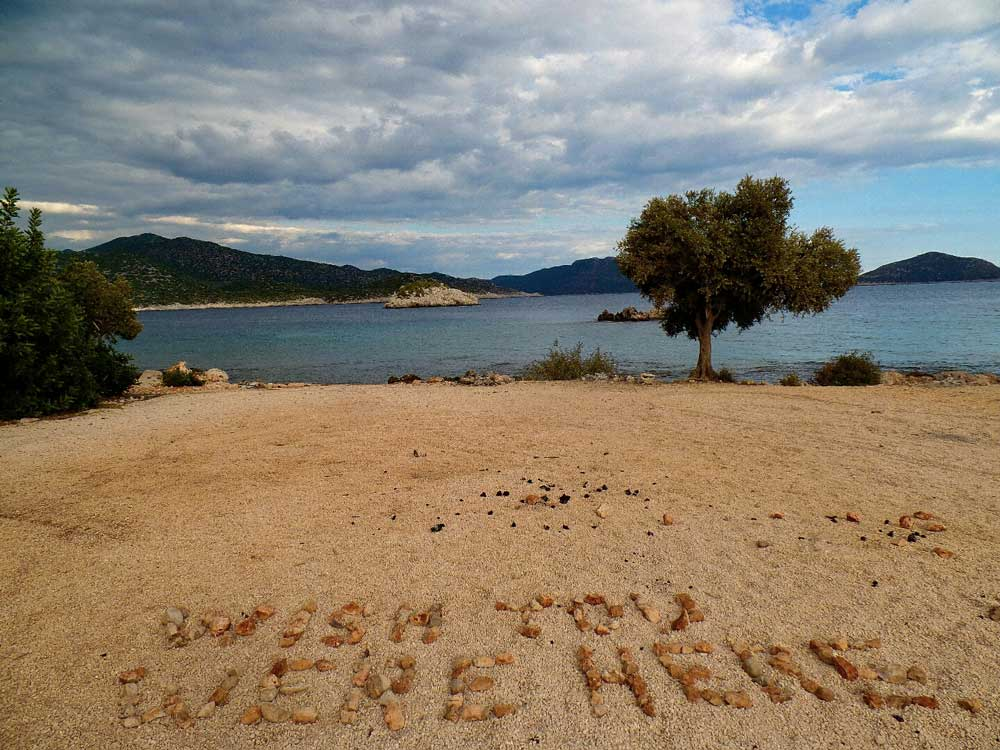

### Kaş -> Limanağzı -> Körmen Adası(13km) - 29 Eylül 2014

Sabah yine erken uyandım. Erken dediğim 7 gibi oluyor. Sanki 5’de kalkmışımda. Bizimkilere telefonsuz gideceğimi söyledim. Neyse ki çok bir şey söylemediler. Gerçi deselerde bir şeyin değişmeyeceğini benim burnumun dikine gideceğimi biliyorlardı. Ayşegül’ün güzel kahvaltısının ardından öğlen gibi yola koyulmaya karar verdim. Muammer abi evde olmadığından vedalaşamadık. Özel olarak teşekkürlerimi ileteceğim. Çok iyi bir insan ve misafirperver. Burada bir gece geçirmek resmen beni toparladı. Yıkandım, temizlendim ve karnım doydu. Daha ne isteyeyim ki :). Şimdi doğaya karışma zamanı.

Bugün taa Üçağız’a kadar giderim diyordum ama yola geç çıkınca Körmen adası civarında kalmaya karar verdim. Yolda 3 Alman dedeyle karşılaştık. Yaşlarına rağmen oldukça iyi görünüyorlardı. Hatta öyle ki ben kamp için çadır kurmaya başladığımda onlar yola devam ediyorlardı. Saat 5 gibi çadır kurma işlemlerini bitirdim. Yaklaşık 12-13km geldim ama artık günlerin yorgunluğu olsa gerek müthiş yorgunum. Finike’ye kadar gideceğimi sanmıyorum. Büyük ihtimalle Demre’de bırakırım. Bu arada iyi ki Olaf’ı dinlemişim ve yanıma 3lt su almışım. Çünkü yolda su yok, köy yok. Sadece Ufakdere diye bir yer 1.5litrelik suya 4tl verdim. Oha ya. Neyse ki adam iyi biriydi de içtiğim çayın parasını almadı :).

Körmen adası karşısında su olan düzlük bir yere çadırımı kurdum. Müthiş yorgunum, biraz kestireyim sonra kalkarım.

Ek bilgi; Bu notlar yolculuk sırasında yazılmıştır.