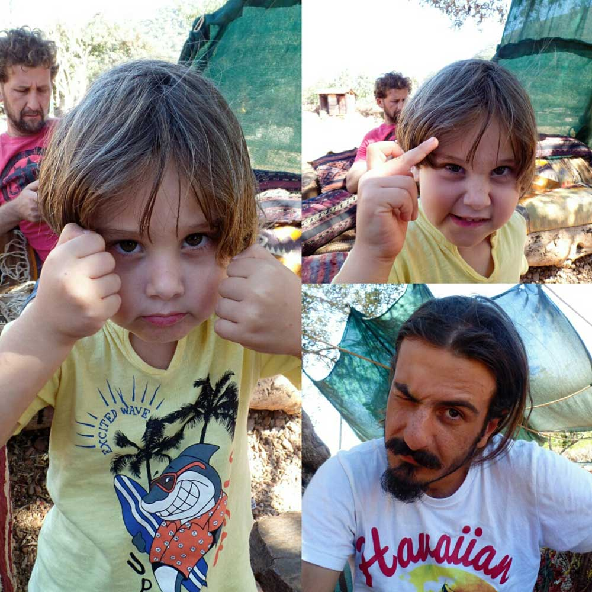
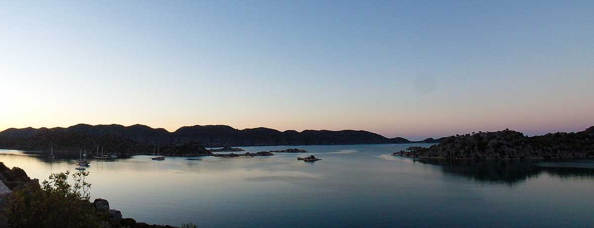
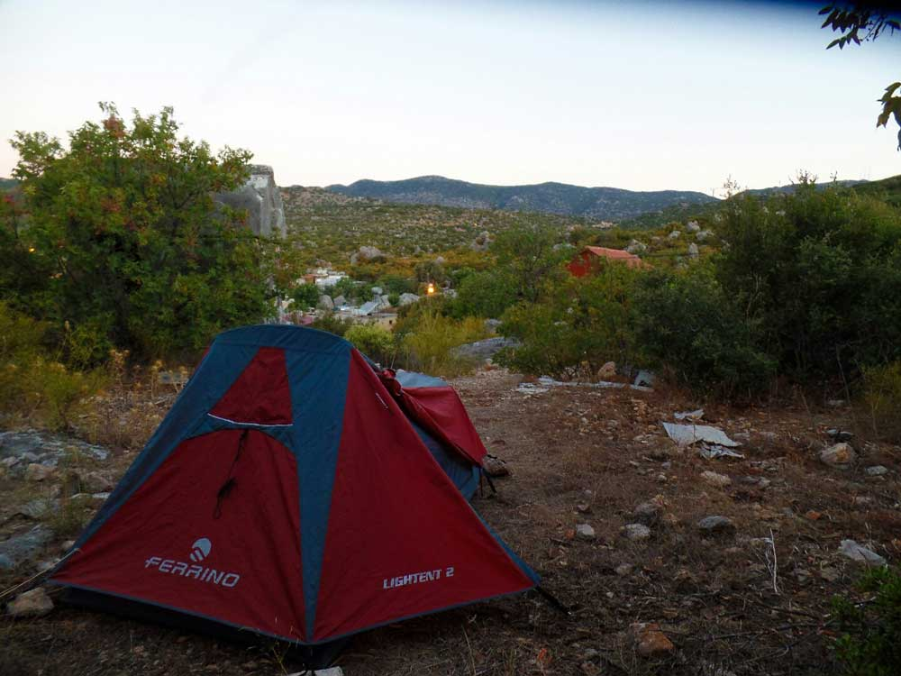

Bu 30 Eylül 2014 günlüğü, Körmen Adası’ndan Boğazcık ve Aperlai üzerinden Kaleüçağız’a yürüdüğüm 23 km’lik son Likya Yolu gününü anlatıyor.

## 2014 yürüyüş günlüğü: hızlı bilgiler

> **Editoryal bağlam:** Bu sayfadaki günlük notları 2014 yürüyüşü sırasında yazıldı; aşağıdaki bilgiler dönemin etap kaydını özetler.

- **Gün:** 11
- **Tarih:** 30 Eylül 2014
- **Etap:** Körmen Adası – Kaleüçağız
- **Mesafe:** 23 km

### Likya Yolu günlük navigasyonu

- [Önceki gün: 10. gün Kaş – Körmen Adası günlüğü](/likya-yolu-10.-gun/)
- [11 günlük yürüyüş dizini: Ölüdeniz – Kaleüçağız parkuru](/likya-yolu-11-gunde-yurudugum-parkur/)
- [Ana rota: Likya Yolu'nun 11 etaplık rota rehberi](/likya-yolu-rotasi/)
- [Pratik etap rehberi: Körmen Adası – Kaleüçağız yürüyüşü](/likya-yolu-rotasi-kormen-adasindan-kaleucagiza/)

### Körmen Adası -> Boğazcık -> Aperlai -> Kaleüçağız(23km) - 30 Eylül 2014

Körmen adasının karşısında olan bu yeri hiç unutmayacağım. Lanet kara sinekler her tarafımı ısırdı. Sabah hiç vakit kaybetmeden toparlanıp yola koyuldum. Öyle ki kahvaltıyı bile yolda yaparım dedim. Bu arada Ayşegül iyi ki bana yolluk yapmış. Bir sürü yok yapma zahmet etme falan demiştim. İyiki yapmış yoksa açlıktan ölürdüm.

Yolda giderken Ufakdere’de gördüğüm Alman çift ile tekrar karşılaştık. Selamlaştıktan sonra ben yola devam ettim. Bir yere geldiğimde rotadan çıktığımı fark ettim. Derken biraz üst tarafta 3 kişiyi gördüm. Muhtemelen bunlar doğru rotada gidiyorlardır diyerek hızlıca yanlarına çıktım ve Hi diye seslendim. Gelen cevap Merhaba olunca dumur oldum. Yürüyen 3 Türk. Aman Allah’ım bu gerçek mi :). Onlarda Kaş-Finike arasını yürüyelim demişler. Ama şu an onlarda kaybolmuş durumdalar. Birlikte işaretleri ararken avcılara denk geldik ve doğru yolu öğrendik ve parkuru bulup yola devam ettik. Boğaziçi köyündeki molada ayrıldık. Ben daha tempolu gittiğim için önden devam ettim. Bu arada Alman çift bizi yakalamıştı ve tekrar selamlaştık. İlk karşılaştığımızda bana hiç yürüyen Türk görmedik demişlerdi. Ben de onlara bakın yürüyen 3 Türk buldum diye hava attım. Ahahah bendeki de nasıl bir eziklikse artık. Ne yapayım yollarda Türklerden çok Almanları görmüştüm.

Sonra ben yine tempomu bozmamak için önden devam ettim. Artiste bak temposunu bozmamak içinmiş. İyi halt yedin. Çünkü 2.kez parkuru kaybettim ve kendimi en yakın köye götürerek yola ulaştım. Birilerine rotayı sordum ve tekrar yolu bulup Aperlai denen antik kente ulaştım. Ohoo bir de ne göreyim 3 Alman dede burada ve Alman çift de yemeklerini yemiş yola koyulacaklar. Tekrar selamlaştık, vedalaştık. Bunun hep böyle sürüp gideceği hissinden dolayı sizinle yine görüşeceğiz dedim :)

Burada hem dinlendim hem de bir şeyler yedim. Sonra yola koyuldum. Bu arada Almanlar hep birlikte Kaleüçağız’a gitmek için tekne ayarlamışlar. Tekneyle geçtikten sonra oradan yürüyerek devam edeceklermiş. Bir Fransız çift de benden yarım saat önce yola düştü. Her nasıl olduysa onlarla tekrar karşılaştık. Nasıl mı? Şöyle: Yine ben, muhteşemim ya, gönül gözümle rotayı görüyorum ya, hay salak adam ya 3.kez bir insan aynı günde nasıl kaybolur? Üstelik son kayboluşumda saçma sapan bir yere geldim. Yanıltıcı bir işaretin etkisi de vardı. Patikayı ararken koca sırt çantamla kayalıkların üstün atlayarak oradan oraya zıplıyorum ve derken ayağım kayıp kolumun üzerine koca kayaya çarparak düştüm. Düşerken kolumun halini görünce ya dirsek yerinden çıktı ya da kırıldı diye düşündüm. Ayağa kalktığımda hiç bir şey yoktu. Acı var tabi ama kolumu kırmamış olmam çok büyük bir şans. Bu noktada bana verilen ilahi mesajı alıyorum ve yürüyüşü bitirme kararı alıyorum. Fiziksel yorgunluk dinlenerek geçer ancak psikolojik yorgunluk daha beter edebilir. Yürüyüşü bitirdim ohh mis. Değil tabi, önce bu saçma sapan yerden çıkmam gerekiyor. Yakınlarda hiç işaret yok. Daha fazla debelenmeyip geri dönme kararı alıyorum. Yolun yarısında bu Fransız çift ile tekrar karşılaşıyoruz. İşaret var mı diyorum, yok cevabı geliyor. Onlarda benimle aynı hatayı yapmışlar. Gps var mı diyorum yine yok cevabı geliyor. Hadi bende yok sizde niye yok arkadaş ya. Ulen siz benden de beter çıktınız derken yanlarında Likya yolu haritası varmış. Ona bakıyoruz ve yolun çok daha geriden yukarı bir yere saptığını gördüm. Ardından geri dönüp parkuru bulduk ve selamlaşıp ayrıldık.

Yorgunluktan ölüyorum, bir yerimi kırmadığım için çok şanslıyım. Psikolojik olarak da çok yoruldum. Demre’ye kadar giderim diyordum ama bugün yaşadığım olaylardan sonra artık sana verilen ilahi mesajı almalısın İbrahim diyorum ve geri dönüyorum. Devam edecek olursam bir sonraki sefere büyük ihtimalle ipsiz bungee jumping yapıyor olacağım. Düşünsene 30 yıl sonra bunun okuyunca o zaman ipsiz bungee jumping yok muymuş diyeceğiz :)

Bugün yolu bitirme kararı aldım. Çünkü çok yoruldum. Artık gitmiyor. Ayaklarım istese de beynim istemiyor. Bugün bir hayalin sonuna geldik. Başarılamamış bir hayal. Olum len 21 gün dayansam bile bu performansla bitişi göremezdim. Daha iyi bir performans içinde insan olmamak lazım.

Şu an Kaleüçağız’da antik kentte bir lahitin yanına çadırımı kurdum ve son cümlelerimi yazıyorum. Mezarlıkta başlayan macera mezarlıkta bitti :)

Saat 20:00

Ek bilgi; Bu notlar yolculuk sırasında yazılmıştır.

---

## Yürüyüşün tamamına dön

**[11 günlük Ölüdeniz–Kaleüçağız parkurunu ve tüm günlükleri gör →](/likya-yolu-11-gunde-yurudugum-parkur/)**

[Likya Yolu ana rota rehberine dön](/likya-yolu-rotasi/)
