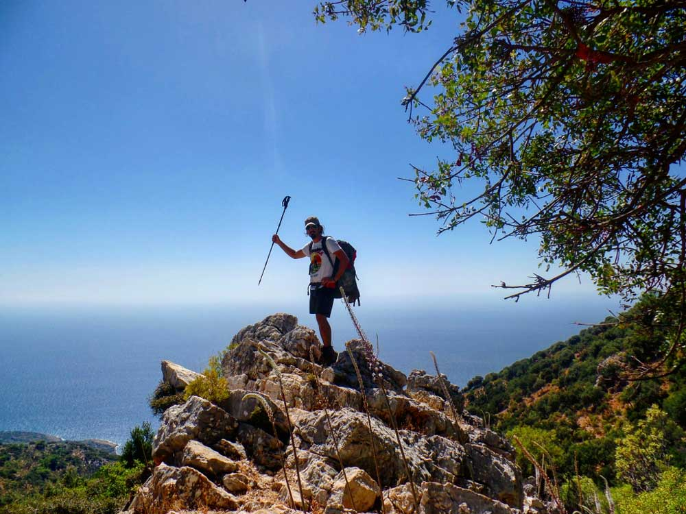
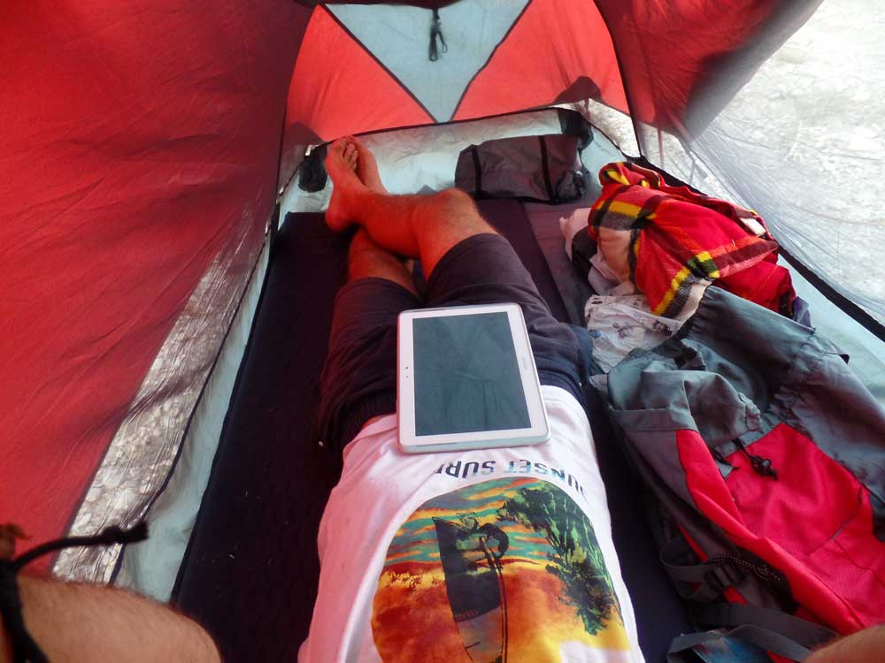

### Sidyma -> Gavurağalı -> Karadere(17km) - **22 Eylül 2014**

Aslında bugün 4.gün. Dün çok yorgun olduğumdan bugün yazmaya karar verdim.

## **SİDYMA’YA VEDA**

Sabah 8 gibi tekrar yollara düştüm. Tam Sidyma’dan ayrılacakken Haşim abi ile karşılaştık. Karşılaşmamız iyi oldu çünkü dün akşam o kadar sohbet ve ikramlarından sonra hem tekrar teşekkür etmiş oldum hem de beraber fotoğraf çekildik. Ardından Bel – Yediburunlar’a doğru giden Likya yoluna devam ettim. Parkurdaki işaretler kırmızı ve beyaz boya ile yapılmış. Renk körü olduğumdan dolayı işaretleri seçmekte zorlanıyorum. Bu kadar yeşilin arasında kırmızıyı görmem zor oluyor. Taşların üzerinde de bir sürü beyaz lekeler var. Bu yüzden çok zorluyor beni. Patika da ilerlerken bir ara yine işaretleri kaybettim. Sonra sarı-kırmızı işaretleri gördüm. Bunlar Almanlar’ın işaretlediği ayrı bir parkur. Baktım görmesi daha kolay hemen bunları takip etmeye başladım. Ne de olsa aynı yere çıkar düşüncesiyle giderken o işaretleri de kaybettim. Haydaa. Sıkıntı yok. Hemen haritadan parkurun nereden devam ettiğine baktım. Epey bir sapmışım. Geri dönmek hiç cazip gelmedi. Şuradan orman içindeki yamaçtan giderim ben diyerek ne kadar büyük bir hata yaptığımı bilmeden devam ettim. İlk çıkış iyiydi. Çünkü orman çok sık değildi. Sonra sıklaşan orman içerisinde yol bulmak pek de mümkün olmadı. Üstelik her taraf dikenli çalılarla dolu. 2 saatte burayı zor çıktım. Her tarafım çizikler içinde sızlıyor. 1-2 yerim kanıyor. Bir şekilde çalılardan sıyrılıp tam düze çıktım kurtuldum derken arı kovanlarının arasında kaldım. Arıcılar kovanları açmış bir şeyler yapıyor. Beni görünce hemen uzaklaş buradan diye hareket yaptılar ki o esnada sağ kaşımın üzerinden bir arı beni öptü. Hayda sanki ben onlara ne yaptım. Kendimi kenara zor attım. Verdikleri alerji ilacını içtim. Arının iğnesi saplı kalmıştı onu çıkardım. Sonra başımda hafif bir ağrı ve şişlik ile yola devam ettim. Rotadan çıkarak gereksiz yere kendimi yordum. Oradan çıkmaya çalışırken kendimi sakatlayabilirdim de. En önemli kurallardan birini ihlal ettim. Yuh bana.

## **GAVURAĞALI İNİŞİ**

Gavurağalı’ya inişe doğru geçtiğimde çok dik bir yere geldim. Kayalık ve dik olan bu yamacı inmek çok yordu. Burayı inerken yine canımdan bezdim. Az daha gaza gelsem Likya yolunu yarıda bırakabilirdim. 2 kez aşağı doğru kayıp giderken kendimi zor durdurdum. Bildiğin aşağıya uçuyordum. Atlattığım en ciddi tehlikeydi. Bu noktada yorulduğumu ve kendimle inatlaştığımı fark ettim. Bu yüzden 1 saatlik mola verdim. Dağın başında saçma sapan bir yerde pipomu içtim. Sonradan öğrendiğime göre Gavurağalı’ya inen bu patika parkurun en zor kısımlarından biriymiş. Neyse sağ salim atlattım. Düzlüğe çıktığımda yerde yatan bir adam gördüm.

## **TURİST AVCISI**

Yerde yatan kişi Ali abi ve kendisi turist avcısı. Pusuya yatmış avını bekliyor. Her gün burada yatıp gelenleri Karadere’deki işletmesine(restoran+pansiyon) yönlendiriyormuş. Karadere’de Özlen restoranı bul, orada çadır kurabilirsin. Bende biraz daha durup geleceğim diyor. 4km sonra Özlen restorana varıyorum.

Çadır yerimiz var dediğinde yumuşak bir zemin hayal etmiştim. Taşlık olan zemine zor da olsa çadırımı  kuruyorum. Şişme matım sayesinde gece rahat bir uyku uyuyabileceğim. Telefonumu restoranda şarja bırakıp sabah almayı planlarken Ali abi olmaz dedi. Haydaa. Telefonun başına bir şey gelir falan fiş mekan deyince bende bu güvensiz yerde 1 gün daha kalmaktan vazgeçtim. 4.günümde kalıp dinlenmeyi planlıyordum ama burada değil. Bugün çok yoruldum ve planlarımdan epey bir saptım. 3 gün içerisinden en zoru bugün oldu. Bugün hayatta kaldıysam daha da ölmem :).

Ek bilgi; Bu notlar yolculuk sırasında yazılmıştır.