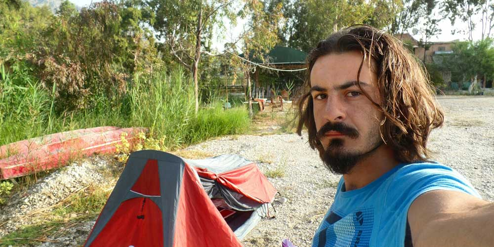
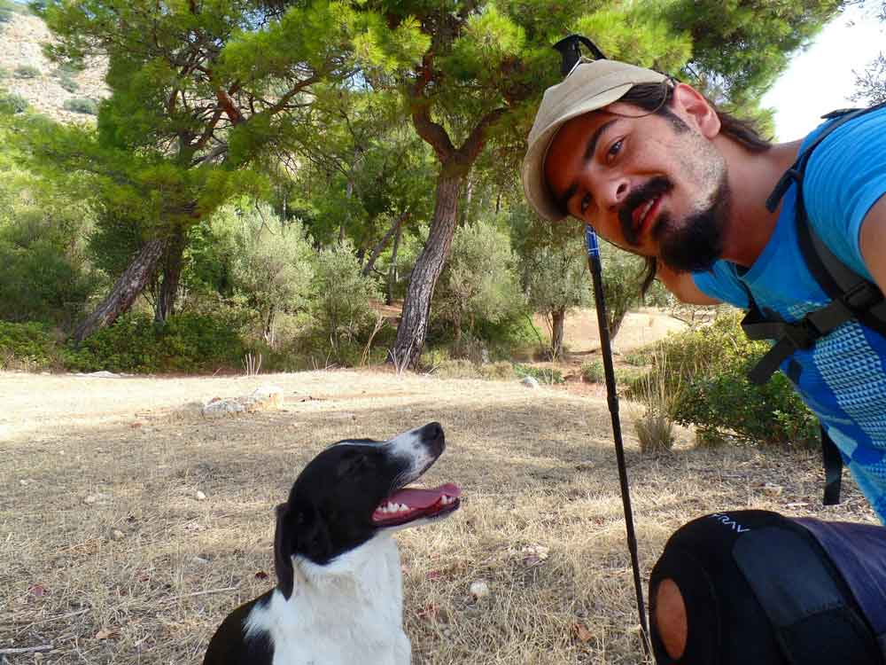
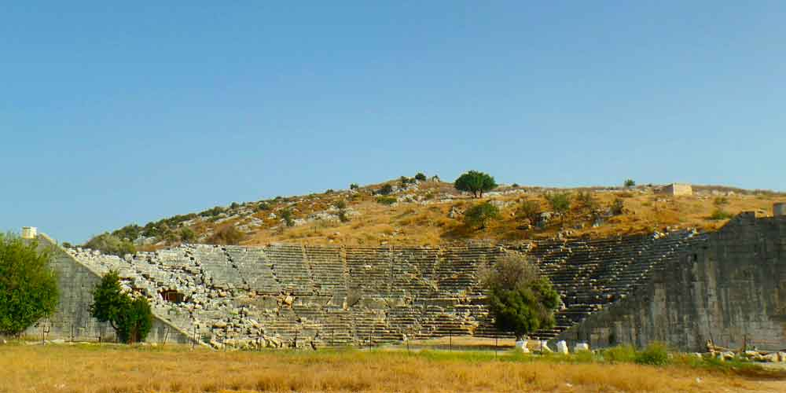

### Karadere -> Pydnee Antik Kenti -> Kınık(15km) - 23 Eylül 2014

Saat 10:15

Bugün daha geç uyandım. 9 gibi yola koyuldum. Bugün dinlenmem lazım ama burada değil. Sol ayağım ağrımaya başladı. Dizlikle biraz yürüyüp Patara sahili başlangıcında karşıma çıkan bu yerde kahvaltı yapmaya karar verdim. Kahvaltı da zeytin yedim ya. Neyse ki zeytini zorlayarak yiyebiliyorum. Sırtımda da bir ağrı var. Bugün artık yürümeyeceğim. Sahili bulmuşken biraz denize girip dinleneceğim. Sonra buralarda bir yerde çadır kurup kalacağım. Belki Letoon antik kentte de kalabilirim. Öncelikle yıkanmalıyım.

Saat 00:30

Sabah yaptığım kahvaltı ve sonrasında denize girmem iyi gelmişti. Kendimi daha iyi hissettim. Sonra Özlem Akovalıgil(Likya parkurunu bana en çok anlatan kişi) aradı ve Kaş’tan Patara’ya geçtiğini, benimde Kınık gibi saçma bir yerde kalmayıp Patara’da dinlenip sonra yola kaldığım yerden devam etmemi söyledi. Bana da çok mantıklı geldi ve Kınık’a doğru yürümeye başladım. Patara’ya gitmek için önce Kınık’a ulaşmam gerekiyordu. Kınık’a vardıkça burada bir yerde çadır kuramayacağımı anladım. Her yer sera. Mezarlıkta yok. Parkur zaten artık asfalt yoldan devam ediyordu bende Patara’ya giteye karar verdim. Ayağım ağrısa da düz yolda yürüdüğümden rahat bir yürüyüş oldu. Yaklaşık 15km yürüme ile Kınık’a ulaştım. Minibüs ile Patara’ya geçtim ve Özlem’le buluştuk. Patara kumsalda biraz dolaştıktan sonra gün batımını görürüz diye kum tepelerinde yerimizi aldık ancak puslu hava gün batımını görmemize izin vermedi.

Bugün rahat bir yürüyüş oldu. En azından tempoyu düşürdüm ve biraz insan içine karıştım. Biraz sosyalleşmek iyi geldi. Patara’daki Medusa campinge gelip çadırlarımızı kurduk. Akşam yemeği ve Likya yolu muhabbetinden sonra ben çamaşır yıkamaya geçtim. Kendimi fırsat buldukça yıkıyorum, çamaşırları da yıkamam gerekiyor. Yoksa kokmaya başlayacağım. Bu arada Likya parkurunu çizen Kate Clow bu yol 21 günde yürünür demiş. Benim iznim o kadar olduğu için 21 gün seçmiştim. Tesadüfe bakar mısın?

Bugün 4.günü bitiriyorum. Yola alıştım gibi. En azından dün ve bugün ilk 2 gün gibi değildi. Bilmiyorum belki de bugün fazlaca yokuş çıkmadığımdan olabilir. Yarın öğleye kadar yatıp sonra minibüslerle tekrar Kınık’a dönüp kaldığım yerden devam edeceğim. Yarın da biraz sakin geçecek gibi. Çünkü zorlu bir patika yok. Zaten bu Gavurağalı’ya iniş en zorlu yerlerdenmiş. Canımı okudu valla. Yolun rahatlamış olması beni de rahatlattı. Şu tütüne bir türlü alışamadım. Az evvel çadıra girmeden içtim ve çadıra girdim, hoop yığıldım kaldım. Baş dönmesi falan. Bir an bayılacağım sandım. Acaba tansiyonu o mu etkiliyor? Ben de anlamadım. Sanırım tütün bana iyi gelmiyor :). Dün ve bugün tansiyon yönünden iyiydim. Bir yaramazlık yok. Artık yatayım o zaman. Çok anlatacak bir şey bulamadım. İyi geceler..

Ek bilgi; Bu notlar yolculuk sırasında yazılmıştır.