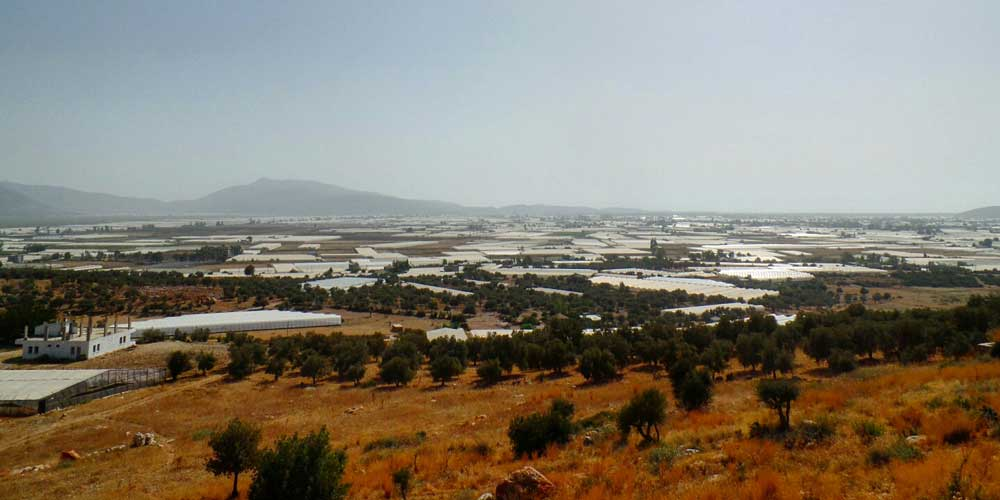
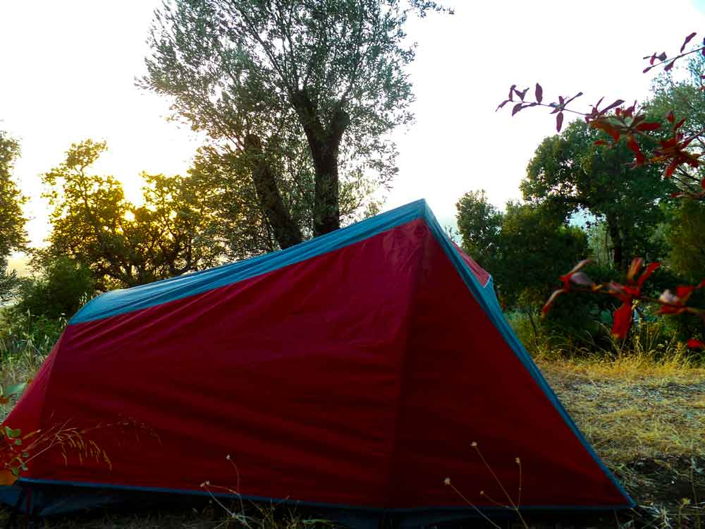

### Kınık -> Çavdır -> Üzümlü(22km) - 24 Eylül 2014

Aman Allah’ım nasıl bir yazı böyle. Ulen ne çirkin yazmışım hep. Neyse bugün daha güzel yazmaya çalışacağım. Yani deneyeceğim :)

Sabah 8 gibi uyandım ve Özlem henüz uyanmadığı için yanımda getirdiğim iplerle bileklik yapmaya başladım. İpler ince ve sürekli düğüm atarak yaptığımdan uzun sürecek gibi. 1cm kadar yaptım. Bugünlük yeter. Özlem de kalkınca kahvaltı yaptık ve biraz muhabbet sonrası ben gitmek için toparlanıp Kınık’a geçtim. Normalde bugün dinlenme günüm ancak planların gerisine düşmemden dolayı hem de dünün yarısını dinlenerek geçirmemden dolayı bugün yürüyeceğim. Saat 1 gibi Kınık’a geldim ve yürüyüşe başladım. Parkurun bu bölümü de yine asfalt yoldan gidiyor.

Bir yerde orman içi patikaya girmem gerekiyorken yine renkleri fark edemedim ve patikayı kaçırarak yoldan devam ettim. Sol ayağımı yormamak adına buraya girmediğim iyi oldu. Rahat bir yürüyüş ile Üzümlü köyü yakınlarına geldim. Burada mola vermişken trekking yapan turist bir çiftle tanıştım. Arash ve Andrea. Arash 30’lu yaşlarda bir İran’lı, Andrea ise yine 30’lu yaşlarda bir Alman. Bu ikisi nasıl buluşmuş, tanışmış sormadım ama gayet kafadengi görünüyorlardı. Onlarda aynı ben gibi Antalya’ya gidiyorlarmış. Çadırları olmadığından pansiyonlarda kalarak devam ediyorlar. Sanırım bu çift ile daha çok karşılaşacağım. Geceyi Üzümlü köyünde geçireceklerini söylediler ben ise Akbel’e gidecektim. Üzümlü köyünden geçerken her yerde üzüm asmaları gördüm. Arkadaş insanın canı bu kadar üzüm çeker mi hiç? Kimse de yok ki istesem de bana bir salkım üzüm verseler diye iç geçirerek devam ettim. Köyün çıkışlarına yakın bir yerde kasalara üzüm yerleştirmekle meşgul olan bir amca seslendi ve bana da 2 salkım üzüm verdi. Normalde kibarlık ederim, istemem falan derim. Bu kez direk atladım, aldım, teşekkür ettim ve köyü geçerek hızlı hızlı Akbel’e doğru devam ettim.

Akbel’e doğru ilerlerken birden saatin 18:25 olduğunu fark ettim ki heniz Akbel’e 4km daha vardı. Yola çıkmadan aldığım kurallardan birini çiğnemeye başlamıştım. Bu kural “18:00’dan sonra yürümek yok, nerede olursan ol orada kal” idi. İlk iş çadır kurmak için yer bakmak oldu. İlk baktığım yerin zemini çok sertti. Kazıklar girmediğinden çadırı kuramadım. Sonra biraz orman içine daldım ve düz yer aradım. 5 gün boyunca bulabildiğim en yumuşak zemindi. Burası da olmasaydı artık Patara’ya kadar yürürdüm.

Hızlıcana yerleştim ve hemen notlarımı yazmaya başladım. Son 2 gün rahat bir parkurda yürümek beni fazlasıyla rahatlatmıştı. Yolu artık kabullenmiştim. Alıştım yani.

Yine iyi geceler..

Saat 21:00

Ek bilgi; Bu notlar yolculuk sırasında yazılmıştır.