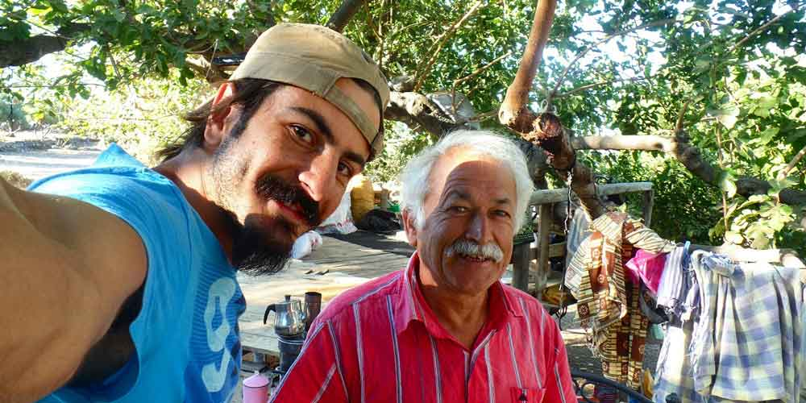
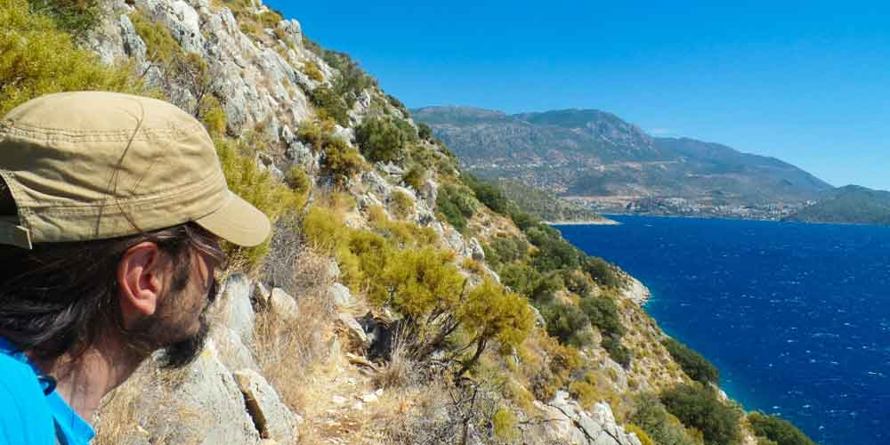
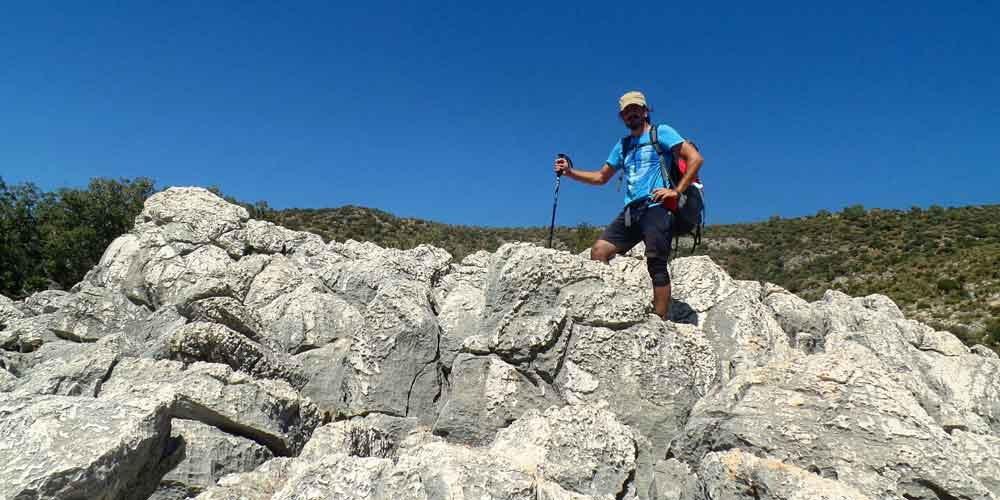
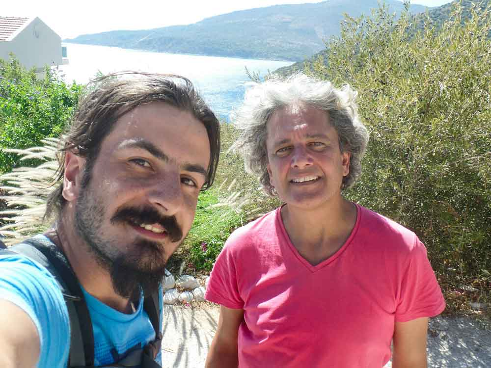
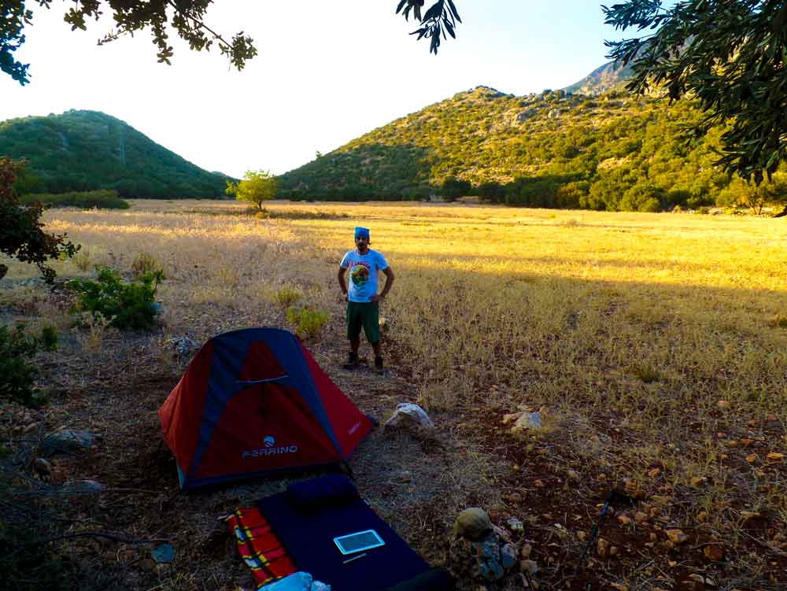

### Üzümlü -> Akbel -> Delik Kemer -> Kalkan -> Bezirgan(22km) - 25 Eylül 2014

Var ya böyle günleri özlemiştim. Hangi günleri mi? Tarihi, saati, günleri unuttuğum veya karıştırdığım günleri özlemiştim. Az önce tarihi yazarken bir önceki sayfadan kopya çektim. Yarın Cuma’ymış. Vay be neredeyse 1 haftayı tamamlıyorum. Ben 6.günümde kendime sayarım, söverim, arıza çıkarırım diye düşünmüştüm ama olmadı. Simge’de 8.gününde öyle olursun demişti. Bakalım daha 2 gün var ve şu an için iyiyim.

Bu sabah biraz geç uyandım. 07:30 gibi uyandım ama hızlıca toparlanıp 08:13 gibi yolda olmayı başardım. Dün iyi ki kendime vermiş olduğum 18:00’dan sonra yürümeyeceğim sözünü tutmuşum. Çünkü parkur artık patikadan devam ediyor, patika üzerinde çadır yeri bulamayıp gece karanlığında yürümek durumunda kalacaktım. Bu patikada da gece yön bulmak oldukça zor olacaktı. Evet bazen kafam çalışıyor :).

Patikada ilerlerken işaretleri kaybettiğimi fark ettim. Yol ikiye ayrıldı ve bir ev gördüm. Parkurun nereden gittiğini sormak için eve ilerledim sonra kendimi sohbet edip çay içerken buldum. Ne yüzsüz adam oldun sen İbrahim. Eskiden biri bir şey ikram edeyim dediğinde “yok ben almayayım, teşekkür ederim, yoluma devam edeyim” gibi cümleler kurarken şimdi bir bardak daha çay istiyorsun. Burada İbrahim amca ailesiyle birlikte yaşıyor. Çok sıcakkanlı ve sevecen insanlar. İbrahim amca eşine çok çektirmiş olsa gerek. Muhabbet ederken bir ara “Allah’ın gücüne gitmesin ama İbrahim’lerin kafası hep arkadan gelir” diyerek lafı İbrahim amcaya çaktı. Tabi inceden bana da giydirdi. İbrahim amca ise eski çakallardan hemen “Bizim kafamız önden gidiyor, o ondandır” diyerek karşılık verdi. Önden veya arkadan mı gidiyor bilmiyorum ama bu aralar benim kafa benden ayrı gidiyor. Onları atışmalarıyla baş başa bırakıp yoluma devam ettim.

Patika beni özlemiş. 2 gündür yoldan rahat rahat gidiyorsun gel birazda patikadan devam et demiş galiba. Parkurun kalan bölümü patikadan devam ediyor. Önce Akbel’e sonra Delik Kemer’e ulaştım. Delik Kemer’e giden patikada otlar iyice azıtmış, çığırından çıkmış arkadaş. Yahu patikayı niye kapatıyorsun, ne gerek var o kadar büyümeye. Sağım solum çizikler içerisinde devam ettim. Delik Kemer’e ulaştım, otlar azaldı, ohh rahat ettim derken bu sefer de yarım litreden az suyumun kaldığını fark ettim. Etrafta su kaynağı göremedim ve parkur iyice çirkinleşmeye başlamıştı. Ne sandın olum. O zaman gidip evde otursaydın. Zorlu kayalık geçişinden sonra patikadan ilerlemeye devam ettim. Yalnız kayalıklar gerçekten çok feci. Bir kaysan veya hafif dengen gitse iptalsin. Hakkın rahmetine doğru yol alırsın. Kayalıklarda zaten ölümlü kazalar oluyormuş(bunu sonradan öğrendim). Neyse ki ben sağ çıktım. Bunu niye diyorsam. Öyle olmasa bu notu nasıl yazacaktım? İşte bizim kafamız arkadan geliyor onda dolayı :)

Şimdi de su bitti. Zaten 1 yudumda bitecek suyum vardı, gıdım gıdım içiyordum. Parkur falan yok zaten. Bildiğin saçma sapan yerlerden geçerek patika devam ediyor. Yaklaşık 1.5 saat susuz yolculuk sonrası Kalkan’a ulaştım. Karşıma çıkan ilk barakanın kenarında hortum vardı. Musluğu buldum sevinçle suya doyacaktım ki su sıcak akıyor. Vay arkadaş ya. Biraz açtım akıttım ama değişmedi. Yine susuz kaldık iyi mi. Yerleşim yerine az kalmıştı, ilk insan gördüğüm evden su istedim. Aslında isteyemedim. Adam halimi görünce ben su demeye kalmadan mutfağa koştu su getirdi. Koca bardak 1 tane diktim. Sonra 1 tane daha içtim ve anca kendime gelip konuşmaya başladım. Adı Mark veya Mayk. Unuttum işte. Yarı İngiliz yarı Hindistan’lı, burada yaşayan iyi bir adam. Su verdi ya iyi oldu, diğerleri kötü mü yani? Üff ne bileyim saçma şeylerle  yorma beni. Neyse güler yüzlü bir adamdı işte.

Kalkan’da lojistik destek sonrası Bezirgan köyüne doğru yol aldım. Daha Bezirgan köyüne varamadan saatin kritik saat olan 18:00’a yaklaştığını fark ettim ve hemen çadır kuracak yer aradım. Burada düz yer çok da arkadaş her yer taş mı olurmuş? Ulen nereden buldunuz bu kadar taşı da buraya döktünüz? Hayret valla. Bir yeri temizledim ve yerleştim. Çadıra girmeden bir pipo yaktım. Bu tütün bana iyi gelmiyor. Pipo içmeyi çok seviyorum ama feci rahatsız ediyor. Bir an ayaktayken düşüp bayılacakmışım gibi hissettim ve kendimi çadıra zor attım. Sanırım tütün benim tansiyonu tetikliyor. Bir de Dardanel ton yemiştim. Allah kahretmesin beni. Hem yağlı dokunuyor hem de yiyorum. Üstüne bir de tütün içiyorum. İyi oluyor olum sana hak ediyorsun bence.

Kendime gelince bir yarım saat bileklik yapmayla uğraştım. Bu arada bugün sağ ayak baş parmağımın tırnağı oynamaya başladı. Hafif ağrı da var. İşte bu korktuğum başıma geliyor. Zaten tırnaklarım yeni düzelmişti. İnşallah iltihap olmaz, sadece düşer. Bugün Kalkan’dayken çantanın omuzu tutan yeri koptu. Onu da bir iple bağlayarak şimdilik hallettim. Sanırım bugün başıma gelmeyen kalmadı. Bugün psikolojik olarak yorulmaya başladığımı hissediyorum. 21 gün artık zor olurmuş gibi geliyor. Zaten planlamalarıma göre gerideyim. Bakalım daha ne kadar devam edeceğim.

Bu günde(olum bugün bitişik yazılır) iyi geceler..

Saat 22:30

Ek bilgi; Bu notlar yolculuk sırasında yazılmıştır.