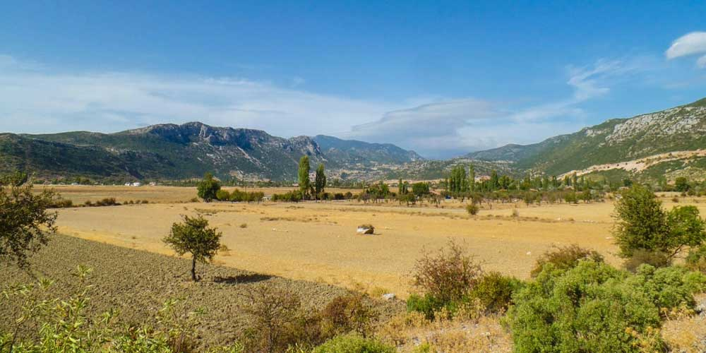
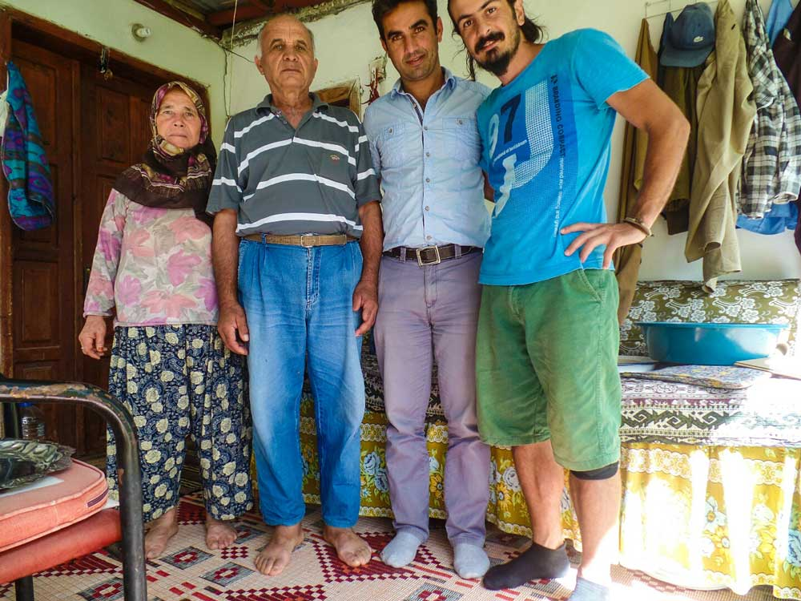
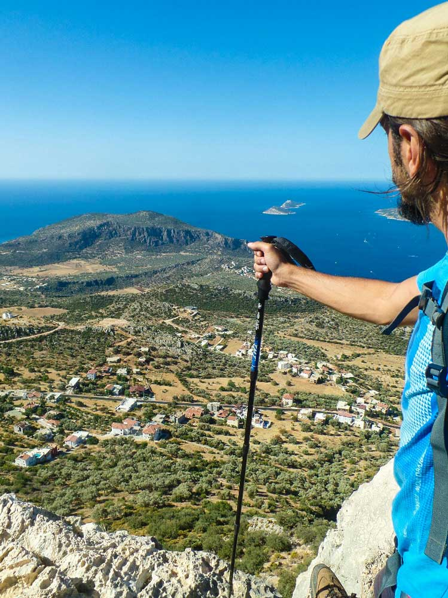

Bu 26 Eylül 2014 günlüğü, Bezirgan’dan Sarıbelen’e yürüdüğüm 12 km’lik yedinci Likya Yolu gününü ve yol üzerindeki deneyimlerimi anlatıyor.

## 2014 yürüyüş günlüğü: hızlı bilgiler

> **Editoryal bağlam:** Bu sayfadaki günlük notları 2014 yürüyüşü sırasında yazıldı; aşağıdaki bilgiler dönemin etap kaydını özetler.

- **Gün:** 7
- **Tarih:** 26 Eylül 2014
- **Etap:** Bezirgan – Sarıbelen
- **Mesafe:** 12 km

### Likya Yolu günlük navigasyonu

- [Önceki gün: 6. gün Üzümlü – Bezirgan günlüğü](/likya-yolu-6.-gun/)
- [11 günlük yürüyüş dizini: Ölüdeniz – Kaleüçağız parkuru](/likya-yolu-11-gunde-yurudugum-parkur/)
- [Ana rota: Likya Yolu'nun 11 etaplık rota rehberi](/likya-yolu-rotasi/)
- [Pratik etap rehberi: Bezirgan – Sarıbelen yürüyüşü](/likya-yolu-rotasi-bezirgandan-saribelene/)
- [Sonraki gün: 8. gün Sarıbelen – Gökçeören günlüğü](/likya-yolu-8.-gun/)

### Bezirgan -> Sarıbelen (12km) - 26 Eylül 2014

Dün sakin bir gece oldu. Gelen giden yoktu. Sabah yine 8 gibi yollara düştüm. Çok pis bir patika çıktıktan sonra Bezirgan köyüne ulaştım. Buraya gelirken yolda 3-4 tane su kuyusu vardı. Niyeti bozmuştum, dağın başında soyunup Kalkan manzarası eşliğinde yıkanacaktım. Ama kuyularda su kalmamıştı. Bezirgan köyü girişinde bir çeşme gördüm. En azından saçlarımı yıkayayım dedim. Gerçekten bu iyi gelmişti. Ben kokuyorum evet ama kafam rahat :). Tam yıkamayı bitirmiş kurulanıyordum Muhittin abi geldi. Namı diğer Moşe. Evet lakabı Moşe’ymiş. Bu lakabı kendi kendine takmış ve köyde herkes beni Moşe olarak tanır dedi. Hafif kafa kırık belli. Keçi otlatmaya çıkmış beni görünce yanıma gelmiş. Biraz muhabbet ettik ve bende Sarıbelen’e doğru gideyim dedim. Tabi önce koca köyün içinden geçmem lazım. Köyün merkezine gelince bugünün Cuma olduğunu ve 1 saat sonra namaz kılınacağını düşünerek Cuma için burada kalmaya karar verdim. Çünkü Sarıbelen’e gideyim desem yetişemezdim. Köy bakkalından aldığım zımbırtıları tıkınıyordum ki Hamza geldi. Kendisi bu bölgede veteriner olarak çalışıyormuş. Biraz muhabbet ettik ve Cuma sonrası bir yere kaybolma Necati amcaya yemeğe gideceğiz dedi. Rahatsızlık vermeyeyim, daha gidecek çok yolum var desemde ikna edemedim. Cuma sonrası Necati amcalara geçtik ve eşinin hazırladığı yemekleri yedik. Allah’ım o ne güzel biber dolmasıydı öyle. Süper olmuştu. Yada günlerdir adam gibi bir şey yemeyen benim için süperdi. Yok yok güzel yapmıştım teyzem. 2 de doksan yaşlarında dede vardı. Maşallahları var o yaşta gayet iyi görünüyorlar. Yemek sonrası vedalaştık ve ben Sarıbelen’e doğru yola koyuldum. Tabiki teşekkür ettim, etmeden olur mu hiç :)

Sarıbelen’e giderken patika tekrar sahile doğru döndü. Sahile iyice yaklaşınca tepeden manzara bir güzel oldu. Ağzım açık bakakaldım. Yaklaşık 25-30kmlik koca Kalkan ve Patara sahili ayaklarımın altındaydı. Deniz ise güneşin yansımasıyla altın gibi parlıyordu. Saatlerce oturup bu manzarayı izleyebilirdim. Patika sonrasında tekrar o iğrenç asfalt yola indi ve yol kenarından Sarıbelen’e doğru gitmeye başladı. Sırf parkuru bağlamak için 2-3kmlik bu bölümü böyle bağlamaları iğrenç olmuş. Bende bu kısım için otostop çektim :). Evet yapmayacaktım ama yaptım. Bunu yaptıysam artık dönmek istiyorum demektir. Çünkü kurallardan birisi de tüm parkuru yürümekti.

Sonra köyün civarında bir yere çadırımı kurup yerleştim. Allah’ım ne iğrenç yerler burası. Her yer taşlık. Önce zemini temizliyorum sonra çadırın kazıkları çakacağım diye canım çıkıyor. Neyse sonunda yerleştim ve bilekliğimi yapmaya devam ettim. Bitiremeyeceğim için kalanını yarına bıraktım.

Hayde iyi geceler..

Saat 22:10

Ek bilgi; Bu notlar yolculuk sırasında yazılmıştır.

---

## Yürüyüşe devam et

**[Sonraki gün: 8. gün Sarıbelen–Gökçeören günlüğü →](/likya-yolu-8.-gun/)**

[11 günlük yürüyüş dizinine dön](/likya-yolu-11-gunde-yurudugum-parkur/)
