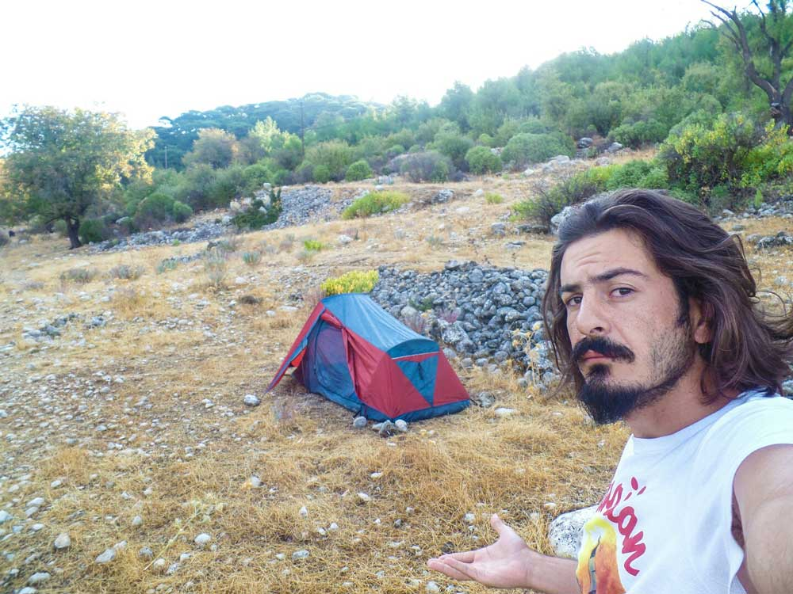
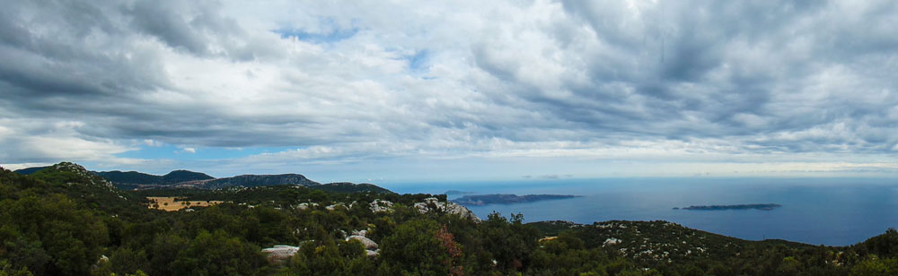
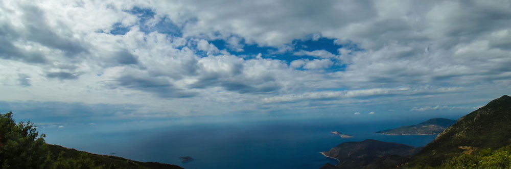
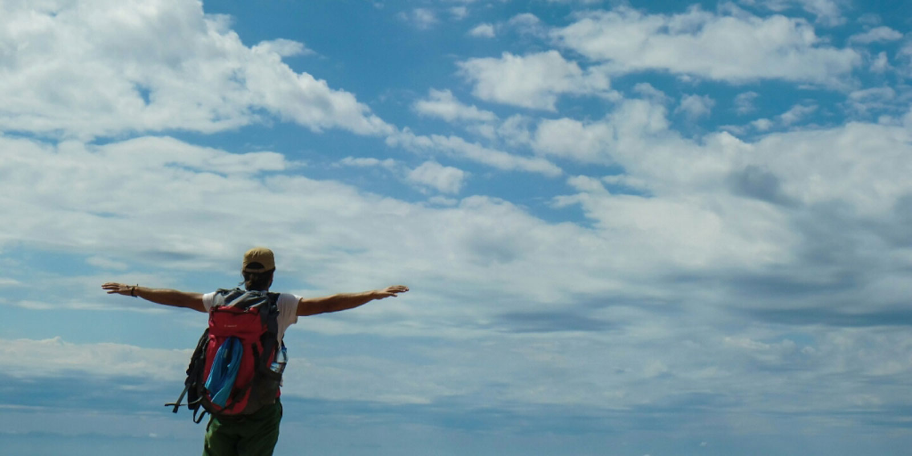
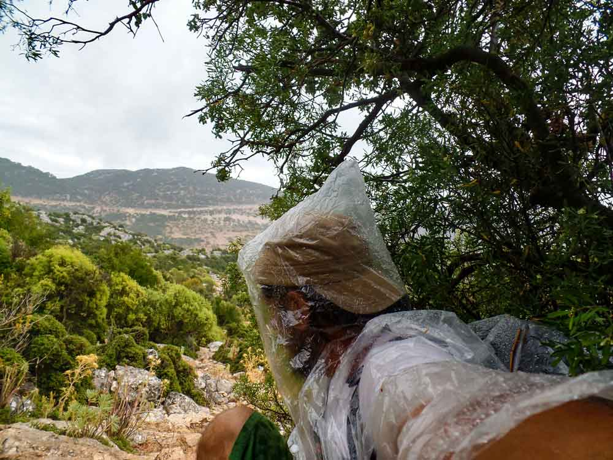

Bu 27 Eylül 2014 günlüğü, Sarıbelen’den Gökçeören’e uzanan 12 km’lik sekizinci Likya Yolu etabını yağmurlu günün notlarıyla kaydediyor.

## 2014 yürüyüş günlüğü: hızlı bilgiler

> **Editoryal bağlam:** Bu sayfadaki günlük notları 2014 yürüyüşü sırasında yazıldı; aşağıdaki bilgiler dönemin etap kaydını özetler.

- **Gün:** 8
- **Tarih:** 27 Eylül 2014
- **Etap:** Sarıbelen – Gökçeören
- **Mesafe:** 12 km

### Likya Yolu günlük navigasyonu

- [Önceki gün: 7. gün Bezirgan – Sarıbelen günlüğü](/likya-yolu-7.-gun/)
- [11 günlük yürüyüş dizini: Ölüdeniz – Kaleüçağız parkuru](/likya-yolu-11-gunde-yurudugum-parkur/)
- [Ana rota: Likya Yolu'nun 11 etaplık rota rehberi](/likya-yolu-rotasi/)
- [Pratik etap rehberi: Sarıbelen – Gökçeören yürüyüşü](/likya-yolu-rotasi-saribelenden-gokceorene/)
- [Sonraki gün: 9. gün Gökçeören – Kaş günlüğü](/likya-yolu-9.-gun/)

### Sarıbelen -> Gökçeören(12km) - 27 Eylül 2014

Dün gece 3 gibi uyandım. Rüzgar şiddetini artırmış ve hafiften yağmur atıştırıyordu. Hemen dışarı çıkıp kuruması için yere bıraktığım giysilerimi aldım ve çadıra girdim. Sonrasında rüzgar gücünü yağmur ise şiddetini artırdı. Zemin çok sert olduğundan çadırı iyi kuramamıştım. Yani kazıkları iyi çakamamıştım. 2 kazık yerinden çıkmasın mı? Haydaaa, çadır uçtu gidecek arkadaş. O yağmurda, rüzgarda tekrar kendimi dışarı attım ve taşlar yardımıyla çadırı sağlamlaştırdım. Burada o kadar fazla taş var ki duvar bile örebilirim. Sabaha yağmur olmaz ümidiyle tekrar uyudum.

Bugün yürüyüşe biraz geç başladım. Hem çadırın kurumasını bekledim hem de çeşmede biraz çamaşır yıkadım. Yağmur durmuştu. Ancak hava bulutluydu. Ne yapacağı belirsizdi. 2 paket büskividen oluşan kahvaltımın ardından 12-14kmlik Gökçeören yoluna düştüm. Tamamen patikadan oluşan ve bayağı yorucu olan bu bölümün müthiş bir manzarası var. Manzaraya bir de bulutlar eklenince tadından yenmez oldu. Tadından yenmez kötü şeyler için kullanılmaz mı? Neyse ya şimdi onu düşünemeyeceğim.

Gökçeören’de güzel bir yemek yemeyi umuyorum. Hatta pansiyon varmış belki orada kalırım ve güzel bir duş alırım. Yola devam ediyorum ancak fiziki olarak o kadar yorulmuşum ki bacaklarımdaki güçsüzlüğü kolayca hissedebiliyorum. Derken dağın başında bir eve denk geldim.

Hüseyin amca, Fatma teyze ve oğulları Adem ile birlikte yaşıyorlarmış. Etrafta kimsecikler yok. En yakın yer 2 saat yürüme mesafesi ile Gökçeören köyü. Cüzi bir ücret karşılığı burada yemek yedim., çay içtim ve epeyde bir sohbet ettik. Hüseyin amca yıllardır burada yaşıyor ve likya parkurunda bayağı da ün yapmış. Benden çok tanınıyor ahahha :). Bir sürü keçileri var ve güneş enerjisi ile elektiriklerini sağlıyorlar. Sonra vedalaştık ve Gökçeören’e doğru devam ettim.

Yalnız bu bulutlar hiç güzel gelmiyorlar. Sağlam bir yağmur olacak gibi demeye kalmadan yağmur başladı. Naylon yağmurluğu çantanın üstüne attım ve bir ağacın dibinde 10-15dk kadar yağmurun azalmasını bekledim. Bu naylon yağmurluk en azından günü kurtarmamı sağladı. Yağmur dinince hızlı adımlarla Gökçeören’e ulaştım. Bu kısımda taşlar ıslandığından oldukça kaygan bir hal almıştı. Telefon da çekmiyor. Bir düşsem iptal olurum. Neyse ki bir şey olmadan köye vardım. Köyün girişinde Hüseyin abi beni karşıladı. Burada pansiyon işleten kişiymiş. Evden oturup dağı gözlüyor ve gelen birini gördüğü anda müşteri veli nimettir prensibiyle hemen gelip karşılıyormuş.

Burada kalmaya karar verdim. Pansiyonun bahçesine çadır kurmaya başladım ki yağmur da tekrar başladı. Yağmurda çadır kurmak zor oldu. Zemin yine deli gibi sert. Kazıklar hep eğildi. Yağmur desen zaten hiç eksik olmuyor. Umarım yarın yağmur devam etmez. Burada bir duş almak ve üzerine temiz kıyafetler giymek çok iyi gelmişti. Sonra Olaf adında bir Alman geldi. 14 gündür yoldaymış. Antalya’dan başlamış yürümeye. Önümüzdeki Cuma günü Almanya’ya uçağı varmış. O zamana kadar ne kadar gidebilirsem devam edeceğim dedi. Likya yolunu nereden öğrendin diye sorunca Almanya’da burası çok ünlü diye cevap verdi. Bilindik bir yer, Türkler neden yürümüyor diye bir de soruyu çaktı. Bizimkiler yürümeyi sevmez diye cevap verdim :). Öyle değil mi yatmayı daha çok seven bir milletiz. Tabi bu bir özeleştiri. Olah bana parkurun kalan bölümü hakkında biraz bilgi verdi. Son kısımların yorucu olduğundan bahsetti. Bende ona dikkat etmesi gereken bir kaç nokta söyledim ve çadırıma çekildim.

Dışarıdan yağmur ve rüzgar sesi geliyor. Yarın yol uzun. 28km yürüyerek Kaş’a ulaşmayı hedefliyorum. Kısmet artık bakalım ne olacak.

Ek bilgi; Bu notlar yolculuk sırasında yazılmıştır.

---

## Yürüyüşe devam et

**[Sonraki gün: 9. gün Gökçeören–Kaş günlüğü →](/likya-yolu-9.-gun/)**

[11 günlük yürüyüş dizinine dön](/likya-yolu-11-gunde-yurudugum-parkur/)
