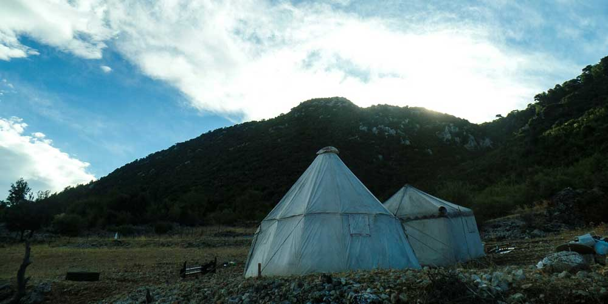
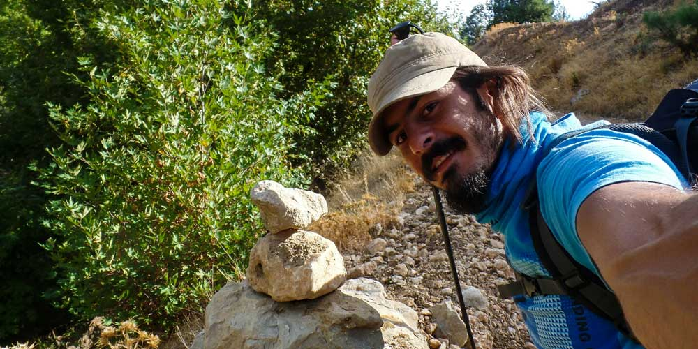
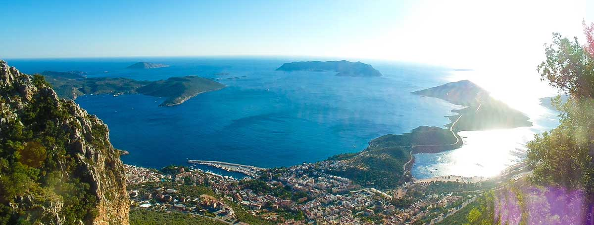

Bu 28 Eylül 2014 günlüğü, Gökçeören’den Phellos ve Çukurbağ üzerinden Kaş’a yürüdüğüm 28 km’lik dokuzuncu Likya Yolu gününü anlatıyor.

## 2014 yürüyüş günlüğü: hızlı bilgiler

> **Editoryal bağlam:** Bu sayfadaki günlük notları 2014 yürüyüşü sırasında yazıldı; aşağıdaki bilgiler dönemin etap kaydını özetler.

- **Gün:** 9
- **Tarih:** 28 Eylül 2014
- **Etap:** Gökçeören – Kaş
- **Mesafe:** 28 km

### Likya Yolu günlük navigasyonu

- [Önceki gün: 8. gün Sarıbelen – Gökçeören günlüğü](/likya-yolu-8.-gun/)
- [11 günlük yürüyüş dizini: Ölüdeniz – Kaleüçağız parkuru](/likya-yolu-11-gunde-yurudugum-parkur/)
- [Ana rota: Likya Yolu'nun 11 etaplık rota rehberi](/likya-yolu-rotasi/)
- [Pratik etap rehberi: Gökçeören – Kaş yürüyüşü](/likya-yolu-rotasi-gokceorenden-kasa/)
- [Sonraki gün: 10. gün Kaş – Körmen Adası günlüğü](/likya-yolu-10.-gun/)

### Gökçeören -> Phellos -> Çukurbağ -> Kaş(28km) - 28 Eylül 2014

Gece neyseki yağmur fazla uzatmadı. Ama mübarek rüzgar hiç dinmedi. Çadırı sonradan iyi kurmuştum bu yüzden sorun olmadı. Sabah masmavi bir gökyüzüyle uyanmak çok güzel oldu. Hava soğuk biraz üşüyorum ama bulutların ve yağmurun olmayışı fazlasıyla sevindirici. Olaf benden daha erkenci çıktı. Ben 8’de  uyandım adam yola çıkmaya hazırdı. Vedalaştık, belki bir gün yine karşılaşırız dedik. Dünya küçük belli mi olur.

Gece hava biraz serindi ama çok rahatsız olmadım. Güzel bir kahvaltının ardından 9 gibi bende yola koyuldum. Bir telefona bakayım dedim ki hoop ne göreyim? Telefon donmuş kalmış. Sonra zaten iptal oldu. Ne yaptıysam açamadım. Bugün telefon ve gps olmadan Kaş’a gitmeyi hedefliyorum. Gökçeören’den Kaş’a kadar yaklaşık 30km ve yolun yüzde 75’i patika olarak gidiyor. Gps ve telefon olmadan yola koyuldum. İşaretler canımı okudu. 4-5 defa işaretleri kaybedip geri döndüm, dolaştım, aradım ve buldum. Bazen hiç işaret görmedim. Yapacak bir şeyim olmadığından yolu takip ettim. Sonra işareti görünce doğru yolda olduğumu gördüm. Bugün müzik dinlemek iyi geldi. Parkurun büyük bir bölümünü müzik dinleyerek geçirdim. Bu yüzden tempom iyiydi. Phellos antik kentine gelmeme 5-6 km kala kendimi bir anda at sürüsünün içinde buldum. Beni görünce kaçtılar. Müzik dinlemiyor olsaydım seslerini duyar ve sinsince yaklaşırdım. Tühh be. Ama peşlerinden gittim. Görüntü kaydı almaya çalıştım ama hergeleler kaçıp gittiler. Onlar koşuyor bende peşlerinden koşuyordum. Biraz görüntülerini aldım :). Temiz ve bakımlı atlardı ama yabanileşmişler. Çok ilginç.

Sonra bir baktım 5.5 saatte 22km yol yapmışım. Ki bu çok iyi. Üstelik patikada yürüdüm ve saat daha 4. Facebook sayfamda dün akşam zamanlı gönderi paylaşmıştım. Sabah yayınlanmıştı. Onun haricinde telefon bozulduğundan kimseyle iletişim kuramadım. 1 gün Çukurbağ’da kalsam merak edilebileceğimden Kaş’a kadar gitmeye karar verdim. Bizimkilere benden 1 gün haber alamazsanız panik olmayın dediğim için içim rahattı.Kaş’a varmaya 2-3 km kala çok yorulmuştum. Kamp yapmak için bir yer bile baktım. Ancak burası çok rüzgarlıydı. Gece rahat bir uyku uyuyamayacağımı düşündüm. Bu yüzden biraz dinlenip sonra devam ettim. 18:00 civarı Kaş’a ulaştım. Tabi gps olmadan sadece işaretlerle yolu bulmak zor oldu. İlk iş olarak internet kafeye gittim. Ne yazıkki facebook’a giremiyorum. Kodmatik’in ürettiği kodu girin diyor. Evdeki face hesabımı açtırdım ve oradan giriş yaptım. Bir baktım kimse beni merak bile etmemiş :). Ayşegül Kaş’taydı. Geldiğinde haberleşelim demişti. İlk işim onu aramak oldu. Seni misafir edelim dedi. Önce rahatsızlık vermemek için yok dedim ama sağ olsun bırakmadı. Medeniyete gelmek beni çok mutlu etmişti. Yıkandım, temizlendim bir de üstüne yemek yedim. Çok ciddi bir lojistik destek aldım. 9 günün sonunda bu çok iyi gelmişti. Ardından telefonla uğraşmaya başladım ama o iş olmadı. Muammer abi ile de tanıştık. Aslında kendisi ev sahibi. Kaş’ta dalış eğitmenliği yapıyor. Ayeşgül ona misafir gelmiş bende Ayşegül’e. Çok iyi ve güleryüzlü insanlar. Kendi evindeymiş gibi rahat et dediler. Bende evin altını üstüne getirdim. Bunu yanlış adama söylediniz dostum :). Şimdi evden kaçacağım ahahah.

Telefonsuz ve haritasız ilerlemek sıkıntı olacak gibi. Sürekli kaybolarak devam etmek zor oluyor. Psikolojik olarak yoruyor insanı. Bu yüzden Demre veya Finike’de yürüyüşü bırakabilirim. Bu arada bizimkilere telefonsuz devam edeceğimi söylemedim. Yarın sabah söyleyip yola devam edeceğim. Şimdi bir de onlarla uğraşamam, bir ton laf ederler :)

Haydin iyi geceler..

Saat 23:30

Ek bilgi; Bu notlar yolculuk sırasında yazılmıştır.

---

## Yürüyüşe devam et

**[Sonraki gün: 10. gün Kaş–Körmen Adası günlüğü →](/likya-yolu-10.-gun/)**

[11 günlük yürüyüş dizinine dön](/likya-yolu-11-gunde-yurudugum-parkur/)
