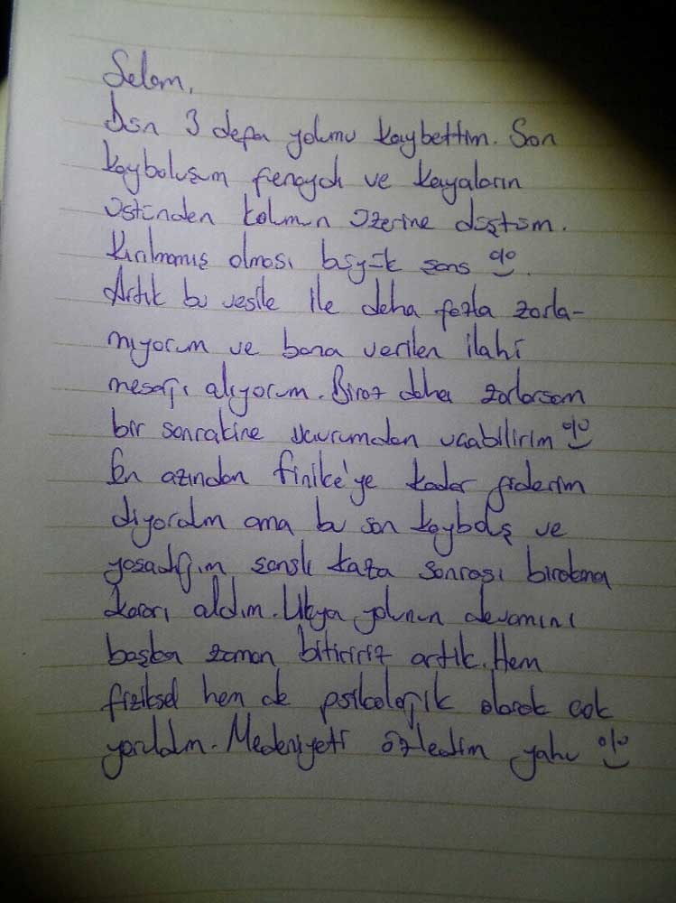

`youtube: https://www.youtube.com/watch?v=k2G3v7FS7gw`

Olay 1 adam 21 gün ve 509 km olarak başladı 1 adam 11 gün 230 km olarak bitti. Bünye bu kadar kaldırdı işte, ne yapayım :). Yukarıdaki görüntüde Ölüdeniz-Üçağız arasındaki parkurun özetini izleyebilirsiniz. Hd izlemeniz tavsiye edilir.

Bu yolculuğa nasıl hazırlandım, nasıl motive oldum ve gün gün neler yaşadım(yolculuk esnasında yazdığım notlar) sorularının cevaplarını şöyle sıralayabiliriz;

* [Bunun Adı Aşk](/bunun-adi-ask-likya-yolu/)
* [Neden Tek Gidiyorsun?](/likya-yoluna-neden-tek-gidiyorsun/)
* [Likya Yolu Hazırlıkları](/likya-yolu-hazirliklari/)
* [Likya Yolu Rotası ve Planlamalarım](/likya-yolu-rotasi/)

  * [Gerçekte Yürüdüğüm Rota](/likya-yolu-11-gunde-yurudugum-parkur/)
* [Sırt Çantam](/likya-parkuru-sirt-cantam/)

Gelelim Yol Anılarıma

Yolculuk esnasında yazdığım notlarıma [Likya Yolu Anılarımdan ](/likya-yolu-11-gunde-yurudugum-parkur/)ulaşabilirsiniz. Yolculuk esnasında yazdığım için o an ki duygu ve ruh durumumu yansıtıyor. Parkur hakkında detaylar da bulabilirsiniz. Ayrıca fotoğraflara bakıp parkur hakkında genel bir izlenime sahip olabilirsiniz.

11 günde 230km tamamlamış oldum. Parkuru tamamlamak için 200km’lik bir bölüm kaldı. İlk fırsatta bitirmeyi planlıyorum. Umarım 2016’da bunu başarırım. Hem de 10 günde bitirmeyi hedefliyorum. Böylece 21günlük planımdan sapmamış olacağım. Sadece tek seferde bitmemiş olacak :)