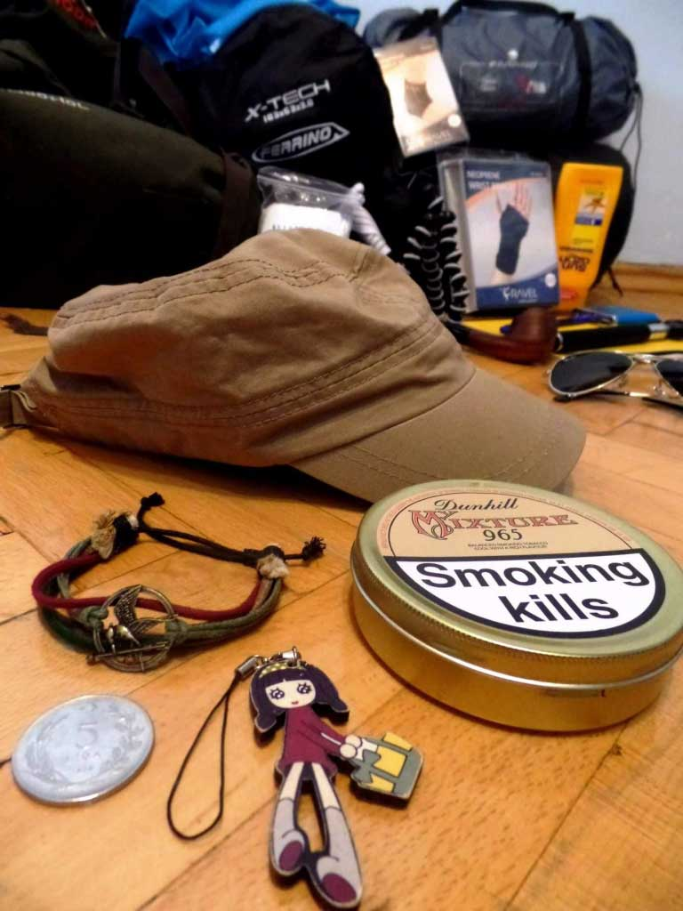

Bu not, 509 km ve 21 gün hedefiyle hazırladığım 2014 Likya Yolu yürüyüşüne bir gün kala parkuru neden seçtiğimi ve yola çıkmadan önceki beklentilerimi kaydediyor.

## Yola çıkmadan bir gün önce

29 Ağustos 2014

Herkesin anlatacak bir hikayesi vardır. Benimki ise 20 Eylül’de başlıyor.

\*Everyone has a story to tell. Mine begins on September 20.

### Neden Likya Yolu?

Adını ilk 2013 Ekim’inde duymuştum. Ön araştırmadan sonra görmüş olduğum manzaralar ile parkur beni cezbetmeye başlamıştı. Doğayı ve trekking’i deli gibi seven biri olarak benim için mükemmel bir parkur. İnsan bu gibi hayatına etki edecek şeyleri hayatında bir ya da 2 kez yapabilir diye düşünmüştüm. Ve karar verdim. 1 adam, 21 gün, 509 km. Benim hikayem bu olacak.

### Likya Yolu'na kimler gitmiş?

Kimler gitmemiş ki :). İnternette bir çok bilgi ve kaynak bulabilirsiniz. Bende araştırmalarımı toparlayınca **Yola Çıkmalı**‘da paylaşıyor olacağım. Bu parkuru parçalı olarak bitiren bir çok insan var. Tek seferde bitiren ise henüz görmedim ama muhakkak ki vardır.

**Likya Yolu Hazırlıkları**

Şubat ayında fizik gücümü artırmak için spora başladım. Düzenli olarak 7 aydır kardiyo ve vücut geliştirme yapıyorum. 4 gün yürüyüp 1 gün dinlenmeyi planladığımdan günde ortamala 30km yürümem için fizik gücümü artırmak zorundaydım. Şu an için günde 30km rahat yürüyebiliyorum ama bu süreç 21 güne yayılınca nasıl olacak doğrusu bende merak ediyorum. Bugün 18 Ağustos ve yola çıkmak için yaklaşık olarak 1 ayım kaldı. Yürüyüşüm parkurum belli ama konaklayacağım yerler belli değil. Kalan 1 ayda hem çadır kuracağım yerleri belirleyeceğim hem de rota üzerinde çalışarak parkur üzerinde geniş bilgi sahibi olacağım.

Adını duydukça heyecan yapıyorum ve gözlerim parıldıyor. Henüz 1 ay gibi çok bir zaman olmasına rağmen hazırlıklar için çok az zamanım kalmış gibi hissediyorum. Sanırım heyecandan olsa gerek :)

Hazırlıklara devam ediyorum. Tamamlayınca daha detaylı bilgiler paylaşıyor olacağım.

\*Asla hayallerinden vazgeçme!
