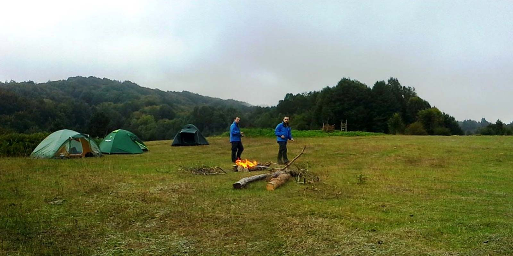
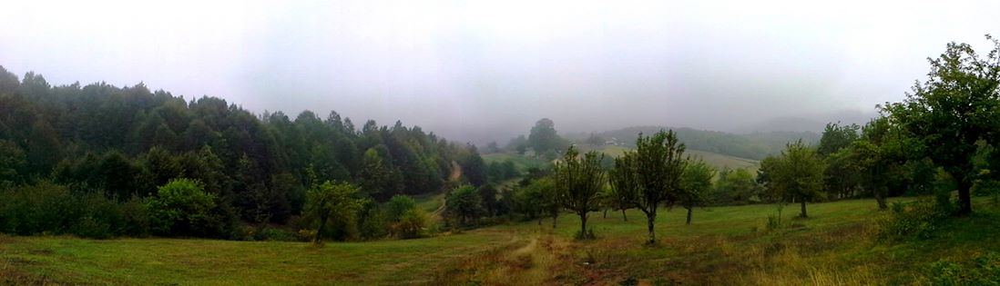

Yine benim için güzel bir zaman. 30 Ağustos Cuma gününe denk geliyor ve 3 günlük mis gibi tatilim oluyor. Ne yapsak acaba, nereye gitsek diye düşünürken bu sefer Kocaeli’nde sınırlarında bulunan Menekşe Subatımı yaylasına gitmeye karar veriyoruz. Subatımı yaylasında kamp yapıp etrafta yürüyüş yapmayı ve Sıcakdere Kanyonuna girmeyi planlıyoruz. Sıcakdere kanyon Kocaeli’nin en zor yürüyüş parkurlarından birisidir.

**Heyecanlı Bir Ekiple Yola Çıkmalı**

4 arkadaş Cumartesi sabah toplaşıp yola koyuluyoruz. Ekip dinamik ve heyecanlı. Ramazan ve Emre’nin ilk kampı Sinan’ın ise birkaç kamp tecrübesi var ve herkes çok istekli. Böyle olunca yaptığınız yolculuk daha zevkli bir hal alıyor. Cumartesi 10 gibi kamp yerimize ulaşıyoruz. Suya yakın olabileceğimiz görece en düz olan yere çadırlarımızı kurup yerleşiyoruz.

**Laz Ali**

Kahvaltı sonrası çevreyi keşif amaçlı yürüyüşümüze başlıyoruz. Önce Papazçayırı’na gidiyoruz, ardından Menekşe yaylasına yürüyoruz. Hava kapalı ve hafif yağmur atıştırıyor. Yağmurluklarımız olduğu için bize sorun olmuyor. Hazırlıklı isem bu tür havaları çok seviyorum. Hem ıslanmak, hem kuru kalmak. Menekşe yaylasında dolaşırken kendini Laz Ali diye tanıtan 70li yaşlarda bir amca ile tanışıyoruz. Biraz eski toprak olan Ali amca benim saça sakala takılmadan edemiyor. Fırsatı buldukça şakayla karışık lafını çakıyor. Eskiler için uzun saç veya top sakal bırakmak ayıp bir şey olarka algılanıyor. Aslında baktığınızda olay tamamen algısal. Düşünsenize 1950 lerde arası gençliğini yaşayan insanların kısa saçlı ve sakalı olmayan insanları garipsemiş olsalardı bugün onlara top sakallı ve uzun saçlı insanlar çok normal gelecekti. Tamamen algısal ve kültürel bir olay. Bu yüzden Ali amcanın çaktığı laflar beni üzmüyor aksine gülümsetiyor. Ali amca ilginç ve değişik bir insan. Öyle ki her yöre halkı gibi yaylada kendi tarlasını ekip, biçiyor. Aynı zamanda ayılardan yana çok dertli. Sürekli ekinlerine zarar veriyorlarmış. Bu yüzden neredeyse her akşam tarlasının kenarında ateş yakıyor. Hiç karşılaştınız mı dediğimde içli bir şekilde “ah bir karşılaşsak vuracağım onu” diyor. Yürürken ağaçtan topladığı elmaları yememiz için veren bu cömert insan ardından çay içmek için bizi evine davet ediyor. Evi yayladaki evlerin seviyesine göre biraz daha yüksekte olduğundan bu yükseltide yağmur daha fazla. Bu yüzden daha fazla yukarı çıkmaktan vazgeçiyoruz ve Ali amca ile biraz daha muhabbet ediyoruz.

**Laz Ali-** Senin Ankara’da tanıdığın var mı?

Ben- Yok (aniden gelen bu soru karşısında afalladım ve muhabbetin nereye gideceğini bilmeden cevapladım)

**Laz Ali-** Benim de yok. Ama onların var.

Ben- Kimin Ali amca?

**Laz Ali-** Ayıların. Ankara’da onlardan çok var, dokunamıyorsunda. Ayı vurmanın ağır cezası var ama bir gelsin vuracağım onu.

diyerek bize ayının zarar verdiği fasülyelerini gösteriyor. Gerçekten de tarlasına ciddi zarar vermiş, fasülyelerin direklerini kırmış ve yaprak bırakmamış. El emeği ve belki de önemli bir gelir olan bu insan için ciddi bir üzüntü kaynağı olduğunu rahatlıkla görebiliyorduk. Ali amcaya teşekkür edip vedalaşıyoruz. Biraz orman içine girerek tekrar kamp yerine ulaşıyoruz. Yağmur henüz tam bastırmadığından kamp ateşimizi güçlendiriyoruz güzel bir muhabbet ve akşam yemeğinin ardından uykuya dalıyoruz. Yarın ki hedef Sıcakdere kanyonu.

**Sinan Kayıp**

2.gün kahvaltı ardından toprak yoldan Sıcakdere kanyonuna doğru ilerliyoruz. Yaklaşık 2.5-3 saatlik yürüyüşün ardından dereye giriyoruz ve 1.5km kadar dere içerisinde ilerliyoruz. Kanyonu aşağıya doğru inmeye çalışıyor ki büyük şelalenin oraya geldiğimizde aşağı inmeyi zorlamıyoruz ve akşam olmadan kamp yerine varmak için geri dönme kararı alıyoruz. Kanyona henüz varamamış olsak da güzel bir yürüyüş oluyor. 17:00 gibi kamp alanına vardığımız da Herkes çadırlara girip dinleniyor. 18:15 gibi  Sinan nerede sesleri yükselmeye başlıyor. Sinan Yok!!!

Sinan’ın kayboluşu ve bulunuşla ilgili kısıma erişmek için tıklayınız. (link eklenecek)

**Son Gün**

Dün gece oldukça hareketli ve korku ile geçtikten sonra bugün toparlanıp kahvaltı için Maşukiye’ye gitmeye karar veriyoruz. Kocaeli -> Yuvacık -> Aytepe -> Menekşe yaylası güzergahını takip ederek geldiğimiz kamp yerine, dönüş yolu olarak Menekşe Yaylası -> Ferhatiye -> Gölcük -> Kocaeli yolunu takip ederek geri dönüyoruz. Maşukiye de güzel bir kahvaltı ardından İstanbul yolculuğu başlıyor.

Bu kampta Sıcakdere kanyonunun bir kısmı ve Menekşe ile Subatımı yaylası ile tanışmış olduk. Arkadaşımız kaybolması bizi korkutsa da bulmanın sevincini yaşamakta bir o kadar güzeldi.  Siz siz olun kampta bireysel hareketlerden kaçının ;)