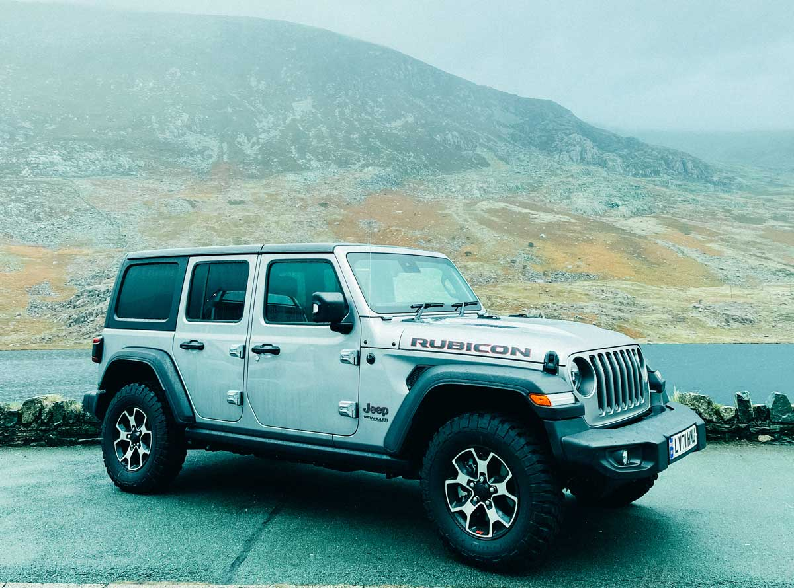

Yeni yoldaş Rubicon. O benim için bir cip veya bir araba olmaktan çok öte. Çünkü şimdiye kadar kurduğum en büyük hayalin yoldaşı olacak o. 

İngiltere'ye göçmek istememdeki en büyük amaçlardan birisi İngiliz pasaportu almak ve dünyaya daha kolay açılabilmekti. Bu pasaport ile uzaktan İngiltere'deki işlerde çalışabilecek olmam veya istediğim zaman buraya geri dönebilecek şansımın olması ise çikiletalı kurabiye gibi ağzımın sularını akıtıyordu. Kurduğum en büyük hayal ise bu pasaportu alınca dünyayı açılmak, bazen doğada bir yerde kalmak bazen de 3-5 ay farklı bir şehirde yaşamak, uzaktan çalışmak ve farklı farklı ülkelerde yaşama fırsatı bulmaktı. Sürekli yolda, yollarda geçecek bu yaşam şeklinde bana yoldaşlık edecek bir araca ihtiyacım olacaktı. Tabi bu hayalin ne kadar sürdürülebilir olduğunu hiç düşünmedim. Belki 1 belki 3 belki de 5-10 yıl böyle takılıp sonrasında emekliliğin(totomda kurt var bu çok zor) tadını çıkartmanın yollarını arayacaktım. Bilmiyorum. Önemli olan ise sadece o hayale başlamak ve doğru yoldaşı bulmaktı.

4 yıldır İngiltere'deyim ve pasaportu almama da 2 yıl civarı bir şey kaldı. Yani bu büyük hayale 2-3 yıl kaldı. Burada geçirdiğim zaman geçirmem gerektiği zamanı geçince de yıllardır düşlediğim bu hayali artık daha fazla düşünmeye başladım. Kurtlanmaya başladım yani zihnim kıpır kıpır. Öyle ki gittiğim her kampta oradaki insanları inceler oldum. Hımmm karavanla gelmişler 1 gece kaldı gittiler. O kadar kurul yerleş ertesi gün git, çok saçma değil mi falan diye kendime sorarken bir yandan gözüm cipiyle yada ben gibi arabasıyla/motoruyla kampa gelenlere ilişiyordu. Düşün düşün düşün bir türlü karar veremiyordum.

Motosiklet tabi ki benim vazgeçemediğim tutkum. Onunla yollarda olmak inanılmaz keyifli. Motorla 3-5 aylık geziler olur eyvallah ama 3-5 yıl yaşamalı geziler olmaz. Benim için olmaz çünkü yolda olmak yolda yaşamak hem de uzaktan çalışıp para kazanmak en önemli kriterlerimdi. Motosikletle yapılır mı yapılır ama konfor kaybı çok fazla olur. Çünkü bilgisayarımı açıp 9-6 çalışacağım zaman konforlu olmam çok önemli. Çok fazla eşya taşıyamam ve sürekli doğadan uzak bir şekilde şehir içinde de yaşayamam. Bu yüzden motoru da eledik. 

Karavandan da vazgeçtim çünkü mobilitemi kısıtlıyor. Yani doğada bir yerdeysen harika, süper konforlusun. 5+1 ev gibi yerleş bir yere 2-3 ay kal. Arkaya bir pisiklet veya ufak bir motor süper gibi görünse de şehir içine gittiğinde karavanı sokamıyorsun. Burada işler öyle Türkiye'deki gibi yürümüyor. Karavanı karavan park alanlarında bırakman gerekiyor. Karavanı uzakta bırak, şehire git orada kal, sonra dön karavanı al vs. vs. uğraş dur. Hep ikinci vasıta gerekli olacaktı. Bu da mobilitemi kısıtlamış olacaktı ki kısıtlanmak istemiyorum. Bu hayalin mihenk taşı özgür olmak, özgürce her yere gidebilmek. Karavanla daha ağır hareket edip daha lokal yaşanılabilir ama ben daha aktif ve özgür olmak istiyorum. Bu yüzden karavan düşüncesine bugün değil belki 20 yıl sonra diyerek veda ettim. 

Pek tabiki kampa veya doğa gezilerine ben gibi arabasıyla gelenler de çok. Gocuman çadırlar(aile çadırları ve gazebo) kuruyorlar, otağı gibi yaşıyorlar. İlk görüşte oha harika gibi gelse de araba filkri bende olmuyordu. Motosiklet ruhuma hitap ederken araba benim için bir araçtan öteye gitmiyor. İki motorlu yolda karşılaştığında selamlaşır ama iki arabalı ne yapar -> hiç. Üstelik daha geniş bir alan istiyordum. Yeri geldiğinde araç içinde yatıp uyumalıydım ve haftalarca bana yetecek eşyayı yanıma alıp doğada zaman geçirebilmeliydim. Hem ev hem de ulaşım aracı olmalıydı o benim için. O yüzden araba da bir türlü zihnimde olmadı. 

Son olarak döndüm dolaştım ve cip olaylarına geldim. [Moturla İskoçya gezisi](/tek-basina-iskoc-yaylalarinda-29-gunde-5500km/)nden sonra cip olayı kafama yatmıştı. Üste çadır ve yana açılan kocaman gazebo falan enfes duruyor. İşin gerçeği bu yıl BMW GS1250 Adventure a geçmeyi planlarken şeytanın cip baksana kardeş diye fısıldamasıyla ortalık karıştı. Bana uyan ruhuma hitap eden, karakter olarak benimle eşleşebilecek 3 cip vardı zaten. Discovery 4, Rubicon ve Defender. 2016 sonrasındaki Discovery modellerini beğenmiyordum. Yeni modellerin totosunu yuvarlamışlar abuk sabuk çirkin bir cip halini almış. 2016 kasasının yeni modeli de olmayınca o da elendi. Yeni Defender'lar ise gocuman, güzel ve pahalı. Fiyat olarak 1 Defender = 1.5 Rubicon. Üstelik şehir cipi gibi. Bir de son yıllarda Land Rover üretimi cipler pek güven vermiyor. Sürekli sorun sürekli sorun. Defender'lar daha iyi diolar ama bilmiyorum. Bana uymadı. Geriye kaldı Rubicon reis. Şeytan bir kez daha fısıldadı test sürüşüne git, bir test sürüşünden bir şey olmaz dedi. Gittim ve ne oldu biliyor musun? Şeytan bir kez daha fısıldadı: kardeş 36 ay vade, 0 faiz(bir Türke sıfır faizle dünyayı bile satabilirsin) ve üstüne yüzde 10 da indirim yapıyorlar, almazsan seni döverler. Oha ne kadar haklısın reis, ne güzel yol gösterdin ve bu büyük hayalin başlamasına 2.5 -3 yıl olmasına rağmen neden olmasın dedim. Hem bu sürede Rubicon'a alışmış ve daha konforlu hale getirmiş olurum diye düşündüm ve uydum şeytana çektim besmeleyi bana oradan bir Rubicon sar abi alıyoruz dedim.

Ve böylelikle bu büyük hayalimin ayak sesleri gelmeye başladı. İşte bu yüzden Rubicon benim için bir araç değil, amaç da değil, aşk hele hele hiç değil. O sadece bir yoldaş :)

Umarım 3 yıl sonra bu büyük hayalime atıldığımda "Geliyorum Dünya Bekle Beni" başlıklı yazımı da yazarım. Hadi hayırlısı bakalım, kısmetse olur. See you...

