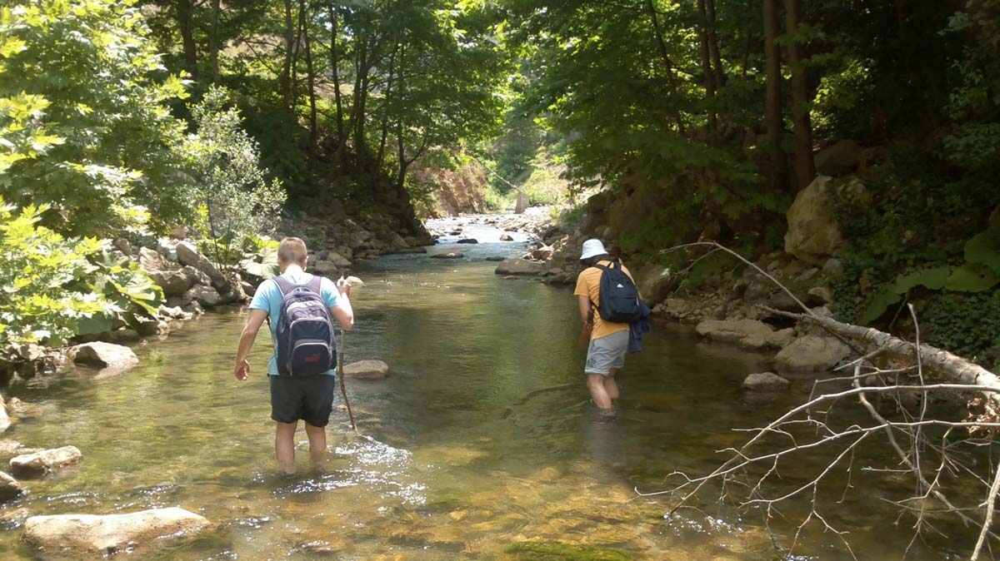
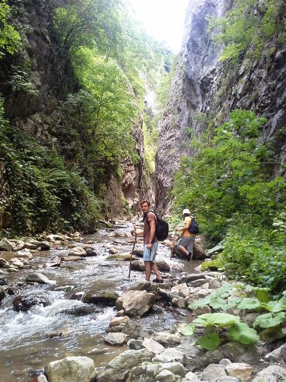
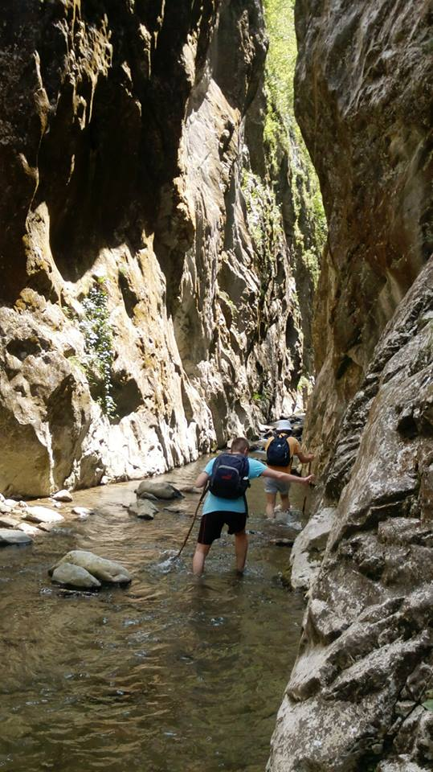
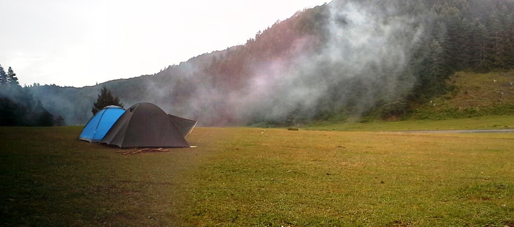
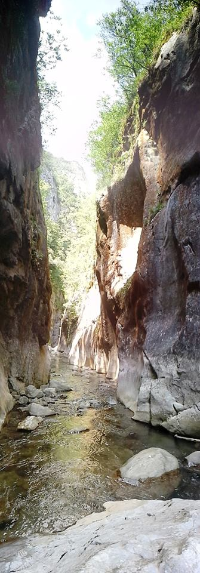
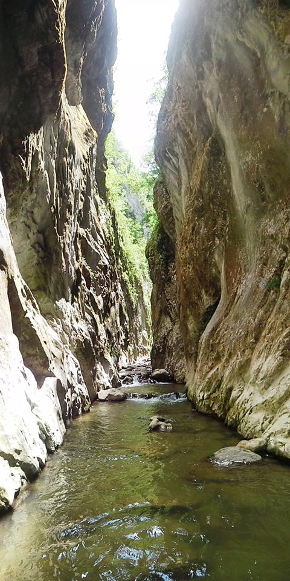

**Kanyona Gidelim mi?**

Ormanlara, deniz kenarlarına, dağlara, tepelere kamp yapmaya gitmiştik. Peki ya kanyon nasıl olurdu acaba? Adını çokça duyduğum Kocaeli sınırları içerisindeki serindere kanyonuna gitmeye karar verdik. Plan hazırdı Cumartesi yola çıkıp kahvaltının ardından kanyonda yürüyüşümüzü yapıp sonrasında İnönü yaylasına geçip orada kamp yapacaktık.

**Başlangıç Noktası**

Ve derenin kenarından suya girerek kanyona doğru ilerlemeye başladık. Zaman zaman dere içerisinden zaman zaman dere kenarından ilerleyerek Kocaeli’nin orta zorlukta olan bu parkurunda dikkatli bir şekilde ilerlemeye devam ettik. Bu sefer kalabalık değildik. Sadece 3 kişi yola çıkmıştık. Yosunlu kayalarda kayıp düşmemek için dikkatli bir şekilde ilerliyorduk.

**Kanyon Görünüyor**

Büyük yapraklı bitkilerin arasından geçerek kanyonun girişine ulaştık. Kanyon girişine geldiğimiz o kadar çok belli oluyor ki, kanonun içerisinden dizlere kadar gelen su geçiyor ve iki kolunuzu açtığınızda göğe doğru yükselen kayalara çarpıyorsunuz. Zaman zaman gökyüzünü bile görmekte zorlandığımız bu kanyonda ilerlemek heyecan vericiydi. Kanyon bittikten sonra bir süre dinlendik ve ardından aynı yolu geri döndük. Ama bakış açımız değiştiği için aynı yoldan dönüyormuş izlenimi oluşmadı.

**Gece Boyu Çatışma**

Geceyi bildiğimiz rahat bir yerde yani İnönü yaylasında geçirmeye karar verdik ve hava kararmadan yaylaya geçtik. Gittiğimizde bizden başka 6 7 farklı grup olduğunu gördük. Yayla büyük olduğu için aramızda mesafe vardı. Bu yüzden rahattık. Odun toplayıp ateşimizi yaktıktan sonra karnımızı doyurduk. Tam çayımızı içip, gökyüzünü seyre dalmıştık ki sağımızdaki grup silahlarını ateşleme başladı. Sesleri duyan karşıdaki grup karşılık vermek üzere onlarda ateş etmeye başladı. Derken solumuzdaki bir grupta silahlarını ateşlemeye başladı. Bir çok silah kurusıkıydı ve aralarında pompalıyla saçma atanlarda vardı. Çünkü karşımızdaki grup bize doğru eğimle ateş edince saçmaları üzerimize geliyordu. Biz uyarında yönlerini değiştirdiler. Evet tüm keyfimiz kaçmıştı. Huzur dolu bir gece geçirmenin hayallerini kurarken silah sesleri eşliğinde muhabbet etmeye çalışıyorduk. İçimizden çeşitlik küfürleri yağdırarak. Hatta silah atmak o kadar normal bir şeymiş gibi yanımızdan geçen laz bir amca uşaklar sizden neden ses çıkmayy diye seslendi :), amca biz kampçıyız kamp yapmaya geldik dediğimizde anlam veremeden yoluna gitti.

Evet silah sesleriyle doğanın tüm sessiz güzelliğini bozmuşlardı. Tabi bu o insanlar için bir şey ifade etmiyordu. Onlar sadece egolarını tatmin etmek için tetiği çekiyorlardı ve mermileri bittikçe arabalarla gidip mermi alıp gelip sıkmaya devam ediyorlardı. Hayır olay hava kararmadan başlasa başka bir yere giderdik. Gecenin 10unda başladılar ve sabaha kadar devam etmişler. Etmişler çünkü ben en son 1 de uykuya dalmıştım. Sabah Furkan ve Cem sabaha kadar devam ettiklerini söyledi. Uykum varsa başka bir ses duymam ben. Güzel bir avantaj benim için. Ben sabaha kadar rahat rahat uyudum onlar ise bir sağa bir sola dönmüşler.

**Yağmur Var Yine**

Artık her kamp olduğu gibi yağmursuz bir kampımız olmuyor. Az da olsa yağmuru görüyoruz. Cem’in çadırının yağmurluğu olmadığından çadırı su almış ve geceyi arabada geçirmek zorunda kalmış. Sabah da yağmur altında kahvaltı yapıp toparlandıktan sonra otobüslerle bir sürü insanın yaylaya geldiğini gördük. Meğer Kocaeli belediyesinin düzenlediği şenlikler varmış. Ve bazı insanlar böyle geceden gelip silah atıyorlarmış. Biz dönüş yoluna koyulduk ama silah sesleri hala devam ediyordu.

İlk kanyon yürüyüşümüz oldukça keyifli geçmişti. Çok sevmiştik, suların daha yüksek olduğu bir zamanda tekrar gelmek istiyorduk. Her ne kadar gece kötü geçse de güzel bir gezi olmuştu.

