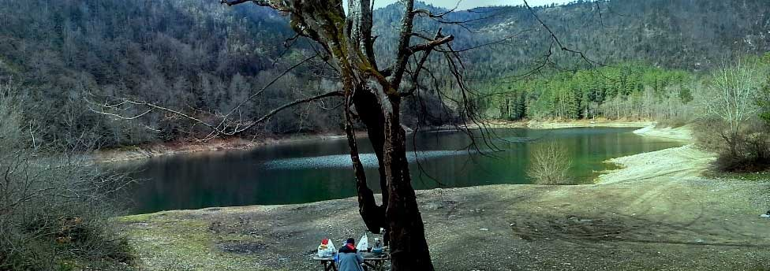
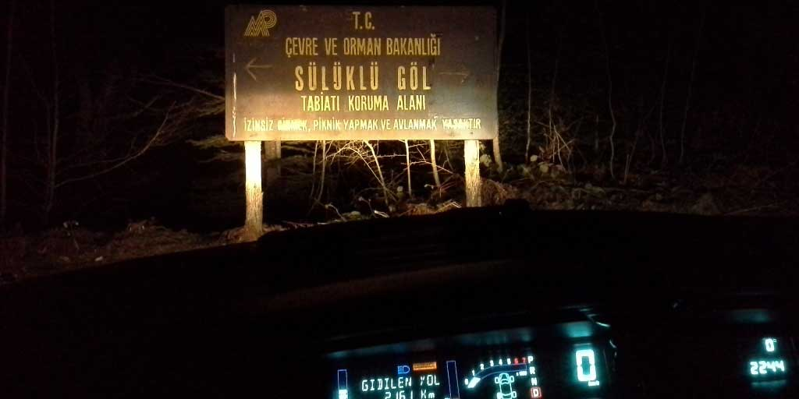
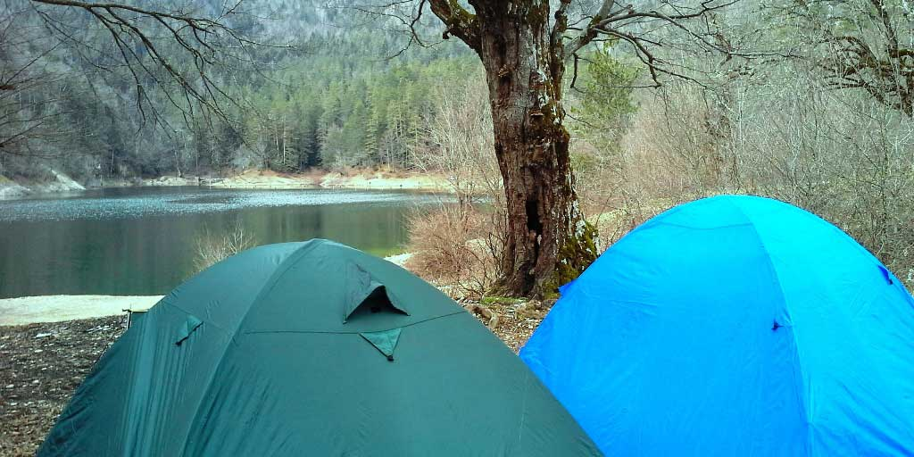
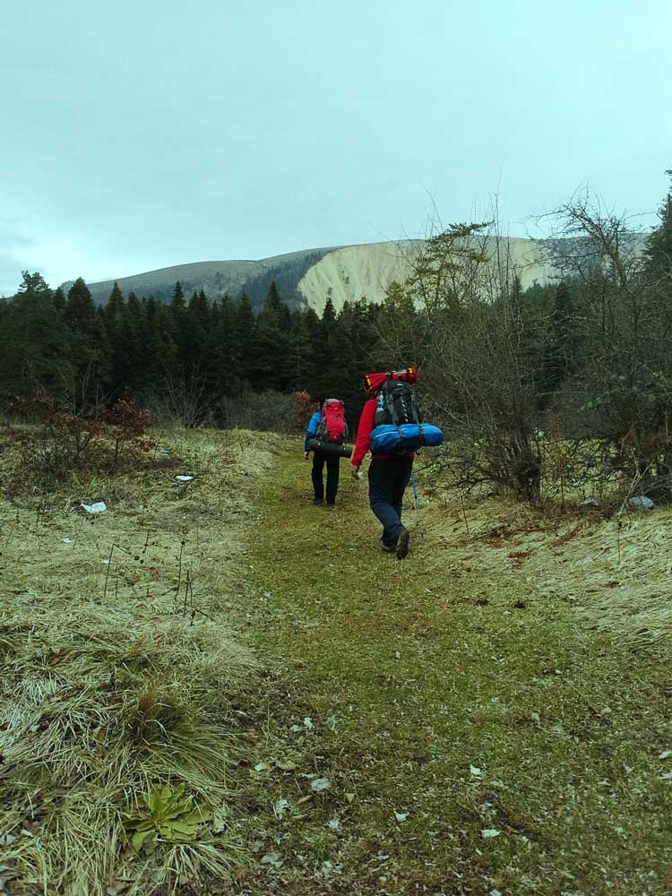
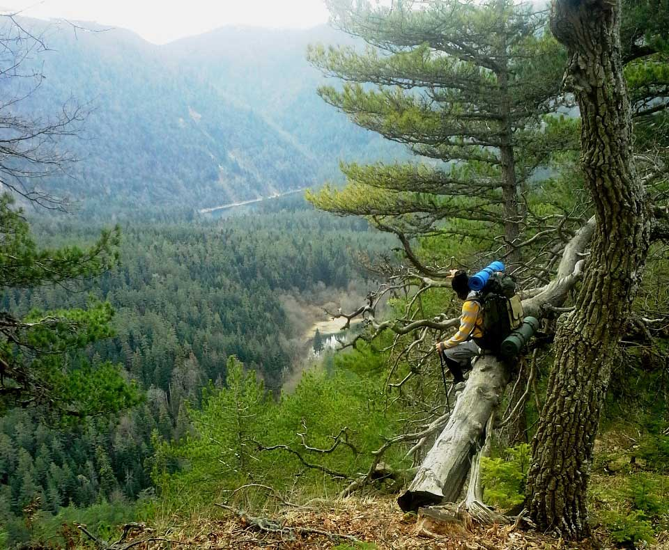
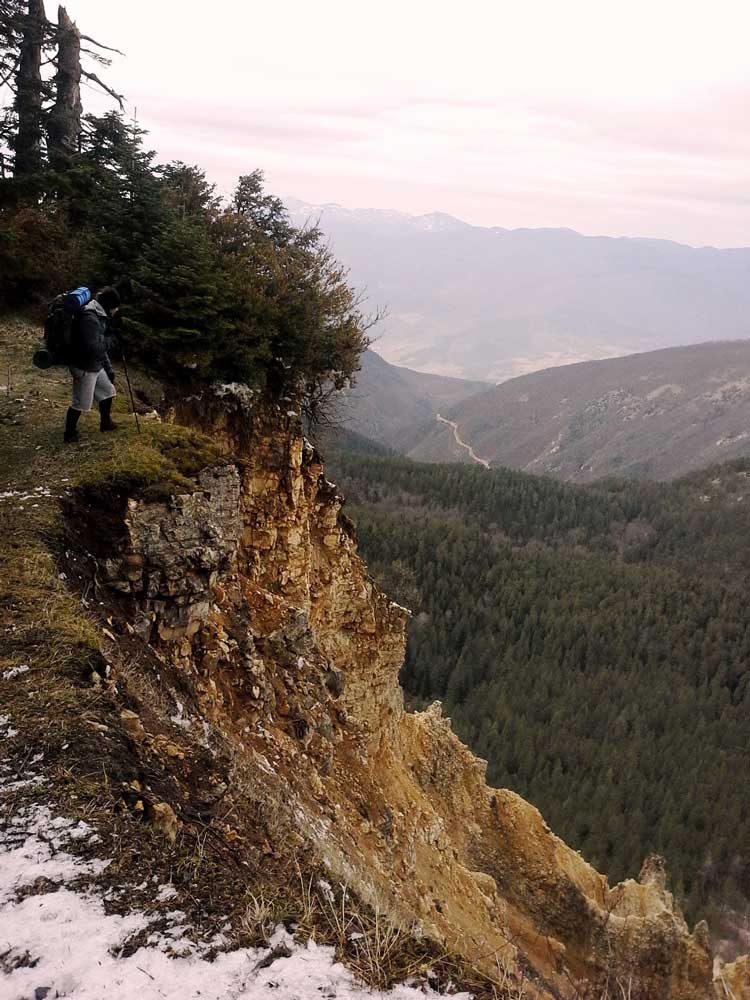
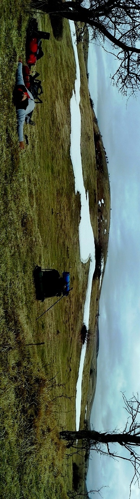
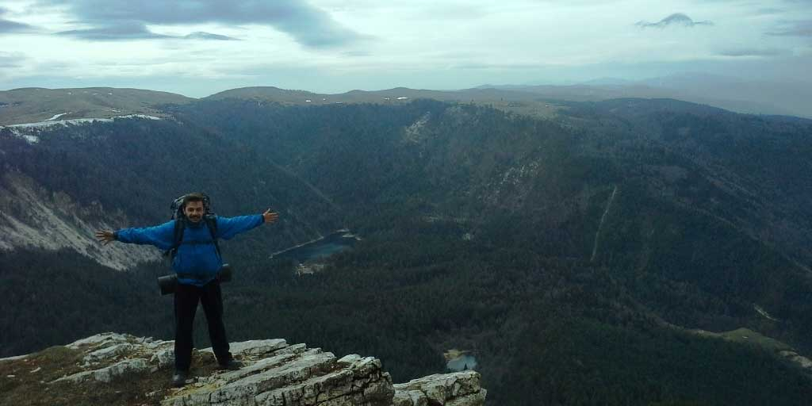

Artık sıranın Sülüklü göle geldiğini düşünüyorum. 

Kardeşim Furkan ile birlikte Cuma akşamı yola çıkmayı planlıyoruz. 2 gece 2 gün olduğunda daha uzun bir kamp yapmış gibi hissediyorum. Hem de Cumartesi sabah erkende yürüyüşe başlayabiliyorum. Planları yaparken Gürkan da bize katılmak istedi ve 3 kişilik kafa dengi bir ekiple yola çıkmaya karar verdik.

**Mesai Bitse de Gitsek**

Cuma akşam yola çıkacağım zamanlar hep böyle oluyor. Mesai bitse de gitsem :). Mesai sonrası yola çıkıyoruz. Gündüzler henüz uzamadığından hava çabuk kararıyor. Karanlıkta yollarda ilerledik. Sülüklü göle son 6km kala yol bozuluyor. Buraya kadar güzel asfalt yoldan gelmiştik. Orman için toprak ve birazı taşlık olan bu bozuk yoldan yavaş yavaş ilerlemeye devam ediyoruz ve sonunda Sülüklü göle varıyoruz. Göl kenarına kadar gidip göle yakın bir yerde düz bir alana far ışığı eşliğinde çadırlarımızı kuruyoruz. Acıktık tabi bir yemek yiyelim dedikten sonra o yorgunlukla herkes çadırına çekiliyor. Yarın yaklaşık 12kmlik yürüyüş sonunda Çubuk gölüne varmayı hedefliyoruz.

**Doğa Evimizdir**

Bugün yürüyüşe biraz geç başladık. Önce orman içerisinden ilerleyerek tepenin eteklerine kadar geliyoruz. Sonra dik bir tepeyi çıkıyoruz. Burası bizi biraz yoruyor. Çünkü kısa mesafede yükselti ciddi derece de artıyor. Zaten belirli bir yükseklikten sonra ağaçlarda kalmıyor. Ardından Sülüklü gölün etrafını dolaşan bu tepeyi takip ediyoruz. Sağ tarafımız uçurum olarak duruyor. 

Tehlikeli ama manzarası çok güzel olan bu patika bir süre sonra gölden uzaklaşarak çubuk gölüne doğru devam ediyor. Bu tepede kar bile var. Ekip çabuk yoruluyor. Dağ yolu düz yol veya patika olmadığından her zaman daha fazla yorucu olur, bilekler daha çok yorulur. Çubuk gölüne yaklaşık olarak 2 km kala Gürkan ve Furkan’ın tüm enerjisi bitiyor. Ama dağın başındayız ve düzlük yok. Bu yüzden düz bir yer bulana kadar aşağı iniyoruz. Ardından ilk bulduğumuz düzlüğe çadırları kurup, kamp ateşini yakıyoruz. Gürkan’ın ilk trekkingi ve onu hiç böyle görmemiştim. Kamplarda dinç ve enerjik olan bu adamın enerjisi kalmamıştı. Bu yüzden geceyi burada geçirmeye karar veriyoruz ve Çubuk gölüne başka zaman gideriz diye yarın geri dönmeye karar veriyoruz.

**Çay Candır**

Yemek sonrası çay içtiğimiz anda kendimize geliyoruz. Hava iyice serinledi ancak kamp ateşimiz bizi güzel ısıtıyor. Bu yüzden üşümüyoruz. Soğuğa hazırlıklı geldiğimiz için çok etkilenmiyoruz. Ateş başı muhabbetin ardından uyumak için çadırlara kaçıyoruz. Uyku tulumlarına girmeden yapışkan ısıtıcılarımızı kullanıyoruz. Bunlar cidden çok iş görüyor. Yaklaşık olarak 12 saat ısı verme yeteneği bize sıcak bir gece geçirmemizi sağlıyor.

**Bilmediğin Yola Girmeyeceksin**

Bugün artık geri dönüş yolundayız. Önce biraz yükselti çıkacağız sonrası tamamen iniş olacağı için düne göre daha rahat bir yürüyüş olacak. Tam tepeye vardığımızda Gürkan ve Furkan ta yolun en başında gözlerine kestirdikleri vadiden daha kestirme olduğu için inmek istiyorlar. Ben ise bilmediğimiz bir yola, üstelik ağaçların sık olduğu bir vadiye girmeyi istemiyorum. Bu riski almaya değmeyeceğini söylesem de arkadaşlar maceraya atılalım diyorlar. Sonrası ise olaylar olaylar. \[bu kısmı yazdım ama nerede bende bilmiyorum, bulunca linki ekleyeyim]

**Kamp Yerindeyiz**

Çok şükür bilmediğimiz bir yoldan çıkmayı başardık ve kamp yerine ulaştık. Bu bana da ders oldu bir daha kimseyi kırmamak için tamam demeyeceğim. Çünkü birisinin kafasının kırılmasındansa kalbinin kırılmasını tercih ederim. Yaklaşık 20 km orman içerisinden, patikalardan, dağ yamacından ve toprak yoldan yürüyerek kamp yerine ulaşmayı başardık.

Bu parkuru da kazasız belasız tamamlamanın ve o vadiden çıkmış olmanın sevinciyle eve dönüş yoluna koyuluyoruz. Siz siz olun bilmediğiniz yola girmeyin :)

