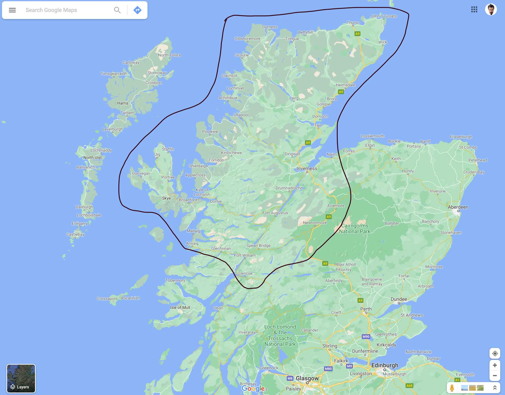

Batı İskoçya'ya diğer bir deyimle Highland bölgesine başka bir deyimle İskoçya yaylalarına tek başıma yaptığım bugüne kadarki en uzun yolculuğum sona erdi. Şimdi şapkayı önümüze koyup bir değerlendirme ve özet geçme vakti. Hadi soru cevap şeklinde yapalım bu işi.

## Yola çıkmadan ve yoldayken neler yazdım

Bu bölümler yolda yazarken ortaya çıktı. Değişik oldu be.

* [Bir Hayale Yolculuk - Isle of Skye](/bir-hayale-yolculuk-isle-of-skye/)
* [Inverness 1. Bölüm](/iskoc-yaylalari-inverness-1.-bolum/)
* [Ben Nevis 2. Bölüm](/iskoc-yaylalari-ben-nevis-2.-bolum/)
* [Isle of Skye 3. Bölüm](/iskoc-yaylalari-isle-of-skye-3.-bolum/)
* [NC500 Rotası 4. Bölüm](/iskoc-yaylalari-nc500-rotasi-4.-bolum/)

## Kaç gün sürdü ne kadar yol yaptım

Londra'dan git gel 2000km ve Highland bölgesinde de 3500km olmak üzere 29 günde toplam 5500km motor sürdüm. 85km civarında ise doğa yürüyüşü yaptım.

## Nasıl gezdim

İyi gezdim, hayvan gibi gezdim, bazen de sakin sakin gezdim. Ama çok motor sürdüm. O kadar çok sürdüm ki 1-2 gün hiç yol yapmadan evde dinlenmem gerekti. Bilgisayar başında evden çalışmam gerektiğinden haftanın 5 günü 8-5 işe bağlandım çalıştım. Akşam iş sonrası ve hafta sonları da gezdim. Bu gezi hem çalış hem de gez hayalimin bir simülasyonu oldu.

## Nereleri gezdim

2-3 farklı İskoç'tan duyduğum şey 'Doğuda yaşa batıya tatile gel' oldu. Batı İskoçya olan Highland bölgesinin en güneyi hariç her yerini gezdim. Saymak gerekirse; Isle of Skye, Ben Nevis, Fort William, Inverness, Kuzey Highland, Glencoe, Applecross, Loch Ness, Harry Potter treninin geçtiği Glennfinnan, Aviemore, Cairngorms gibi en ünlü yerlerine gittim. Alttaki haritada çizili alan içerisinde kalan neredeyse tüm yollarda motor sürdüm. Vakit olmadığından adalara gidemedim.

## Nerelerde kaldım

Normalde 4-5 gün kamp sonrasında 4-5 gün evde kal şeklinde planlamıştım. İş değişikliği tüm yıllık izin kullanım planlarımı çöpe attırdı ve sadece 3 gece kamp alanı 1 gece de Ben Nevis dağının zirvesine yakın bir yerde kamp yaptım. Onun haricinde Airbnb üzerinden ayarladığım evlerdeki odalarda kaldım. Oda bakarken fiyat&performans, masa&sandalye ve wifi üçgeninde gittim geldim. Evden çalışacağım için bunlar belirleyici kriterlerim oldu.

## Maliyet ne kadar oldu

Çok oldu, kimine göre çok kimine göre az oldu. Çalışmıyor olsaydım kesinlikle maliyetleri daha da düşürürdüm. En az yarı yarıya indirirdim. Çalıştığım için kalacağım yer önemli oldu ve bu yüzden en çok parayı konaklamaya ödedim. Temmuz 2021 itibariyle 29 günlük bu gezide kalem kalem ortalama harcamalarım şöyle oldu;

* 29 gece konaklama: 1250 pound yaklaşık olarak 15bin tl
* Benzin: 18-19 depo. 400 pound civarı, yaklaşık olarak 5bin tl
* Yeme-içme: 400 pound civarı, yaklaşık olarak 5bin tl

Gezi öncesi motor bakımları ve almam gereken bir kaç elektronik eşyayı saymıyorum. Onlar zaten rutin giderlerim olacaktı. Bunlar haricinde başka da bir harcamam olmadı. Yaklaşık 2bin pound ki bugünün TLsi ile 25 bin civarı yapar. Genelde daha az para harcayarak daha çok gezme taraftarı olmuşumdur ve dediğim gibi çalışmıyor olsam en az yarı yarıya mal ederdim bu geziyi. Ama öyle bir amacım yoktu ve o ay kazandığım paranın güzel bir kısmını bu gezi için harcamış oldum. Hiç umrumda da değil. Zaten parayı ne için kazanıyoruz ki !  

## Yolda en çok dinlediğim müzikler nelerdi

Yolda en önemli şeylerden biri kesinlikle müzik. Yoldaki ritminizi belirliyor hatta ritminizi artırıyor. 5500km boyunca farklı türlerde müzikler dinledim. Ama en çok dinlediğim, kopamadığım ve dönüp dönüp dinlediğim Daft Punk ve The Avener oldu. Yine gitsem yüzde 80 bu ikisinin müziklerini dinlerim. O güzel yollarda keyif alma olayımı tavan yaptıran müzikler oldu. 

## Yaşadığım en riskli olay

5500km az bir yol değil. Özellikle motor sırtında. Çok şükür ciddi bir kaza veya problem yaşamadım. Sadece Londra'dan İskoçya'ya giderken otobanda en sol şeritteki tırın tekeri patladı ve birden orta şeride savruldu. Allah'tan ben en sağ şeritteydim ve sadece olayı seyrettim. Orta şeritte giden karavanda bir şey yapamadı üzerinden geçti gitti. Olayın olma şekli ve hızı çok aniydi. Karavanın yerinde ben olsaydım 120km hızla giderken yapacak çok fazla bir şeyim olmazdı. Çok şükür o lastik bana gelmedi. Bu arada bilmeyenler için not geçeyim Birleşik Krallık'ta(İngiltere, İskoçya, Galler, Kuzey İrlanda) trafik soldan akıyor. 

## Unutamadığım en güzel an

Ben Nevis'te muhteşem gün batımı izledikten sonraki sabah onu 100 ile çarpan bir gün doğumu izledikten sonra duygusal bir top olup aşağı inerken hıçkırıklara boğularak ağlamam oldu. Merak edenler [Ben Nevis 2. Bölüm](/iskoc-yaylalari-ben-nevis-2.-bolum/)'ü okuyabilir.

## Keşke dediğim ne oldu

Keşke daha fazla yürüyüp kamp yapabilseydim dedim ama çalıştığım koşullarda daha fazlasını yapamazdım. Çok ciddi yoruluyordum. Bir de şu balina görme turunu keşke baştan ayarlasaydım dedim. Neyse artık sonraki sefere.

## Bir sakatlanma yaşadım mı

Kısmen evet. Londra'dan yola çıkıp 1 günde 12 saat motor sürerek 1000km sonra Inverness'e ulaştım. Tek günde bu kadar yol yapınca omuzlarım kilitlendi ve kasıldı kaldı. Ciddi omuz ağrısı çektim. 3-4 gün kas gevşetici ve yakı bandı kullandıktan sonra rahatladım. Belki de motor sürmeye alıştığımdan dolayı geri dönerken aynı sorun olmadı ama geri dönüşte hava sıcaktı ve ellerim çok terledi ki normalde de çok terler, eldivenler iyice elime yapıştı. Gidonu da sürekli tutunca kaslarda ödem oluşuyor ve ellerimde uyuşma oluyor. 1 hafta geçmesine rağmen ağrılar devam ediyor. Biraz pc ve telefon kullanımını azaltıp buz tedavisi uygulamaya başladım. Bu olumsuz etkilenmeler dışında ciddi bir problem yaşamamış olmam harika oldu.

## Beni en çok yoran şey

Bir yere gittiğimde o motor kıyafetlerini giy çıkar yapmak. Çünkü o kıyafetlerle ve botlarla yürüyemem. Bu yüzden gün içerisinde 3-4 kere onları giy çıkar yapmak beni çok yoruyordu. Ama gördüğüm manzaralar ve yoldan aldığım keyif o çileyi bana unutturdu. 

## Beni en çok üzen şey

24 yaşında tek başına yürüyüş yaparken Ben Nevis'de gün doğumunu gördükten sonra kaybolan ve daha sonra cansız bedeni bulunan gencecik bir kız. Toprağın bol olsun..

## Yanıma aldığım gereksiz malzemeler

Tripod. Allah kahretmesin bir kere bile kullanmadım ve bir dünya da yer kaplıyordu. Bunun yerine örümcek tripodu almamış olmam da üzdü. Diğer çantanın içinde kalmış. Bu yüzden hiç görmemişim. Hem hafif hem de az yer kaplardı. Bunun yanında da bir ufak çanta dolusu ıvır zıvır vardı. Ama onlar her an lazım olabilirdi de. Neyse sağlık olsun. Sonuçta sırtımda taşımadım bizim delikanlı taşıdı.

## Tekrar gitsem ne yaparım

Zaten şu aralar planını yapıyorum. Bol bol yürüyüş ve doğada kamp yaparım. Ha bir de balina görmek için tur.

Bu gezide harika anılar biriktirdim ve çok güzel tecrübeler edindim. İleride yaşamayı planladığım hayatın bir simülasyonu oldu adeta. Zaman ne gösterir ne olur bilemeyiz tabi ama nefes aldıkça hayallerin peşinde koşmaya devam edeceğiz. Yani ben edeceğim ;)