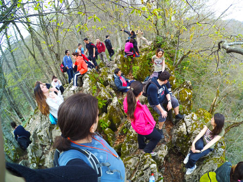

### HİKİNG NE DEMEKTİR, HİKİNG NEDİR?

Genellikle günübirlik yaptığımız ama bir kaç gün boyunca da yapılabilen uzun mesafeler yürüdüğümüz doğa yürüyüşlerine Hiking denir. 

`youtube: https://www.youtube.com/watch?v=z_8thoQiJck&t=3s`

İngilizce bir kelimedir. Bizde doğa yürüyüşü denmediği için hiking olarak bilinir. Aslında yaygın olarak kullanılan kelime trekking’dir. Trekking’de bir doğa yürüyüşüdür. Hiking’den en önemli farklı çadır konaklamalı olarak uzun soluklu doğa yürüyüşü olmasıdır.

Yukarıda fotoğraftaki gördüğünüz kare bizim iş arkadaşlarıyla kalabalık bir grup oluşturup günübirlik yaptığımız doğa yürüyüşümüze ait. Grup yürüyüşlerinde farklı bir sinerji oluşuyor. Kalabalık grup içerisinde kendi temponuza uygun mini grup bulup daha keyifli bir yürüyüş yapabilirsiniz.

Genelde günübirlik yürüyüş yapacağımız zaman sabah sandviçlerimizi yanımıza alırız. Yürüyüşümüzü yapar, dönüşte de güzel bir yemek yer ve medeniyete hayata kaldığımız yerden devam etmek için geri döneriz. Sabah kahvaltı sonrası yürüyüş her daim zor olur. Tok karnına spor yapmak gibidir. Kahvaltıdan 1-2 saat sonra yürüyüşe başlamak ise daha iyi bir tercih olabilir.

[Trekking Nedir?](/trekking-ne-demek) veya [Trekking ile Hiking Arasındaki Farklar Nelerdir? ](/trekking-ile-hiking-arasindaki-farklar-nelerdir)yazılarına göz atabilirsin.

Keyifli yürüyüşler.