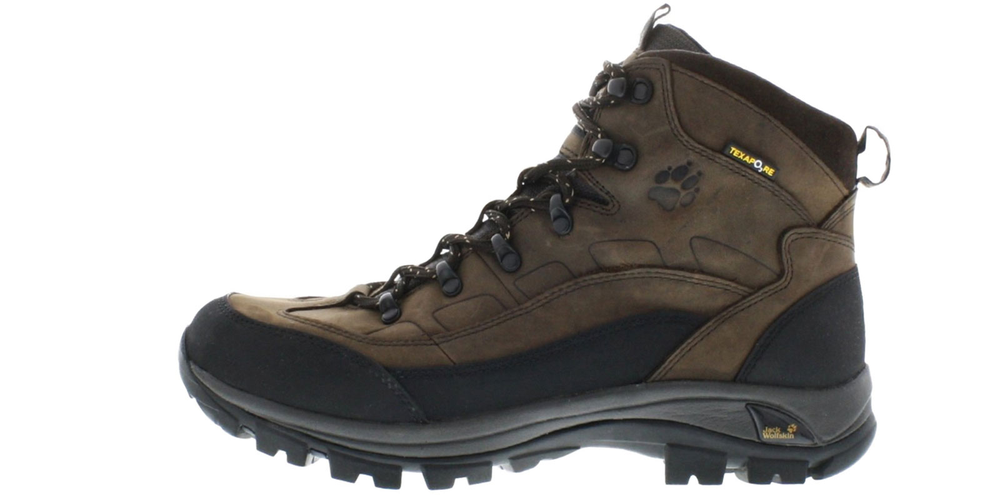

Asıl soru şöyle olmalı;

## Doğa Yürüyüşlerinde Ayakkabı Nasıl Olmalı?

Aktivite ister Trekking isterseniz Hiking olsun yapacağınız ayakkabı tercihinde alttaki görüşlerimi dilkkate alabilirsiniz. [Trekking Nedir?](/trekking-nedir) [Hiking Nedir?](/hiking-nedir) hatta [Trekking ile Hiking Arasındaki Farklar Nelerdir?](/trekking-ile-hiking-arasindaki-farklar-nelerdir) yazılarından daha detaylı bilgi edinebilirsiniz. 

Gelelim ayakkabı mevzusuna;

Aslında o kadar para verip de trekking için bir ayakkabı almaya gerek yok. Evet doğru duydunuz. En ucuzu 300 TL den(yıl oldu 2017 ve iyi bir goretex bot 600 tl civarı, nasıl olacak bende bilmiyorum) başlayan botlardan almanıza bütçenizi sarsmanıza hiç gerek yok. Güzel bir spor ayakkabınız varsa size fazlasıyla yetecektir.

Heyt be birader tam aradığım adamsın. O kadar para harcayıp bot alacakken beni bu yükten kurtardın. Ağzından bal damlıyor resmen. Ucuz yollu çözümlerle kurtardın beni.

Spor ayakkabıyla, rahat bir kışlık botla ve trekking ayakkabısıyla uzun mesafe yürüyüş yapmış biri olarak; arkadaşım yukarıdaki gibi bahsettiğim bir dünya yok. Spor ayakkabısı bileklerinizi kavramayacaktır ve yerdeki tüm taşları size hissettirecektir. En küçüğünden, en büyüğüne ve en sivrisinden en ovaline kadar hepsini hissedeceksiniz. Rahat bir kışlık bot ise şehir için tasarlanmıştır. Bileğinizi sarabilir ancak hava almayan bir bot içerisinde ayaklarınız terleyecek ve kısa süre sonra su toplayacaktır. Bunun yanında yürüyüşte patikayı iyice kavramayacağından sürekli ayağınız kayacaktır. Ek olarak bir trekking botu kadar zeminle temasınızı kesmeyecektir. Böylece yerdeki taşların bir kısmını hissedeceksiniz.

Peki bir trekking botuna o kadar para verdiğiniz de ne olacak? Yürüyüşlerinizin çok daha rahat geçeceğine emin olabilirsiniz. Gore-tex veya texapore gibi maddelerden üretilmiş bir bot seçerseniz ayağınız ıslanmayacak ve botun içi sürekli havalanıyor olacaktır. Bu kumaşların özelliği su moleküllerini geçirmeyip hava moleküllerini geçiriyor olmaları. Aa nasıl oluyor? Çok basit. Su molekülleri hava moleküllerinden daha büyüktür bu yüzden kapıdan geçemezler. Bunun bir diğer avantajı ise ayaklarınız hemen su toplamayacaktır(çok sıcak bir havada bundan kaçamazsınız). Kalın tabanı sayesinde zeminle teması keseceğinden rahat bir yürüyüş sağlıyor olacaktır. Eğer bilekleri saran bir bot tercih ederseniz yürüyüşlerde bilek burkma ihtimaliniz daha az olacaktır. Bunun yanında bilekleriniz daha az yorulacaktır.

Sonuç olarak; o kadar para verip güzel bir trekking botu alarak yıllarca keyifli yürüyüşler yapabilirsiniz. Parasının hakkını veriyor. Ne kadar para o kadar konfor :)

Merak edenler için ek bilgi: fotoğrafta görmüş olduğunuz [Jack Wolfskin Solid Trail Texapore Erkek Trekking botu](/jack-wolfskin-solid-trail-texapore-erkek-trekking-bot)nu bir süre kullandıktan sonra emekliye ayrıldı. Şimdilerde ise [Lowa Zephyr Mid Gore Tex yürüyüş botunu ](/lowa-zephyr-gtx-mid-bot-sage)ve [Meindel Respond GTX ](https://meindl.de/product/respond-gtx-en/?lang=en)yürüyüş ayakkabısını kullanmaktayım. Trekking botu seçerken ayağınıza yarım veya bir numara büyük olmasına dikkat etmelisiniz. normalde ayak büyüklüğüm 42 ancak 43 numara trekking botu giyiyorum. Giyeceğiniz trekking çorabıyla bu boşluğun bir kısmını kapatıyor olacaksınız. Üstelik yokuş aşağı inişlerde ayak parmaklarınız sıkışıp kalmayacak ve daha rahat edecektir.

Rahat yürüyüşler…