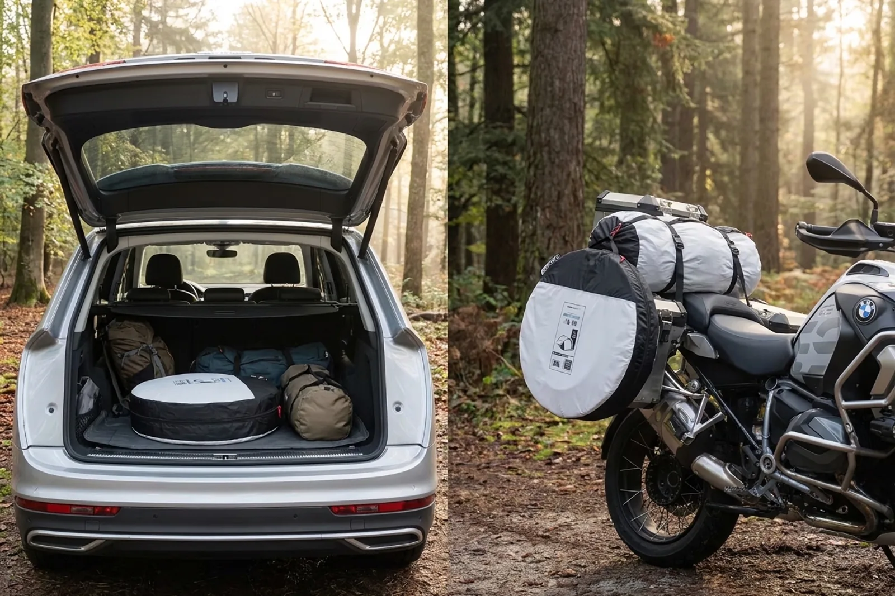
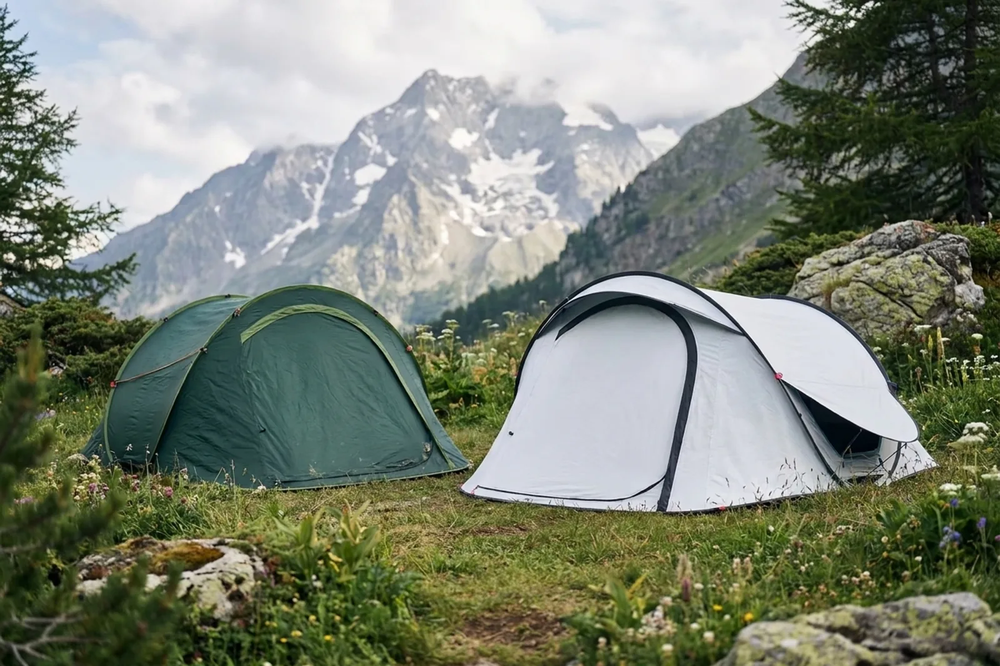
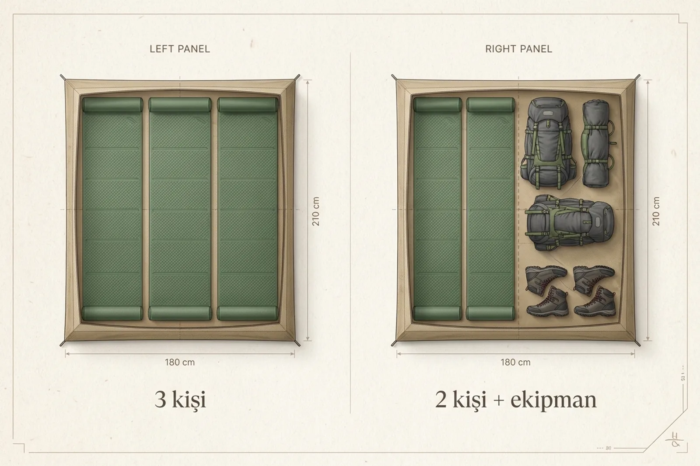
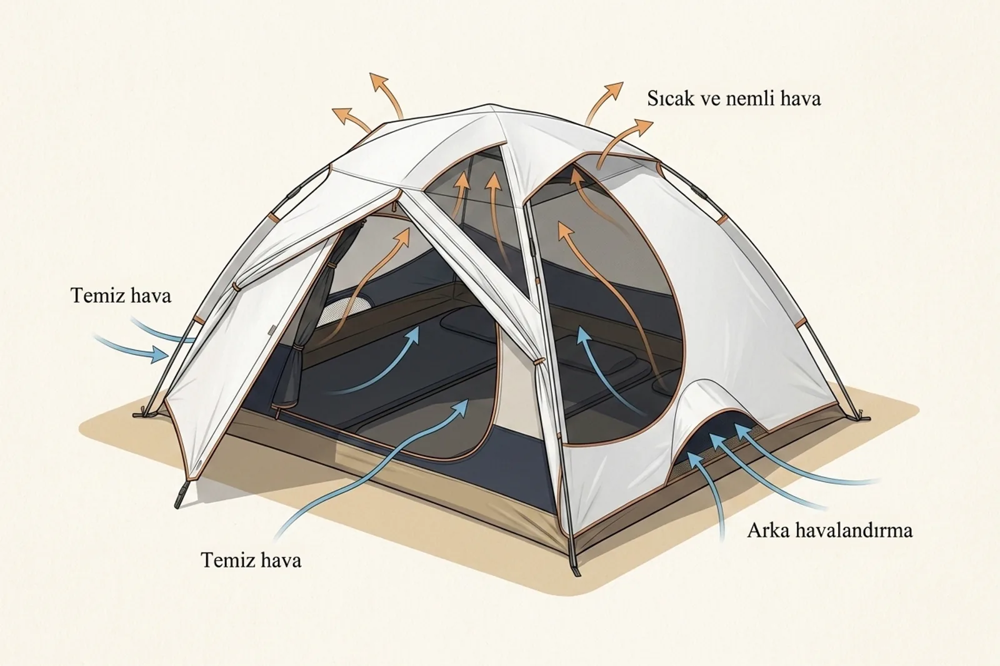
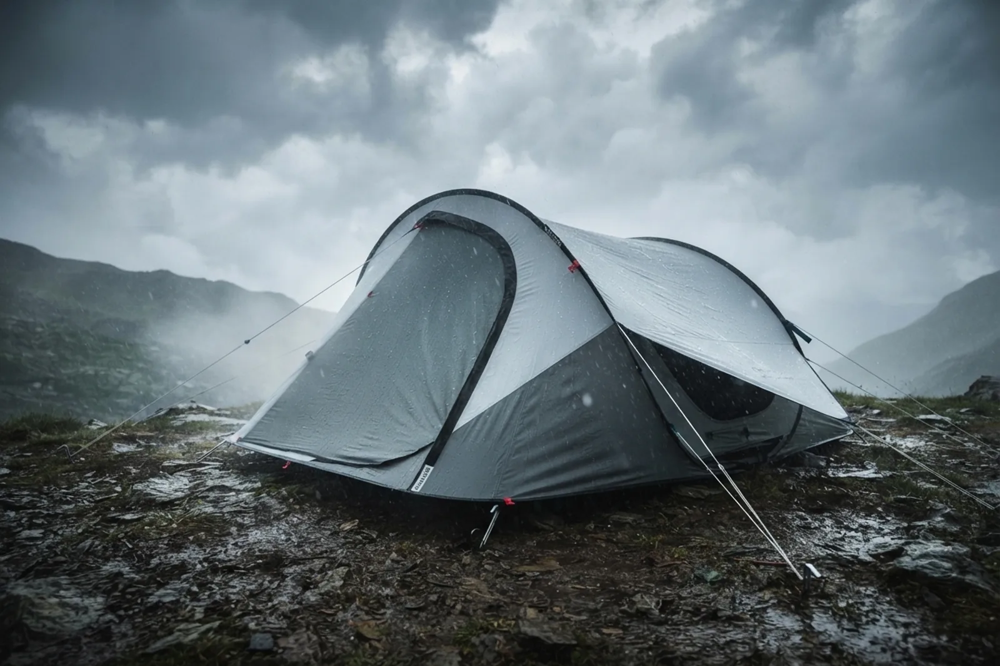

Quechua 2 Seconds Fresh&Black 3 kişilik çadır; hızlı kurulum, karanlık iç bölüm ve otomobille kamp yapanlar için rahat bir uyku alanı sunuyor. Buna karşılık 4,9 kilogramlık ağırlığı ve 86 santimetre çapındaki yuvarlak paketi yüzünden motosiklet, bisiklet ve trekking için hâlâ pek mantıklı değil.

Kısa kararım bu.

Yıllar önce serinin koyu yeşil 2 Seconds Easy 3 modelini değerlendirdiğimde de en büyük eleştirim paket hacmi ve havalandırmaydı. Yeni model havalandırma konusunda ciddi biçimde geliştirilmiş. Fakat taşıma tarafında küçülmek yerine daha da ağırlaşmış.

> Hızlı kurulan çadır, kolay taşınan çadır demek değildir.

## Quechua 2 Seconds Fresh&Black 3 kişilik çadır kime uygun?

Bu çadırı çoğunlukla otomobilin yanında kamp kuracak, gün içinde sık yer değiştirecek veya gece geç saatte kamp alanına varacak kişiler değerlendirebilir.

Özellikle şu kullanım biçimlerinde avantajlı:

- Otomobille yapılan hafta sonu kampları
- Festival ve kamp alanı konaklamaları
- Kurulumla uzun süre uğraşmak istemeyen yeni kampçılar
- Sabah güneşiyle erkenden uyanmak istemeyenler
- Tek kişi geniş, iki kişi rahat bir uyku alanı arayanlar

Buna karşılık motosiklet, bisiklet veya sırt çantasıyla seyahat ediyorsanız paket ölçüsü baştan sorun çıkarıyor. Çadırın yuvarlak taşıma çantası 86 × 10 santimetre ve toplam hacmi 58 litre. Ağırlığı ise 4,9 kilogram.

Ben zaman zaman motosikletle seyahat ettiğim için böyle bir paketi taşımak istemem. Motosiklete bir şekilde bağlasanız bile rüzgâr alan geniş bir disk hâline geliyor. Sırt çantasına takmaya çalışırsanız da çadır değil, uydu anteni taşıyormuşsunuz gibi gezebilirsiniz.

Çadır seçimini yalnızca kişi sayısına göre yapmamak gerektiğini [çadır alırken dikkat edilmesi gerekenler](/cadir-alirken-nelere-dikkat-edilmeli/) rehberinde daha ayrıntılı anlattım.

*Yuvarlak paket otomobilde pratik olabilir; motosiklet ve sırt çantasında aynı rahatlığı sağlamaz.*

## Yeni 2 Seconds Fresh&Black modelinde neler değişti?

Eski koyu yeşil 2 Seconds Easy 3 ile yeni modelin uyku alanı birbirine oldukça yakın. Asıl değişiklikler kumaş, havalandırma ve taşıma ölçülerinde görülüyor.

| Özellik | Eski 2 Seconds Easy 3 | Yeni 2 Seconds Fresh&Black |
|---|---:|---:|
| Uyku alanı | 180 × 210 cm | 180 × 210 cm |
| Kullanılabilir yükseklik | Yaklaşık 104 cm | 102 cm |
| Ağırlık | 3,9 kg | 4,9 kg |
| Paket | Büyük, yuvarlak disk | 86 × 10 cm, 58 litre |
| Karanlık iç bölüm | Yok | Fresh&Black |
| Havalandırma | Daha sınırlı | İki yan ve bir arka açıklık |
| Dış tente su geçirmezliği | Modele göre değişiyor | 2.000 mm üzeri |
| Rüzgâr testi | — | Doğru kurulumla 50 km/sa |

Yeni model aynı taban alanını korurken yaklaşık bir kilogram ağırlaşmış. Yani Fresh&Black kumaş ve geliştirilen havalandırma konfor getiriyor ama bunun taşıma tarafında bir bedeli var.

*Yeni model havalandırma ve karanlık konusunda ilerlerken ağırlık ve paket hacmi artmış.*

## Çadır gerçekten iki saniyede kuruluyor mu?

Çadır kılıfından çıkarılıp kayışları çözüldüğünde gövde gerçekten birkaç saniye içinde şeklini alıyor. Fakat “iki saniye” ifadesini çadırın tamamen kurulup geceye hazır olması şeklinde anlamamak gerekir.

Çadırı doğru yöne çevirmek, kazıkları çakmak, germe iplerini ayarlamak ve havalandırmaları açmak ayrıca zaman alıyor. Yapılan bir saha incelemesinde bütün kazıklar, ipler ve havalandırmalarla kurulumun alıştıktan sonra yaklaşık üç dakika sürdüğü belirtiliyor.

Bu yine de oldukça hızlı.

Toplama tarafı ise biraz pratik istiyor. İnternetteki kullanıcı yorumlarında en sık tekrarlanan konulardan biri, çadırın kolay açıldığı fakat ilk birkaç katlamada insanı uğraştırdığı. Hatta bazı kullanıcılar gövdeyi bükerken çadırı kıracakmış gibi hissettiklerini anlatıyor.

Ben olsam ilk kampı beklemeden evde veya bahçede birkaç defa açıp toplardım. Yağmur başlarken, hava kararırken veya dönüş için acele ederken kullanım videosunu aramak pek keyifli olmaz.

## Üç kişi bu çadırda rahat kalabilir mi?

Taban ölçüsü 180 × 210 santimetre. Bu alan, yan yana yerleştirilmiş üç adet 60 santimetrelik mata matematiksel olarak yetiyor.

Matematik yetiyor da insan rahat ediyor mu? Orası biraz karışık.

Üç yetişkin içeride uyuyabilir fakat çantalar, botlar ve diğer kamp malzemeleri devreye girdiğinde alan hızla daralır. Kullanıcı değerlendirmelerinde de üç kişilik modelin iki kişi ve ekipman için daha rahat olduğu sıkça söyleniyor.

Ben bu çadırı şöyle değerlendirirdim:

- Tek kişi için oldukça geniş
- İki kişi ve temel ekipman için rahat
- Üç yetişkin için kullanılabilir ama sıkışık
- Üç kişi ve büyük çantalar için yetersiz

Üretici, kişi başına en fazla 60 santimetre genişliğinde mat kullanılmasını öneriyor. Altı santimetreden daha kalın şişme matlar ise kullanılabilir yüksekliği azaltarak iç tenteye yaklaşmanıza ve yoğunlaşmanın daha fazla hissedilmesine neden olabilir.

*Üç mat tabana sığıyor; iki kişi ve ekipman düzeni ise daha rahat bir yaşam alanı bırakıyor.*

## Fresh&Black teknolojisi gerçekten işe yarıyor mu?

Fresh&Black kumaşın iki amacı var: Güneş ışığını büyük ölçüde kesmek ve güneş altında iç bölümün daha yavaş ısınmasına yardımcı olmak.

Özellikle yazın sabahın köründe çadırın içini aydınlatan güneşten rahatsız oluyorsanız bu özellik ciddi bir konfor sağlayabilir. Festival kullanıcılarının yorumlarında daha geç saate kadar uyuyabildiklerini söyleyenler var. Klasik bir çadır ile Fresh&Black modeli yan yana kullanan bazı kampçılar da karanlık modelin sabah saatlerinde belirgin biçimde daha konforlu olduğunu anlatıyor.

Yalnız bunu klima gibi düşünmeyin. Çadır doğrudan güneş altında kaldığında yine ısınır. Kumaş ısıyı geciktirir; havayı buzdolabına çevirmez.

Üstelik iç bölüm karanlık olduğu için gündüz çadırın içinde oturmak isteyenlere kasvetli gelebilir. Bu özellik kimisi için güzel bir uyku odası, kimisi için öğlen vakti küçük bir mağara demek.

## Yeni modelin havalandırması yeterli mi?

Eski modelde eleştirdiğim konulardan biri havalandırmaydı. Yeni Fresh&Black modelde iki yan ve bir arka havalandırma bulunuyor. Yan açıklıklar kumaş panel ile sineklikli fileden oluşuyor; arka bölüm de içeriden ayarlanabiliyor.

Bu, eski modele göre önemli bir gelişme.

Yine de hiçbir havalandırma sistemi yoğuşmayı tamamen ortadan kaldırmaz. İnsan nefesi, ıslak kıyafetler, nemli zemin ve sıcaklık farkı gece boyunca iç yüzeylerde su birikmesine neden olabilir.

Bir saha testinde yan havalandırmalar açık bırakıldığında tek kişilik gece kullanımında belirgin yoğunlaşma görülmediği belirtilmiş. Başka kullanıcılar ise nemli havalarda bir miktar yoğuşmayla karşılaştıklarını söylüyor. Bu iki deneyim birbiriyle çelişmek zorunda değil; hava, kişi sayısı ve havalandırmaların kullanımı sonucu değiştiriyor.

*Yan ve arka açıklıkların kullanılabilmesi yoğuşma riskini azaltır; tamamen ortadan kaldırmaz.*

Yoğuşmayı azaltmak için:

- Yan ve arka havalandırmaları mümkün olduğunca açık tutun
- Islak kıyafetleri uyku alanına yığmayın
- Çadırı germe ipleriyle düzgün biçimde kurun
- Dış tentenin iç bölüme yapışmasına izin vermeyin
- Sabah çadırı toplamadan önce havalandırın

Çadır su geçirmiyor olabilir; içerideki hamamın sahibi yine siz olabilirsiniz.

## Yağmur ve rüzgâr performansı nasıl?

[Decathlon’un ürün bilgilerine göre](https://www.decathlon.com.tr/p/3-kisilik-otomatik-kamp-cadiri-freshandblack-2-seconds/_/R-p-346717) dış tente 2.000 mm üzeri, zemin ise 2.400 mm üzeri su geçirmezlik değerine sahip. Dikişler bantlanmış ve çadır, saatte 200 milimetrelik yağışı taklit eden laboratuvar testine üç saat boyunca maruz bırakılmış.

Rüzgâr dayanımı da doğru biçimde kurulup bütün germe ipleri kullanıldığında 50 km/sa olarak açıklanıyor.

Bunlar karşılaştırma yapmak için faydalı laboratuvar değerleri. Arazideki sonuç; çadırın yönüne, kazıkların zeminde ne kadar iyi tuttuğuna, iplerin gerginliğine ve bakım durumuna bağlı.

Özellikle rüzgârlı havada yalnızca çadır kendi kendine ayakta duruyor diye kazıkları çakmadan bırakmayın. Saha incelemelerinde gövdenin sert rüzgârda esneyip tekrar biçimini aldığı görülmüş. Bu esneklik normal olsa da dış tente iç bölüme değerse yoğuşma veya yüzeydeki su içeriye temas edebilir.

Sert ve taşlı zeminde standart kazıkların yeterli olmayabileceğini düşünüyorsanız kullandığım [Ferrino çelik çadır kazıklarına](/ferrino-cadir-kazigi/) da bakabilirsiniz. Çelik kazıkların sağlamlık karşılığında fazladan ağırlık getirdiğini unutmayın.

*Laboratuvar değeri kadar çadırın doğru yönde kurulması ve germe iplerinin kullanılması da önemlidir.*

## İnternetteki kullanıcı yorumlarında neler söyleniyor?

Yorumları okurken model adlarına dikkat etmek gerekiyor. “2 Seconds”, “2 Seconds Easy” ve “Fresh&Black” adları farklı yıllardaki benzer modellere de verildiği için her yorum doğrudan `8801561` ürün kodlu yeni modele ait olmayabilir.

Yine de farklı model yıllarında tekrar eden bazı ortak noktalar var:

- **Kurulum çok hızlı, toplama pratik istiyor.** Çadır birkaç saniyede açılıyor fakat sekiz biçiminde katlama hareketini öğrenmek gerekiyor.
- **Fresh&Black sabah konforunu artırıyor.** Karanlık iç bölüm ve güneşi yansıtan kumaş özellikle yaz kamplarında beğeniliyor.
- **Üç kişilik kapasite iyimser bulunuyor.** Birçok kullanıcı modeli iki kişi ve ekipman için daha uygun görüyor.
- **Paket hacmi en büyük dezavantaj.** Otomobil kampında kabul edilebilirken tren, motosiklet ve yürüyüşte taşıması zor bulunuyor.
- **Yoğuşma hava şartlarına göre değişiyor.** Havalandırmaları açık kullananlar daha iyi sonuç alıyor; nemli ve kapalı kullanımda su damlacıkları görülebiliyor.

Bu değerlendirmeler [ayrıntılı saha testleri](https://campingguidance.com/quechua-2-seconds-fresh-and-black-tent-review/), [uzun kullanım incelemeleri](https://www.test4outside.com/en/produit/quechua-fresh-black-2-secondes-3-personnes/) ve [kampçı yorumları](https://www.reddit.com/r/camping/comments/1bkqyej/looking_for_a_great_3_person_pop_up_tent/) arasında tekrar eden gözlemler.

## 2 Seconds Fresh&Black çadırın artıları ve eksileri neler?

### Artıları

- Çok hızlı kuruluyor
- Kendi kendine ayakta duruyor
- Fresh&Black kumaş sabah ışığını ciddi biçimde azaltıyor
- İki kişi için rahat bir uyku alanı sunuyor
- Yan ve arka havalandırmalar eski modele göre daha kullanışlı
- Yağmur ve rüzgâr için açıklanmış laboratuvar testleri bulunuyor
- Yedek parçaları değiştirilebiliyor
- Beş yıllık garantiyle satılıyor

### Eksileri

- 4,9 kilogram ağırlığında
- 86 santimetrelik yuvarlak paket çok yer kaplıyor
- Motosiklet, bisiklet ve trekking için uygun değil
- Üç yetişkin ve ekipman için dar kalıyor
- Geniş ve kapalı bir bagaj bölümü bulunmuyor
- Katlama hareketini önceden öğrenmek gerekiyor
- Karanlık iç bölüm gündüz kullanımında herkese hitap etmeyebilir

## Bu çadırı alır mıydım?

Otomobille hafta sonu kampına gidecek, çadırı hızlıca kuracak ve sabah güneşinden korunmak isteyecek olsam değerlendirebilirdim. Tek kişi için ferah, iki kişi için rahat ve kurulumu gerçekten pratik.

Motosikletle veya sırt çantasıyla seyahat edecek olsam almazdım. Eski modelde söylediğim şey yeni model için de geçerli: Ağırlıktan önce o kocaman yuvarlak paketi nereye koyacağınızı düşünmeniz gerekiyor.

Benim kullanımımda daha küçük paketlenen, iç ve dış tentesi ayrı yönetilebilen bir trekking çadırı daha mantıklı. Bu kullanım biçimine örnek olarak [Ferrino Lightent 2 incelememe](/ferrino-lightent-2-kamp-cadiri/) bakabilirsiniz.

Yeni 2 Seconds Fresh&Black eski modelin havalandırma ve sabah sıcaklığı gibi zayıf noktalarını iyileştirmiş. Fakat onu hâlâ bir taşıma çadırı değil, otomobilin yanında kullanılacak pratik bir kamp çadırı olarak görüyorum.

Siz bu çadırı hangi hava koşulunda, kaç kişiyle kullandınız? Özellikle katlama kolaylığı, sabah sıcaklığı, yağmur performansı ve yoğuşma tecrübenizi marka, model ve gece koşullarıyla yorumlara yazarsanız satın almayı düşünenlere gerçekten faydalı bir karşılaştırma bırakmış olursunuz.
