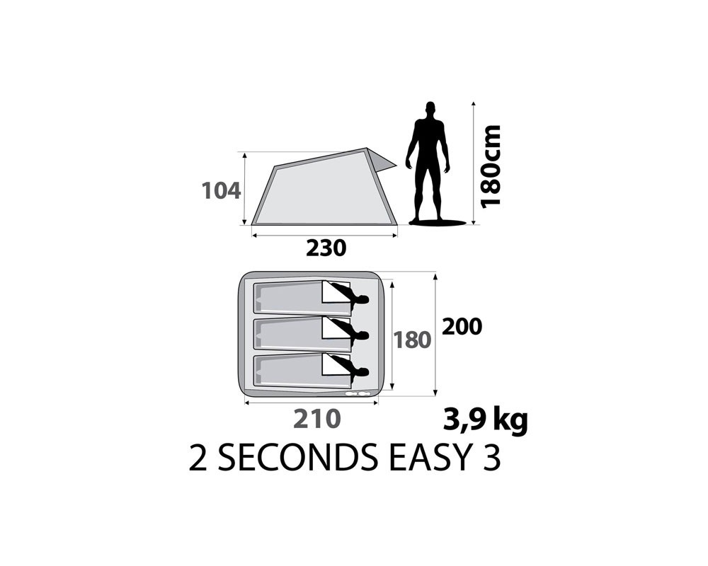

Fiyatına göre kaliteli bir ürün. En büyük artısının kolay kurulum ve kolay toplama olduğu söyleniyor. Kurulum süresi açısından diğer çadırlardan çok farklı yok. Zaten yağmurluklu çadırların da kurulumu zor değil. Bu yüzden kolay ve hızlı kurulum sloganının büyük bir artı olduğunu düşünmüyorum. Geniş iç hacmi, kapı kısmındaki küçük bagaj alanı ve gölgeliği daha önemli artıları olarak görebiliriz. Eksileri ise katlanmış hali çok büyük, aracın bagajında bile fazla yer kaplıyor. Yağmurluk ve tentenin ayrı olmaması da havalandırmasını daha kötü kılıyor. Yağmurluk ve tentesi ayrı olan çadırların havalandırması her zaman daha iyidir ve katlanmış boyutunun da büyük olmaması araçta daha az yer kaplaması açısından önemli bir etken oluyor. 3.9kg olması ise azımsanmayacak bir ağırlık.

Benim gibi zaman zaman motorda seyahat ediyorsanız bu çadır kesinlikle size göre değil. Çünkü yer sorununuz var. Daha iyi havalandırma ve daha fazla sağlamlık istiyorsanız yağmurluk ve tentesi ayrı olan çadır tercih etmelisiniz. Yer sorunum yok fiyatı da bence iyi diyorsanız tercih edebilirsiniz.