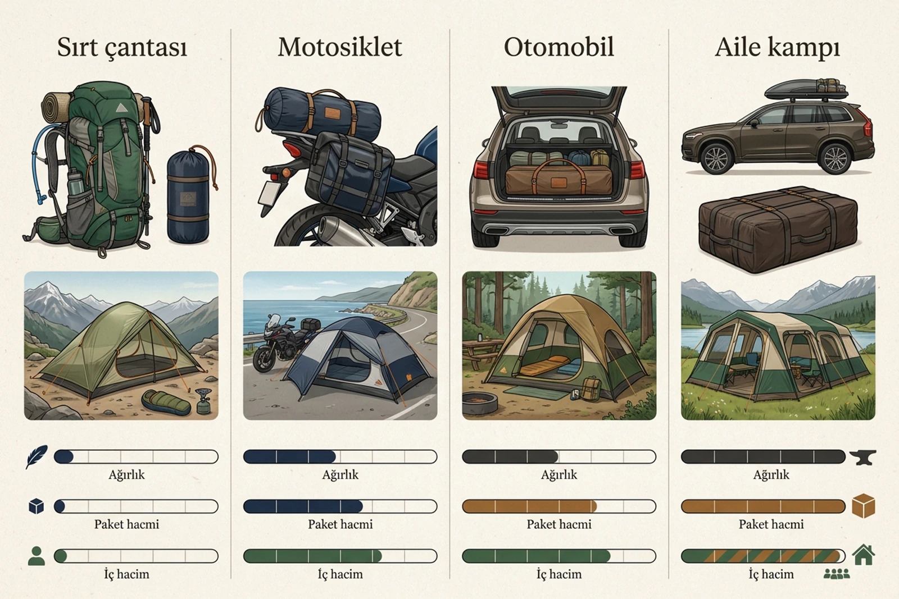
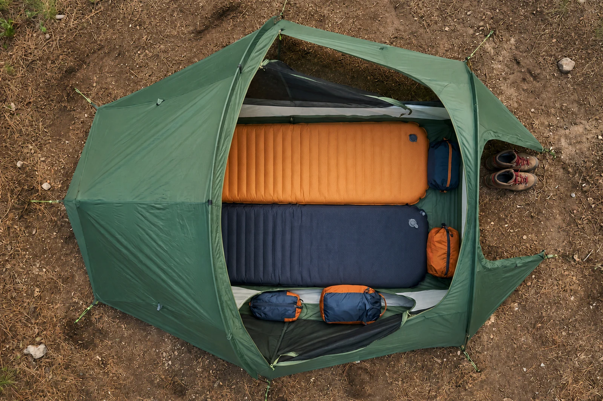
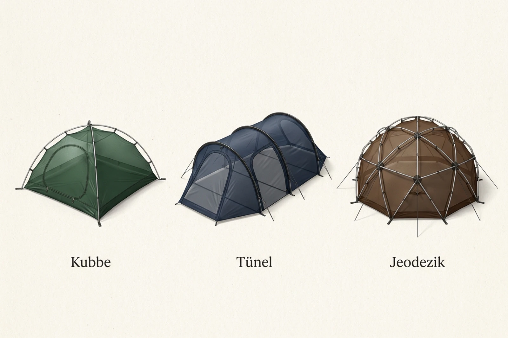
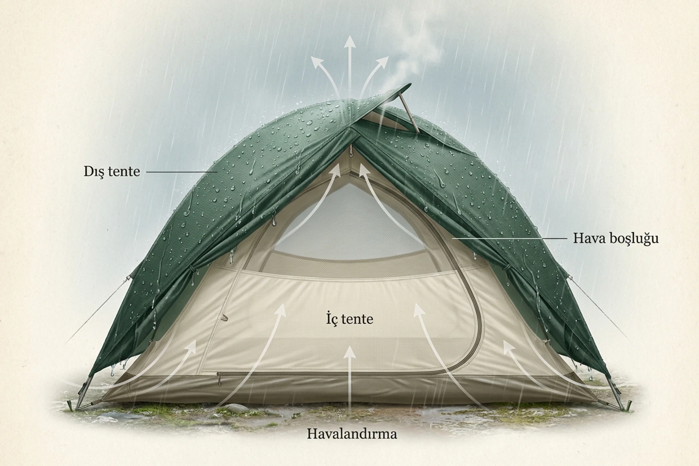
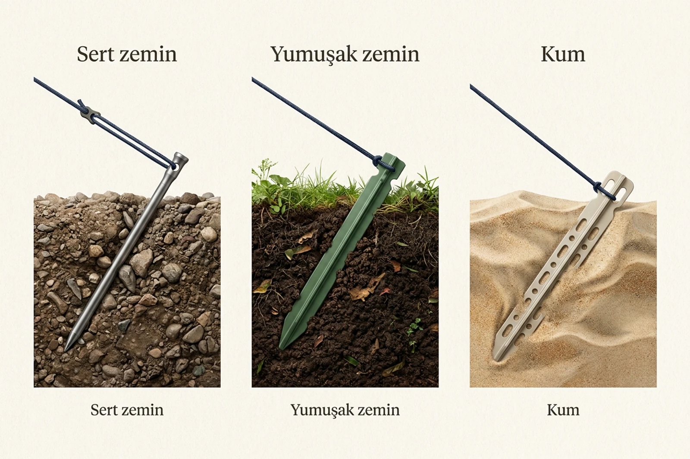

Bana en çok gelen sorulardan biri şu: “Çadır alırken nelere dikkat etmeliyim, nasıl bir çadır almalıyım?”

Kısa cevap şu: Herkese uygun tek bir çadır yok. Aracın yanında iki gece kamp yapacak biriyle bütün ekipmanını sırtında taşıyacak birinin aynı çadırı seçmesi zaten pek mantıklı değil.

Önce çadırı nerede, kaç kişiyle ve nasıl taşıyarak kullanacağınızı belirleyin. Ardından ağırlık, paket hacmi, iç alan, hava koşulları, havalandırma ve kurulum biçimini karşılaştırın. Marka ve model aramaya bundan sonra başlayın.

> İyi çadır, mağazada en çok özelliği olan değil; sizin kampınızda en az sorun çıkaran çadırdır.

## Çadır alırken nelere dikkat edilmeli?

İlk sorunuz “Kaç kişilik çadır almalıyım?” değil, “Bu çadırı nasıl kullanacağım?” olmalı.

Çadır otomobilin bagajında taşınacaksa birkaç kilogram fazla ağırlık dünyanın sonu değildir. Geniş bir bagaj bölümü, ayakta durabileceğiniz bir yaşam alanı ve rahat giriş çıkış daha önemli olabilir.

Motosiklet, bisiklet veya sırt çantası devreye girdiğinde hesap değişir. Bu defa yalnızca ağırlığa değil, çadırın katlanmış uzunluğuna ve kapladığı hacme de bakmanız gerekir. Hafif olduğu hâlde çantaya veya motosiklete bağlanamayacak kadar büyük bir paket de işinizi görmez.

*Önce taşıma biçimini belirleyin; doğru ağırlık ve hacim hesabı onun arkasından gelir.*

| Kullanım biçimi | Öncelik verilmesi gerekenler | Kabul edilebilir ödün |
|---|---|---|
| Otomobille kamp | İç hacim, bagaj alanı, tavan yüksekliği | Fazladan ağırlık ve hacim |
| Motosiklet veya bisiklet | Paket ölçüsü, bağlantı kolaylığı, ağırlık | Daha dar yaşam alanı |
| Trekking | Toplam ağırlık, küçük paket, hava dayanımı | Daha az iç alan |
| Aile kampı | Ayrı bölümler, havalandırma, geniş giriş | Uzun kurulum süresi |
| Kış ve açık arazi | Güçlü iskelet, sağlam sabitleme, rüzgâr ve kar dayanımı | Daha yüksek ağırlık ve fiyat |

## Kaç kişilik çadır almalısınız?

Çadırın üzerinde yazan kişi sayısı genellikle kaç kişinin yan yana uyuyabileceğini anlatır. Çantalarınızın, botlarınızın ve diğer ekipmanların da içeride rahatça yaşayacağını garanti etmez.

Tek başınıza ve mümkün olduğunca hafif yürüyorsanız tek kişilik çadır mantıklı olabilir. Fakat daha uzun kalacak, ekipmanınızı içeri alacak veya biraz hareket alanı isteyecekseniz iki kişilik model daha rahat olabilir.

Ben Ferrino Lightent alırken önce tek kişilik modeli düşünmüştüm. İki kişilik modelle arasında yaklaşık 300 gram fark vardı. Sonunda [Ferrino Lightent 2’yi](/ferrino-lightent-2-kamp-cadiri/) aldım ve iyi ki öyle yapmışım dedim. Tek başıma kaldığımda eşyalarım için yer açıldı; iki kişi gittiğimizde ise ikinci bir çadır taşımamız gerekmedi.

Bu, herkes tek başına kamp yaparken iki kişilik çadır alsın demek değil. Fazladan alanın ağırlığına değip değmeyeceğine karar vermeniz gerekiyor.

*Etiketteki kişi sayısını değil, gerçekten kullanabileceğiniz alanı karşılaştırın.*

Ürün ölçülerinde şunlara bakın:

- Yalnızca toplam taban alanına değil, uyku bölümünün en ve boyuna
- Kullanacağınız matların yan yana sığıp sığmadığına
- Tavanın baş ve ayak kısmında ne kadar alçaldığına
- Çantaların içeride mi, bagaj bölümünde mi kalacağına
- Kapının gece diğer kişiyi rahatsız etmeden kullanılıp kullanılamadığına

## Ağırlık ve paket hacmi neden ayrı ayrı önemli?

İlk kullandığım çadırlardan biri yaklaşık 4 kilogramdı. Yalnızca kamp yapmak için bir yere gittiğimde bu ağırlık büyük bir sorun değildi. İş trekking yapmaya gelince aynı çadır sırtımda ciddi bir yüke dönüşüyordu.

İlk zamanlarda “İki kilogram fazla taşırım, ne olacak?” diye düşünüyordum. Tecrübe arttıkça bazen 100 gramın bile günün sonunda nasıl hissedildiğini gördüm. Demek ki bazı şeyleri yaşayarak öğrenmem gerekiyormuş.

Yine de yalnızca katalogdaki ağırlığa bakmak yetmez. Şunları ayrıca kontrol edin:

- Yazılan değer yalnızca çadır gövdesini mi, yoksa direk, kazık ve taşıma çantasını da mı kapsıyor?
- Katlanmış çadırın uzunluğu ve çapı ne kadar?
- Paket sırt çantasının içine sığıyor mu?
- Direkler motosiklete veya bisiklete güvenli biçimde bağlanabiliyor mu?
- Ağırlık iki kişi arasında paylaştırılabiliyor mu?

İncelediğim [2 Seconds Easy 3 kamp çadırının](/2-seconds-easy-3-kamp-cadiri/) kurulumu kolay ve iç hacmi genişti. Fakat katlanmış hâli motosikletle taşımaya uygun değildi. Aracın bagajında yer sorunu yaşamayan biri için aynı özellik sorun olmayabilir.

Yani “hafif çadır” ile “kolay taşınan çadır” her zaman aynı şey değildir.

## Hangi çadır tipi size uygun?

Çadırın biçimi yalnızca görüntüsünü değil, kurulum şeklini, kullanılabilir alanını ve rüzgârdaki davranışını da etkiler.

*Çadırın şekli, kullanılabilir alan kadar kuracağınız zemini de belirler.*

### Kubbe çadır

Direkleri çoğunlukla merkezde çaprazlanır. Pek çok kubbe çadır kendi başına ayakta durabilir ve kurulumu kolaydır. Genel kamp kullanımı ve sık yer değiştirenler için pratiktir.

Kendi başına ayakta durması, kazığa ihtiyaç duymadığı anlamına gelmez. Rüzgâr çıktığında sabitlenmemiş çadırı kamp alanında kovalamak istemezsiniz.

### Tünel çadır

Paralel yaylardan oluşan yapısı sayesinde ağırlığına göre geniş bir iç hacim sunabilir. Aile çadırlarında ve uzun yaşam alanı isteyenlerde sık görülür.

Buna karşılık doğru biçimde gerilmesi ve sağlam kazıklanması gerekir. Sert veya kayalık zeminde sabitleme noktaları baştan düşünülmelidir.

### Jeodezik ve yarı jeodezik çadır

Birden fazla direğin farklı noktalarda kesişmesi yükü iskelete dağıtır. Açık arazide, kuvvetli rüzgâr ihtimalinde ve daha zor koşullarda tercih edilir.

Bu sağlamlığın karşılığında genellikle daha fazla direk, daha yüksek ağırlık, daha uzun kurulum ve daha yüksek fiyat gelir.

## Üç mevsim mi, dört mevsim mi?

“Dört mevsim” ifadesi, her kamp için daha iyi çadır anlamına gelmez. Bu sınıflandırma takvimden çok karşılaşılması beklenen hava koşullarını anlatır.

Üç mevsim çadırlar genellikle kar yükünün beklenmediği ilkbahar, yaz ve sonbahar kullanımı için tasarlanır. Daha fazla file alanına sahip olabilir; hafiflik ve havalandırma ön plandadır.

Dört mevsim çadırlar ise kuvvetli rüzgâr, kar yükü ve sert kış şartları düşünülerek daha güçlü iskeletlerle üretilir. Bunun bedeli çoğunlukla daha fazla ağırlık, daha az havalandırma ve daha yüksek fiyattır.

Kış kampı yapmayacaksanız sırf adı daha güçlü geliyor diye dört mevsim çadır taşımak gereksiz olabilir. Öte yandan yüksek, açık ve hava değişiminin hızlı olduğu arazilerde yalnızca “üç mevsim” etiketine güvenmek de doğru değildir. Direk yapısını, sabitleme noktalarını ve üreticinin tarif ettiği kullanım koşullarını birlikte inceleyin.

## Çadırın su geçirmezlik değeri ne anlatır?

Çadır kumaşlarında gördüğünüz 2.000 mm, 3.000 mm veya 5.000 mm gibi değerler hidrostatik su basıncı testini anlatır. Kumaşın suyu hangi basınca kadar geçirmediği laboratuvar ortamında ölçülür.

Örneğin 3.000 mm değeri, kumaşın yaklaşık üç metrelik su sütununun oluşturduğu basınca karşı test edildiğini ifade eder. Bu sayı, çadırın içinde her şartta kuru kalacağınızın garantisi değildir.

Genel üç mevsim kullanımı için dış tentede 2.000–3.000 mm aralığına bakmak makul bir başlangıç olabilir. Uzun süreli yağış, rüzgârla sürüklenen yağmur ve daha açık kamp alanları söz konusuysa daha yüksek değerleri değerlendirmek gerekir. Taban kumaşında ise üzerine uygulanan vücut ve ekipman basıncı nedeniyle daha yüksek değerlere rastlanması normaldir.

Fakat sayıların yanında şunları da kontrol edin:

- Dikişlerin tamamı bantlanmış mı?
- Taban kenarları suyun içeri yürümesini önleyecek kadar yükseliyor mu?
- Dış tente zemine yeterince yaklaşıyor mu?
- Kapı açıldığında yağmur doğrudan içeri giriyor mu?
- Kumaşın kaplaması ve dikiş bantları kolayca onarılabiliyor mu?
- Üretici dış tente ve taban değerlerini ayrı ayrı açıklıyor mu?

Kâğıt üzerinde yüksek su geçirmezlik değeri olan, kötü kurulmuş ve dikişleri yıpranmış bir çadır su alabilir. Daha düşük değerli ama doğru gerilmiş, bakımlı ve iyi tasarlanmış bir çadır ise kullanım senaryonuza daha uygun olabilir.

## Tek katmanlı mı, çift katmanlı mı?

Tek katmanlı çadırlar daha sade, hafif ve hızlı kurulabilir. Ancak içeride oluşan nem doğrudan aynı yüzeyde yoğunlaşacağı için yoğuşmayı yönetmek daha zor olabilir.

Çift katmanlı çadırlarda uyuduğunuz iç bölüm ile yağmuru karşılayan dış tente ayrıdır. İki katman arasındaki hava boşluğu, içeride oluşan nemin uyku alanından uzaklaşmasına yardımcı olur.

*İç ve dış tente arasındaki boşluk, yoğuşmanın uyku alanından uzak tutulmasına yardımcı olur.*

Benim tecrübemde iç ve dış tentesi ayrı olan çadırların havalandırması daha kullanışlıydı. Fakat çift katmanlı olması yoğuşmayı tamamen ortadan kaldırmaz. Havalandırma açıklıklarını kapatırsanız, ıslak kıyafetleri içeri yığarsanız ve dış tenteyi iç tenteye yapışacak kadar gevşek kurarsanız sabah yine damlalarla karşılaşabilirsiniz.

> Çadır su geçirmiyor olabilir; içerideki hamamın sahibi yine siz olabilirsiniz.

## Kurulum şekli ve zemin neden önemli?

Bazı çadırlar direkleri takılınca ayakta durur. Bazılarıysa şeklini alabilmek için önce zemine sabitlenmek ve gerilmek zorundadır.

Ferrino Lightent 2’de karşılaştığım en önemli konu buydu. Çadırın önce kazıklarla gerdirilmesi gerekiyordu. Yumuşak zeminde sorun yoktu; kazık çakılamayan sert zeminde kurulum ciddi biçimde zorlaşıyordu.

Bu nedenle çadırı satın almadan önce şu sorunun cevabını öğrenin:

**Kazık çakamazsam bu çadırı yine de kurabilir miyim?**

*Çadır kadar, onu zemine bağlayan kazığın da doğru seçilmesi gerekir.*

Sert ve taşlı zeminde daha dayanıklı kazıklar gerekebilir. Kullandığım [Ferrino çelik çadır kazıkları](/ferrino-cadir-kazigi/) bu zeminde güven veriyordu ama çelik oldukları için sırt çantasında taşımaya uygun sayılmazlardı. Kumda ve gevşek zeminde ise ince kazık yerine daha geniş yüzeyli modeller gerekir.

Çadırla birlikte gelen kazıkların her zemine uygun olmasını beklemeyin. Kuracağınız yere göre kazık setini değiştirmek, bazen çadırı değiştirmekten daha mantıklıdır.

## Küçük görünen hangi ayrıntılar kampta fark yaratır?

### Bagaj alanı

Dış tente ile iç bölüm arasında kalan kapalı alan, çamurlu botları ve ıslak ekipmanı uyku alanına sokmadan bırakmanızı sağlar. Küçük bir bagaj bile yağmurlu havada ciddi rahatlık sağlar.

Ancak burası ocak kullanma alanı değildir. Çadırın içi, girişi veya kapalı bagaj bölümünde ocak ve mangal kullanmak yangın ve karbonmonoksit zehirlenmesi riski taşır. Ocağı açık havada, çadırdan güvenli bir mesafede kullanın.

### Kapı sayısı

İki kişinin kaldığı dar bir çadırda çift kapı, gece birbirinizin üzerinden geçmeden dışarı çıkmanızı sağlar. İkinci kapı ve bagaj alanı ağırlığı artırır ama uzun kamplarda konforu ciddi ölçüde yükseltebilir.

### Havalandırma açıklıkları

Yağmur yağarken de açık tutulabilen üst havalandırmaları arayın. Yalnızca kapıyı açarak havalandırılan bir çadır, kötü havada sizi seçim yapmak zorunda bırakabilir.

### Kurulum sırası

Bazı modeller önce iç tente, sonra dış tente biçiminde kurulur. Yağmur altında kurulum yapacaksanız iç bölümün bu sırada ıslanıp ıslanmayacağını düşünün. Dış tente önde veya iki katman birlikte kurulabiliyorsa yağışlı havada avantaj sağlar.

### Yedek parça ve tamir

Direk bölümlerinin, bağlantı parçalarının ve kumaş yamalarının bulunabilirliğini kontrol edin. Küçük bir yırtığı büyümeden kapatacak tamir bandı ve kırılan direği geçici olarak sabitleyecek bir parça çadır çantasında fazla yer kaplamaz.

### Taban koruyucu

Çadıra uygun ölçüde bir footprint, yani taban koruyucu, taşlı zemindeki aşınmayı azaltabilir. Fakat dışarı taşacak kadar büyük bir örtü sermeyin. Yağmur suyu örtünün üzerinde birikerek çadır tabanının altına yürüyebilir.

## Çadır satın almadan önce hangi soruları sormalısınız?

Satın alma düğmesine basmadan önce şu listeyi gözden geçirin:

- Çadırı çoğunlukla otomobilde mi, motosiklette mi, bisiklette mi, sırtımda mı taşıyacağım?
- Direk, kazık ve taşıma çantası dâhil gerçek paket ağırlığı nedir?
- Katlanmış ölçüleri taşıma sistemime uyuyor mu?
- Matım ve uyku tulumum içeri rahatça sığıyor mu?
- Ekipman için içeride veya bagaj bölümünde yeterli alan var mı?
- Çadır kazık olmadan kurulabiliyor mu?
- Dış tente, taban ve dikişlerin su koruması nasıl?
- Yağmur altında havalandırma açıklıkları kullanılabiliyor mu?
- İlk kurulumu evde veya bahçede denemek mümkün mü?
- Direk ve kumaş hasarı sahada geçici olarak onarılabiliyor mu?

Mümkünse çadırı satın almadan önce kurulu görün. İçine matınızı veya aynı ölçüde bir örtüyü serin. Kapıya oturun, uzanın ve tavana başınızın değip değmediğine bakın. Katalogdaki santimetreler, çadırın içinde oturduğunuzda daha anlamlı hâle geliyor.

## Ben olsam nasıl bir çadır seçerdim?

Otomobille kamp yapacak olsam ağırlıktan önce iç hacme, havalandırmaya ve rahat bir bagaj bölümüne bakardım.

Motosiklet veya bisikletle seyahat edecek olsam paket ölçüsünü, direklerin uzunluğunu ve çadırın araca nasıl bağlanacağını hesaplardım.

Trekking yapacak olsam toplam ağırlığı azaltırdım ama sırf birkaç yüz gram kazanacağım diye kurulacağı zemine ve beklenen hava şartlarına uygun olmayan bir çadır seçmezdim.

En pahalı, en hafif veya en hızlı kurulan çadır otomatik olarak doğru çadır değildir. Doğru çadır, sizin taşıma biçiminize, gideceğiniz yere ve kabul edeceğiniz konfor seviyesine uyan çadırdır.

Siz çadırınızı en çok nerede, kaç kişiyle ve hangi taşıma biçimiyle kullanıyorsunuz; kullandığınız modelin ağırlığını, paket ölçüsünü ve sizi en çok rahatlatan ya da uğraştıran özelliğini yorumlarda yazarsanız aynı arayıştaki birine iyi bir fikir bırakmış olursunuz.
