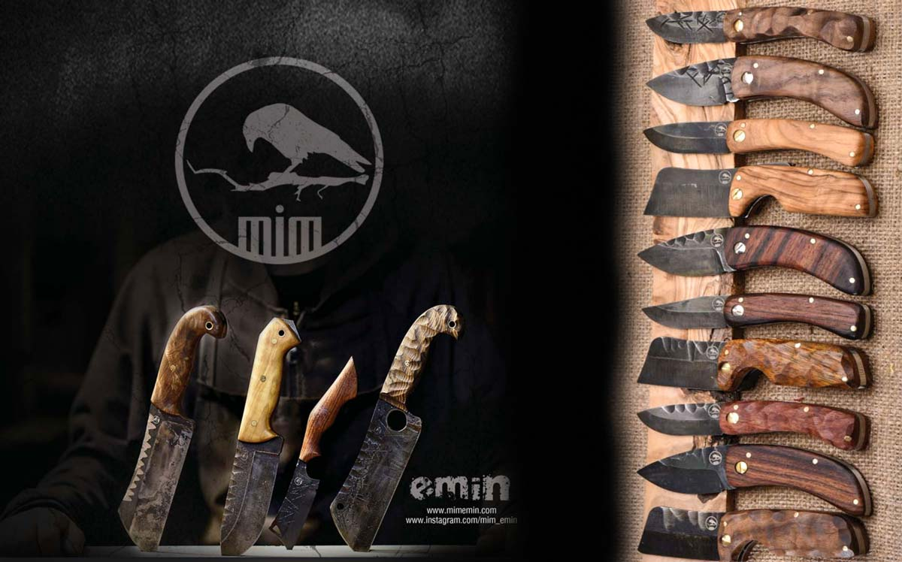
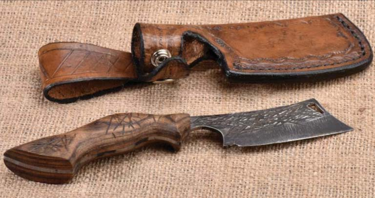
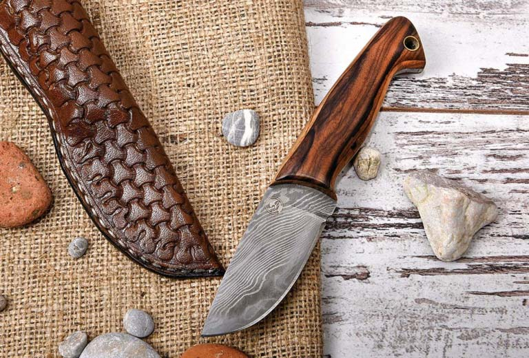

El yapımı, usta yapımı **kamp bıçağı** arayanlar varsa doğru adrestesiniz. Bu yazı tam size göre ama bıçak mevzusunu ben anlatmayacağım. Sadece tavsiyelerde ve önerilerde bulunacağım. Zaten bıçak olaylarından çok anlamıyorum. Bıçak mevzusu ayrı bir dünya olduğundan dolayı da içine çok girmedim. Kısıtlı bilgimin olmasına ve sıradan bir bıçak sever olmama rağmen kamp ekipmanlarımın arasındaki en özel malzemem bıçağımdır. Bir tane babadan kalma bıçağım var bir de bıçaklarla yaşayan Emin abimin bana özel yaptığı bıçak ve çakım var. Ha bir de Opinel marka bıçağım var, onu da saymak lazım. Opineli amelasyon işlerde kullanıyorum. O benim için özel bir bıçak sayılmaz ama iyi iş görüyor. Diğer bıçaklarımın pis işlere bulaşmamasını sağlıyor. Bu yüzden onu da seviyorum. Bıçak seven bir adam olarak bıçaklarımın manevi bir değer taşıması onlarla aramda bir bağ oluşturuyor ve onları benim için daha özel kılıyor. Belki de bu yüzden kamp ekipmanlarımın arasındaki en özel malzememdir.

Gelelim kalite, sağlamlık ve işçiliğine. Şahsen bir bıçakta ilk aradığım şey keskinlik ve sağlamlıktır. Sonrasında ise modeline bakarım, beğenirsem onu severim. Beğenmezsem hayatıma giremez(her insanın yaptığı gibi, sanki yeni bir şey bulmuş gibi söylüyorum). Emin abinin bana yapmış olduğu bu bıçaklar benim beklentilerimi fazlasıyla karşılıyor. Abimiz bunları oldukça sağlam ve kaliteli malzemelerden üretmiş. Aslında Emin abiyi ve bıçaklarını çok da övemeye gerek yok, zaten övülmeye ihtiyacı bile yok bence. Bıçaklara bakınca farkı, kaliteyi ve işçilikteki güzelliği zaten göreceksiniz.

Siz de el yapımı ve özel bir **kamp bıçağı**nız/çakınızın olmasını istiyorsanız veya farklı bıçak modelleri görmek istiyorsanız Emin abiyle [instagram hesabı ](http://www.instagram.com/mim_emin)(mim_emin) üzerinden veya web sitesinden([mimemin.com](http://mimemin.com/bicak_sanati.php)) iletişime geçebilirsiniz.

Bir de balta yapsa varya ilk müşterisi ben olurum, güzel bir baltaya ihtiyacım var :)

