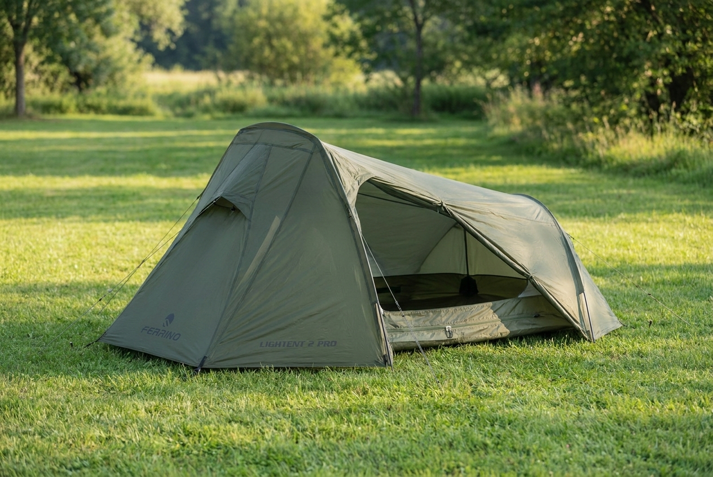
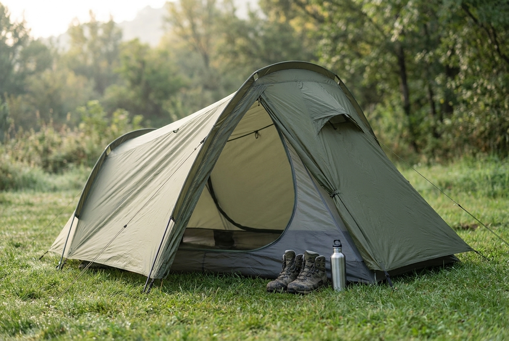
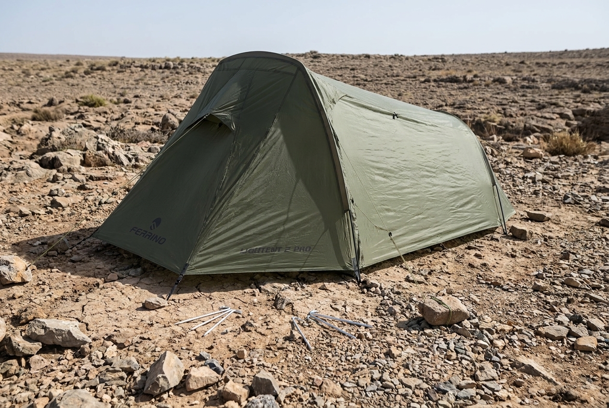

Ferrino Lightent 2; ağırlığı ve paket hacmi önemli olan trekking, bisiklet ve motosiklet kampları için mantıklı bir iki kişilik çadır. Benim kullandığım modelde en sevdiğim taraf hafifliği ve içeride ekipman için bıraktığı alan oldu. En çok zorlandığım konu ise sert zeminde kazık çakmadan kurulamamasıydı.

Kısacası bu çadır, yumuşak toprağa kurulacak hafif bir trekking çadırı arıyorsanız güçlü bir aday. Fakat kamp yeriniz çoğu zaman taş, sıkışmış toprak veya kazık çakılamayan sert bir zemin olacaksa karar vermeden önce kurulum biçimini hesaba katmanız gerekiyor.

> İyi çadır, yalnızca hafif olan değil; kuracağınız zeminde sizi yarı yolda bırakmayandır.

## Ferrino Lightent 2’yi neden aldım?

Bu çadırdan önce yaklaşık 4 kilogramlık, üç mevsim ve yağmurluklu bir model kullanıyordum. Üç yıl boyunca yalnızca kamp yapmak için bir yere gittiğimde bu ağırlığı dert etmedim. Ancak çadırı trekking ekipmanının bir parçası olarak sırtımda taşımaya başlayınca iki, üç kilogramın hiç de küçük bir fark olmadığını anladım.

İlk başta Lightent’in tek kişilik modelini düşünmüştüm. İki model arasında yaklaşık 300 gram fark vardı. “300 gram da 300 gramdır” diye hesap yaparken, sipariş ve bekleme süreci uzayınca iki kişilik modeli aldım. Şimdi dönüp baktığımda doğru karar verdiğimi düşünüyorum.

Tek başıma kaldığımda çantam ve diğer eşyalarım için içeride yeterli yer kalıyor. İki kişi gittiğimizde de ikinci bir çadır taşımak gerekmiyor. İki uyku tulumu içeride rahatça sığıyor; eşyaları ayak tarafına yerleştirince uyku alanı tamamen kaybolmuyor.

*Çadırın tünel formu ve tek girişli yapısı dışarıdan böyle görünüyor.*

## Lightent 2’nin güncel teknik özellikleri neler?

Benim anlattığım saha deneyimi kullandığım eski Lightent 2’ye ait. Güncel ürün listelerinde model, **Lightent 2 Pro** adıyla geçebiliyor. Bu nedenle aşağıdaki tabloyu güncel Lightent 2 Pro teknik özelliklerini özetlemek için kullanıyorum.

| Teknik özellik | Değer |
|---|---|
| Kişi kapasitesi | 2 kişi |
| Yapı | Tünel, 3 mevsim |
| Ağırlık | 1,85 kg minimum / 2,10 kg maksimum |
| Paket ölçüsü | 17 × 35 cm |
| Giriş ve vestibül | 1 giriş, 1 vestibül |
| Dış tente | Geri dönüştürülmüş polyester, 3.000 mm su basıncı |
| Taban | Geri dönüştürülmüş polyester, 8.000 mm su basıncı |
| Kurulum | Kendi kendine ayakta durmaz; dış direk sistemi kullanır |
| Havalandırma | Ön, arka ve vestibül bölgesinde açıklıklar |
| İç tentesiz kullanım | 1,5 kg olarak kurulabilir |
| Aksesuarlar | Taşıma çantası, tamir kiti, iç cepler ve lamba askısı |

Ferrino’nun ürün bilgilerinde **vestibül**, yani girişin önünde kalan küçük sundurma açıkça belirtiliyor. Bunu çadırın baş kısmında ayrı bir oda gibi düşünmeyin. Benim kullandığım modelde botları, ayakkabıları ve su şişesini uyku bölümünden uzak tutmak için işe yarayan bölüm bu giriş önüydü.

Güncel modelin 1,85 kilogramlık minimum ağırlığı iç çadır, dış tente ve direklerin belirli bir kombinasyonunu ifade ediyor. Kazıklar, ipler, çanta ve diğer parçalarla birlikte maksimum ağırlık 2,10 kilograma çıkıyor. Sırt çantası hesabını yaparken maksimum değeri esas almak daha güvenli.

## İki kişilik Lightent 2 içeride rahat mı?

İki kişilik çadır etiketini görünce iki kişinin bütün eşyalarıyla salona kurulmuş gibi yaşayacağını düşünmeyin. Lightent 2, iki kişinin uyumasına yetecek bir alan sunuyor; fakat büyük çantaları içeri aldığınızda hareket alanı doğal olarak azalıyor.

Ben tek başıma kullandığımda alanı daha rahat buluyorum. Çantamı içeri alabiliyor, kıyafetlerimi ve küçük ekipmanları ayak tarafına yerleştirebiliyorum. İki kişi kaldığımızda ise eşyaları düzenli yerleştirmek gerekiyor. Çantalar ve botlar için asıl rahatlık giriş önündeki vestibülden geliyor.

Burada bir uyarı yapayım: Eski yazımda yağmurlu havada bagaj bölümünde ocak kullandığımı söylemiştim. Yapmış olmam, bunun güvenli olduğu anlamına gelmiyor. Çadırın içinde veya kapalı bagajında ocak yakmak yangın ve karbonmonoksit riski taşır. Ocağı açık havada, çadırdan güvenli bir mesafede kullanın.

Kapasite hesabını nasıl yapacağınızı [çadır alırken dikkat edilmesi gerekenler](/cadir-alirken-nelere-dikkat-edilmeli/) rehberinde daha ayrıntılı anlattım.

*Vestibül, botları ve küçük eşyaları uyku alanının dışında tutmak için kullanışlı.*

## Lightent 2 kolay kuruluyor mu?

Bu çadırın kurulumu, kendi kendine ayakta duran kubbe çadırlar gibi değil. Önce iç çadırın tabanını kazıklarla zemine sabitlemeniz ve gerginleştirmeniz gerekiyor. Daha sonra direkleri takıyor, son olarak dış tenteyi geçiriyorsunuz.

Güncel Lightent 2 Pro’nun da kendi kendine ayakta durmayan bir tünel çadır olarak listelenmesi, bu kurulum karakterini doğruluyor. Direklerin farklı renklerde olması, hangi direğin nereye gideceğini anlamayı kolaylaştırıyor.

Yumuşak toprakta bu sıra sorun değil. Kazıkları çakarsınız, tabanı gerersiniz, direkleri yerleştirirsiniz. Fakat sert zeminde ilk adım zaten en zor adımdır. Kazık çakılamıyorsa çadırı normal biçimde geremezsiniz.

Bu yüzden satın almadan önce kendinize şu soruyu sorun:

**Kazık çakamadığım bir zeminde bu çadırı nasıl kuracağım?**

## Sert zeminde Lightent 2’nin sorunu nedir?

Çadırla birlikte gelen kazıklar sert ve taşlı zeminlerde benim için yeterli olmadı. Kolayca eğilebiliyorlar ve kısa oldukları için sıkışmış toprağa tam girmeyebiliyorlar. Bu, çadırın kumaşından veya direklerinden bağımsız, doğrudan kurulum biçimiyle ilgili bir sorun.

*Sert ve taşlı zemin, çadırdan önce kazık seçimini zorlaştırıyor.*

Benim kullandığım çözüm daha sağlam kazık taşımak oldu. [Ferrino çelik çadır kazıkları](/ferrino-cadir-kazigi/) sert zeminde daha güven veriyor; ancak bu defa da sırt çantasına fazladan ağırlık ekliyorlar. Hafiflik ararken bütün hesabı yalnızca çadır üzerinden yapmak mümkün değil.

Kazık çakılamayan yerde çadırı ağaçlara veya sağlam noktalara iplerle gererek kurmayı denemek mümkün olabilir. Fakat bunun için yanınızda yeterli ip bulunması ve kurduğunuz bağlantının çadırın germe noktalarına uygun olması gerekir. Her kamp alanında böyle bir çözüm bulunmayabilir.

Benim gibi nereye kurulacağı önceden belli olmayan kamplar yapıyorsanız sert zemin ihtimalini hafife almayın. Trekking rotasında yumuşak bir çimenlikte harika çalışan çadır, taşlık bir düzlükte bütün akşamınızı kazıkla güreşerek geçirmenize neden olabilir.

## Yağmur ve havalandırma performansı nasıl?

Benim kullandığım Lightent 2’nin dış tentesi şimdiye kadar su geçirmedi. Bu, kendi kullanımım için olumlu bir gözlem; her hava koşulunda ve her model yılında aynı sonucu garanti etmez. Çadırı doğru gerginlikte kurmak, dış tentesini iç tenteye değdirmemek ve kumaşın bakımını yapmak burada en az kumaşın katalog değerleri kadar önemli.

Güncel Lightent 2 Pro listesinde dış kumaş için 3.000 mm, taban için 8.000 mm hidrostatik su basıncı değeri veriliyor. Bunlar laboratuvar karşılaştırması için yararlı değerlerdir. “8.000 mm taban var, zeminden gelen her şeyi unutabilirim” anlamına gelmez. Taş, basınç, dikişler ve yanlış kurulum sonucu değiştirir.

Çadırın iç ve dış katmanının ayrı olması da önemli. İki katman arasındaki hava boşluğu, yağmur suyunu ve içeride oluşan nemi uyku alanından uzak tutmaya yardımcı oluyor. Yine de çift katmanlı çadır yoğuşmayı ortadan kaldırmaz. Nemli kıyafetleri içeri yığarsanız veya havalandırmayı tamamen kapatırsanız sabah içeride küçük bir hamam kurulabilir.

Güncel üründe entegre sineklik bulunuyor. Bu, yaz kamplarında kapıyı açık tutmak istediğinizde işe yarayan basit ama değerli bir ayrıntı. Giriş sayısı ise bir olduğu için iki kişi kaldığınızda gece çıkışları çift kapılı çadırlar kadar rahat olmayacaktır.

## Ferrino Lightent 2 kime uygun?

Bu çadırı özellikle şu kullanım biçimleri için mantıklı buluyorum:

- Ekipmanını sırtında taşıyan trekking yapanlar
- Bisiklet veya motosikletle daha küçük paket arayanlar
- Tek başına kamp yapıp içeride çanta ve ekipman için alan isteyenler
- İki kişi aynı çadırı paylaşacak olanlar
- Çoğunlukla üç mevsim ve yumuşak zeminde kamp kuranlar

Şu durumlarda ise temkinli olurdum:

- Kamp alanlarının çoğu taşlık veya sert zemindeyse
- Çadırın kazık çakmadan ayakta durmasını istiyorsanız
- İki kişiyle içeride geniş yaşam alanı ve iki ayrı giriş arıyorsanız
- Kış şartları veya yoğun kar yükü bekliyorsanız

Lightent 2’yi dört mevsim çadır gibi değerlendirmem. Güncel ürün bilgisi de modeli üç mevsim olarak sınıflandırıyor. Hafiflik uğruna çadırın tasarlandığı kullanım sınırlarını yok saymak, kampın ortasında pahalı bir sürpriz yaşatabilir.

## Lightent 2’nin artıları ve eksileri neler?

### Artıları

- Yaklaşık 2,1 kilogramlık paket ağırlığı
- Tek kişi için ekipman yerleştirmeye uygun iç alan
- İki kişi için kullanılabilir uyku alanı
- Çanta ve botlar için bagaj bölümü
- Çift katmanlı yapı ve entegre sineklik
- Güncel modelde tamir kiti ve taşıma çantasıyla gelmesi
- Trekking, bisiklet ve motosiklet kamplarında taşımayı kolaylaştırması

### Eksileri

- Kendi kendine ayakta durmuyor
- Kurulum için önce kazıkları çakmak gerekiyor
- Birlikte gelen kazıklar sert zeminde yetersiz kalabiliyor
- Tek giriş, iki kişi için gece kullanımını biraz zorlaştırıyor
- Üç mevsimle sınırlı; ağır kış koşulları için tasarlanmamış
- İki kişi ve bütün ekipmanla içerideki alan hızla daralıyor

## Ferrino Lightent 2 alınır mı?

Ben bugün yeniden çadır alacak olsam ve ağırlığı sırtımda taşıyacağım bir trekking düzeni kuracak olsam Lightent 2’yi hâlâ değerlendirirdim. Tek başına kullanımda sunduğu alan, iki kişiyle paylaşılabilmesi ve küçük paket avantajı benim için ciddi artılar.

Fakat kararım zemine göre değişirdi. Çadırı çoğunlukla yumuşak toprağa kuracaksam sorun görmem. Taşlık ve sert zeminlerde kamp yapacaksam daha sağlam kazık, fazladan ip ve biraz daha sabır taşımayı baştan kabul ederdim.

Bu çadırı “her yere kurulur” diye değil, “doğru zeminde hafif ve işlevli” diye tanımlamak daha doğru. Ekipman seçerken ağırlığı azaltmak güzel; ama kamp yerinde kazık çakamıyorsanız o 2,1 kilogram bir anda dünyanın en ağır çadırı gibi hissedilebilir.

Siz Lightent 2’yi hangi zeminde ve kaç kişiyle kullandınız? Ağırlığını, yağmur performansını ve özellikle sert zemindeki kurulum deneyiminizi yazarsanız bu çadırı araştıranlara gerçek bir karşılaştırma bırakmış olursunuz.
