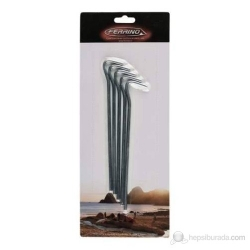

Ferrino’nun 5 mm kalınlığında ve 20 cm uzunluğundaki çelik çadır kazıkları sert zeminde sağlamlık arayanlar için uygun; ancak ağırlık nedeniyle çadırını sırt çantasında taşıyanlar için ilk tercih olmayabilir. Hepsiburada’dan sipariş verdiğim bu kazıklardan kullanım amacım açısından oldukça memnun kaldım.

## Temel özellikler

* 5 mm kalınlığında 20 cm uzunluğunda 5 adet geliyor.
* Çelikten üretilmiş.
* Malzeme çelik olduğu için sert zeminlerde rahatlıkla kullanılabilir.
* Bu boyutlardaki çelikten üretilmiş bir çadır kazığının ağır olacağını unutmayınız.
* Çadırınızı sürekli sırt çantanızda taşıyorsanız yani ağırlık sizin için önemli ise daha hafif bir ürün tercih etmenizi öneririm.

## Kimler için uygun?

Araçla kamp yapıyor, ağırlıktan çok dayanıklılığa önem veriyor ve standart kazıkların sert zeminde kolayca eğilmesinden şikâyet ediyorsanız bu tip çelik kazıklar mantıklı bir seçim. Özellikle kazıkla sabitlenmeden ayakta durmayan çadırlarda sağlam bir yedek set taşımak kurulum sırasında işe yarar.

Uzun mesafe yürüyüşlerinde ise beş çelik kazığın toplam ağırlığını hesaba katmak gerekir. Çadırı ve diğer ekipmanı sırtınızda taşıyacaksanız daha hafif alüminyum seçenekleri karşılaştırın; zeminin yumuşak olduğu kamplarda çeliğin ekstra dayanıklılığına ihtiyaç duymayabilirsiniz.

## Kısa karar

Benim değerlendirmem net: sert zeminde güven veren, sade ve dayanıklı bir ürün. Ağırlık sorun değilse alınabilir; ultralight bir kamp listesi hazırlıyorsanız daha hafif bir kazık seti daha doğru olur. Çadır seçiminde ağırlık ve zemin ilişkisini görmek için [Ferrino Lightent 2 kamp çadırı incelemesine](/ferrino-lightent-2-kamp-cadiri/) de göz atabilirsiniz.
